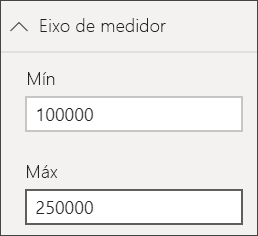

# Gráficos de medidores radiais no Power BI

Um gráfico de medidor radial tem um arco circular e mostra um único valor que acompanha o progresso rumo a um objetivo ou um Indicador Chave de Desempenho (KPI). A linha (ou *agulha*) representa o valor-alvo ou o objetivo. O sombreado representa o progresso em relação a esse objetivo. O valor dentro do arco representa o valor do progresso. O Power BI distribui todos os valores possíveis de forma uniforme ao longo do arco, desde o mínimo (valor mais à esquerda) até ao máximo (valor mais à direita).

Neste exemplo, é um revendedor de automóveis a controlar a média de vendas da equipa por mês. A agulha representa um objetivo de vendas de 140 carros. A média mínima possível de vendas é 0 e o máximo é 200.  O sombreado azul mostra que a equipa tem atualmente uma média de aproximadamente 120 vendas neste mês. Felizmente, ainda há outra semana para alcançar o objetivo.

Deixe que o Will lhe mostre como criar elementos visuais de métrica única: medidores, cartões e KPIs.

<iframe width="560" height="315" src="https://www.youtube.com/embed/xmja6EpqaO0?list=PL1N57mwBHtN0JFoKSR0n-tBkUJHeMP2cP" frameborder="0" allowfullscreen></iframe>

## Quando usar um medidor radial

Os medidores radiais são uma ótima opção para:

* Mostrar o progresso rumo a um objetivo.

* Representar uma medida percentual, como um KPI.

* Mostrar a integridade de uma única medida.

* Apresentar informações que pode analisar e compreender rapidamente.

## Pré-requisitos

* O serviço Power BI ou Power BI Desktop

* Pasta de trabalho do Excel de exemplo financeiro: [faça download do exemplo diretamente](http://go.microsoft.com/fwlink/?LinkID=521962).

## Criar um medidor radial básico

Estas instruções utilizam o serviço Power BI. Para acompanhar, inicie sessão no Power BI e abra o ficheiro de Exemplo Financeiro do Excel.

### Passo 1: Abrir o ficheiro do Excel do Exemplo Financeiro

1. Transfira o [ficheiro do Excel do Exemplo Financeiro](../sample-financial-download.md), caso ainda não o tenha feito. Lembre-se de onde o guardou.

1. No serviço Power BI, selecione **Obter Dados** > **Ficheiros**.

1. Selecione **Ficheiro Local** e navegue até à localização do ficheiro de exemplo.

1. Selecione **Importar**. O Power BI adiciona o Exemplo Financeiro à área de trabalho como um conjunto de dados.

1. Na lista de conteúdo **Conjuntos de dados**, selecione o ícone **Criar relatório** para o **Exemplo Financeiro**.

    

### Passo 2: Criar um medidor para acompanhar as Vendas Brutas

Na última secção, quando selecionou o ícone **Criar relatório**, o Power BI criou um relatório em branco na vista de edição.

1. No painel **Campos**, selecione **Vendas Brutas**.

   

1. Altere a agregação para **Média**.

   

1. Selecione o ícone de medidor  para converter o gráfico de colunas num gráfico de medidor.

    

    Dependendo de quando transferiu o ficheiro **Exemplo Financeiro**, poderá ver valores diferentes dos apresentados.

    > [!TIP]
    > Por predefinição, o Power BI cria um gráfico de medidor no qual assume que o valor atual (neste caso, a **Média de Vendas Brutas**) deve estar no ponto médio do medidor. Como o valor da **Média de Vendas Brutas** é de 182 000,76 $, o valor inicial (Mínimo) é definido como 0 e o valor final (Máximo) é definido como o dobro do valor atual.

### Passo 3: Definir um valor de destino

1. Arraste **COGS** do painel **Campos** para o conjunto **Valor-alvo**.

1. Altere a agregação para **Média**.

   O Power BI adiciona uma agulha para representar o valor de destino de **US$ 145.480**.

   

    Observe que ultrapassámos o nosso alvo.

   > [!NOTE]
   > Pode inserir manualmente um valor de destino. Veja a secção [Utilizar as opções de formatação manual para definir os valores Mínimo, Máximo e Alvo](#use-manual-format-options-to-set-minimum-maximum-and-target-values).

### Passo 4: Definir um valor máximo

No Passo 2, o Power BI utilizou o campo **Valor** para definir automaticamente os valores mínimo e máximo. E se quiser definir o seu próprio valor máximo? Digamos que, em vez de utilizar o dobro do valor atual como valor máximo possível, quer defini-lo como o maior número de Vendas Brutas no conjunto de dados.

1. Arraste **Vendas Brutas** do painel **Campos** para o conjunto **Valor máximo**.

1. Altere a agregação para **Máximo**.

   

   O medidor é redesenhado com um novo valor de término, 1,21 milhão em vendas brutas.

   

### Passo 5: Guardar relatório

1. [Guarde o relatório](../service-report-save.md).

1. [Adicionar gráfico medidor como um mosaico do dashboard](../service-dashboard-pin-tile-from-report.md). 

## Utilizar as opções de formatação manual para definir os valores Mínimo, Máximo e Alvo

1. Remova **Vendas Brutas Máx.** do **Valor máximo**.

1. Selecione o ícone de rolo de pintura para abrir o painel **Formatação**.

   

1. Expanda o **Eixo do medidor** e introduza valores para **Mín.** e **Máx.**

    

1. Desmarque a opção **COGS** no painel **Campos** para remover o valor-alvo.

    

1. Quando o campo **Destino** aparecer no **Eixo do medidor**, insira um valor.

     

1. Opcionalmente, continue com a formatação do gráfico de medidor.

Após concluir estes passos, deverá ter um gráfico de medidor semelhante ao seguinte:

## Passo seguinte

* [Elementos visuais do Indicador Chave de Desempenho (KPI)](power-bi-visualization-kpi.md)

* [Tipos de visualização no Power BI](power-bi-visualization-types-for-reports-and-q-and-a.md)

Mais perguntas? [Pergunte à Comunidade do Power BI](http://community.powerbi.com/)