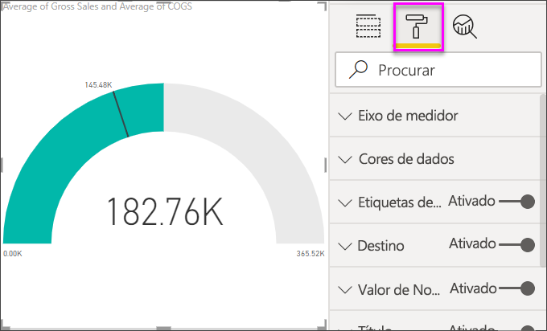

# Gráficos de medidores radiais no Power BI

[!INCLUDE[consumer-appliesto-nyyn](../includes/consumer-appliesto-nyyn.md)]

[!INCLUDE [power-bi-visuals-desktop-banner](../includes/power-bi-visuals-desktop-banner.md)]

Um gráfico de medidor radial tem um arco circular e mostra um único valor que acompanha o progresso rumo a um objetivo ou um Indicador Chave de Desempenho (KPI). A linha (ou *agulha* ) representa o valor-alvo ou o objetivo. O sombreado representa o progresso em relação a esse objetivo. O valor dentro do arco representa o valor do progresso. O Power BI distribui todos os valores possíveis de forma uniforme ao longo do arco, desde o mínimo (valor mais à esquerda) até ao máximo (valor mais à direita).

Neste exemplo, é um revendedor de automóveis a controlar a média de vendas da equipa por mês. A agulha representa um objetivo de vendas de 140 carros. A média mínima possível de vendas é 0 e o máximo é 200.  O sombreado azul mostra que a equipa tem atualmente uma média de aproximadamente 120 vendas neste mês. Felizmente, ainda há outra semana para alcançar o objetivo.

> [!NOTE]
> Para partilhar o seu relatório com outro utilizador do Power BI, é necessário que ambos tenham licenças individuais do Power BI Pro ou que o relatório seja guardado numa capacidade Premium.

## Quando usar um medidor radial

Os medidores radiais são uma ótima opção para:

* Mostrar o progresso rumo a um objetivo.

* Representar uma medida percentual, como um KPI.

* Mostrar a integridade de uma única medida.

* Apresentar informações que pode analisar e compreender rapidamente.

## Pré-requisitos

Este tutorial utiliza o [ficheiro do Excel do Exemplo Financeiro](https://download.microsoft.com/download/9/6/D/96DDC2FF-2568-491D-AAFA-AFDD6F763AE3/Retail%20Analysis%20Sample%20PBIX.pbix).

1. Na secção superior esquerda da barra de menus, selecione **Obter Dados** > **Excel**
   
2. Procure a sua cópia do **ficheiro do Excel do Exemplo Financeiro**

1. Abra o **ficheiro do Excel do Exemplo Financeiro** na vista de relatório .

1. Selecione **finanças** e **Folha1**

1. Clique em **Carregar**

1. Selecionar  para adicionar uma nova página.

## Criar um medidor radial básico

### Passo 1: Criar um medidor para acompanhar as Vendas Brutas

1. Começar numa página de relatório em branco

1. No painel **Campos** , selecione **Vendas Brutas**.

   

1. Altere a agregação para **Média**.

   

1. Selecione o ícone de medidor  para converter o gráfico de colunas num gráfico de medidor.

    

    Dependendo de quando transferiu o ficheiro **Exemplo Financeiro** , poderá ver valores diferentes dos apresentados.

    > [!TIP]
    > Por predefinição, o Power BI cria um gráfico de medidor no qual assume que o valor atual (neste caso, a **Média de Vendas Brutas** ) deve estar no ponto médio do medidor. Como o valor da **Média de Vendas Brutas** é de 182 000,76 $, o valor inicial (Mínimo) é definido como 0 e o valor final (Máximo) é definido como o dobro do valor atual.

### Passo 3: Definir um valor de destino

1. Arraste **COGS** do painel **Campos** para o conjunto **Valor-alvo**.

1. Altere a agregação para **Média**.

   O Power BI adiciona uma agulha para representar o valor de destino de **US$ 145.480**.

   

    Observe que ultrapassámos o nosso alvo.

   > [!NOTE]
   > Pode inserir manualmente um valor de destino. Veja a secção [Utilizar as opções de formatação manual para definir os valores Mínimo, Máximo e Alvo](#use-manual-format-options-to-set-minimum-maximum-and-target-values).

### Step 4: Definir um valor máximo

No Passo 2, o Power BI utilizou o campo **Valor** para definir automaticamente os valores mínimo e máximo. E se quiser definir o seu próprio valor máximo? Digamos que, em vez de utilizar o dobro do valor atual como valor máximo possível, quer defini-lo como o maior número de Vendas Brutas no conjunto de dados.

1. Arraste **Vendas Brutas** do painel **Campos** para o conjunto **Valor máximo**.

1. Altere a agregação para **Máximo**.

   

   O medidor é redesenhado com um novo valor de término, 1,21 milhão em vendas brutas.

   

### Step 5: Guardar relatório

1. [Guarde o relatório](../create-reports/service-report-save.md).

## Utilizar as opções de formatação manual para definir os valores Mínimo, Máximo e Alvo

1. Remova **Vendas Brutas Máx.** do **Valor máximo**.

1. Selecione o ícone de rolo de pintura para abrir o painel **Formatação**.

   

1. Expanda o **Eixo do medidor** e introduza valores para **Mín.** e **Máx.**

    

1. Desmarque a opção **COGS** no painel **Campos** para remover o valor-alvo.

    

1. Quando o campo **Destino** aparecer no **Eixo do medidor** , insira um valor.

     

1. Opcionalmente, continue com a formatação do gráfico de medidor.

Após concluir estes passos, deverá ter um gráfico de medidor semelhante ao seguinte:

## Passo seguinte

* [Elementos visuais do Indicador Chave de Desempenho (KPI)](power-bi-visualization-kpi.md)

* [Tipos de visualização no Power BI](power-bi-visualization-types-for-reports-and-q-and-a.md)

Mais perguntas? [Pergunte à Comunidade do Power BI](https://community.powerbi.com/)

