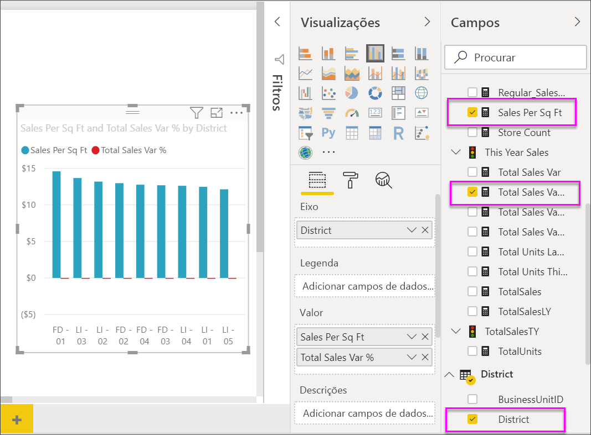
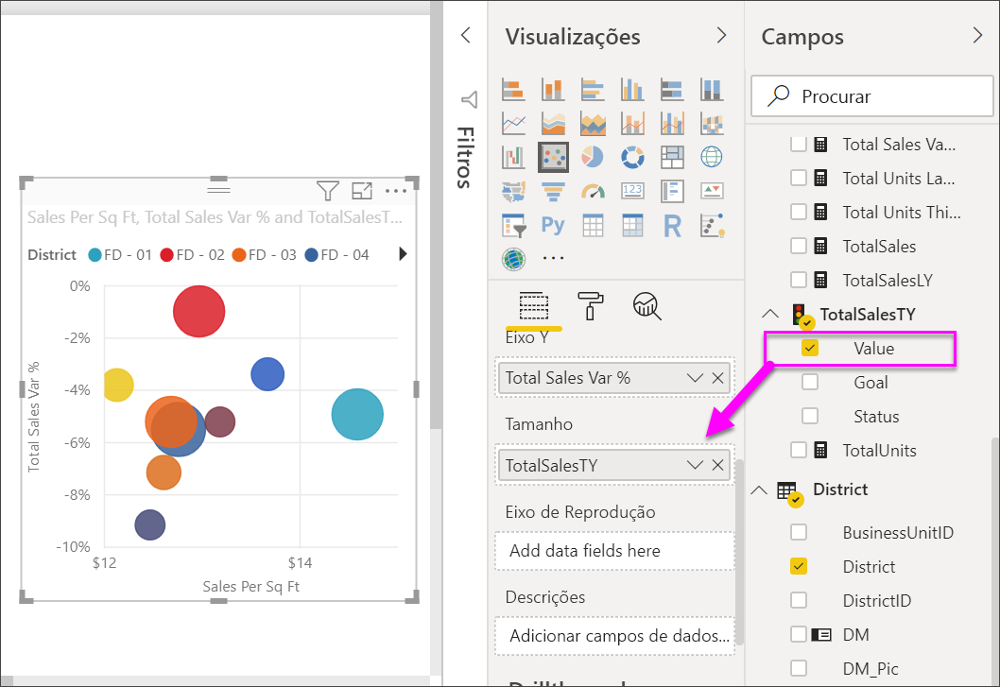
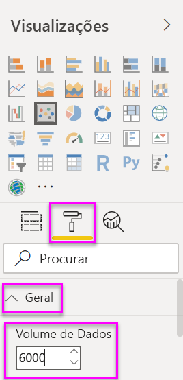
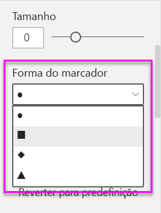
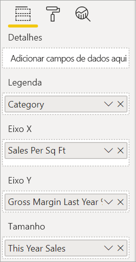
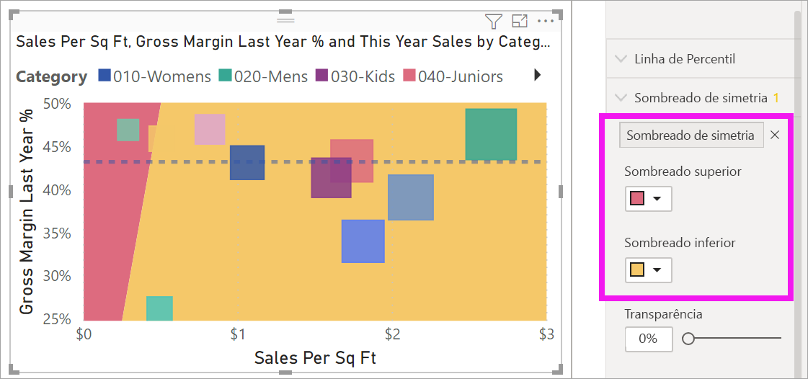
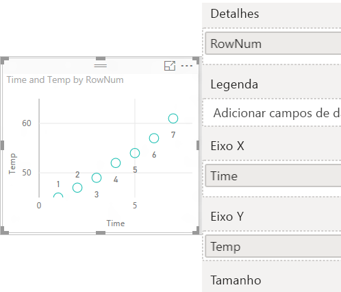

# Gráficos de dispersão, de bolhas e de pontos no Power BI

[!INCLUDE [power-bi-visuals-desktop-banner](../includes/power-bi-visuals-desktop-banner.md)]

Um gráfico de dispersão tem sempre dois eixos de valor para mostrar: um conjunto de dados numéricos num eixo horizontal e outro conjunto de valores numéricos num eixo vertical. O gráfico mostra pontos na intersecção de um valor numérico de x e y e combina estes valores em pontos de dados individuais. O Power BI pode distribuir estes pontos de dados de forma uniforme ou não pelo eixo horizontal. Depende dos dados que o gráfico representa.

Assista a este vídeo para ver o Will a criar um gráfico de dispersão e, em seguida, siga os passos abaixo para criar um sozinho.
   > [!NOTE]
   > Este vídeo utiliza uma versão mais antiga do Power BI Desktop.
   > 
   > 
<iframe width="560" height="315" src="https://www.youtube.com/embed/PVcfPoVE3Ys?list=PL1N57mwBHtN0JFoKSR0n-tBkUJHeMP2cP" frameborder="0" allowfullscreen></iframe>

Pode definir o número de pontos de dados até um máximo de 10 000.  

## Quando usar um gráfico de dispersão, de bolhas ou de pontos

### Gráficos de dispersão e bolhas

Um gráfico de dispersão mostra a relação entre dois valores numéricos. Um gráfico de bolhas substitui os pontos de dados por bolhas, sendo que o *tamanho* das bolhas representa uma terceira dimensão dos dados adicional.

Os gráficos de dispersão são uma ótima opção:

* Para mostrar as relações entre dois valores numéricos.

* Para representar dois grupos de números como uma série de coordenadas x e y.

* Para utilizar em vez de um gráfico de linhas quando quiser alterar a escala do eixo horizontal.

* Para transformar o eixo horizontal numa escala logarítmica.

* Para mostrar os dados da folha de cálculo que incluem pares ou conjuntos de valores agrupados.

    > [!TIP]
    > Num gráfico de dispersão, pode ajustar as escalas independentes dos eixos para revelar mais informações sobre os valores agrupados.

* Para mostrar padrões em grandes conjuntos de dados, por exemplo, ao mostrar tendências lineares ou não lineares, clusters e valores atípicos.

* Para comparar grandes números de pontos de dados, independentemente do tempo.  Quantos mais dados incluir num Gráfico de dispersão, melhores serão as comparações que pode realizar.

Além do que os Gráficos de dispersão podem fazer por si, os gráficos de bolhas são uma escolha excelente:

* Se os dados tiverem três séries de dados que contêm um conjunto de valores cada um.

* Para apresentar dados financeiros.  Os diferentes tamanhos de bolha são úteis para destacar visualmente os valores específicos.

* Para utilizar com quadrantes.

### Gráficos de pontos

Um gráfico de pontos é semelhante a um gráfico de bolhas e a um gráfico de dispersão, mas é utilizado para desenhar dados categóricos ao longo do Eixo X.

São uma escolha excelente se quiser incluir dados categóricos ao longo do Eixo X.

## Pré-requisitos

Este tutorial utiliza o [ficheiro PBIX do Exemplo de Análise de Revenda](https://download.microsoft.com/download/9/6/D/96DDC2FF-2568-491D-AAFA-AFDD6F763AE3/Retail%20Analysis%20Sample%20PBIX.pbix).

1. Na secção superior esquerda da barra de menus, selecione **Ficheiro** > **Abrir**.
   
2. Procure a sua cópia do **ficheiro PBIX do Exemplo de Análise de Revenda**

1. Abra o **Ficheiro PBIX do Exemplo de Análise de Revenda** na vista de relatório .

1. Selecionar  para adicionar uma nova página.

## Criar um gráfico de dispersão

1. Comece numa página de relatório em branco e, no painel **Campos**, selecione estes campos:

    * **Sales** (Vendas)  > **Sales Per Sq Ft** (Vendas Por Metro Quadrado)

    * **Sales** (Vendas)  > **Total Sales Variance %** (% da Variação do Total de Vendas)

    * **District** (Distrito)  > **District** (Distrito)

    

1. No painel **Visualização**, selecione . Para converter o gráfico de colunas de cluster num gráfico de dispersão.

   

1. Arraste **Distrito** de **Detalhes** para **Legenda**.

    O Power BI apresenta um gráfico de dispersão que representa a **% da Variação do Total de Vendas** no Eixo Y e as **Vendas por Metro Quadrado** no Eixo X. As cores do ponto de dados representam os distritos:

    

Agora, vamos adicionar uma terceira dimensão.

## Criar um gráfico de bolhas

1. No painel **Campos**, arraste **Vendas** > **Vendas Deste Ano** > **Valor** para o painel **Tamanho**. Os pontos de dados são expandidos para volumes proporcionais ao valor das vendas.

   

1. Coloque o cursor sobre uma bolha. O tamanho da bolha reflete o valor das **Vendas Deste Ano**.

    

1. Para definir o número de pontos de dados para mostrar no gráfico de bolhas, na secção **Formato** do painel **Visualizações**, expanda **Geral** e ajuste o **Volume de Dados**.

    

    Pode definir o volume máximo de dados para qualquer número até 10 000. À medida que avançar nos números, sugerimos que realize testes primeiro para assegurar um bom desempenho.

    > [!NOTE]
    > Mais pontos de dados podem significar mais tempo de carregamento. Se optar por publicar os relatórios com os limites na extremidade maior da escala, confirme que testa os seus relatórios via Web e móvel. Confirme que o desempenho do gráfico corresponde às expetativas dos seus utilizadores.

1. Continue a formatar as cores de visualização, as etiquetas, os títulos, o fundo e muito mais. Para [melhorar a acessibilidade](../desktop-accessibility.md), considere adicionar formas de marcador a cada linha. Para selecionar a forma de marcador, expanda **Formas**, selecione **Forma do marcador** e selecione uma forma.

    

    Altere a forma do marcador para um diamante, triângulo ou quadrado. Utilizar uma forma do marcador diferente para cada linha permite que os leitores do relatório distingam mais facilmente as linhas (ou áreas) umas das outras.

1. Abra o painel de Análise  para adicionar informações adicionais à sua visualização.  
    - Adicione uma Linha mediana. Selecione **Linha mediana** > **Adicionar**. Por predefinição, o Power BI adiciona uma linha mediana para *Sales per sq ft*. Isto não é muito útil, uma vez que temos conhecimento de que existem dez pontos de dados e sabemos que a mediana irá ser criada com cinco pontos de dados de cada lado. Em vez disso, mude a **Medida** para *Total sales variance %* .  

        

    - Adicione sombreado de simetria para mostrar que pontos têm um valor mais alto da medida do eixo x em comparação com a medida do eixo y e vice-versa. Ao ativar o sombreado de simetria no painel de Análise, o Power BI apresenta-lhe o fundo do seu gráfico de dispersão simetricamente baseado nos limites superior e inferior do eixo atual. Esta é uma forma muito rápida de identificar a medida do eixo que um ponto de dados favorece, especialmente quando há um intervalo de eixos diferente para os eixos x e y.

        a. Altere o campo **Total sales variance %** para **Gross margin last year %** .

        

        b. No painel de Análise, adicione o **Sombreado de simetria**. Com base no sombreado, podemos ver que Hosiery (a bolha verde na área sombreada rosa) é a única categoria que favorece a margem bruta em detrimento das respetivas vendas por metro quadrado da loja. 

        

    - Continue a explorar o painel de Análise para descobrir informações relevantes sobre os seus dados. 

        

## Criar um gráfico de pontos

Para criar um gráfico de pontos, substitua o campo numérico do **Eixo X** por um campo categórico.

No painel **Eixo X**, remova **Vendas por metro quadrado** e substitua por **Distrito** > **Gestor Distrital**.

## Considerações e resolução de problemas

### O gráfico de dispersão tem apenas um ponto de dados

O gráfico de dispersão contém apenas um ponto de dados que agrega todos os valores nos eixos X e Y?  Ou talvez agregue todos os valores numa única linha horizontal ou vertical?

Adicione um campo ao painel **Detalhes** para informar o Power BI sobre como agrupar os valores. O campo tem de ser exclusivo para cada ponto que quer representar. Basta um número de linha simples ou um campo de ID.

Se não tiver esse valor nos dados, crie um campo que concatena os valores X e Y juntos em algo exclusivo por ponto:

Para criar um novo campo [utilize o Editor de Consultas do Power BI Desktop para adicionar uma Coluna de Índice](../desktop-add-custom-column.md) ao conjunto de dados. Em seguida, adicione esta coluna ao painel **Detalhes** da visualização.

## Próximos passos

Poderá também estar interessado nos seguintes artigos:

* [Amostragem de alta densidade em gráficos de dispersão do Power BI](desktop-high-density-scatter-charts.md)
* [Tipos de visualização no Power BI](power-bi-visualization-types-for-reports-and-q-and-a.md)
* [Sugestões para ordenar e distribuir diagramas de dados em relatórios do Power BI](../guidance/report-tips-sort-distribute-data-plots.md)

Mais perguntas? [Pergunte à Comunidade do Power BI](https://community.powerbi.com/)
