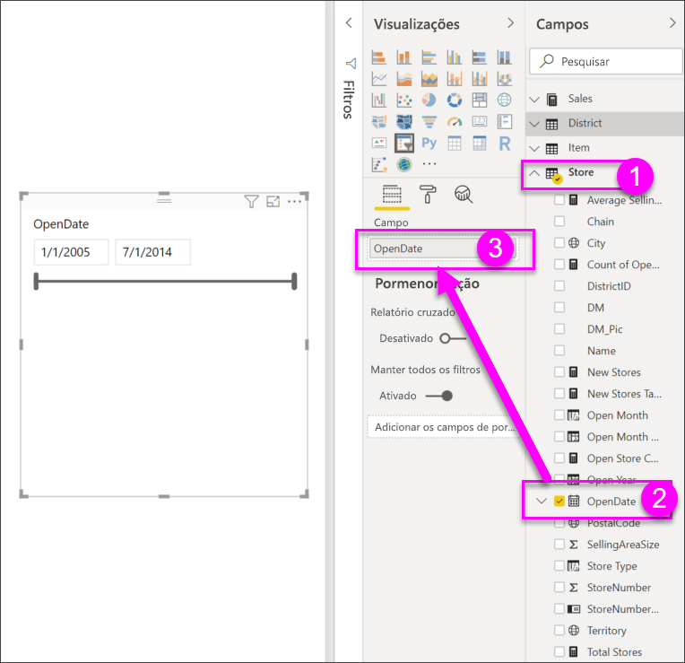
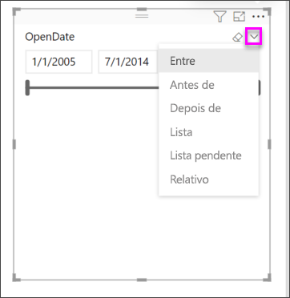
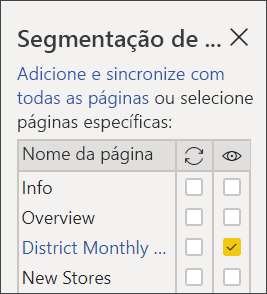
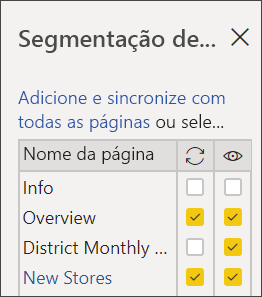
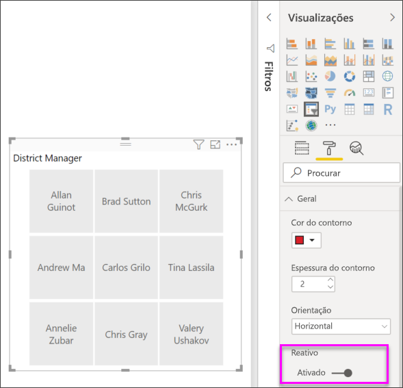
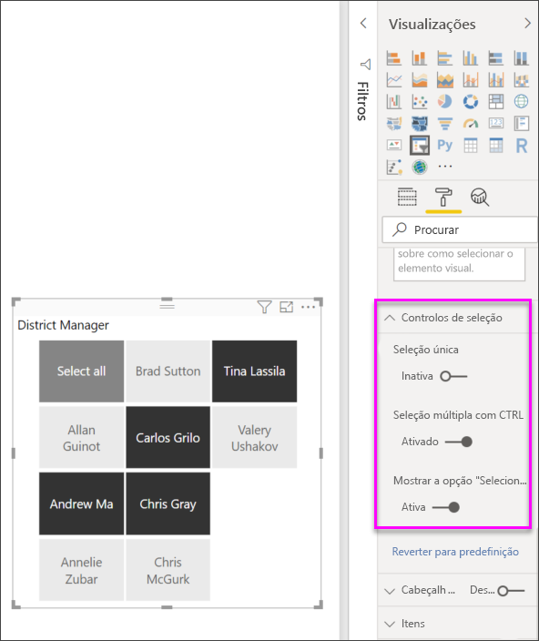

# Segmentação de Dados no Power BI

[!INCLUDE [power-bi-visuals-desktop-banner](../includes/power-bi-visuals-desktop-banner.md)]

Quer que os leitores de relatórios consigam observar as métricas gerais das vendas e, ao mesmo tempo, consigam realçar o desempenho dos Gestores Distritais individuais e os diferentes períodos de tempo. Pode criar relatórios separados ou gráficos comparativos ou pode utilizar segmentações de dados. A segmentação de dados é uma forma alternativa de filtrar que restringe a parte do conjunto de dados apresentada nas outras visualizações num relatório. 

Este tutorial utiliza o [Exemplo de Análise de Revenda](../sample-retail-analysis.md) gratuito para o ajudar a criar, formatar e utilizar segmentações de dados de lista e de intervalo de datas. Divirta-se a descobrir maneiras de formatar e utilizar as segmentações de dados. 

## Quando usar uma segmentação
As segmentações de dados são uma ótima escolha quando quer:

* Apresentar os filtros mais utilizados ou importantes na tela do relatório para facilitar o acesso.
* Facilitar a apresentação do estado atual filtrado sem ter de abrir uma lista pendente. 
* Filtrar por colunas desnecessárias e ocultas nas tabelas de dados.
* Criar relatórios mais objetivos ao colocar as segmentações de dados junto aos elementos visuais importantes.

As segmentações de dados do Power BI têm as seguintes limitações:

- As segmentações de dados não suportam campos de texto.
- A desagregação não é suportada para segmentações de dados.

## Criar segmentações de dados

**Criar uma nova segmentação de dados para filtrar dados por Gestor Distrital**

Este tutorial utiliza o [ficheiro PBIX do Exemplo de Análise de Revenda](https://download.microsoft.com/download/9/6/D/96DDC2FF-2568-491D-AAFA-AFDD6F763AE3/Retail%20Analysis%20Sample%20PBIX.pbix).

1. Na secção superior esquerda da barra de menus, selecione **Ficheiro** > **Abrir**.
   
2. Procure a sua cópia do **ficheiro PBIX do Exemplo de Análise de Revenda**

1. Abra o **Ficheiro PBIX do Exemplo de Análise de Revenda** na vista de relatório .

1. Selecionar  para adicionar uma nova página.

2. Na página Descrição Geral, sem nada selecionado na tela, selecione o ícone da **Segmentação de dados**  no painel **Visualizações** para criar uma nova segmentação de dados. 
3. Com a nova segmentação de dados selecionada, no painel Campos, selecione **Distrito** > **GD** para preencher a segmentação de dados. A nova segmentação de dados é uma lista com caixas de seleção antes dos nomes. 
    
    
    
4. Redimensione e arraste a segmentação de dados e os outros elementos na tela para criar espaço para a segmentação de dados. Note que os itens da segmentação de dados serão cortados se o redimensionamento da segmentação de dados for demasiado pequeno. 
5. Selecione os nomes na segmentação de dados e observe os efeitos nas outras visualizações na página. Selecione os nomes novamente para os desselecionar e mantenha premida a tecla **Ctrl** para selecionar mais do que um nome. Selecionar todos os nomes tem o mesmo efeito que selecionar nenhum. 

6. Em alternativa, selecione o ícone de rolo de pintura para formatar a segmentação de dados. Existem demasiadas opções para as descrever todas aqui. Assim, experimente e crie uma segmentação de dados que funcione para si. Nos exemplos abaixo, a primeira segmentação de dados utiliza uma orientação horizontal e fundos coloridos para os itens. A segunda segmentação de dados foi mantida na vertical e apresenta o texto colorido para um aspeto mais padronizado.

   
>[!TIP]
>Por predefinição, os itens da segmentação de dados da lista são ordenados por ordem ascendente. Para inverter a ordenação para a ordem descendente, selecione as reticências ( **...** ) no canto superior direito da segmentação de dados e escolha **Ordenação descendente**.

**Para criar uma nova segmentação de dados para filtrar dados por intervalo de datas**

1. Sem nada selecionado na tela, abra o menu **Loja** no painel Campos e arraste **DataDeAbertura** para a área **Valores** no painel Visualizações para criar uma nova visualização.
2. Com a nova visualização selecionada, selecione o ícone **Segmentação de Dados** para converter a nova visualização numa segmentação de dados. Esta segmentação de dados é um controlo de deslize com o intervalo de datas preenchido.
    
    

    
4. Redimensione e arraste a segmentação de dados e os outros elementos na tela para criar espaço para a segmentação de dados. Note que o controlo de deslize é redimensionado com o tamanho da segmentação de dados, mas desaparecerá e as datas serão cortadas se o redimensionamento da segmentação de dados for demasiado pequena. 
4. Selecione diferentes intervalos de data com o controlo de deslize ou selecione um campo de data para escrever um valor ou aparecer um calendário para uma seleção mais precisa. Note os efeitos nas outras visualizações na página.
    
    >[!NOTE]
    >Por predefinição, os tipos de dados numéricos e de data/hora criam segmentações de dados de controlo de deslize de intervalo. A partir da atualização de fevereiro de 2018 do Power BI, os controlos de deslize de intervalo de tipo de dados de número inteiro ajustam-se aos valores de número inteiro em vez de mostrar casas decimais. 

5. Para alterar o tipo de segmentação de dados, com a segmentação de dados selecionada, paire o cursos sobre a área superior direita da segmentação de dados, largue o acento circunflexo que aparece e escolha uma das outras opções, tais como **Lista** ou **Antes**. Observe como muda o aspecto da segmentação de dados e das opções de seleção. 
 
    

Para obter mais informações sobre como criar segmentações de dados de intervalo numérico e de datas, veja [Utilizar a segmentação de dados de intervalo numérico no Power BI Desktop](../desktop-slicer-numeric-range.md) e o vídeo seguinte.
   > [!NOTE]
   > Este vídeo utiliza uma versão mais antiga do Power BI Desktop.
   > 
   > 
<iframe width="560" height="315" src="https://www.youtube.com/embed/zIZPA0UrJyA" frameborder="0" allowfullscreen></iframe> 

## Controlar que elementos visuais da página são afetados pelas segmentações de dados
Por predefinição, as segmentações de dados nas páginas de relatórios afetam todas as outras visualizações nessa página, incluindo umas às outras. À medida que escolhe valores nas segmentações de dados de lista e de data que acabou de criar, observe os efeitos nas outras visualizações. Os dados filtrados são uma interseção dos valores selecionados em ambas as segmentações de dados. 

Pode utilizar as **Interações visuais** para impedir que algumas visualizações da página sejam afetadas pelas outras. Na página **Descrição Geral**, o gráfico “Variação das Vendas Totais por Mês Fiscal e Gestor Distrital” mostra dados comparativos gerais para os Gestores Distritais por Mês, os quais pretende manter sempre visíveis. Pode utilizar **Interações visuais** para impedir que as seleções da segmentação de dados filtrem este gráfico. 

1. Com a segmentação de dados Gestor Distrital na página **Vendas Mensais Distritais** selecionada:
    - No Power BI Desktop, selecione o menu **Formato** em **Ferramentas Visuais** e, em seguida, selecione **Editar interações**.
   
   Os controlos de filtro  são apresentados acima de todos os outros elementos visuais na página. Inicialmente, todos os ícones **Filtro** estão selecionados.
   
2. Selecione o ícone **Nenhum** acima do gráfico **Variação das Vendas Totais por Mês Fiscal e Gestor Distrital** para que a segmentação de dados deixe de ser filtrada. 
3. Selecione o controlo de deslize **Mês** e selecione novamente o ícone **Nenhum** acima do gráfico **Variação das Vendas Totais por Mês Fiscal e Gestor Distrital** para que esta segmentação de dados deixe de ser filtrada. Agora, à medida que seleciona nomes e intervalos de datas nas segmentações de dados, o gráfico Variação das Vendas Totais por Mês Fiscal e Gestor Distrital não é alterado. 

Veja [Interações visuais num relatório do Power BI](../service-reports-visual-interactions.md) para obter mais informações sobre a edição de interações.

## Sincronizar e utilizar segmentações de dados noutras páginas
A partir da atualização de fevereiro de 2018 do Power BI, pode sincronizar uma segmentação de dados e utilizá-la em qualquer uma ou em todas as páginas de um relatório. 

No relatório atual, a página **Vendas Mensais Distritais** também tem uma segmentação de dados **Gestor Distrital**. Mas, e se também quiséssemos a segmentação de dados na página **Descrição Geral**? A página **Novas Lojas** também tem uma segmentação de dados, mas fornece apenas informações sobre o **Nome da Loja**. Com o painel **Sincronizar segmentação de dados**, podemos sincronizar a segmentação de dados **Gestor Distrital** para estas páginas, de forma a que as seleções da segmentação de dados em qualquer página afetem as visualizações nas três páginas.

1. No Power BI Desktop, no menu **Ver**, selecione **Sincronizar segmentação de dados**.

    

1.  O painel **Sincronizar segmentação de dados** é apresentado entre o painel **Filtros** e o painel **Visualizações**.  

    

1. Na página **Vendas Mensais Distritais**, selecione a segmentação de dados **Gestor Distrital**. 
    
    
    
3. Na coluna **Sincronizar**, selecione a página **Novas Lojas** e a página **Descrição Geral** para sincronizar a segmentação de dados **Vendas Mensais Distritais** dessas páginas. 
    
3. Na coluna **Visível**, selecione a página **Novas Lojas** e a página **Descrição Geral**. O painel **Sincronizar segmentação de dados** deve, agora, ser semelhante à imagem abaixo:

    

1. Observe os efeitos da sincronização da segmentação de dados e de a tornar visível nas outras páginas. Na página **Vendas Mensais Distritais**, a segmentação de dados **Gestor Distrital** mostra agora as mesmas seleções que as da página **Descrição Geral**. Na página **Novas Lojas**, as seleções na segmentação de dados **Gestor Distrital** afetam as seleções que estão disponíveis na segmentação de dados **Nome da Loja**. 
    
    >[!TIP]
    >Embora a segmentação de dados inicialmente seja apresentada nas páginas sincronizadas com o mesmo tamanho e posição da página original, pode mover, redimensionar e formatar as segmentações de dados sincronizadas nas várias páginas de forma independente. 

>[!NOTE]
>Se sincronizar uma segmentação de dados numa página, mas não a tornar visível nessa página, as seleções da segmentação de dados efetuadas nas outras páginas ainda filtrarão os dados na página.
 
## Formatar as segmentações de dados
Estão disponíveis diferentes opções de formatação, dependendo do tipo de segmentação de dados. Ao utilizar a orientação **Horizontal**, o esquema **Reativo** e a cor **Item**, pode criar botões ou mosaicos em vez de itens de lista padrão e fazer com que os itens da segmentação de dados sejam redimensionados para se ajustarem aos diferentes tamanhos de ecrã e esquemas.  

1. Com a segmentação de dados **Gestor Distrital** selecionada em qualquer página, no painel **Visualizações**, selecione o ícone **Formatação**  para apresentar os controlos de formatação. 
    
    
    
2. Selecione as setas de menu pendente junto a cada categoria para mostrar e editar as opções. 

### Secção de opções Geral
1. Selecione vermelho em **Cor do contorno** e altere a **Espessura do contorno** para "2". Quando ativado, isto define a cor e a espessura dos contornos ou sublinhados do cabeçalho e do item. 
2. Em **Orientação**, a opção predefinida é **Vertical**. Selecione **Horizontal** para criar uma segmentação de dados com os mosaicos ou os botões dispostos horizontalmente e desloque-se com as setas para aceder aos itens que não cabem na segmentação de dados.
    
    
    
3. Ative o esquema**Reativo** para alterar o tamanho e a disposição dos itens da segmentação de dados, de acordo com o viewscreen e o tamanho da segmentação de dados. Para segmentações de dados de lista, o esquema reativo só está disponível na orientação horizontal e impede que os itens sejam cortados em ecrãs pequenos. Para segmentações de dados de controlo de deslize de intervalo, a formatação reativa altera o estilo do controlo de deslize e permite um redimensionamento mais flexível. Ambos os tipos de segmentações de dados tornam-se ícones de filtro nos tamanhos muito pequenos. 
    
    
    
    >[!NOTE]
    >As alterações do esquema Reativo poderão substituir a formatação de um cabeçalho ou item específico que definiu. 
    
4. Defina a posição e o tamanho da segmentação de dados com precisão numérica, em **Posição X**, **Posição Y**, **Largura** e **Altura** ou mova e redimensione a segmentação de dados diretamente na tela. Experimente tamanhos de itens e disposições diferentes e observe como a formatação reativa é alterada em conformidade.  

    

Veja [Criar uma segmentação de dados reativa que pode redimensionar no Power BI](../power-bi-slicer-filter-responsive.md) para saber mais sobre a orientação horizontal e o esquema reativo.

### Opções de controlos de seleção (apenas segmentações de dados de lista)
1. A opção **Mostrar a opção “Selecionar Tudo”** está **Inativa**, por predefinição. Altere-a para **Ativa** para adicionar um item **Selecionar Tudo** à segmentação de dados e selecionar ou desselecionar todos os itens ao a ativar/desativar. Quando todos os itens estiverem selecionados, ao clicar ou tocar num deles desseleciona esta opção, o que permite criar um filtro do tipo “is-not”. 
    
    
    
2. A opção **Seleção Única** está **Ativa**, por predefinição. Clicar ou tocar num item seleciona-o e manter premida a tecla **Ctrl** ao clicar ou tocar permite selecionar vários itens. Mude a opção **Seleção Única** para **Inativa** para poder selecionar vários itens sem manter premida a tecla **Ctrl**. Ao clicar ou tocar num item novamente desseleciona-o. 

### Opções de título
Por predefinição, o **Título** está **Ativo** e mostra o nome do campo de dados na parte superior da segmentação de dados. 
1. Formate o texto do título para que a **Cor do tipo de letra** seja vermelha, o **Tamanho do texto** 14, o **Alinhamento** centrado e a **Família de tipos de letra** Arial Black. 

### Opções do item (apenas segmentações de dados de lista)
1. Formate o texto e o fundo do item para tornar a **Cor do tipo de letra** preta, o **Fundo** vermelho claro, o **Tamanho do texto** 10 e a **Família de tipos de letra** Arial. 
2. Em **Contorno**, selecione **Moldura** para desenhar um limite à volta de cada item com o tamanho e a cor que definiu nas opções em **Geral**. 
    
    
    
    >[!TIP]
    >- Com a **Orientação > Horizontal**, os itens desselecionados mostram as cores de texto e fundo escolhidas, enquanto os itens selecionados utilizam a predefinição do sistema, normalmente fundo preto com texto branco.
    >- Com a **Orientação > Vertical**, os itens mostram sempre as cores definidas e as caixas de seleção ficam sempre em preto quando são selecionadas. 

### Opções Entradas de data/númericas e Opções de controlo de deslize (apenas segmentações de dados de controlo de deslize de intervalo)
- As opções de entradas de data/numéricas são as mesmas que as opções **Item** das segmentações de dados de lista, mas não existe nenhum **Contorno** nem sublinhado.
- As opções de controlo de deslize permitem-lhe definir a cor do controlo de deslize de intervalo ou mudar o controlo de deslize para **Inativo**, deixando apenas as entradas numéricas.

### Outras opções de formatação
As outras opções de formatação estão desativadas por predefinição. Quando estão **Ativas**: 
- **Fundo:** Adiciona uma cor de fundo a toda a segmentação de dados e define a transparência.
- **Manter proporção:** Mantém a forma da segmentação de dados se esta for redimensionada.
- **Limite:** Adiciona um limite de um pixel à volta da segmentação e define a respetiva cor. (Este limite da segmentação de dados é separado das definições de Contorno Geral e não é afetado pelas mesmas.) 

## Próximos passos
[Tipos de visualização no Power BI](power-bi-visualization-types-for-reports-and-q-and-a.md)

[Tabelas no Power BI](power-bi-visualization-tables.md)

