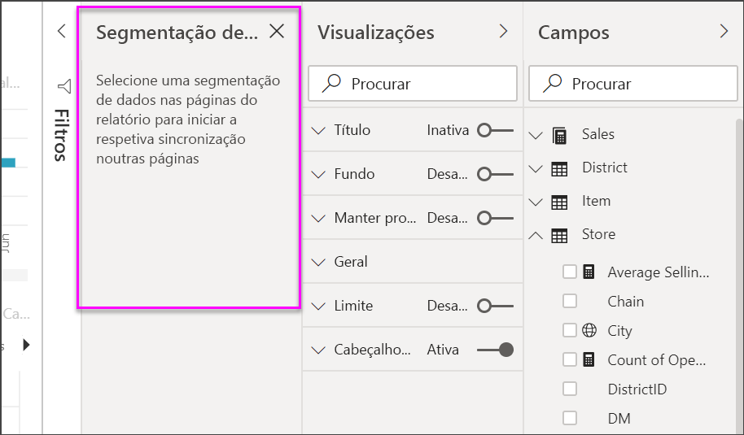
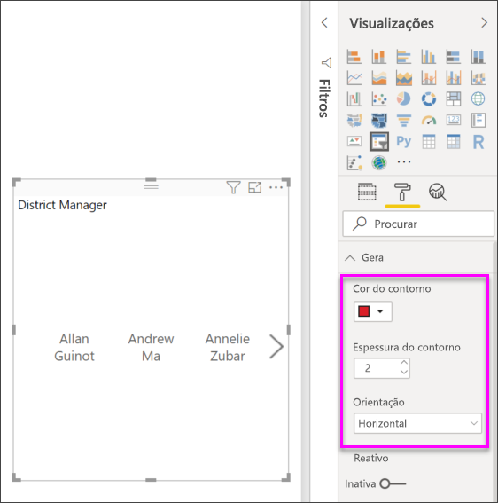

# Segmentação de Dados no Power BI

[!INCLUDE [applies-to](../includes/applies-to.md)] [!INCLUDE [yes-desktop](../includes/yes-desktop.md)] [!INCLUDE [yes-service](../includes/yes-service.md)]

Suponha que pretende que os leitores de relatórios consigam observar as métricas gerais das vendas e, ao mesmo tempo, consigam realçar o desempenho dos gestores distritais individuais e os diferentes períodos de tempo. Pode criar relatórios separados ou gráficos comparativos. Pode adicionar filtros no painel Filtros. Em alternativa, pode utilizar *segmentações de dados*. As segmentações de dados são outra forma de filtragem. Restringem a parte do conjunto de dados mostrado nas outras visualizações no relatório. 

Este artigo explica o processo de criação e formatação de uma segmentação de dados básica, através do [Exemplo de Análise de Revenda](../create-reports/sample-retail-analysis.md) gratuito. Aborda também o controlo dos elementos visuais que são afetados por uma segmentação de dados, em sincronização com as segmentações de dados noutras páginas, ao filtrar e formatar segmentações de dados.

Estes artigos adicionais explicam como fazer tipos específicos de segmentações de dados:

- [Segmentações de intervalos numéricos](../create-reports/desktop-slicer-numeric-range.md).
- [Segmentações de dados relativos](desktop-slicer-filter-date-range.md).
- [Segmentações de dados de hora relativa](../create-reports/slicer-filter-relative-time.md).
- [Segmentações de dados redimensionáveis](../create-reports/power-bi-slicer-filter-responsive.md) e reativos.
- [Segmentações de dados de hierarquia](../create-reports/power-bi-slicer-hierarchy-multiple-fields.md) com vários campos.

## Quando usar uma segmentação
As segmentações de dados são uma ótima escolha quando quer:

* Apresentar os filtros mais utilizados ou importantes na tela do relatório para facilitar o acesso.
* Facilitar a apresentação do estado atual filtrado sem ter de abrir uma lista pendente. 
* Filtrar por colunas que são desnecessárias e estão ocultas nas tabelas de dados.
* Criar relatórios mais focados ao colocar as segmentações de dados junto aos elementos visuais importantes.

As segmentações de dados do Power BI não suportam:

- Campos de entrada
- Desagregação

## Criar uma segmentação

Esta segmentação de dados filtra dados por gestores distritais. Se quiser continuar com este procedimento, transfira o [ficheiro Exemplo de Análise de Revenda PBIX.pbix](https://download.microsoft.com/download/9/6/D/96DDC2FF-2568-491D-AAFA-AFDD6F763AE3/Retail%20Analysis%20Sample%20PBIX.pbix).

1. Abra o Power BI Desktop e, na barra de menus, selecione **Ficheiro** > **Abrir**.
   
1. Navegue até ao ficheiro **Exemplo de Análise de Revenda PBIX.pbix** e, em seguida, selecione **Abrir**.

1. No painel esquerdo, selecione o ícone de **Relatório**  para abrir o ficheiro na vista de relatório.

1. Na página **Descrição Geral** , sem nada selecionado na tela do relatório, selecione o ícone de **Segmentação de dados**  no painel **Visualizações** para criar uma nova segmentação de dados. 

1. Com a nova segmentação de dados selecionada, no painel **Campos** , selecione **Distrito** > **GD** para preencher a segmentação de dados. 

    A nova segmentação de dados está agora preenchida com uma lista de nomes de gerentes distritais e as respetivas caixas de seleção.
    
    
    
1. Redimensione e arraste os elementos na tela para criar espaço para a segmentação de dados. Tenha em atenção que, se redimensionar a segmentação de dados demasiado pequena, os seus itens serão cortados. 

1. Selecione os nomes na segmentação de dados e observe os efeitos nas outras visualizações na página. Selecione os nomes novamente para os desselecionar ou mantenha a tecla **Ctrl** premida para selecionar mais do que um nome. Selecionar todos os nomes tem o mesmo efeito que selecionar nenhum. 

1. Em alternativa, selecione **Formatar** (ícone de rolo de pintura) no painel **Visualizações** para formatar a sua segmentação de dados. 

   Existem demasiadas opções para as descrever todas aqui. Experimente e crie uma segmentação de dados que funcione para si. Na seguinte imagem, primeira segmentação de dados tem uma orientação horizontal e fundos coloridos para os itens. A segunda segmentação de dados tem uma orientação vertical e texto colorido para um aspeto mais padrão.

   

   >[!TIP]
   >Por predefinição, os itens da lista de segmentação de dados são ordenados por ordem ascendente. Para inverter a ordenação para a ordem descendente, selecione as reticências ( **...** ) no canto superior direito da segmentação de dados e escolha **Ordenação descendente**.

## Controlar que elementos visuais da página são afetados pelas segmentações de dados
Por predefinição, as segmentações de dados nas páginas de relatórios afetam todas as outras visualizações nessa página, incluindo umas às outras. À medida que seleciona valores nos controlos de deslize de lista e data que acabou de criar, observe os efeitos nas outras visualizações. Os dados filtrados são uma interseção dos valores selecionados em ambas as segmentações de dados. 

Utilize as interações visuais para impedir que algumas visualizações da página sejam afetadas pelas outras. Na página **Descrição Geral** , o gráfico **Variação das Vendas Totais por Mês Fiscal e Gestor Distrital** mostra dados comparativos gerais para os gestores distritais por mês, os quais pretende manter sempre visíveis. Utilize as interações visuais para impedir que as seleções da segmentação de dados filtrem este gráfico. 

1. Aceda à página **Descrição Geral** do relatório e, em seguida, selecione a segmentação de dados **GD** que criou anteriormente.

1. No menu do Power BI Desktop, selecione o menu **Formato** em **Ferramentas Visuais** e, em seguida, selecione **Editar interações**.
   
   Os controlos de filtro , cada um com um **Filtro** e uma opção **Nenhum** , aparecem acima dos elementos visuais na página. Inicialmente, a opção **Filtro** está pré-selecionada em todos os controlos.
   
1. Selecione a opção **Nenhum** no controlo de filtro acima do gráfico **Variação das Vendas Totais por Mês Fiscal e Gestor Distrital** para que a segmentação de dados **GD** deixe de ser filtrada. 

1. Selecione a segmentação de dados **OpenDate** e, em seguida, selecione a opção **Nenhum** acima do gráfico **Variação das Vendas Totais por Mês Fiscal e Gestor Distrital** para que a segmentação de dados deixe de ser filtrada. 

   Agora, à medida que seleciona nomes e intervalos de datas nas segmentações de dados, o gráfico **Variação das Vendas Totais por Mês Fiscal e Gestor Distrital** não é alterado.

Para obter mais informações sobre a edição de interações, veja [Alterar a forma como os elementos visuais interagem num relatório do Power BI](../create-reports/service-reports-visual-interactions.md).

## Sincronizar e utilizar segmentações de dados noutras páginas
Pode sincronizar uma segmentação de dados e utilizá-la em qualquer ou em todas as páginas num relatório. 

No relatório atual, a página **Vendas Mensais Distritais** também tem uma segmentação de dados **Gestor Distrital** , mas e se também quiséssemos a segmentação de dados na página **Novas Lojas** ? A página **Novas Lojas** tem uma segmentação de dados, mas fornece apenas informações sobre o **Nome da Loja**. Com o painel **Segmentação de dados de sincronização** , pode sincronizar a segmentação de dados **Gestor Distrital** para estas páginas, de forma a que as seleções da segmentação de dados em qualquer página afetem as visualizações nas três páginas.

1. No Power BI Desktop, no menu **Ver** , selecione **Segmentação de dados de sincronização**.

    

    O painel **Sincronizar segmentação de dados** é apresentado entre os painéis **Filtros** e **Visualizações**.

    

1. Na página **Vendas Mensais Distritais** do relatório, selecione a segmentação de dados **Gestor Distrital**. 

    Como já criou uma segmentação de dados **Gestor Distrital** ( **GD** ) na página **Descrição Geral** , o painel **Segmentação de dados de sincronização** aparece da seguinte forma:
    
    
    
1. Na coluna **Sincronização** do painel **Segmentação de dados de sincronização** , selecione as páginas **Descrição Geral** , **Vendas Mensais Distritais** e **Novas Lojas**. 

    Esta seleção faz com que a segmentação **Vendas Mensais Distritais** seja sincronizada em todas as três páginas. 
    
1. Na coluna **Visível** , do painel **Segmentação de dados de sincronização** , selecione a página **Novas Lojas**. 

    Esta seleção faz com que a segmentação **Vendas Mensais Distritais** seja visível nestas três páginas. O painel **Segmentação de dados de sincronização** é agora apresentado da seguinte forma:

    

1. Observe os efeitos da sincronização da segmentação de dados e de a tornar visível nas outras páginas. Na página **Vendas Mensais Distritais** , observe que a segmentação de dados **Gestor Distrital** apresenta agora as mesmas seleções que as da página **Descrição Geral**. Na página **Novas Lojas** , a segmentação de dados **Gestor Distrital** está agora visível e as suas seleções afetam as seleções que estão visíveis na segmentação de dados **Nome da Loja**. 
    
    >[!TIP]
    >Embora a segmentação de dados inicialmente seja apresentada nas páginas sincronizadas com o mesmo tamanho e posição da página original, pode mover, redimensionar e formatar as segmentações de dados sincronizadas nas várias páginas de forma independente. 

    >[!NOTE]
    >Se sincronizar uma segmentação de dados numa página, mas não a tornar visível nessa página, as seleções da segmentação de dados efetuadas nas outras páginas continuarão a filtrar os dados na página.
 
## Filtrar segmentações de dados
Pode aplicar filtros de nível visual às segmentações de dados para reduzir a lista de valores que são apresentados na segmentação. Por exemplo, pode filtrar valores em branco de uma segmentação de listas ou filtrar certas datas de uma segmentação de dados de intervalo. Quando o faz, isso só afeta *os valores que são apresentados na segmentação de dados* e não *o filtro que a segmentação de dados aplica a outros elementos visuais* quando faz uma seleção. Digamos, por exemplo, que aplica um filtro a uma segmentação de dados de intervalo para apresentar apenas certas datas. A seleção na segmentação de dados só apresentará as primeiras e últimas datas desse intervalo, mas continuará a ver outras datas noutros elementos visuais. Assim que alterar o intervalo selecionado na segmentação de dados, verá a atualização dos outros elementos visuais. Se limpar a segmentação de dados, todas as datas serão novamente apresentadas.

Veja [Tipos de filtro](../create-reports/power-bi-report-filter-types.md) para obter mais informações sobre filtros de nível visual.

## Formatar as segmentações de dados
Estão disponíveis diferentes opções de formatação, dependendo do tipo de segmentação de dados. Ao utilizar a orientação **Horizontal** , o esquema **Reativo** e a cor **Item** , pode criar botões ou mosaicos em vez de itens de lista padrão e fazer com que os itens da segmentação de dados sejam redimensionados para se ajustarem aos diferentes tamanhos de ecrã e esquemas.  

1. Com a segmentação de dados **Gestor Distrital** selecionada em qualquer página, no painel **Visualizações** , selecione o ícone **Formato**  para visualizar os controlos de formatação. 
    
    
    
1. Selecione as setas de menu pendente junto a cada categoria para mostrar e editar as opções. 

### Secção de opções Geral
1. Em **Formatar** , selecione **Geral** , selecione uma cor vermelha em **Cor do contorno** e, em seguida, altere a **Espessura do contorno** para *2*. 

    Esta definição altera a cor e a espessura dos contornos e sublinhados do cabeçalho e do item.

1. Em **Orientação** , a opção predefinida é **Vertical**. Selecione **Horizontal** para criar uma segmentação de dados com os mosaicos ou os botões dispostos horizontalmente e desloque-se com as setas para aceder aos itens que não cabem na segmentação de dados.
    
    
    
1. **Ative** o esquema **Reativo** para alterar o tamanho e a disposição dos itens da segmentação de dados, de acordo com o ecrã da vista e o tamanho da segmentação de dados. 

    Para segmentações de dados de lista, o esquema reativo impede que os itens sejam cortados em ecrãs pequenos. Está disponível apenas nas orientações verticais. Para segmentações de dados de controlo de deslize de intervalo, a formatação reativa altera o estilo do controlo de deslize e permite um redimensionamento mais flexível. Ambos os tipos de segmentações de dados tornam-se ícones de filtro nos tamanhos pequenos.
    
    
    
    >[!NOTE]
    >As alterações do esquema Reativo podem substituir a formatação de um cabeçalho ou item específico que definiu. 
    
1. Em **Posição X** , **Posição Y** , **Largura** e **Altura** , defina a posição e o tamanho da segmentação de dados com precisão numérica ou mova e redimensione a segmentação de dados diretamente na tela. 

    Experimente tamanhos de itens e disposições diferentes e observe como a formatação reativa é alterada em conformidade. Estas opções estão disponíveis apenas quando seleciona as orientações horizontais. 

    

Para obter mais informações sobre as orientações horizontais e esquemas reativos, veja [Criar uma segmentação de dados reativa que pode redimensionar no Power BI](../create-reports/power-bi-slicer-filter-responsive.md).

### Opções de controlos de seleção (apenas segmentações de dados de lista)
1. Em **Controlos de seleção** , ative a **opção Mostrar "Selecionar tudo"** para **Ativada** para adicionar um item **Selecionar Tudo** à segmentação de dados. 

    **A opção "Selecionar Tudo"** está **Desativada** , por predefinição. Quando está ativada, esta opção, alternada, seleciona ou desseleciona todos os itens. Se selecionar todos os itens, selecionar um item anula a sua seleção, permitindo um tipo de filtro *não é*.
    
    
    
1. Mude a opção **Seleção única** para **Desativado** para poder selecionar múltiplos itens sem ter de manter a tecla **Ctrl** premida. 

    A opção **Seleção única** está **Ativada** , por predefinição. Selecionar um item seleciona-o e manter a tecla **Ctrl** premida seleciona múltiplos itens. Selecionar um item novamente desseleciona esta opção.

### Opções de título
**Título** está **Ativado** por predefinição. Esta seleção apresenta o nome do campo de dados na parte superior da segmentação de dados. Também pode editar o título, o que é especialmente útil para as segmentações de dados de hierarquia. Veja [Alterar o título](../create-reports/power-bi-slicer-hierarchy-multiple-fields.md#change-the-title) no artigo “Adicionar vários campos a uma segmentação de dados de hierarquia” para obter mais detalhes.

- Para este artigo, formate o texto do título da seguinte forma: 
   - **Cor do tipo de letra** : vermelho
   - **Tamanho do texto** : **14 pt**
   - **Alinhamento** : **Centro**
   - **Família de tipos de letra** : **Arial Black**

### Opções Itens

As opções Itens só estão disponíveis para as segmentações de dados de lista.

1. Para este artigo, formate as opções **Itens** da seguinte forma:
    - **Cor do tipo de letra** : preto
    - **Fundo** : vermelho claro
    - **Tamanho do texto** : **10 pt**
    - **Família de tipos de letra** : **Arial**
 
1. Para **Contorno** , selecione **Moldura** para desenhar um limite à volta de cada item com o tamanho e a cor que definiu nas opções em **Geral**. 
    
    
    
    >[!TIP]
    >- Com a opção **Geral** > **Orientação** > **Horizontal** selecionada, os itens desmarcados mostram o texto e as cores de fundo escolhidos. Os itens selecionados utilizam a predefinição do sistema, normalmente um fundo preto com texto branco.
    >- Com a **Orientação** > **Geral > Vertical** selecionada, os itens mostram sempre as cores selecionadas e as caixas de verificação ficam sempre em preto quando são selecionadas. 

### Opções de entradas de data/numéricas e de controlo de deslize

As opções de entradas de data/numéricas e de controlo de deslize apenas estão disponíveis para segmentações de dados de controlo de deslize de intervalo.

- Para segmentações de dados de lista, as opções de entradas de data/numéricas são as mesmas que as opções **Itens** , mas não existem opções de contorno ou sublinhado.
- As opções de controlo de **deslize** permitem-lhe definir a cor do controlo de deslize de intervalo ou mudar o controlo de deslize para **Desativo** , deixando apenas as entradas numéricas.

### Outras opções de formatação
As outras opções de formatação estão **Desativadas** por predefinição. **Ative** estas opções para controlá-las: 

- **Fundo:** Adiciona uma cor de fundo à segmentação de dados e define a sua transparência.
- **Manter proporção** : mantenha a altura e a largura relativas da segmentação de dados se for redimensionada.
- **Limite** : Adiciona um limite à volta da segmentação e define a respetiva cor. Este limite da segmentação de dados é separado das definições **Gerais** e não é afetado pelas mesmas.
- **Sombra** : adicione uma sombra ao controlo de deslize.

## Próximos passos
Para obter mais informações sobre as segmentações de dados, veja os seguintes artigos:

- [Segmentações de intervalos numéricos](../create-reports/desktop-slicer-numeric-range.md)
- [Segmentações de datas relativas](desktop-slicer-filter-date-range.md)
- [Segmentações de hora relativa](../create-reports/slicer-filter-relative-time.md)
- [Segmentações de dados redimensionáveis](../create-reports/power-bi-slicer-filter-responsive.md) e reativos
- [Segmentações de dados de hierarquia](../create-reports/power-bi-slicer-hierarchy-multiple-fields.md) com vários campos
