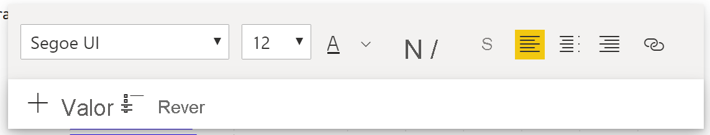
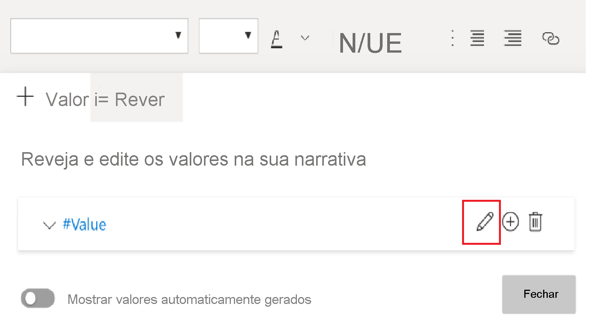
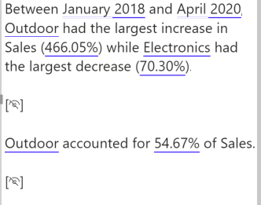

# Criar resumos de narrativas inteligentes (pré-visualização)

[!INCLUDE[consumer-appliesto-nyyn](../includes/consumer-appliesto-nyyn.md)]    

[!INCLUDE [power-bi-visuals-desktop-banner](../includes/power-bi-visuals-desktop-banner.md)]

A visualização de narrativa inteligente ajuda-o a resumir rapidamente os elementos visuais e relatórios. Fornece ideias inovadoras relevantes que pode personalizar.

Use resumos de narração inteligente nos seus relatórios para abordar as conclusões fundamentais, destacar tendências e editar o idioma e o formato de um público-alvo específico. No PowerPoint, em vez de colar uma captura de ecrã do relatório com as conclusões fundamentais, pode adicionar narrativas que são atualizadas com cada atualização. O seu público-alvo pode utilizar os resumos para compreender os dados, chegar aos pontos chave mais rapidamente e explicar os dados a outras pessoas.

>[!NOTE]
> Como a caraterística de narrativa inteligente está em pré-visualização, tem de ativá-la se quiser usá-la. No Power BI, selecione **Ficheiro** > **Opções e Definições** > **Opções** > **Funcionalidades de pré-visualização**. Em seguida, selecione **Elemento visual de narrativa inteligente**.
>
>

## Introdução 
Veja a Justyna a mostrar como utilizar narrativas inteligentes e, em seguida, experimente também com o tutorial, abaixo do vídeo.  Para acompanhar este tutorial, transfira o [ficheiro de exemplo](https://github.com/microsoft/powerbi-desktop-samples/blob/master/Monthly%20Desktop%20Blog%20Samples/2020/2020SU09%20Blog%20Demo%20-%20September.pbix) de um cenário de vendas online.

> [!VIDEO https://youtu.be/01UrT-z37sw]

No painel **Visualizações**, selecione o ícone **Narrativa inteligente** para gerar automaticamente um resumo.

Vê uma narrativa baseada em todos os elementos visuais na página. Por exemplo, no ficheiro de exemplo, as narrativas inteligentes podem gerar automaticamente um resumo dos elementos visuais do relatório que abordam a receita, as visitas ao site e as vendas. O Power BI analisa automaticamente as tendências para mostrar que a receita e as visitas cresceram ambas. Calcula inclusivamente o crescimento que, neste caso, é de 72%.
 

 
Para gerar uma narrativa inteligente de uma visualização, clique com o botão direito do rato na mesma e selecione **Resumir**. Por exemplo, no ficheiro de exemplo, tente resumir um gráfico de dispersão que mostra várias transações. O Power BI analisa os dados e mostra qual cidade ou região tem a receita mais alta por transação e o número mais alto de transações. A narrativa inteligente também mostra o intervalo de valores esperado para estas métricas. Vê que a maioria das cidades produz menos de 45 USD por transação e tem menos de 10 transações.
 
  

 
## Editar o resumo
 
O resumo da narrativa inteligente é altamente personalizável. Pode editar ou adicionar ao texto existente através dos comandos da caixa de texto. Por exemplo, pode deixar o texto a negrito ou alterar a sua cor.
 

  
Para personalizar o resumo e adicionar as suas próprias informações, utilize *valores dinâmicos*. Pode mapear o texto para campos e medidas existentes ou utilizar uma linguagem natural para definir uma nova medida para mapear para texto. Por exemplo, para adicionar informações sobre o número de itens devolvidos no ficheiro de exemplo, adicione um valor. 

Ao escrever um nome de valor, pode escolher a partir de uma lista de sugestões, tal como faz num elemento visual de Perguntas e Respostas. Assim, além de fazer perguntas sobre os seus dados num elemento visual de Perguntas e Respostas, agora pode criar os seus próprios cálculos sem sequer usar Data Analysis Expressions (DAX). 
  

  
Também pode formatar valores dinâmicos. Por exemplo, no ficheiro de exemplo, pode mostrar valores como moeda, especificar casas decimais e escolher um separador para milhares. 
   

   
Para formatar um valor dinâmico, selecione o valor no resumo para ver suas opções de edição no separador **Rever**. Em alternativa, na caixa de texto, junto ao valor que quer editar, selecione o botão Editar. 
   

   
Também pode usar o separador **Revisão** para rever, eliminar ou reutilizar os valores definidos anteriormente. Selecione o sinal de adição (+) para inserir o valor no resumo. Também pode mostrar valores gerados automaticamente ao ativar a opção na parte inferior do separador **Rever**.

Às vezes, aparece um símbolo de resumo oculto na narrativa inteligente. Este indica que os dados e filtros atuais não produzem qualquer resultado para o valor. Um resumo está vazio quando não há informações disponíveis. Por exemplo, no gráfico de linhas do ficheiro de exemplo, um resumo de valores altos e baixos pode estar vazio quando a linha do gráfico está em baixo. No entanto, o resumo pode aparecer noutras condições. Os símbolos de resumo ocultos são visíveis apenas quando tenta editar um resumo.

   
## Interações visuais
Um resumo é dinâmico. Este atualiza automaticamente o texto gerado e os valores dinâmicos quando utiliza o filtro cruzado. Por exemplo, se selecionar produtos eletrónicos no gráfico em anel do ficheiro de exemplo, o resto do relatório tem filtragem cruzada e o resumo também será filtrado de forma cruzada para se focar nos produtos eletrónicos.  

Neste caso, as visitas e as receitas têm diferentes tendências, portanto, o texto de resumo é atualizado para refletir as tendências. O valor da contagem de devoluções adicionado é atualizado para 4196 $. Os resumos vazios também podem ser atualizados quando aplica a filtragem cruzada.
   

   
Também pode aplicar uma filtragem mais avançada. Por exemplo, no ficheiro de exemplo, examine o elemento visual das tendências de vários produtos. Se estiver interessado apenas numa tendência de um determinado trimestre, selecione os pontos de dados relevantes para atualizar o resumo dessa tendência.
   

   
## Limitações

A caraterística de narrativa inteligente não suporta a seguinte funcionalidade:
- Afixar num dashboard 
- Utilização de valores dinâmicos e da formatação condicional (por exemplo, título dependente de dados)
- Azure Analysis Services, AS no local
- KPIs, cartões, cartões de várias linhas, mapas, tabelas, matrizes, elementos visuais R ou elementos visuais Python, elementos visuais personalizados 
- Resumos de elementos visuais com colunas agrupadas por outras colunas e de elementos visuais compilados num campo de grupo de dados 
- Filtragem cruzada de um elemento visual
- Mudar o nome dos valores dinâmicos ou editar os valores dinâmicos gerados automaticamente
- Resumos de elementos visuais com cálculos imediatos, como aritmética de Perguntas e Respostas e percentagem do total geral 
- [Grupos de cálculo](/analysis-services/tabular-models/calculation-groups)
   

