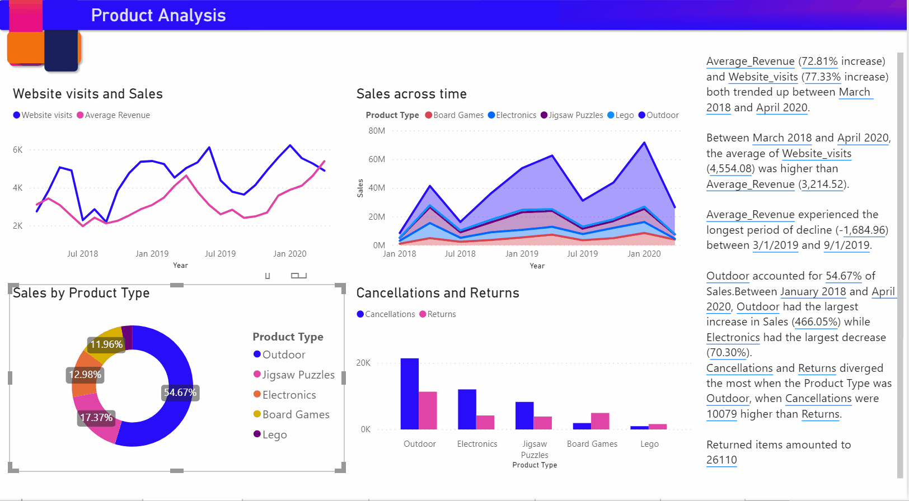

# Criar Narrativas Inteligentes no Power BI (pré-visualização)

[!INCLUDE[consumer-appliesto-nyyn](../includes/consumer-appliesto-nyyn.md)]    

[!INCLUDE [power-bi-visuals-desktop-banner](../includes/power-bi-visuals-desktop-banner.md)]

A visualização das Narrativas inteligentes ajuda-o a resumir rapidamente os elementos visuais e os relatórios ao proporcionar informações integradas relevantes personalizáveis.

Ao utilizar esta funcionalidade, os criadores podem adicionar narrativas ao relatório para abordar conclusões fundamentais, destacar tendências, editar a linguagem e formatá-la para se ajustar a um público específico. Em vez de colarem uma captura de ecrã do relatório no PowerPoint com as conclusões fundamentais adicionadas, agora conseguem adicionar narrativas ao relatório que são atualizadas com cada atualização. Os utilizadores finais podem utilizar as narrativas para compreender os dados, chegar aos pontos chave mais rapidamente e explicar os dados a outras pessoas.

>[!NOTE]
> Já que está funcionalidade está em pré-visualização, primeiro precisará de a ativar em Ficheiro > Opções e Definições> Opções > Funcionalidade de pré-visualização e confirmar que a opção **Elemento visual da narrativa inteligente** está ativada:

Pode encontrar o pbix utilizado para o cenário de Vendas Online nesta documentação [aqui](https://github.com/microsoft/powerbi-desktop-samples/blob/master/Monthly%20Desktop%20Blog%20Samples/2020/2020SU09%20Blog%20Demo%20-%20September.pbix).

## Começar Agora 

Clique no ícone de novas narrativas inteligentes no painel de visualização para gerar automaticamente um resumo.

 Verá uma narrativa criada com base em todos os elementos visuais na página. Por exemplo, pode clicar no ícone para gerar automaticamente um resumo dos elementos visuais que se referem a receitas, visitas ao site e vendas neste relatório. Repare que o Power BI analisa automaticamente a tendência para mostrar que as Receitas e as Visitas aumentaram. Calcula também o tipo de crescimento que vê – neste caso, um aumento de 72%.
 
 
 
 Também pode clicar com o botão direito do rato no elemento visual e selecionar **“resumir”** , o que irá gerar um resumo automático dessa visualização. Por exemplo, quando clica com o botão direito do rato em -> resumir no gráfico de dispersão ao mostrar as várias transações, o Power BI analisa os dados e mostra qual a cidade/região tem a receita mais alta por transação e o número mais alto de transações. Também mostra o intervalo de valores esperado para essas métricas, para que possa compreender que a maioria das cidades esteve abaixo de 45 $ de receita por transação e teve menos de 10 transações.
 
  
 
 
 ## Editar o resumo
 
 O resumo é altamente **personalizável**, onde pode adicionar novo texto ou editar o existente ao utilizar os mesmos controlos disponíveis na caixa de texto normal. Por exemplo, pode deixar o texto a negrito ou alterar a cor.
 
  
  
  Também pode personalizar o resumo e adicionar as suas próprias informações ao adicionar **valores dinâmicos**. Pode mapear o texto para campos e medidas existentes ou utilizar uma linguagem natural para definir uma nova medida para mapear para texto. Por exemplo, se quiser adicionar informações sobre o número de itens devolvidos, poderá utilizar a experiência de adição de valor, conforme é indicado no gif. Integramos a experiência de Perguntas e Respostas para adicionar valores dinâmicos. À medida que escreve, obterá sugestões numa lista pendente tal como num elemento visual de Perguntas e Respostas e poderá simplesmente guardá-las como um valor.  Assim, além de ser capaz de fazer perguntas sobre os dados nas Perguntas e Respostas, o âmbito foi expandido para criar os seus próprios cálculos sem utilizar o DAX. 
  
   
  
  Pode formatar os valores dinâmicos, por exemplo, para serem mostrados como moeda, especificar casas decimais, separador de milhares, etc. 
   
   
   
   Pode fazer isto ao clicar diretamente no valor no resumo para o formatar ou ao clicar no botão de edição correspondente ao valor no separador de revisão do controlo da caixa de texto. 
   
   
   
   Também pode fazer com que o separador Revisão reveja, elimine ou reutilize os valores definidos anteriormente.  Clicar no ícone de adição irá inserir o valor no resumo. Também pode mostrar valores gerados automaticamente ao mudar a opção na parte inferior.

Às vezes, poderá ver o símbolo dos resumos oculto a indicar “Os filtros e os dados atuais não produzem nenhum resultado para este valor”. Tal ocorre porque alguns resumos podem estar vazios, pois não há nada de interessante a dizer. Por exemplo, um resumo que examine valores altos e baixos num gráfico de linhas poderá estar vazio se for uma linha reta, mas poderá não estar vazio sob outras condições. Estes símbolos só estarão visíveis quando tentar editar os resumos.

   
   
   ## Interações visuais
   O resumo é dinâmico e atualiza automaticamente o texto gerado e os valores dinâmicos quando utiliza o filtro cruzado. Por exemplo, se selecionar Produtos eletrónicos no gráfico em anel, o resto do relatório irá aplicar a filtragem cruzada e o resumo também será filtrado para se focar nos Produtos eletrónicos.  Neste caso, as visitas e as receitas têm diferentes tendências, portanto, o texto é atualizado para refletir isso. E a contagem do valor de devoluções adicionado é atualizada para 4196 $. Alguns dos resumos vazios também poderão ser atualizados quando aplica a filtragem cruzada.
   
   
   
   Também pode aplicar uma filtragem mais avançada. Por exemplo, se estiver interessado apenas na tendência num determinado trimestre deste elemento visual que analisa as tendências de vários produtos diferentes, bastará selecionar os pontos de dados relevantes para fazer com que esse fragmento seja atualizado no resumo.
   
   
   
   ## Limitações
   - A afixação no Dashboard não é suportado.
   - A utilização de Valores Dinâmicos e da Formatação Condicional (por exemplo, título dependente de dados) não é suportada.
   - O Azure Analysis Services, AS no Local não é suportado.
   - O resumo não é suportado pelos elementos visuais de KPI, Cartão, Cartão de várias linhas, Mapas, Tabela, Matrizes, R/Python nem pelos elementos visuais personalizados. Alguns destes elementos visuais serão adicionados no futuro.
   - O resumo não é suportado em elementos visuais com colunas agrupadas por outras colunas e compiladas num campo de Grupo de Dados. 
   - A filtragem cruzada fora dos elementos visuais não é suportada.
   - Mudar o nome dos valores dinâmicos ou editar os valores dinâmicos gerados automaticamente não é suportado.
   - O resumo de elementos visuais que contêm cálculos imediatos, como aritmética de FAQ, Percentagem do Total geral, etc., não é suportado.
   

