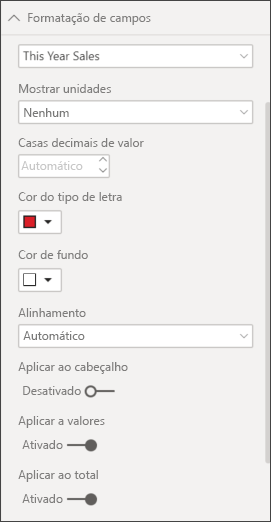
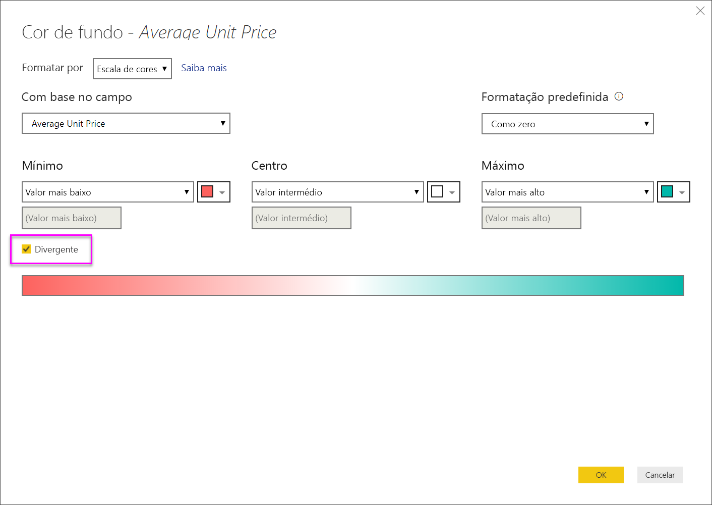
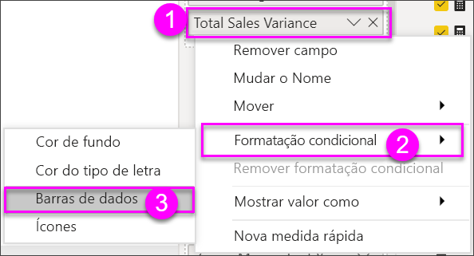
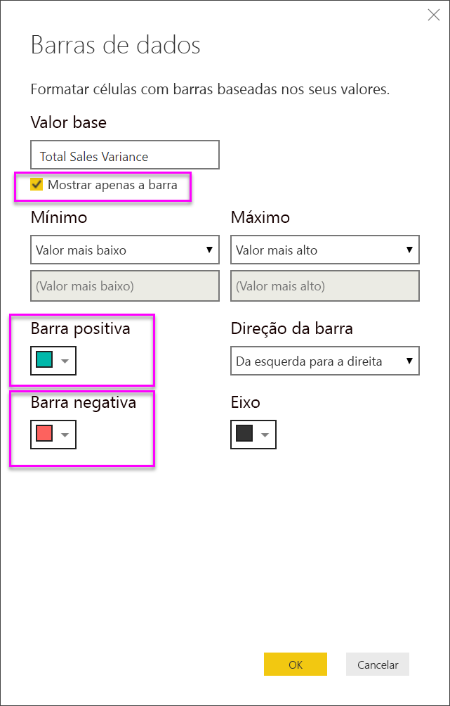
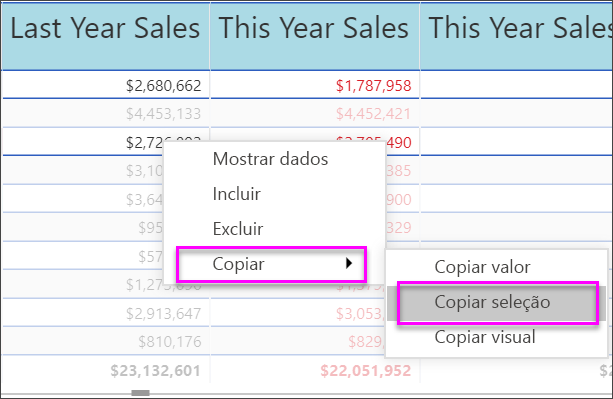

# Tabelas em relatórios e dashboards do Power BI
Uma tabela é uma grelha que contém dados relacionados numa série lógica de linhas e colunas. Também pode conter cabeçalhos e uma linha para totais. As tabelas funcionam bem com comparações quantitativas, onde pode observar vários valores para uma única categoria. Por exemplo, esta tabela apresenta 5 medidas diferentes para **Categoria**.

Crie tabelas em relatórios e realça de forma cruzada os elementos na tabela com outros elementos visuais na mesma página do relatório.  Além disso, pode selecionar linhas, colunas, células individuais e realces cruzados. Pode copiar e colar células individuais e múltiplas seleções de célula noutras aplicações.

## Quando utilizar uma tabela
As tabelas são uma excelente opção:

* para ver e comparar dados detalhados e valores exatos (em vez de representações visuais)
* para apresentar dados num formato tabular
* para apresentar dados numéricos por categorias   

> [!NOTE]
> Se uma tabela tiver demasiados valores, considere convertê-la numa matriz e/ou utilizar desagregação. O máximo de pontos de dados que a tabela irá apresentar é 3500.

## Pré-requisitos
- Serviço Power BI ou Power BI Desktop
- Exemplo de Análise de Revenda

## Criar uma tabela
Vamos criar a tabela ilustrada acima para apresentar os valores de vendas por categoria de item. Para acompanhar, inicie sessão no serviço Power BI, selecione **Obter Dados \> Exemplos \> Exemplo de Análise de Revenda > Ligar** e selecione **Ir para o dashboard**. A criação de uma visualização exige permissões de edição para o conjunto de dados e para o relatório. Felizmente, todos os exemplos do Power BI são editáveis. Se um relatório tiver sido partilhado consigo, não poderá criar visualizações nos relatórios.

1. No painel de navegação esquerdo, selecione **Áreas de trabalho > A minha área de trabalho**.    
2. Selecione o separador Conjuntos de dados e desloque o ecrã para baixo até ao conjunto de dados Exemplo de Análise de Revenda que acabou de adicionar.  Selecione o ícone **Criar relatório**.

    
2. No editor de relatórios, selecione **Item** > **Categoria**.  O Power BI cria automaticamente uma tabela que apresenta uma lista de todas as categorias.

    
3. Selecione **Vendas > Preço Unitário Médio** e **Vendas > Vendas do Último Ano** e **Vendas > Vendas Deste Ano** e escolha todas as 3 opções (Valor, Objetivo, Estado).   
4. No painel Visualizações, localize a área **Valores** e arraste e largue os valores até que a ordem das colunas do gráfico corresponda à primeira imagem desta página.  A área Valores deverá ser semelhante à seguinte.

    
5. Afixe a tabela ao dashboard, selecionando o ícone de pin  

     

## Formatar a tabela
Existem várias formas de formatar uma tabela e vamos apenas abordar algumas delas aqui. Uma excelente forma de saber mais sobre as outras opções de formatação é abrir o painel de Formatação (ícone de rolo de pintura ) e explorar.

* Experimente formatar a grelha da tabela. Aqui, adicionámos uma grelha vertical azul, adicionámos espaço às linhas, aumentámos um pouco o contorno e o tamanho do texto.

    

    
* Para os cabeçalhos de coluna, alterámos a cor de fundo, adicionámos um contorno e aumentámos o tamanho do tipo de letra. 

    

    

* Pode até aplicar a formatação em colunas individuais e em cabeçalhos de coluna. Comece por expandir **Formatação de campo** e selecionar, na lista pendente, a coluna a formatar. Consoante os valores da coluna, a opção Formatação de campo permite definir coisas como: as unidades de apresentação, a cor do tipo de letra, o número de casas decimais, o fundo, o alinhamento e muito mais. Assim que tiver ajustado as definições, decida se pretende aplicar essas definições também ao cabeçalho e à linha de totais.

    

* E, após alguma formatação adicional, eis a nosso tabela final. Uma vez que existem muitas opções de formatação, a melhor forma de aprender é começar com a formatação predefinida. Para tal, abra o painel Formatação  e comece a explorar. 

    

### Formatação condicional
Um tipo de formatação é chamado *formatação condicional* e é aplicado aos campos na área **Valores** do painel **Visualizações** no serviço Power BI ou no Desktop. 

Com a formatação condicional para tabelas, pode especificar cores de fundo de célula personalizadas e cores de tipo de letra com base nos valores de célula, incluindo a utilização de cores da gradação. 

1. No painel **Visualizações** no serviço Power BI ou no Desktop, selecione a seta para baixo junto ao valor na área **Valores** que pretende formatar (ou clique com o botão direito do rato no campo). Só pode gerir a formatação condicional para os campos na área **Valores** da área **Campos**.

    
2. Selecione **Escalas de cores de fundo**. Na caixa de diálogo que aparece, pode configurar a cor, bem como os valores *Mínimo* e *Máximo*. Se selecionar a caixa **Divergente**, também pode configurar um valor de *Centro* opcional.

    

    Vamos aplicar alguma formatação personalizada aos nossos valores de Preço Unitário Médio. Selecione **Divergente**, adicione algumas cores e escolha **OK**. 

    
3. Adicione um novo campo à tabela que tem valores positivos e negativos.  Selecione **Vendas > Desvio de Vendas Total**. 

    
4. Adicione formatação condicional à barra de dados, selecionando a seta para baixo junto a **Desvio de Vendas Total** e escolhendo **Formatação condicional > Barras de dados**.

    
5. Na caixa de diálogo que aparece, defina as cores para **Barra positiva**, **Barra negativa**, coloque uma marca de verificação junto a **Mostrar apenas a barra** e faça outras alterações que pretender.

    

    Quando seleciona **OK**, as barras de dados substituem os valores numéricos na tabela, facilitando a análise da mesma.

    
6. Para remover a formatação condicional de uma visualização, clique novamente no campo com o botão direito do rato e selecione **Remover Formatação Condicional**.

> [!TIP]
> A formatação condicional também está disponível a partir do painel de Formatação (ícone de rolo de pintura). Selecione o valor a formatar e, em seguida, defina **Escalas de cores** ou **Barras de dados** como **Ativo** para aplicar as predefinições ou, para personalizar as definições, selecione **Controlos avançados**.
> 
## Copie os valores das tabelas do Power BI para utilizar noutras aplicações

A tabela ou a matriz pode ter conteúdos que quer utilizar noutras aplicações, como o Dynamics CRM, o Excel e até mesmo noutros relatórios do Power BI. Ao clicar com o botão direito do rato no Power BI, pode copiar uma única célula ou uma seleção de células para a área de transferência e colar noutra aplicação.

* Para copiar o valor de uma única célula, selecione a célula, clique com o botão direito do rato e escolha **Copiar valor**. Com o valor da célula não formatado na área de transferência, pode agora colá-lo noutra aplicação.

    

* Para copiar mais do que uma célula, selecione um intervalo de células ou utilize CTRL para selecionar uma ou mais células. A cópia incluirá os cabeçalhos de coluna e de linha.

    

    A cópia inclui os cabeçalhos de coluna e de linha.

    

## Ajustar a largura da coluna de uma tabela
Por vezes, o Power BI trunca o cabeçalho de uma coluna num relatório e num dashboard. Para mostrar o nome completo da coluna, paire sobre o espaço à direita do cabeçalho para revelar as setas duplas, selecione e arraste.

## Considerações e resolução de problemas
* Ao aplicar a formatação de colunas, apenas pode escolher uma opção de alinhamento por coluna: Auto, Left, Center, Right. Normalmente, uma coluna contém só texto ou só números e não uma combinação de ambos. No entanto, quando uma coluna tiver números e texto, a opção de alinhamento **Automático** alinhará o texto à esquerda e os números à direita. Este comportamento suporta idiomas que se leem da esquerda para a direita.   

## Próximos passos

[Treemaps no Power BI](power-bi-visualization-treemaps.md)

[Tipos de visualização no Power BI](power-bi-visualization-types-for-reports-and-q-and-a.md)