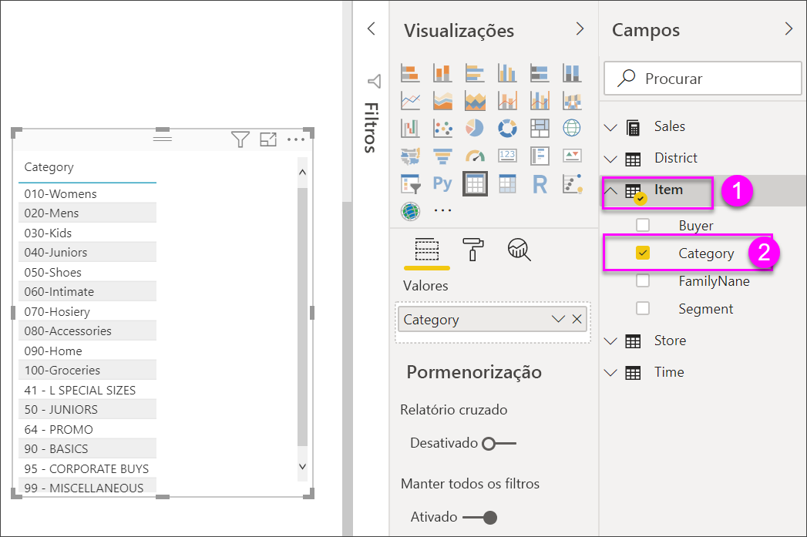
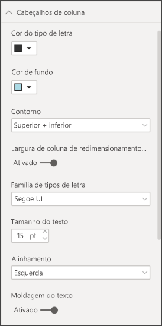

# Tabelas em relatórios e dashboards do Power BI

[!INCLUDE [power-bi-visuals-desktop-banner](../includes/power-bi-visuals-desktop-banner.md)]

Uma tabela é uma grelha que contém dados relacionados numa série lógica de linhas e colunas. Também pode conter cabeçalhos e uma linha para totais. As tabelas funcionam bem com comparações quantitativas, onde pode observar vários valores para uma única categoria. Por exemplo, esta tabela apresenta cinco medidas diferentes para **Categoria**.

Crie tabelas em relatórios e realce de forma cruzada os elementos na tabela com outros elementos visuais na mesma página do relatório. Pode selecionar linhas, colunas e até células individuais e realces cruzados. Além disso, pode copiar e colar células individuais e múltiplas seleções de célula noutras aplicações.

## Quando utilizar uma tabela

As tabelas são uma excelente opção:

* Para ver e comparar dados detalhados e valores exatos (em vez de representações visuais).

* Para apresentar dados num formato tabular.

* Para apresentar dados numéricos por categorias.

## Pré-requisito

Este tutorial utiliza o [ficheiro PBIX do Exemplo de Análise de Revenda](https://download.microsoft.com/download/9/6/D/96DDC2FF-2568-491D-AAFA-AFDD6F763AE3/Retail%20Analysis%20Sample%20PBIX.pbix).

1. Na secção superior esquerda da barra de menus, selecione **Ficheiro** > **Abrir**.
   
2. Procure a sua cópia do **ficheiro PBIX do Exemplo de Análise de Revenda**

1. Abra o **Ficheiro PBIX do Exemplo de Análise de Revenda** na vista de relatório .

1. Selecionar  para adicionar uma nova página.

## Criar uma tabela

Vai criar a tabela ilustrada no início do artigo para apresentar os valores de vendas por categoria de item.

1. No painel **Campos**, selecione **Item** > **Categoria**.

    O Power BI cria automaticamente uma tabela que apresenta uma lista de todas as categorias.

    

1. Selecione **Vendas > Preço Unitário Médio** e **Vendas > Vendas do Ano Passado**

1. Em seguida, selecione **Vendas > Vendas Deste Ano** e selecione as três opções: **Valor**, **Objetivo** e **Estado**.

1. No painel **Visualizações**, localize o painel **Valores** e selecione os valores até que a ordem das colunas do gráfico corresponda à primeira imagem desta página. Arraste os valores na área, se for necessário. O painel **Valores** terá o seguinte aspeto:

    

## Formatar a tabela

Existem várias formas de formatar uma tabela. Apenas algumas são abordadas aqui. Uma excelente forma de saber mais sobre as outras opções de formatação é abrir o painel **Formatação** (ícone de rolo de pintura ) e explorar.

* Experimente formatar a grelha da tabela. Aqui, vai adicionar uma grelha vertical azul, adicionar espaço às linhas e aumentar um pouco o contorno e o tamanho do texto.

    

    

* Para os cabeçalhos de coluna, altere a cor de fundo, adicione um contorno e aumente o tamanho do tipo de letra.

    

    

* Pode até aplicar a formatação em colunas individuais e em cabeçalhos de coluna. Comece por expandir **Formatação de campos** e selecionar, na lista pendente, a coluna a formatar. Consoante os valores da coluna, a opção **Formatação de campos** permite definir coisas como: as unidades de apresentação, a cor do tipo de letra, o número de casas decimais, o fundo, o alinhamento e mais. Assim que tiver ajustado as definições, decida se pretende aplicar essas definições também ao cabeçalho e à linha de totais.

    

    

* Após alguma formatação adicional, aqui está a nossa tabela final.

    

### Formatação condicional

*Formatação condicional* é um tipo de formatação. O Power BI aplica a formatação condicional aos campos no painel **Valores** do painel **Visualizações**.

Com a formatação condicional para tabelas, pode especificar cores de fundo de célula personalizadas e cores de tipo de letra com base nos valores de célula, incluindo a utilização de cores da gradação.

1. No painel **Visualizações**, selecione o ícone **Campos** .

1. Selecione a seta para baixo junto ao valor no painel **Valores** que pretende formatar (ou clique com o botão direito do rato no campo).

    > [!NOTE]
    > Só pode gerir a formatação condicional para os campos na área **Valores** da área **Campos**.

    

1. Selecione **Cor de fundo**.

1. Na caixa de diálogo que aparece, pode configurar a cor, os valores **Mínimo** e **Máximo**. Se selecionar a opção **Divergente**, também pode configurar um valor de **Centro** opcional.

    

    Vamos aplicar alguma formatação personalizada aos nossos valores de Preço Unitário Médio. Selecione **Divergente**, adicione algumas cores e selecione **OK**.

    
1. Adicione um novo campo à tabela que tem valores positivos e negativos. Selecione **Vendas > Desvio de Vendas Total**.

    

1. Adicione formatação condicional à barra de dados, selecionando a seta para baixo junto a **Desvio de Vendas Total** e escolhendo **Formatação condicional > Barras de dados**.

    

1. Na caixa de diálogo que aparece, defina as cores para **Barra positiva** e **Barra negativa**, selecione a opção **Mostrar apenas a barra** e faça outras alterações que pretender.

    

1. Selecione **OK**.

    As barras de dados substituem os valores numéricos na tabela, facilitando a análise da mesma.

    

Se pretender remover a formatação condicional de uma visualização, clique novamente no campo com o botão direito do rato e selecione **Remover Formatação Condicional**.

> [!TIP]
> A formatação condicional também está disponível a partir do painel **Formatar**. Selecione o valor a formatar e, em seguida, defina **Escalas de cores** ou **Barras de dados** como **Ativo** para aplicar as predefinições ou, para personalizar as definições, selecione **Controlos avançados**.

## Copie os valores das tabelas do Power BI para utilizar noutras aplicações

A tabela ou a matriz pode ter conteúdos que quer utilizar noutras aplicações, como o Dynamics CRM, o Excel e até mesmo noutros relatórios do Power BI. No Power BI, ao clicar com o botão direito do rato numa célula, pode copiar os dados de uma única célula ou de uma seleção de células para a área de transferência e colá-los noutras aplicações.

Para copiar o valor de uma única célula:

1. Selecione a célula que pretende copiar.

1. Clique com o botão direito do rato dentro da célula.

1. Selecione **Copiar** > **Copiar valor**.

    

    Com o valor da célula não formatado na área de transferência, pode colá-lo noutra aplicação.

Para copiar mais do que uma única célula:

1. Selecione um intervalo de células ou utilize **Ctrl** para selecionar uma ou mais células.

1. Clique com o botão direito do rato dentro de uma das células que selecionou.

1. Selecione **Copiar** > **Copiar seleção**.

    

## Ajustar a largura da coluna de uma tabela

Por vezes, o Power BI trunca o cabeçalho de uma coluna num relatório e num dashboard. Para mostrar o nome completo da coluna, paire sobre o espaço à direita do cabeçalho para revelar as setas duplas, selecione e arraste.

## Considerações e resolução de problemas

Ao aplicar a formatação de colunas, apenas pode escolher uma opção de alinhamento por coluna: **Auto**, **Left**, **Center**, **Right**. Normalmente, uma coluna contém só texto ou só números e não uma combinação de ambos. Quando uma coluna tiver números e texto, a opção de alinhamento **Auto** alinhará o texto à esquerda e os números à direita. Este comportamento suporta idiomas que se leem da esquerda para a direita.

## Próximos passos

* [Treemaps no Power BI](power-bi-visualization-treemaps.md)

* [Tipos de visualização no Power BI](power-bi-visualization-types-for-reports-and-q-and-a.md)
