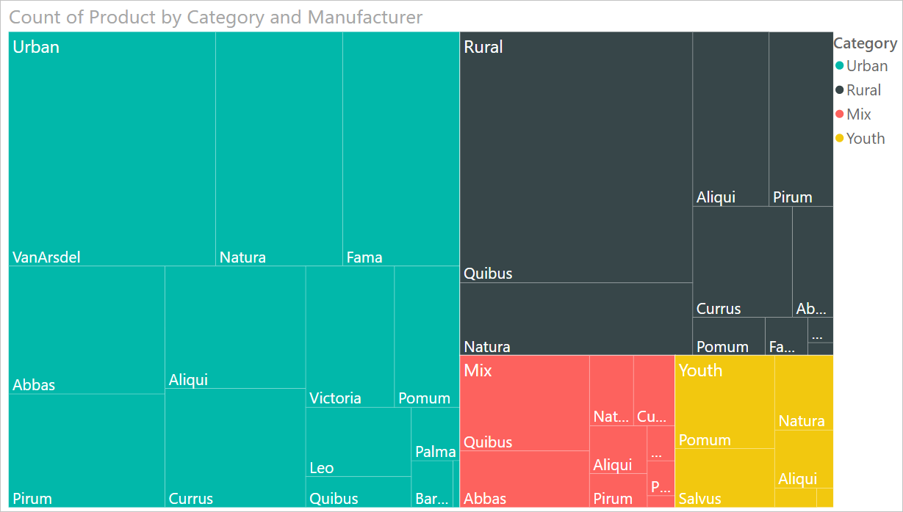
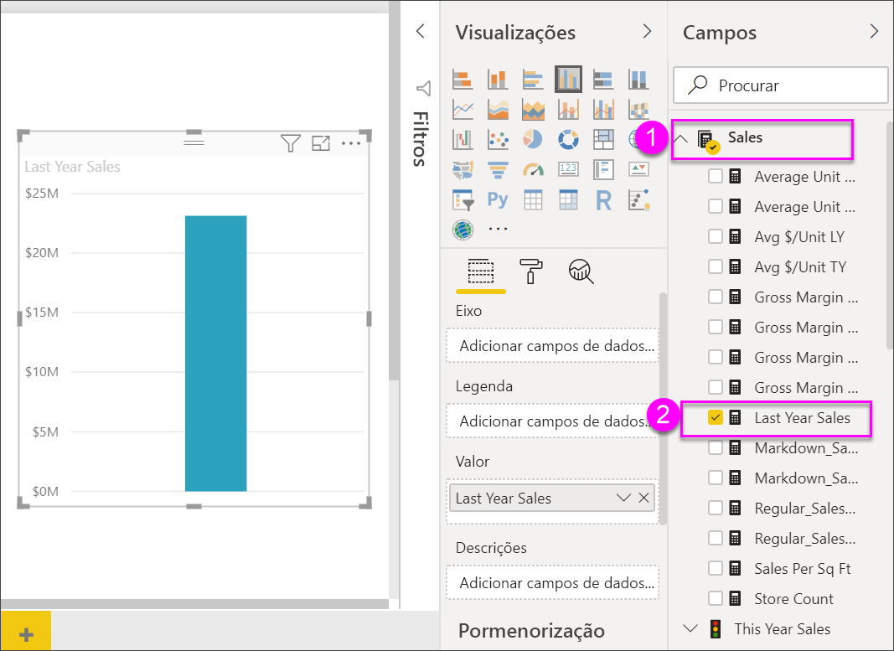
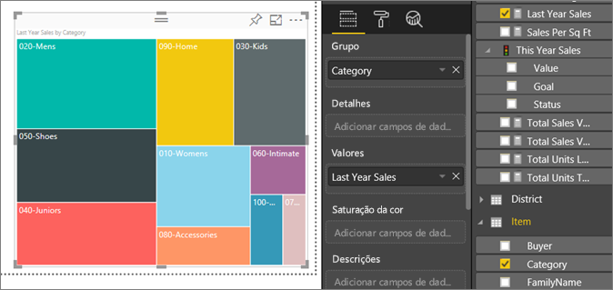
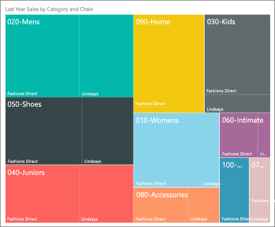
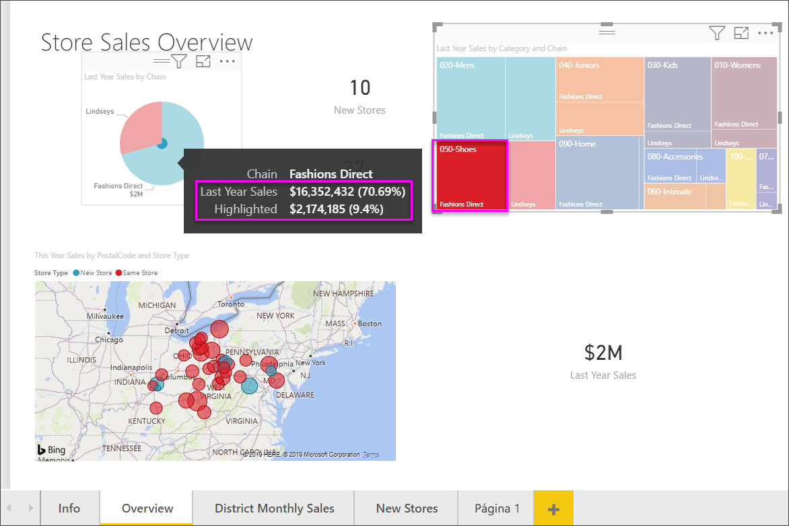

# Treemaps no Power BI

[!INCLUDE [power-bi-visuals-desktop-banner](../includes/power-bi-visuals-desktop-banner.md)]

Os treemaps apresentam dados hierárquicos, como um conjunto de retângulos aninhados. Cada nível da hierarquia é representado por um retângulo colorido (ramo) que contém outros retângulos mais pequenos (folhas). O Power BI baseia o tamanho do espaço dentro de cada retângulo no valor medido. Os retângulos são organizados por tamanho da parte superior esquerda (maior) para a parte inferior direita (menor).

Por exemplo, se estiver a analisar as vendas, poderá ter ramos de nível superior para as categorias de vestuário: **Urbano**, **Rural**, **Jovem** e **Combinado**. O Power BI dividiria os retângulos da categoria em folhas para os fabricantes de vestuário dentro dessa categoria. Estas folhas seriam dimensionadas e sombreadas com base no número vendido.

No ramo **Urbano** acima, foi vendido muito vestuário **VanArsdel**. Foi vendido menos vestuário **Natura** e **Fama**. Apenas foi vendido algum vestuário **Leo**. Assim, o ramo **Urbano** do Treemap tem:

* O maior retângulo para **VanArsdel** no canto superior esquerdo.

* Retângulos um pouco menores para **Natura** e **Fama**.

* Muitos outros retângulos para todo o outro vestuário vendido.

* Um retângulo pequeno para **Leo**.

Pode comparar o número de artigos vendidos noutros grupos de vestuário ao comparar o tamanho e o sombreado de cada nó de folha; os retângulos maiores e mais escuros representam um valor mais elevado.

Quer ver alguém criar primeiro um treemap? Avance para 2:10 neste vídeo para ver a Amanda criar um treemap.

   > [!NOTE]
   > Este vídeo utiliza uma versão mais antiga do Power BI Desktop.
   > 
   > 

<iframe width="560" height="315" src="https://www.youtube.com/embed/IkJda4O7oGs" frameborder="0" allowfullscreen></iframe>

## Quando utilizar um Treemap

Os treemaps são uma ótima opção:

* Para apresentar grandes quantidades de dados hierárquicos.

* Quando um gráfico de barras não puder lidar efetivamente com um grande número de valores.

* Para mostrar as proporções entre cada parte e o todo.

* Para mostrar o padrão da distribuição da medida em cada nível das categorias na hierarquia.

* Para mostrar atributos com a codificação de cor e tamanho.

* Para identificar padrões, valores atípicos, colaboradores mais importantes e exceções.

## Pré-requisito

Este tutorial utiliza o [ficheiro PBIX do Exemplo de Análise de Revenda](https://download.microsoft.com/download/9/6/D/96DDC2FF-2568-491D-AAFA-AFDD6F763AE3/Retail%20Analysis%20Sample%20PBIX.pbix).

1. Na secção superior esquerda da barra de menus, selecione **Ficheiro** > **Abrir**.
   
2. Procure a sua cópia do **ficheiro PBIX do Exemplo de Análise de Revenda**

1. Abra o **Ficheiro PBIX do Exemplo de Análise de Revenda** na vista de relatório .

1. Selecionar  para adicionar uma nova página.

Depois de obter o conjunto de dados **Exemplo de Análise de Revenda**, pode começar a trabalhar.

## Criar um treemap básico

Vai criar um relatório e adicione um treemap básico.

1. No painel **Campos**, selecione a medida **Vendas** > **Vendas do Ano Passado**.

   

1. Selecione o ícone de treemap  para converter o gráfico num treemap.

   

1. Selecione **Item** > **Categoria**, o que irá adicionar **Categoria** à área **Grupo**.

    O Power BI cria um treemap no qual o tamanho dos retângulos se baseia no total de vendas e a cor representa a categoria. No fundo, criou uma hierarquia que descreve visualmente o tamanho relativo do total de vendas por categoria. A categoria **Men** tem as vendas mais altas e a categoria **Hosiery** tem as mais baixas.

    

1. Selecione **Loja** > **Cadeia**, o que irá adicionar **Cadeia** à área **Detalhes** para concluir o treemap. Agora pode comparar as vendas do ano passado por categoria e cadeia.

   

   > [!NOTE]
   > Os campos Saturação de Cor e Detalhes não podem ser utilizados em simultâneo.

1. Coloque o cursor sobre uma área **Cadeia** para revelar a descrição dessa parte da **Categoria**.

    Por exemplo, pairar o rato sobre **Fashions Direct** no retângulo **090 Home** revela a descrição da parte Fashion Direct da categoria Home.

   

## Realce e filtragem cruzada

Realçar uma **Categoria** ou **Detalhes** num treemap filtra e destaca de forma cruzada as outras visualizações na página de relatório. Para acompanhar, adicione alguns elementos visuais a esta página do relatório ou copie o treemap para uma das outras páginas neste relatório. A imagem abaixo do treemap foi copiada para a página **Descrição geral**. 

1. No treemap, selecione uma **Categoria** ou uma **Cadeia** numa **Categoria**. Assim, destaca de forma cruzada as outras visualizações na página. Por exemplo, se selecionar **050-Shoes**, é indicado que as vendas do ano passado de sapatos foram de **16 352 432 $** , sendo **2 174 185 $** provenientes da **Fashions Direct**.

   

1. No gráfico circular **Vendas do Ano Passado por Cadeia**, se selecionar o setor **Fashions Direct**, filtrará de forma cruzada o mapa de árvore.
   

1. Para gerir a forma como os gráficos se realçam e filtram entre si de forma cruzada, veja [Alterar a forma como os elementos visuais interagem num relatório do Power BI](../service-reports-visual-interactions.md).

## Próximos passos

* [Gráficos de cascata no Power BI](power-bi-visualization-waterfall-charts.md)

* [Tipos de visualização no Power BI](power-bi-visualization-types-for-reports-and-q-and-a.md)
