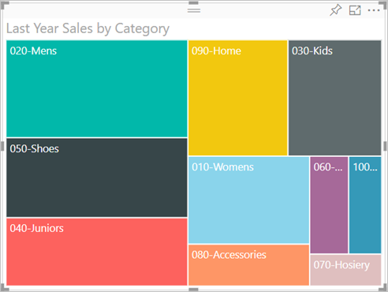

# Treemaps no Power BI
Os treemaps apresentam dados hierárquicos, como um conjunto de retângulos aninhados.  Cada nível da hierarquia é representado por um retângulo colorido (muitas vezes chamado um "ramo") que contém outros retângulos ("folhas").  O espaço dentro de cada retângulo é alocado com base no valor que está a ser medido. Além disso, os retângulos são organizados por tamanho da parte superior esquerda (maior) para a parte inferior direita (menor).

Por exemplo, se estiver a analisar as minhas vendas, posso ter retângulos de nível superior, também chamados *ramos*, para as categorias de vestuário: **Urbano**, **Rural**, **Jovem** e **Combinado**.  Os retângulos da categoria seriam divididos em retângulos mais pequenos, também denominados *folhas*, para os fabricantes de vestuário dentro dessa categoria. Por sua vez, estes retângulos mais pequenos seriam dimensionados e sombreados com base no número vendido.  

No ramo **Urbano** acima, muito vestuário `Maximus` foi vendido, menos `Natura` e `Fama`, e algum `Leo`.  Assim, o ramo **Urbano** do meu Treemap teria:
* o retângulo maior para `Maximus` no canto superior esquerdo
* retângulos um pouco menores para `Natura` e `Fama`
* muitos outros retângulos para todo o outro vestuário vendido e 
* um retângulo pequenino para `Leo`.  

Posso comparar o número de artigos vendidos noutros grupos de vestuário ao comparar o tamanho e o sombreado de cada nó de folha; os retângulos maiores e mais escuros representam um valor mais elevado.

## Quando utilizar um Treemap
Os treemaps são uma ótima opção:

* para apresentar grandes quantidades de dados hierárquicos.
* quando um gráfico de barras não puder lidar efetivamente com um grande número de valores.
* para mostrar as proporções entre cada parte e o todo.
* para mostrar o padrão da distribuição da medida em cada nível das categorias na hierarquia.
* para mostrar atributos com a codificação de cor e tamanho.
* para identificar padrões, valores atípicos, colaboradores mais importantes e exceções.

### Pré-requisitos
 - Serviço Power BI ou Power BI Desktop
 - Exemplo de Análise de Revenda

## Criar um treemap básico
Quer ver alguém criar primeiro um treemap?  Avance para 2:10 neste vídeo para ver a Amanda criar um treemap.

<iframe width="560" height="315" src="https://www.youtube.com/embed/IkJda4O7oGs" frameborder="0" allowfullscreen></iframe>

Em alternativa, crie o seu próprio treemap. Essas instruções utilizam o Exemplo de Análise de Revenda. Para acompanhar, inicie sessão no serviço Power BI, selecione **Obter Dados \> Exemplos \> Exemplo de Análise de Revenda \> Ligar \> Ir para o dashboard**. A criação de visualizações num relatório exige permissões de edição para o conjunto de dados e para o relatório. Felizmente, os exemplos do Power BI são editáveis. No entanto, não é possível adicionar visualizações a um relatório que alguém partilhou consigo.  

1. Selecione o mosaico “Total de Lojas” para abrir o relatório Exemplo de Análise de Revenda.    
2. Abra a [Vista de Edição](../service-interact-with-a-report-in-editing-view.md) e selecione a medida **Vendas** > **Vendas do Ano Passado**.   
      
3. Converta o gráfico num treemap.  
      
4. Arraste **Item** > **Categoria** para o painel **Grupo**. O Power BI cria um treemap no qual o tamanho dos retângulos se baseia no total de vendas e a cor representa a categoria.  No fundo, criou uma hierarquia que descreve visualmente o tamanho relativo do total de vendas por categoria.  A categoria **Men** tem as vendas mais altas e a categoria **Hosiery** tem as mais baixas.   
      
5. Arraste **Loja** > **Cadeia** para o painel **Detalhes** para concluir o treemap. Agora pode comparar as vendas do ano passado por categoria e cadeia.   
   
   
   > [!NOTE]
   > Os campos Saturação de Cor e Detalhes não podem ser utilizados em simultâneo.
   > 
   > 
5. Coloque o cursor sobre uma área **Cadeia** para revelar a descrição dessa parte da **Categoria**.  Por exemplo, pairar o rato sobre **Fashions Direct** no retângulo **090 Home** revela a descrição da parte Fashion Direct da categoria Home.  
   
6. [Adicione o treemap como um mosaico de dashboard (afixar o elemento visual)](../service-dashboard-tiles.md). 
7. [Guarde o relatório](../service-report-save.md).

## Destaque e filtragem cruzada
Para obter informações sobre como utilizar o painel Filtros, veja [Adicionar um filtro a um relatório](../power-bi-report-add-filter.md).

Realçar uma Categoria ou Detalhes num treemap filtra e destaca de forma cruzada as outras visualizações na página de relatório e vice-versa. Para acompanhar, adicione alguns elementos visuais a esta página do relatório ou copie o treemap para uma das outras páginas que não estão em branco neste relatório.

1. No treemap, selecione uma Categoria ou uma Cadeia numa Categoria.  Isto destaca de forma cruzada as outras visualizações na página. Por exemplo, se selecionar **050-Shoes**, é indicado que as vendas do ano passado de sapatos foram de 3 640 471 $, sendo 2 174 185 $ proveniente da Fashions Direct.  
   

2. No gráfico circular **Vendas do Ano Passado por Cadeia**, se selecionar o setor **Fashions Direct**, filtrará de forma cruzada o mapa de árvore.  
       

3. Para gerir a forma como os gráficos se destacam e filtram entre si de forma cruzada, veja [Interações de visualização num relatório do Power BI](../service-reports-visual-interactions.md)

## Próximos passos

[Gráficos de cascata no Power BI](power-bi-visualization-waterfall-charts.md)

[Tipos de visualização no Power BI](power-bi-visualization-types-for-reports-and-q-and-a.md)