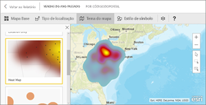
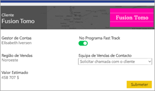
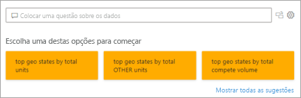
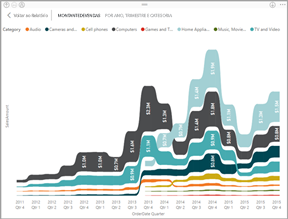
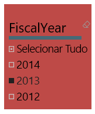
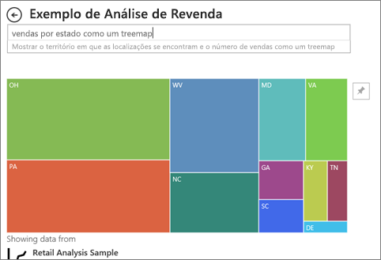

# Tipos de visualização no Power BI
## Visualizações do Power BI
Estamos a adicionar novas visualizações, fique atento!

E consulte o [Microsoft AppSource](https://appsource.microsoft.com/marketplace/apps?product=power-bi-visuals), onde encontrará uma lista cada vez maior dos [elementos visuais do Power BI](../developer/visuals/power-bi-custom-visuals.md) que pode transferir e utilizar nos seus próprios dashboards e relatórios. Sente-se criativo? [Saiba como criar e adicionar os seus próprios elementos visuais ao site da comunidade](../developer/visuals/office-store.md).  

## Lista das visualizações disponíveis no Power BI
Todas estas visualizações podem ser adicionadas aos relatórios do Power BI, especificadas nas Perguntas e Respostas e afixadas a dashboards.

### Gráficos das áreas: Básica (em camadas) e Empilhada

>[!TIP]
>O gráfico de Área Básica baseia-se no gráfico de linhas com a área entre o eixo e a linha preenchida.

Para obter mais informações, veja [Gráfico de Área Básico](power-bi-visualization-basic-area-chart.md).

### Gráficos de barras e colunas

 

>[!TIP]
>Os gráficos de barras são o padrão para observar um valor específico em diferentes categorias.

### Cartões: várias linhas

### Cartões: número único

Para obter mais informações, consulte [Criar um Cartão (mosaico de número grande)](power-bi-visualization-card.md).

### Gráficos de combinação

>[!TIP]
>Um gráfico de combinação combina um gráfico de colunas e um gráfico de linhas. Escolha entre *Coluna de Linhas e Empilhada* e *Coluna de Linhas e em Cluster*.

Para obter mais informações, veja [Gráficos de Combinação no Power BI](power-bi-visualization-combo-chart.md).

### Gráficos em anel

>[!TIP]
>Os gráficos em Anel são semelhantes aos gráficos Circulares.  Mostram a relação das partes com um todo.

Para obter mais informações, veja [Gráficos em Anel no Power BI](power-bi-visualization-doughnut-charts.md).

### Gráficos de funil

>[!TIP]
>Os funis ajudam a visualizar um processo que contém fases e itens que seguem uma sequência de uma fase para a seguinte.  Utilize um funil quando houver um fluxo sequencial entre fases, como um processo de vendas que começa com clientes potenciais e termina com a realização da compra.

Para obter mais informações, veja [Gráficos de Funil no Power BI](power-bi-visualization-funnel-charts.md).

### Gráficos de medidor

>[!TIP]
>Apresenta o estado atual no contexto de um objetivo.

Para obter mais informações, veja [Gráficos de Medidores no Power BI](power-bi-visualization-radial-gauge-charts.md).

### Gráfico de principais influenciadores

Um gráfico de principais influenciadores apresenta os maiores contribuidores para um determinado resultado ou valor.

Para obter mais informações, veja [Gráficos de influenciadores principais no Power BI](power-bi-visualization-influencers.md)

### KPIs

>[!TIP]
>Apresenta o progresso para atingir um objetivo mensurável.

Para obter mais informações, veja [KPIs no Power BI](power-bi-visualization-kpi.md).

### Gráficos de linhas

>[!TIP]
>Enfatizam o formato geral de uma série inteira de valores, geralmente ao longo do tempo.

### Mapas: mapas básicos

>[!TIP]
>São utilizados para associar informações categóricas e quantitativas a localizações espaciais.

Para obter mais informações, veja [Sugestões e truques para elementos visuais de mapas](power-bi-map-tips-and-tricks.md).

### Mapas: Mapas ArcGIS

Para obter mais informações, veja [Mapas ArcGIS no Power BI](power-bi-visualization-arcgis.md).

### Mapas: mapas preenchidos (Coropleto)

>[!TIP]
>Quanto mais intensa for a cor, maior será o valor.

Para obter mais informações, veja [Mapas de Manchas no Power BI](power-bi-visualization-filled-maps-choropleths.md).

### Mapas: mapas de formas

>[!TIP]
>Compara as regiões por cor.

Para obter mais informações, veja [Mapas de Forma no Power BI](desktop-shape-map.md).

### Matriz

>[!TIP]
>Uma tabela suporta duas dimensões, mas uma matriz facilita a apresentação dos dados de forma significativa em várias dimensões – suporta um esquema gradual. A matriz agrega automaticamente os dados e permite a desagregação. 

Para obter mais informações, veja [Matrix visuals in Power BI](desktop-matrix-visual.md) (Elementos visuais Matriz no Power BI).

### Gráficos circulares

>[!TIP]
>Os gráficos circulares mostram a relação das partes com um todo. 

### Elemento visual do Power Apps

Os designers de relatórios podem criar um Power App e incorporá-lo no relatório do Power BI como elemento visual. Os consumidores podem interagir com esse elemento visual dentro do relatório do Power BI. 

Para obter mais informações, veja [Adicionar um elemento visual do Power Apps ao relatório](power-bi-visualization-powerapp.md).

### Q&A visual (Elemento visual Perguntas e Respostas)

>[!TIP]
>Tal como a [experiência das Perguntas e Respostas em dashboards](../power-bi-tutorial-q-and-a.md), o elemento visual de Perguntas e Respostas permite que faça perguntas sobre os seus dados através de linguagem natural. 

Para obter mais informações, veja [Elementos visuais das Perguntas e Respostas no Power BI](power-bi-visualization-q-and-a.md).

### elementos visuais do script R

>[!TIP]
>Os elementos visuais criados com scripts R, geralmente denominados *elementos visuais R*, podem apresentar formatação e análise dos dados avançadas, como previsão, ao utilizar o poder avançado de análise e visualização da linguagem R. Os elementos visuais R podem ser criados no Power BI Desktop e publicados no serviço Power BI.   

Para obter mais informações, veja [Elementos visuais R no Power BI](service-r-visuals.md).

### Gráfico do friso

>[!TIP]
>Os gráficos do friso mostram que categoria de dados tem a classificação mais elevada (valor maior). Os gráficos de friso são uma forma eficaz de mostrar as alterações de classificação, com a classificação (valor) mais elevada sempre mostrada na parte superior de cada período temporal.

Para obter mais informações, veja [Gráficos de friso no Power BI](desktop-ribbon-charts.md).

### Gráficos de Dispersão e Bolhas

>[!TIP]
>Apresente relações entre 2 (dispersão) ou 3 (bolhas) medidas quantitativas – se ou não, em qual ordem, etc.

Para obter mais informações, veja [Gráficos de Dispersão no Power BI](power-bi-visualization-scatter.md).

### Dispersão de alta densidade

>[!TIP]
>Demasiados pontos de dados num elemento visual podem abrandá-lo, por isso é utilizado um algoritmo de amostragem sofisticado para garantir a precisão da visualização.

Para obter mais informações, veja [High Density Scatter charts in Power BI](desktop-high-density-scatter-charts.md) (Gráficos de Dispersão de Alta Densidade no Power BI).

### Segmentações

Para obter mais informações, veja [Segmentação de Dados no Power BI](power-bi-visualization-slicers.md).

### Imagens autónomas

Para saber mais, veja [Adicionar um widget de imagem a um dashboard](../service-dashboard-add-widget.md).

### Tabelas

>[!TIP]
>Funcionam bem com comparações quantitativas entre os itens em que há várias categorias.

Para obter mais informações, veja [Trabalhar com tabelas no Power BI](power-bi-visualization-tables.md).

### Treemaps

Para obter mais informações, veja [Treemaps no Power BI](power-bi-visualization-treemaps.md).

>[!TIP]
>São gráficos de retângulos coloridos, com um tamanho que representa o valor.  Podem ser hierárquicos, com retângulos aninhados nos retângulos principais.

### Gráficos de cascata

>[!TIP]
>Os gráficos de cascata mostram uma duração total conforme os valores são adicionados ou subtraídos.

Para obter mais informações, veja [Gráficos de Cascata no Power BI](power-bi-visualization-waterfall-charts.md).

## Informe as Perguntas e Respostas sobre qual a visualização a utilizar
Ao escrever consultas em linguagem natural com as Perguntas e Respostas do Power BI, pode especificar o tipo de visualização na consulta.  Por exemplo:

"***vendas por estado como um mapa de árvore***"

## Próximos passos
[Visualizações nos relatórios do Power BI](power-bi-report-visualizations.md)    
[A referência correta do elemento visual de sqlbi.com](https://www.sqlbi.com/wp-content/uploads/videotrainings/dashboarddesign/visuals-reference-may2017-A3.pdf)