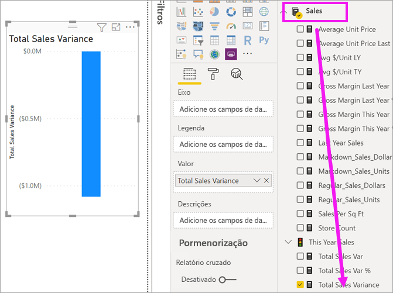
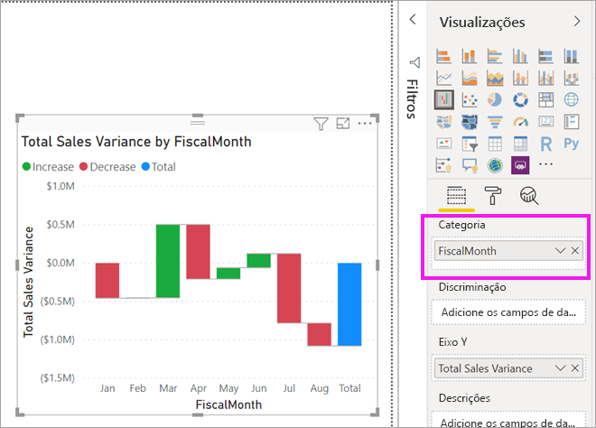
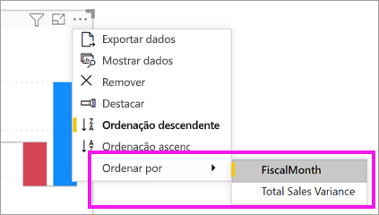
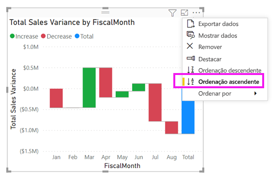
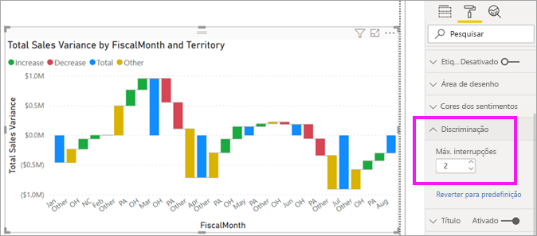

# Gráficos de cascata no Power BI

[!INCLUDE [power-bi-visuals-desktop-banner](../includes/power-bi-visuals-desktop-banner.md)]

Os gráficos de cascata mostram um total em execução conforme o Power BI adiciona e subtrai valores. São úteis para entender como um valor inicial (como a receita líquida) é afetado por uma série de alterações positivas e negativas.

As colunas são codificadas para que possa verificar rapidamente os aumentos e as diminuições. Muitas vezes, as colunas de valores iniciais e finais [começam no eixo horizontal](https://support.office.com/article/Create-a-waterfall-chart-in-Office-2016-for-Windows-8de1ece4-ff21-4d37-acd7-546f5527f185#BKMK_Float "iniciar no eixo horizontal"), enquanto os valores intermediários são colunas flutuantes. Devido a esse estilo, os gráficos de cascata também são chamados de gráficos de ponte.

   > [!NOTE]
   > Este vídeo utiliza uma versão mais antiga do Power BI Desktop.
   > 
   > 

<iframe width="560" height="315" src="https://www.youtube.com/embed/qKRZPBnaUXM" frameborder="0" allow="autoplay; encrypted-media" allowfullscreen></iframe>

## Quando utilizar um gráfico de cascata

Os gráficos de cascata são uma ótima opção:

* Quando existirem alterações na medida ao longo do tempo, uma série ou categorias diferentes.

* Para auditar as principais alterações que contribuem para o valor total.

* Para traçar o lucro anual da empresa ao mostrar várias origens de receita e chegar ao lucro total (ou perda).

* Para ilustrar o número de funcionários inicial e final da sua empresa num ano.

* Para visualizar a quantidade de dinheiro ganho e gasto em cada mês, e o saldo parcial da sua conta.

## Pré-requisito

Este tutorial utiliza o [ficheiro PBIX do Exemplo de Análise de Revenda](https://download.microsoft.com/download/9/6/D/96DDC2FF-2568-491D-AAFA-AFDD6F763AE3/Retail%20Analysis%20Sample%20PBIX.pbix).

1. Na secção superior esquerda da barra de menus, selecione **Ficheiro** > **Abrir**.
   
2. Procure a sua cópia do **ficheiro PBIX do Exemplo de Análise de Revenda**

1. Abra o **Ficheiro PBIX do Exemplo de Análise de Revenda** na vista de relatório .

1. Selecionar  para adicionar uma nova página.

## Criar um gráfico de cascata

Vai criar um gráfico de cascata que mostra a variação de vendas (vendas estimadas vs. vendas reais) por mês.

### Criar o gráfico de cascata

1. No painel **Campos**, selecione **Vendas** > **Variação de Vendas Total**.

   

1. Selecione o ícone de cascata 

    

1. Selecione **Altura** > **MêsFiscal** para o adicionar à caixa **Categoria**.

    

### Ordenar o gráfico de cascata

1. Certifique-se de que o Power BI ordena o gráfico de cascata por mês. Selecione **Mais opções** (...) no canto superior direito do gráfico.

    Para este exemplo, selecione **Ordenar por** e selecione **FiscalMonth**. Um indicador amarelo junto à sua seleção indica quando a sua opção de seleção está a ser aplicada.

    
    
    Para apresentar os meses por ordem cronológica, selecione **Ordenação ascendente**. Tal como no passo anterior, confirme se existe um indicador amarelo à esquerda da opção **Ordenação ascendente**. Isto indica que está a ser aplicada a opção selecionada.

    

    

    Tenha em atenção que o gráfico ordenou FiscalMonth de janeiro a agosto.  

### Explorar o gráfico de cascata

Aprofunde um pouco mais para ver o que contribui mais para as alterações mês a mês.

1.  Selecione **Store** > **Territory**, o que permitirá adicionar **Territory** ao registo **Divisão**.

    

    O Power BI utiliza o valor no registo **Divisão** para adicionar dados à visualização. Adiciona os cincos principais contribuidores de aumentos ou diminuições de cada mês fiscal. Por exemplo, isto significa que fevereiro tem seis pontos de dados em vez de apenas um.  

    

    Digamos que só está interessado nos dois principais contribuidores.

1. No painel **Formatação**, selecione **Divisão** e defina **Máximo de divisões** como **2**.

    

    Uma análise rápida revela que as zonas de Ohio e Pensilvânia são os maiores contribuintes para o movimento, tanto negativo como positivo, no seu gráfico de cascata.

    

## Próximos passos

* [Alterar a forma como os elementos visuais interagem num relatório do Power BI](../service-reports-visual-interactions.md)

* [Tipos de visualização no Power BI](power-bi-visualization-types-for-reports-and-q-and-a.md)
