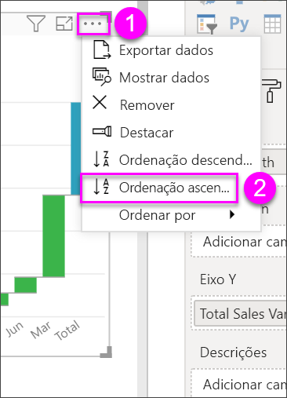

# Gráficos de cascata no Power BI

Os gráficos de cascata mostram um total em execução conforme o Power BI adiciona e subtrai valores. São úteis para entender como um valor inicial (como a receita líquida) é afetado por uma série de alterações positivas e negativas.

As colunas são codificadas para que possa verificar rapidamente os aumentos e as diminuições. Muitas vezes, as colunas de valores iniciais e finais [começam no ](https://support.office.com/article/Create-a-waterfall-chart-in-Office-2016-for-Windows-8de1ece4-ff21-4d37-acd7-546f5527f185#BKMK_Float "eixo horizontal"), enquanto os valores intermediários são colunas flutuantes. Devido a esse estilo, os gráficos de cascata também são chamados de gráficos de ponte.

<iframe width="560" height="315" src="https://www.youtube.com/embed/qKRZPBnaUXM" frameborder="0" allow="autoplay; encrypted-media" allowfullscreen></iframe>

## Quando utilizar um gráfico de cascata

Os gráficos de cascata são uma ótima opção:

* Quando existirem alterações na medida ao longo do tempo, uma série ou categorias diferentes.

* Para auditar as principais alterações que contribuem para o valor total.

* Para traçar o lucro anual da empresa ao mostrar várias origens de receita e chegar ao lucro total (ou perda).

* Para ilustrar o número de funcionários inicial e final da sua empresa num ano.

* Para visualizar a quantidade de dinheiro ganho e gasto em cada mês, e o saldo parcial da sua conta.

## Pré-requisitos

* O serviço Power BI ou Power BI Desktop

* Relatório de Exemplo de Análise de Revenda

## Obter o relatório de Exemplo de Análise de Revenda

Essas instruções utilizam o Exemplo de Análise de Revenda. A criação de uma visualização exige permissões de edição para o conjunto de dados e para o relatório. Felizmente, todos os exemplos do Power BI são editáveis. Se alguém partilhar um relatório consigo, não poderá criar visualizações nos relatórios. Para acompanhar, obtenha o [relatório de Exemplo de Análise de Revenda](../sample-datasets.md).

Depois de obter o conjunto de dados **Exemplo de Análise de Revenda**, pode começar a trabalhar.

## Criar um gráfico de cascata

Vai criar um gráfico de cascata que mostra a variação de vendas (vendas estimadas vs. vendas reais) por mês.

1. Em **A Minha Área de Trabalho**, selecione **Conjuntos de dados** > **Criar um relatório**.

    

1. No painel **Campos**, selecione **Vendas**  > **Variação de Vendas Total**.

   

1. Selecione o ícone de cascata  para converter o gráfico num treemap.

    Se a **Variação de Vendas Total** não estiver na área do **Eixo Y**, arraste-a para lá.

    

1. Selecione **Altura** > **MêsFiscal** para o adicionar à caixa **Categoria**.

    

1. Confirme que o Power BI ordenou o gráfico de cascata por ordem cronológica. Selecione as reticências (...) no canto superior direito do gráfico.

    Verifique se existe um indicador amarelo junto ao lado esquerdo das opções **Ordenação ascendente** e **MêsFiscal**

    

    Também pode observar os valores do Eixo X e ver se estão por ordem, de **Jan** o **Ago**.

    Aprofunde um pouco mais para ver o que contribui mais para as alterações mês a mês.

1. Arraste **Arquivo** > **Território** para o registo **Divisão**.

    

    Por predefinição, o Power BI adiciona os cinco principais contribuintes de aumentos ou diminuições por mês.

    

    Apenas está interessado nos dois principais contribuintes.

1. No painel **Formatação**, selecione **Divisão** e defina **Máximo de divisões** como **2**.

    

    Uma análise rápida revela que as zonas de Ohio e Pensilvânia são os maiores contribuintes para o movimento, tanto negativo como positivo, no seu gráfico de cascata.

    

    É uma conclusão interessante. Ohio e Pensilvânia têm um impacto tão significativo porque as vendas nestes dois territórios são muito superiores às dos outros territórios? Pode verificar.

1. Crie um mapa que apresente o valor de vendas deste ano e as vendas do último ano por território.

    

    O mapa suporta a sua teoria. Mostra que estes dois territórios tiveram o valor mais elevado de vendas no ano passado (tamanho da bolha) e neste ano (sombreado da bolha).

## Realce e filtragem cruzada

Para obter informações sobre como utilizar o painel **Filtros**, veja [Adicionar um filtro a um relatório na Vista de edição](../power-bi-report-add-filter.md).

Realçar uma coluna num gráfico de cascata faz uma filtragem cruzada nas outras visualizações na página do relatório, e vice-versa. No entanto, a coluna **Total** não aciona o destaque nem responde à filtragem cruzada.

## Próximos passos

* [Alterar a forma como os elementos visuais interagem num relatório do Power BI](../service-reports-visual-interactions.md)

* [Tipos de visualização no Power BI](power-bi-visualization-types-for-reports-and-q-and-a.md)
