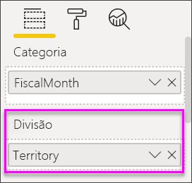

# Gráficos de cascata no Power BI

[!INCLUDE [power-bi-visuals-desktop-banner](../includes/power-bi-visuals-desktop-banner.md)]

Os gráficos de cascata mostram um total em execução conforme o Power BI adiciona e subtrai valores. São úteis para entender como um valor inicial (como a receita líquida) é afetado por uma série de alterações positivas e negativas.

As colunas são codificadas para que possa verificar rapidamente os aumentos e as diminuições. Muitas vezes, as colunas de valores iniciais e finais [começam no ](https://support.office.com/article/Create-a-waterfall-chart-in-Office-2016-for-Windows-8de1ece4-ff21-4d37-acd7-546f5527f185#BKMK_Float "eixo horizontal"), enquanto os valores intermediários são colunas flutuantes. Devido a esse estilo, os gráficos de cascata também são chamados de gráficos de ponte.

   > [!NOTE]
   > Este vídeo utiliza uma versão mais antiga do Power BI Desktop.
   > 
   > 

<iframe width="560" height="315" src="https://www.youtube.com/embed/qKRZPBnaUXM" frameborder="0" allow="autoplay; encrypted-media" allowfullscreen></iframe>

## Quando utilizar um gráfico de cascata

Os gráficos de cascata são uma ótima opção:

* Quando existirem alterações na medida ao longo do tempo, uma série ou categorias diferentes.

* Para auditar as principais alterações que contribuem para o valor total.

* Para traçar o lucro anual da empresa ao mostrar várias origens de receita e chegar ao lucro total (ou perda).

* Para ilustrar o número de funcionários inicial e final da sua empresa num ano.

* Para visualizar a quantidade de dinheiro ganho e gasto em cada mês, e o saldo parcial da sua conta.

## Pré-requisito

Este tutorial utiliza o [ficheiro PBIX de Exemplo de Análise de Revenda](http://download.microsoft.com/download/9/6/D/96DDC2FF-2568-491D-AAFA-AFDD6F763AE3/Retail%20Analysis%20Sample%20PBIX.pbix).

1. Na secção superior esquerda da barra de menus, selecione **Ficheiro** > **Abrir**.
   
2. Encontre a sua cópia do **ficheiro PBIX de Exemplo de Análise de Revenda**.

1. Abra o **Ficheiro PBIX de Exemplo de Análise de Revenda** na vista de relatório .

1. Selecionar  para adicionar uma nova página.

## Criar um gráfico de cascata

Vai criar um gráfico de cascata que mostra a variação de vendas (vendas estimadas vs. vendas reais) por mês.

1. No painel **Campos**, selecione **Vendas**  > **Variação de Vendas Total**.

   

1. Selecione o ícone de cascata 

    

1. Selecione **Altura** > **MêsFiscal** para o adicionar à caixa **Categoria**.

    

1. Confirme que o Power BI ordenou o gráfico de cascata por ordem cronológica. Selecione as reticências (...) no canto superior direito do gráfico.

    Para este exemplo, vamos selecionar **Ordenação ascendente**

    Verifique se existe um indicador amarelo junto ao lado esquerdo da opção **Ordenação ascendente**. Isto indica que está a ser aplicada a opção selecionada.

    

    Em seguida, vamos clicar em **Ordenar por** e selecionar **FiscalMonth** (MêsFiscal). Tal como no passo anterior, um indicador amarelo ao lado da sua seleção indica quando é que a sua opção de seleção está a ser aplicada.

    

    Também pode observar os valores do Eixo X e ver se estão por ordem, de **Jan** o **Ago**.

    Aprofunde um pouco mais para ver o que contribui mais para as alterações mês a mês.

1.  Selecione **Store**(Loja)  > **Territory** (Território), o que permitirá adicionar **Territory** (Território) ao registo **Divisão**.

    

    Por predefinição, o Power BI adiciona os cinco principais contribuintes de aumentos ou diminuições por mês. A imagem abaixo expandiu o nosso painel de visualização para incluir mais dados. 

    

    Apenas está interessado nos dois principais contribuintes.

1. No painel **Formatação**, selecione **Divisão** e defina **Máximo de divisões** como **2**.

    

    Uma análise rápida revela que as zonas de Ohio e Pensilvânia são os maiores contribuintes para o movimento, tanto negativo como positivo, no seu gráfico de cascata.

    

## Próximos passos

* [Alterar a forma como os elementos visuais interagem num relatório do Power BI](../service-reports-visual-interactions.md)

* [Tipos de visualização no Power BI](power-bi-visualization-types-for-reports-and-q-and-a.md)
