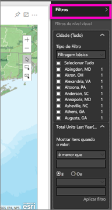
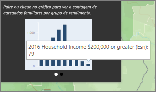
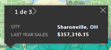

# Interagir com mapas ArcGIS no Power BI
Este tópico foi escrito do ponto de vista de uma pessoa que *consome* um mapa ArcGIS no serviço Power BI, Desktop ou para dispositivo móvel. Quando um criador partilha um mapa ArcGIS consigo, existem várias formas de interagir com o mapa.  Para obter mais informações sobre como criar um mapa ArcGIS, veja [Tutorial de mapas ArcGIS da ESRI](../power-bi-visualization-arcgis.md).

A combinação de mapas ArcGIS com o Power BI leva o mapeamento além da apresentação de pontos num mapa a um nível totalmente novo. As opções disponíveis para mapas de base, tipos de localização, temas, estilos de símbolos e camadas de referência cria belíssimas visualizações de mapas informativos. A combinação de camadas de dados autoritativas (como dados de censo) num mapa com análise espacial proporciona uma compreensão mais aprofundada dos dados na visualização.

> [!TIP]
> GIS representa Geographic Information Science (Sistemas de Informação Geográfica).
> 

O exemplo que estamos a utilizar é o mesmo mapa ArcGIS criado no [Tutorial de mapas ArcGIS da ESRI](../power-bi-visualization-arcgis.md). Analisa as vendas do último ano por cidade e utiliza um mapa de base de ruas, símbolos de bolha para representar o tamanho e uma camada de referência para o rendimento médio do agregado familiar. O mapa contém 3 marcadores e um raio do tempo de viagem (em roxo).

> [!TIP]
> Visite a [página da ESRI no Power BI](https://www.esri.com/powerbi) para ver muitos exemplos e ler depoimentos. E, em seguida, veja a página [Introdução ao ArcGIS Maps for Power BI](https://doc.arcgis.com/en/maps-for-powerbi/get-started/about-maps-for-power-bi.htm) da ESRI.
> 
> 

 

## Consentimento do utilizador
Quando um colega partilhar pela primeira vez um mapa ArcGIS consigo, o Power BI apresentará uma mensagem. O ArcGIS Maps for Power BI é fornecido pela Esri (www.esri.com) e a sua utilização está sujeita aos termos e à política de privacidade da Esri. Os utilizadores do Power BI que pretendam utilizar os elementos visuais do ArcGIS Maps for Power BI têm de aceitar a caixa de diálogo de consentimento.

## Ferramentas de seleção
O ArcGIS Maps for Power BI permite três modos de seleção. É possível selecionar um máximo de250 pontos de dados de cada vez.

 Selecione pontos de dados individuais.

 Desenha um retângulo no mapa e seleciona os pontos de dados contidos. Utilize CTRL para selecionar mais do que uma área retangular.

 Permite que os limites ou polígonos dentro de camadas de referência sejam utilizados para selecionar pontos de dados contidos.

 

## Interagir com um mapa ArcGIS
As funcionalidades disponíveis dependem se for um *criador* (pessoa que criou o mapa) ou o *consumidor* (alguém partilhou um mapa ArcGIS consigo). Se estiver a interagir com um mapa ArcGIS como um consumidor ([Vista de leitura](../service-reading-view-and-editing-view.md)), seguem-se as ações disponíveis para si.

* Tal como com outros tipos de visualização, pode [afixar nos dashboards](../service-dashboard-pin-tile-from-report.md), [ver](../service-reports-show-data.md) e/ou [exportar os dados subjacentes](../power-bi-visualization-export-data.md) e ver o mapa no [Modo de detalhe](../service-focus-mode.md)e em [Ecrã inteiro](../service-fullscreen-mode.md).    
* Expanda o painel **Filtros** para explorar o mapa através de filtros. Quando fechar o relatório, os filtros aplicados não são guardados.    
      
* Se o mapa tiver uma camada de referência, selecione as localizações para apresentar os detalhes numa descrição. Aqui, selecionámos o condado de Adams e vemos os dados da camada de referência do rendimento médio do agregado familiar que o criador adicionou ao mapa.
  
      
  
    Neste caso, obtemos também um gráfico. Selecione uma barra no gráfico para aprofundar os dados. Aqui, vemos que 79 agregados familiares no condado de Adams ganhou 200 000 dólares ou um valor superior.
  
    
  
    Selecione a seta para apresentar quaisquer gráficos adicionais.
* Coloque o cursor sobre os símbolos de localização do mapa de base para apresentar os detalhes numa descrição.     
  
  
  > [!TIP]
  > Poderá ter de ampliar para selecionar uma localização específica.  Caso contrário, se existirem localizações de sobreposição, o Power BI pode apresentar-lhe mais do que 1 descrição de cada vez. Selecione as setas para alternar entre as descrições
  > 
  > 
  > 
  > 
* Se o criador tiver adicionado uma camada de gráficos informativos ao mapa ArcGIS, verá os dados adicionais no canto superior direito do mapa.  Por exemplo, o criador do mapa adicionou aqui "Crianças com menos de 14 anos".
  
    

## Considerações e Limitações
O ArcGIS Maps for Power BI está disponível nos seguintes serviços e aplicações:

<table>
<tr><th>Serviço/Aplicação</th><th>Disponibilidade</th></tr>
<tr>
<td>Power BI Desktop</td>
<td>Sim</td>
</tr>
<tr>
<td>Serviço Power BI (app.powerbi.com)</td>
<td>Sim</td>
</tr>
<tr>
<td>Aplicações móveis do Power BI</td>
<td>Sim</td>
</tr>
<tr>
<td>Publicar na Web do Power BI</td>
<td>Não</td>
</tr>
<tr>
<td>Power BI Embedded</td>
<td>Não</td>
</tr>
<tr>
<td>Incorporação do serviço Power BI (PowerBI.com)</td>
<td>Não</td>
</tr>
</table>

**Como é que o ArcGIS Maps for Power BI funciona?**
O ArcGIS Maps for Power BI é fornecido pela Esri (www.esri.com). A utilização do ArcGIS Maps for Power BI está sujeita aos [termos](https://go.microsoft.com/fwlink/?LinkID=8263222) e à [política de privacidade](https://go.microsoft.com/fwlink/?LinkID=826323) da Esri. Os utilizadores do Power BI que pretendam utilizar os elementos visuais do ArcGIS Maps for Power BI, têm de aceitar a caixa de diálogo de consentimento (veja a secção Consentimento do Utilizador para obter detalhes).  A utilização do ArcGIS Maps for Power BI da Esri está sujeita aos Termos e à Política de Privacidade da Esri, que também estão ligados à caixa de diálogo de consentimento. Cada utilizador tem de dar consentimento antes de utilizar o ArcGIS Maps for Power BI pela primeira vez. Assim que o utilizador der consentimento, os dados vinculados aos elementos visuais são enviados para os serviços da Esri para obter geocodificação, ou seja, transformar as informações de localização em informações de latitude e longitude que podem ser representadas num mapa. Deve presumir que os dados vinculados à visualização de dados podem ser enviados aos serviços da Esri. A Esri fornece serviços como mapas de base, análise espacial, geocodificação, etc. Os elementos visuais do ArcGIS Maps for Power BI interagem com estes serviços através de uma ligação SSL protegida por um certificado fornecido e mantido pela Esri. Pode obter informações adicionais sobre o ArcGIS Maps for Power BI na [página do produto ArcGIS Maps for Power BI](https://www.esri.com/powerbi) da Esri.

Quando um utilizador se inscreve numa subscrição Plus oferecida pela Esri através do ArcGIS Maps for Power BI, está a estabelecer uma relação direta com a Esri. O Power BI não envia informações pessoais sobre o utilizador à Esri. O utilizador inicia sessão e confia numa aplicação do AAD fornecida pela Esri ao utilizar a sua própria identidade do AAD. Ao fazê-lo, o utilizador está a partilhar as suas informações pessoais diretamente com a Esri. Assim que o utilizador adicionar conteúdos da subscrição Plus a um elemento visual do ArcGIS Maps for Power BI, os outros utilizadores do Power BI também precisam de uma subscrição Plus da Esri para ver ou editar esses conteúdos. 

Se tiver perguntas técnicas sobre como o ArcGIS Maps for Power BI da Esri funciona, contacte a Esri através do site de suporte da empresa.

**O mapa ArcGIS não está a ser apresentado**    
Em serviços ou aplicações em que o ArcGIS Maps for Power BI não está disponível, a visualização irá ser apresentada como um elemento visual em branco, com o logótipo do Power BI.

**Não estou a ver todos os meus endereços no mapa**    
Ao geocodificar endereços de ruas, apenas os primeiros 1500 endereços serão geocodificados. A geocodificação de nomes de locais ou países não está sujeita ao limite de 1500 endereços.

**Existe algum custo de utilização do ArcGIS Maps for Power BI?**

O ArcGIS Map for Power BI está disponível para todos os utilizadores do Power BI sem custos adicionais. É um componente fornecido pela **ESRI** e a sua utilização está sujeita aos termos e à política de privacidade fornecida pela **ESRI**, conforme indicado anteriormente no artigo.

**Estou a receber um mensagem de erro no Power BI Desktop sobre a minha cache estar cheia**

Este é um erro que está a ser resolvido.  Entretanto, selecione a ligação que aparece na mensagem de erro para obter instruções sobre como limpar a cache do Power BI.

**Posso ver os meus mapas ArcGIS offline?**

Não, o Power BI precisa de conectividade de rede para apresentar os mapas.

## Passos seguintes
Obter ajuda: a **ESRI** fornece [documentação completa](https://go.microsoft.com/fwlink/?LinkID=828772) do conjunto de funcionalidades do **ArcGIS Maps for Power BI**.

Pode colocar perguntas, encontrar as informações mais recentes, problemas de relatório e localizar as respostas no [thread da Comunidade do Power BI relacionado com o **ArcGIS Maps for Power BI**](https://go.microsoft.com/fwlink/?LinkID=828771).

Se tiver uma sugestão para uma melhoria, submeta-a na [Lista de ideias do Power BI](https://ideas.powerbi.com).

[Página do produto ArcGIS Maps for Power BI](https://www.esri.com/powerbi)

