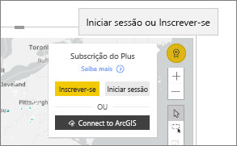

# Interagir com mapas ArcGIS no Power BI
Este tópico foi escrito do ponto de vista de uma pessoa que utiliza um mapa ArcGIS no serviço Power BI, Desktop ou para dispositivo móvel. Quando um designer partilha um mapa ArcGIS de um elemento visual do Power BI, existem muitas formas de interagir com esse elemento visual.  Para saber mais sobre como criar um mapa ArcGIS, veja [ArcGIS maps by Esri tutorial](../visuals/power-bi-visualization-arcgis.md) (Tutorial de mapas ArcGIS do Esri).

A combinação de mapas ArcGIS com o Power BI leva o mapeamento além da apresentação de pontos num mapa, a um nível totalmente novo. Os designers de relatórios começam com um mapa e anexam camadas de dados demográficos ao mesmo. A combinação de camadas de dados baseados em localizações (como dados de censos) num mapa com análise espacial proporciona uma compreensão mais aprofundada dos dados nas suas visualizações.

> [!TIP]
> GIS significa Geographic Information System (Sistema de Informação Geográfica).
> 

Este mapa ArcGIS de um elemento visual do Power BI mostra as vendas do último ano organizadas por cidade e utiliza um mapa base de ruas e uma camada de referência do rendimento médio por agregado familiar. O mapa contém dois alfinetes (vermelho e amarelo) e um raio do tempo de condução (a roxo).

> [!TIP]
> Visite a [página do Esri no Power BI](https://www.esri.com/powerbi) para ver muitos exemplos e ler testemunhos. Em seguida, veja a [página de introdução ao ArcGIS Maps for Power BI](https://doc.arcgis.com/en/maps-for-powerbi/get-started/about-maps-for-power-bi.htm) da Esri.
> 
> 

## Consentimento do utilizador

Quando um colega partilhar pela primeira vez um mapa ArcGIS consigo, o Power BI apresentará uma mensagem de consentimento. O ArcGIS Maps for Power BI é fornecido pelo Esri (https://www.esri.com) e a sua utilização está sujeita aos termos e à política de privacidade do Esri). Os utilizadores do Power BI que pretendam utilizar os elementos visuais do ArcGIS Maps for Power BI têm de aceitar a caixa de diálogo de consentimento.

## Compreender as camadas

Um elemento visual do ArcGIS Maps for Power BI pode apresentar vários tipos de camadas de informações demográficas de localizações.

### Mapas base

Cada elemento visual do ArcGIS Maps for Power BI começa com um mapa base. Pense nos mapas base como telas para os dados. Um mapa base pode ser uma tela básica de cor escura ou clara,

 

ou uma tela com detalhes de ruas e transportes. 

  

O mapa base é totalmente aplicado à tela. À medida que se desloca e amplia o mapa, o mesmo é atualizado. Amplie o mapa para ver informações de ruas e transportes ainda mais detalhadas. Pode deslocar-se de continente em continente e o nível de detalhe permanece constante. Neste exemplo, deslocámo-nos do Porto até Pequim.

  

### Camadas de referência

Um *designer* de relatórios pode adicionar uma camada de referência. As camadas de referência são alojadas pelo Esri e fornecem uma camada adicional de informações demográficas acerca de uma localização. O exemplo abaixo mostra uma camada de referência da densidade populacional. As cores escuras representam uma maior densidade.

  

### Infográficos

Um *designer* de relatórios pode adicionar muitas camadas de infográficos. Os infográficos são indicadores visuais breves apresentados no lado direito da tela de elementos visuais. Os infográficos são alojados pelo Esri e fornecem uma camada adicional de informações demográficas sobre uma localização. O exemplo abaixo mostra três infográficos aplicados. Não são apresentados no mapa, mas sim em cartões. Os cartões de infográficos são atualizados à medida que ampliar, deslocar e selecionar áreas no mapa.

  

### Marcadores

Os alfinetes representam localizações exatas, como uma cidade ou endereço. Por vezes, os *designers* de relatórios utilizam alfinetes com o raio do tempo de condução. Este exemplo mostra lojas num raio de 50 milhas de Charlotte, na Carolina do Norte.

 

## Interagir com um elemento visual do ArcGIS Maps para Power BI
As funcionalidades disponíveis dependem da forma como o relatório foi partilhado consigo, bem como do tipo da sua conta do Power BI. Se tiver dúvidas, contacte o administrador do sistema. Os elementos visuais do ArcGIS Maps for Power BI têm um comportamento semelhante a outros elementos visuais num relatório. Poderá [apresentar os dados utilizados para criar a visualização](../consumer/end-user-show-data.md), ver o mapa no [Modo de detalhe e de ecrã inteiro](../consumer/end-user-focus.md), [adicionar comentários](../consumer/end-user-comment.md), [interagir com os filtros](../consumer/end-user-report-filter.md) definidos pelo *designer* de relatórios e muito mais. Os elementos visuais do ArcGIS podem filtrar outros elementos visuais de forma cruzada na página de relatório e vice-versa.

Paire o cursor do rato sobre uma localização num mapa base (por exemplo, uma bolha) para ver a respetiva descrição. Além disso, pode utilizar as ferramentas de seleção de elementos visuais do ArcGIS para ver descrições adicionais e efetuar seleções específicas no mapa base ou na camada de referência.  

### Ferramentas de seleção

O ArcGIS Maps for Power BI permite cinco modos de seleção. É possível selecionar o máximo de 250 pontos de dados de cada vez.

#### A ferramenta de seleção única

 

Selecione um ponto de dados de série, uma bolha, um alfinete ou um ponto de dados individual a partir da camada de referência. O Power BI irá apresentar uma descrição com informações sobre a sua seleção. A seleção única efetua uma filtragem cruzada dos outros elementos visuais na página de relatório com base na sua seleção e atualiza os cartões de infográficos da área selecionada. 

Neste exemplo, selecionámos um ponto de dados de bolhas castanhas no nosso mapa base. Power BI:
- destaca a nossa seleção,
- apresenta uma descrição do respetivo ponto de dados, 
- atualiza os cartões de infográficos para apresentar apenas dados da nossa seleção e
- realça o gráfico de colunas de forma cruzada.

Se o mapa tiver uma camada de referência, selecione as localizações para apresentar os detalhes numa descrição. Neste caso, selecionámos o Condado de Seneca e podemos ver os dados da camada de referência (densidade populacional) que o *designer* de relatórios adicionou ao mapa. Neste exemplo, o nosso ponto de dados inclui dois condados diferentes, logo a nossa descrição tem duas páginas. Cada página tem um gráfico. Selecione uma barra no gráfico para apresentar detalhes adicionais. 

> [!TIP]
  > Por vezes, pode reduzir o número de páginas de descrição ao ampliar o mapa para selecionar uma localização específica.  Caso contrário, se existirem localizações de sobreposição, o Power BI pode apresentar-lhe mais do que 1 descrição de cada vez. Selecione as setas para alternar entre as descrições
  > 
  > 

#### A ferramenta de seleção múltipla

 

Desenha um retângulo no mapa e seleciona os pontos de dados contidos. Utilize CTRL para selecionar mais do que uma área retangular. A seleção múltipla atualiza os cartões de infográficos da área selecionada e realça de forma cruzada os outros elementos visuais na página de relatório com base na sua seleção.

 

#### A ferramenta de camadas de referência

 

Permite que os limites ou polígonos dentro de camadas de referência sejam utilizados para selecionar pontos de dados contidos. É difícil vê-lo, mas existe um contorno amarelo na camada de referência. Ao contrário do que acontece com a ferramenta de seleção única, não obtemos descrições. Em vez disso, são-nos apresentados todos os pontos de dados dentro desse contorno. Neste exemplo, a nossa seleção contém um ponto de dados de uma loja Lindseys em Winston-Salem.

 

#### A ferramenta de memória intermédia

 

Permite a seleção de pontos de dados através de uma camada de memória intermédia. Por exemplo, utilize esta ferramenta para selecionar um raio do tempo de condução e continuar a interagir com o resto do relatório. O raio do tempo de condução permanece ativo e os cartões de infográficos continuam a refletir o raio do tempo de condução. No entanto, se selecionar outros pontos de dados no mapa, os restantes elementos visuais no relatório de página serão filtrados de forma cruzada.

 

#### A ferramenta Localizar Semelhantes

 

Permite-lhe encontrar localizações com atributos semelhantes. Comece por selecionar um ou mais pontos de interesse ou localizações de referência ao definir até cinco dimensões que pretenda utilizar na análise. Em seguida, a ferramenta Localizar Semelhantes calcula as 10 localizações no seu mapa mais semelhantes às localizações de referência que definiu. Em seguida, pode utilizar os cartões de Infográficos para saber mais sobre os dados demográficos relativos a cada um dos seus resultados, criar áreas de tempo de condução para ter uma noção dos locais que estão a uma distância aceitável de cada uma das localizações selecionadas ou até utilizar a ferramenta Localizar Semelhantes para filtrar o seu relatório e obter mais informações. Acima de tudo, todos os cálculos são efetuados localmente no seu computador, logo pode ter a certeza de que os seus dados confidenciais permanecerão protegidos.

## Considerações e Limitações
O ArcGIS Maps for Power BI está disponível nos seguintes serviços e aplicações:

|Serviço/Aplicação  |Disponibilidade  |
|---------|---------|
|Power BI Desktop     |     Sim    |
|Serviço Power BI (app.powerbi.com)     |    Sim     |
|Aplicações móveis do Power BI     |  Sim      |
|Publicar na Web do Power BI     |  Não       |
|Power BI Embedded     |     Não    |
|Incorporação do serviço Power BI (PowerBI.com)  | Não |

## Como é que o ArcGIS Maps for Power BI funciona?
O ArcGIS Maps for Power BI é fornecido pela Esri (https://www.esri.com). A utilização do ArcGIS Maps for Power BI está sujeita aos [termos](https://go.microsoft.com/fwlink/?LinkID=8263222) e à [política de privacidade](https://go.microsoft.com/fwlink/?LinkID=826323) da Esri. Os utilizadores do Power BI que pretendam utilizar os elementos visuais do ArcGIS Maps for Power BI, têm de aceitar a caixa de diálogo de consentimento (veja a secção Consentimento do Utilizador para obter detalhes).  A utilização do ArcGIS Maps for Power BI do Esri está sujeita ao Termos e à Política de Privacidade do Esri, cujas ligações também se encontram na caixa de diálogo de consentimento. Cada utilizador tem de dar consentimento antes de utilizar o ArcGIS Maps for Power BI pela primeira vez. Assim que o utilizador der consentimento, os dados vinculados aos elementos visuais são enviados para os serviços da Esri para obter geocodificação, ou seja, transformar as informações de localização em informações de latitude e longitude que podem ser representadas num mapa. Deve presumir que os dados vinculados à visualização de dados podem ser enviados aos serviços da Esri. A Esri fornece serviços como mapas de base, análise espacial, geocodificação, etc. Os elementos visuais do ArcGIS Maps for Power BI interagem com estes serviços através de uma ligação SSL protegida por um certificado fornecido e mantido pela Esri. Pode obter informações adicionais sobre o ArcGIS Maps for Power BI na [página do produto ArcGIS Maps for Power BI](https://www.esri.com/powerbi) da Esri.

### Power BI Plus

Quando um utilizador se inscreve numa subscrição Plus oferecida pela Esri através do ArcGIS Maps for Power BI, está a estabelecer uma relação direta com a Esri. O Power BI não envia informações pessoais sobre o utilizador à Esri. O utilizador inicia sessão e confia numa aplicação do AAD fornecida pela Esri ao utilizar a sua própria identidade do AAD. Ao fazê-lo, o utilizador está a partilhar as suas informações pessoais diretamente com a Esri. Assim que o utilizador adicionar conteúdos da subscrição Plus a um elemento visual do ArcGIS Maps for Power BI, os respetivos colegas que quiserem ver ou editar o mesmo também precisarão de uma subscrição Plus do Esri. 

Se tiver perguntas técnicas sobre como o ArcGIS Maps for Power BI da Esri funciona, contacte a Esri através do site de suporte da empresa.

## Considerações e resolução de problemas

**O mapa ArcGIS não está a ser apresentado**    
Em serviços ou aplicações em que o ArcGIS Maps for Power BI não estiver disponível, a visualização irá ser apresentada como um elemento visual em branco, com o logótipo do Power BI.

**Não estou a ver todas as minhas informações no mapa**    
Ao fazer a geocodificação da latitude/longitude no mapa, são apresentados até 30 000 pontos de dados. Ao fazer a geocodificação de pontos de dados, como códigos postais ou endereços, apenas são geocodificados os primeiros 15 000 pontos de dados. A geocodificação de nomes de locais ou países não está sujeita ao limite de 1500 endereços.

**Existe algum custo de utilização do ArcGIS Maps for Power BI?**

O ArcGIS Map for Power BI está disponível para todos os utilizadores do Power BI sem custos adicionais. É um componente fornecido pela **Esri** e a sua utilização está sujeita aos termos e à política de privacidade fornecidos pela **Esri**, conforme indicado anteriormente no artigo. Se subscrever o ArcGIS **Plus**, existirá um custo associado.

**Estou a receber um mensagem de erro no Power BI Desktop sobre a minha cache estar cheia**

Este comportamento é um erro que está a ser resolvido.  Entretanto, selecione a ligação que aparece na mensagem de erro para obter instruções sobre como limpar a cache do Power BI.

**Posso ver os meus mapas ArcGIS offline?**

Não, o Power BI precisa de conectividade de rede para apresentar os mapas.

## Próximos passos
Obter ajuda: A **Esri** fornece [documentação completa](https://go.microsoft.com/fwlink/?LinkID=828772) do conjunto de funcionalidades do **ArcGIS Maps for Power BI**.

Pode colocar perguntas, encontrar as informações mais recentes, problemas de relatório e localizar as respostas no [thread da Comunidade do Power BI relacionado com o **ArcGIS Maps for Power BI**](https://go.microsoft.com/fwlink/?LinkID=828771).

[Página do produto ArcGIS Maps for Power BI](https://www.esri.com/powerbi)
