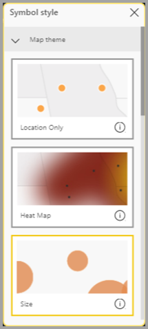
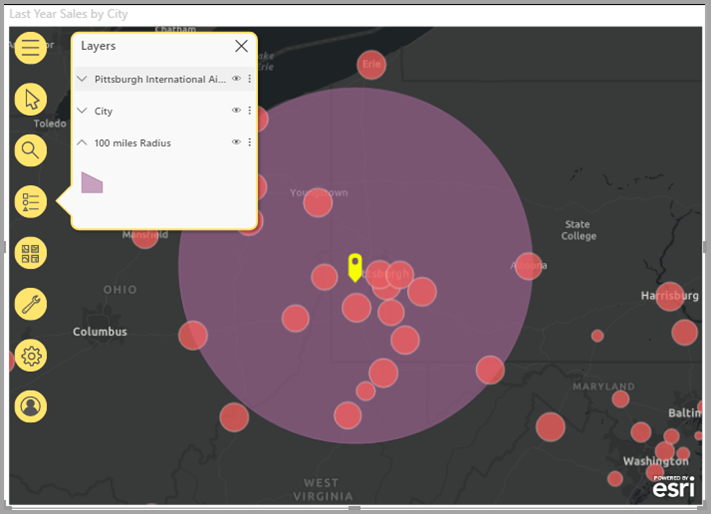

# Criar mapas do ArcGIS no Power BI

[!INCLUDE[consumer-appliesto-yyyn](../includes/consumer-appliesto-yyyn.md)]    

> [!NOTE]
> Estes elementos visuais podem ser criados e visualizados no Power BI Desktop e no serviço Power BI. Os passos e as ilustrações neste artigo referem-se ao Power BI Desktop.

Esta descrição geral foi escrita do ponto de vista de uma pessoa que está a criar um mapa do ArcGIS for Power BI. Quando um _designer_ partilha um mapa do ArcGIS for Power BI com um colega, este pode ver e interagir com o mapa, mas não pode guardar as alterações. Para saber mais sobre a visualização de um mapa do ArcGIS, veja [Explorar o ArcGIS for Power BI](https://doc.arcgis.com/en/power-bi/use/explore-maps.htm).

A combinação de mapas ArcGIS com o Power BI leva o mapeamento além da apresentação de pontos num mapa, a um nível totalmente novo. Escolha entre mapas de base, tipos de localização, temas, estilos de símbolos e camadas de referência para criar belíssimas visualizações de mapas informativos. A combinação de camadas de dados autoritativas num mapa com análise espacial proporciona uma compreensão mais aprofundada dos dados na visualização. Embora não seja possível criar um mapa do ArcGIS for Power BI num dispositivo móvel, pode visualizá-lo e interagir com o mesmo.

> [!NOTE]
> O ArcGIS for Power BI suporta o Power BI Report Server apenas em ambientes online; não é suportado num ambiente offline.

> [!TIP]
> GIS significa Geographic Information Systems (Sistemas de Informação Geográfica).

O exemplo abaixo utiliza uma tela em cinzento escuro para mostrar as vendas regionais como um mapa térmico, em relação a uma camada demográfica do rendimento disponível médio de 2016. Como poderá constatar nesta leitura, a utilização do ArcGIS for Power BI oferece uma capacidade de mapeamento avançado, dados demográficos e visualizações de mapas ainda mais apelativas para contar a melhor história.

> [!TIP]
> Visite a [**página da Esri sobre o ArcGIS for Power BI**](https://www.esri.com/powerbi) para ver muitos exemplos e ler testemunhos. Além disso, veja a ajuda do **[ArcGIS Maps for Power BI online](https://doc.arcgis.com/en/power-bi/get-started/about-maps-for-power-bi.htm) da Esri**.

## Consentimento do utilizador

O ArcGIS for Power BI é disponibilizado pela Esri ([https://www.esri.com](https://www.esri.com/)). A utilização do ArcGIS for Power BI está sujeita aos [termos](https://go.microsoft.com/fwlink/?LinkID=826322) e à [política de privacidade](https://go.microsoft.com/fwlink/?LinkID=826323) da Esri. Os utilizadores do Power BI que queiram utilizar os elementos visuais do ArcGIS for Power BI têm de clicar em Aceitar na caixa de diálogo de consentimento. Esta caixa de diálogo aparece apenas na primeira vez que utilizar o ArcGIS for Power BI.

## Pré-requisitos

Este tutorial utiliza o Power BI Desktop e o PBIX [exemplo de Análise de Revenda](https://download.microsoft.com/download/9/6/D/96DDC2FF-2568-491D-AAFA-AFDD6F763AE3/Retail%20Analysis%20Sample%20PBIX.pbix). Os mapas do ArcGIS for Power BI também podem ser criados com o serviço Power BI.

1. Na secção superior esquerda da barra de menus, selecione **Ficheiro** > **Abrir relatório**.
2. Localize o **ficheiro PBIX de Exemplo de Análise de Revenda** guardado no computador local.
3. Abra o **Exemplo de Análise de Revenda** na vista de relatório .
4. Selecione  para adicionar uma página nova ao relatório.

## Criar uma visualização de mapa do ArcGIS for Power BI

Para adicionar um mapa a um relatório, siga estes passos:

1. Selecione o ícone ArcGIS for Power BI no painel Visualizações.

    

2. O Power BI adiciona um modelo vazio à tela de relatórios. Nesta descrição geral, utilizaremos a versão **Standard** incluída com o Power BI. Se iniciar sessão numa conta válida do ArcGIS com o licenciamento adequado, terá acesso a mais funcionalidades. Para obter mais detalhes, veja a [ajuda do ArcGIS for Power BI online](https://doc.arcgis.com/en/power-bi/get-started/account-types.htm).

    

3. No painel **Campos**, arraste um campo de dados para o campo **Localização** ou arraste as coordenadas para os registos **Latitude** e/ou **Longitude** adequados. Neste exemplo, estamos a utilizar **Store > City** (Loja > Cidade).

    > [!NOTE]
    > O ArcGIS for Power BI deteta automaticamente se a visualização dos campos que selecionou é melhor como uma forma ou um ponto num mapa. Pode ajustar a predefinição nas definições (veja [Formatar a visualização do ArcGIS for Power BI](#format-the-arcgis-for-power-bi-visualization)).

    

4. No painel **Campos**, arraste uma medida para o registo **Tamanho**, para ajustar a forma como os dados são apresentados. Neste exemplo, estamos a utilizar **Sales > Last Year Sales** (Vendas > Vendas do Último Ano).

    

Criou o primeiro mapa do ArcGIS for Power BI. Agora, vamos refinar e formatar o nosso mapa com mapas de base, tipos de localização, temas e mais.

## Formatar a visualização do ArcGIS for Power BI

Para aceder às funcionalidades de formatação do **ArcGIS for Power BI**:

1. No painel Visualizações, clique no separador **Formatar** para ver as opções de formatação.

    

    Opções de formatação do mapa do ArcGIS:

    * **Camadas:** altere o título da lista Camadas (ToC), ative ou desative a lista de camadas, ancore a lista no mapa e defina a posição da lista ancorada. A lista Camadas está ativada por predefinição e está disponível nas ferramentas de mapa expandidas .
    * **Ferramentas de mapa:** ative ou desative as ferramentas de navegação, bloqueie a extensão do mapa na posição atual, defina a posição dos cartões infográficos no mapa. Os botões Ampliar e Reduzir estão desativados por predefinição.
    * **Tipo de localização:** especificar o país/região no qual os dados estão localizados ajuda a melhorar a precisão das localizações no mapa. Se os dados estiverem num único país/região, escolha o país/região na lista suspensa. Se os dados forem globais, escolha Mundo.
    * **Pesquisar:** ative ou desative a função Pesquisar e altere a cor predefinida do alfinete. a pesquisa está ativada por predefinição e está disponível nas ferramentas de mapa expandidas .

### Editar um mapa do ArcGIS for Power BI

Depois de adicionar dados à visualização do mapa, as ferramentas de mapa ficam disponíveis.

> [!NOTE]
> Este tutorial mostra apenas as funcionalidades e as opções disponíveis na versão **Standard** do ArcGIS for Power BI. Se tiver sessão iniciada numa [conta do ArcGIS](https://doc.arcgis.com/en/power-bi/get-started/account-types.htm) válida com o licenciamento adequado, terá acesso a mais funcionalidades.

Para expandir as ferramentas de mapa:

1. Clique no botão Ferramentas de mapa para expandir as ferramentas.

    

As ferramentas de mapa podem ser expandidas para mostrar as funcionalidades disponíveis. Cada funcionalidade, quando selecionada, abre um painel de tarefas que fornece opções detalhadas.

> [!TIP]
> A Esri disponibiliza [ documentação completa](https://go.microsoft.com/fwlink/?LinkID=828772) sobre a utilização do ArcGIS for Power BI.

#### Alterar o mapa base

Um mapa base proporciona um fundo, ou um contexto visual, para os dados num mapa. Por exemplo, um mapa base a mostrar as ruas pode disponibilizar contexto para os dados de endereço. Com a conta **Standard**, são disponibilizados quatro mapas base: Tela Cinzento Escuro, Tela Cinzento Claro, OpenStreetMap e Streets.

Para alterar o mapa base, siga estes passos:

1. Clique no botão **Mapa base**  para ver a galeria.
2. Selecione o mapa base **Tela Cinzento Escuro**.

    

    O mapa é atualizado com o novo mapa base.

Para obter mais informações, veja [Alterar o mapa base](https://doc.arcgis.com/en/power-bi/design/change-the-basemap.htm) na ajuda online do ArcGIS for Power BI.

#### Mostrar camadas do mapa

No ArcGIS for Power BI, trabalha com dados geográficos através de camadas. As camadas são coleções lógicas de dados geográficos que são utilizadas para criar mapas. Também são a base para a análise geográfica.

Para visualizar a lista Camadas, clique no botão **Camadas**  nas ferramentas de mapa.

A lista Camadas apresenta cada camada que compõe o mapa e cada camada tem o seu próprio conjunto de opções para o ajudar a personalizar e a trabalhar com o mapa. Aparecem diferentes opções no menu, dependendo do tipo de camada selecionada; por exemplo, pode alterar a simbologia e o tipo de localização para uma camada criada através dos dados do Power BI – como a camada **Cidade** que criou para este exemplo – mas essas opções não estão disponíveis para referência ou camadas do tempo de condução.

Para obter mais informações, veja [Trabalhar com camadas](https://doc.arcgis.com/en/power-bi/design/work-with-layers.htm) na ajuda online do ArcGIS for Power BI.

#### Especificar o tipo de localização

O ArcGIS for Power BI utiliza a tecnologia de ativação geográfica potente para posicionar com precisão os dados de localização no mapa e compõe automaticamente os itens como pontos ou limites por predefinição, com base no tipo de dados. Por exemplo, uma coordenada de latitude-longitude é composta como um ponto no mapa, enquanto um campo de estado é composto como um limite ou polígono. Pode alterar a forma como as localizações são compostas ao especificar o tipo de localização.

Utilize a funcionalidade Tipo de localização para melhorar a precisão das localizações no mapa. Pode fazê-lo rapidamente ao escolher um país/região no painel Formato da visualização (expanda a categoria Tipo de localização e escolha o país/região apropriado) ou aceda a mais opções através da funcionalidade Tipo de localização completa no painel de opções de camada.

Pode aceder à funcionalidade **Tipo de localização** através do menu de opções das camadas, onde poderá escolher se quer representar os dados como pontos ou limites (polígonos), além de especificar o país/região no qual os dados estão localizados. Os limites são normalmente definidos como áreas geográficas padrão, como países, províncias, códigos postais, etc. Se escolher limites e um país/região específico para as localizações de dados, poderá escolher entre uma variedade de limites padrão, como condados, áreas de recenseamento, distritos ou municípios. Estão disponíveis diferentes tipos de localização para cada país/região.

Para modificar o tipo de localização dos dados, siga estes passos:

1. Na lista Camadas, selecione a camada de dados com a qual deseja trabalhar.
2. Clique no botão **Opções de camada** e escolha **Tipo de localização**.

    

    Aceite os valores predefinidos para compor as localizações como pontos no mapa e especifique **Um país > Estados Unidos**.

    

Para obter mais informações, veja [Especificar o tipo de localização](https://doc.arcgis.com/en/power-bi/design/specify-location-type.htm) na ajuda online do ArcGIS for Power BI.

#### Personalizar a simbologia do mapa

O ArcGIS for Power BI utiliza valores no painel Campos para determinar de forma inteligente como deve compor as localizações no mapa. A funcionalidade **Simbologia** permite-lhe modificar o estilo predefinido para contar melhor a história. Pode escolher um tema do mapa diferente e personalizar os símbolos e as cores utilizados para representar as localizações no mapa. Estão disponíveis diferentes opções de estilo e temas do mapa, dependendo dos valores que adicionou ao painel Campos do elemento visual do mapa.

Para alterar a simbologia de uma camada, siga estes passos:

1. Na lista Camadas, selecione a camada de dados com a qual quer trabalhar.

2. Clique no botão **Opções de camada** e escolha **Simbologia**.

O painel Simbologia é apresentado, com a categoria Tema do mapa expandida.

##### Alterar o tema do mapa

Neste exemplo, como adicionámos valores aos campos **Localização** e **Tamanho**, o mapa utiliza o tema **Tamanho** por predefinição.

Para alterar o tema do mapa, siga estes passos:

1. Escolha alguns dos outros temas do mapa para ver como o mapa é alterado.

    

2. Escolha o tema **Tamanho**.

Para obter informações detalhadas, veja [Alterar o tema do mapa](https://doc.arcgis.com/en/power-bi/design/change-the-map-theme.htm) na ajuda online do ArcGIS for Power BI.

##### Transparência da camada

Se o mapa tiver várias camadas, poderá ser útil compor camadas com algum nível de transparência para que os itens nas outras camadas também estejam visíveis.

Para definir o valor de transparência para a camada, siga estes passos:

1. No painel **Simbologia**, expanda a categoria **Transparência**.

2. Introduza uma percentagem na caixa de texto ou mova o controle de deslize para a esquerda (menos transparente) ou para a direita (mais transparente).

##### Estilo do símbolo

Os estilos do símbolo permitem-lhe ajustar a forma como os dados são apresentados no mapa. Os estilos do símbolo predefinidos são baseados no Tipo de localização e no Tema do mapa selecionados e as opções de estilo disponíveis são diferentes dependendo de quais conjuntos de campos contêm valores e a natureza desses valores.

Para alterar o estilo de símbolo, siga estes passos:

1. No painel **Simbologia**, expanda a categoria **Estilo do símbolo**.

2. Altere as definições do símbolo conforme desejado. Escolha uma forma, cor, transparência, cor de contorno, espessura e transparência para o símbolo. Expanda a categoria Tamanho do símbolo para alterar estas opções; são apresentadas opções diferentes dependendo da natureza dos dados e do tema do mapa selecionado.

    O exemplo abaixo mostra o tema do mapa definido como **Tamanho** e vários ajustes de estilos de símbolos para transparência, estilo e tamanho.

    

3. Quando terminar de definir as opções de estilo, feche o painel Simbologia.

### Analisar os dados

O ArcGIS for Power BI proporciona várias ferramentas que lhe permitem descobrir padrões nos dados e contar uma história apelativa com um mapa.

As funcionalidades de análise incluem:

- Selecionar localizações no mapa
- Pesquisar um endereço específico, um local ou um ponto de interesse
- Adicionar uma camada de referência para disponibilizar mais contexto
- Encontrar localizações numa área de tempo de condução ou raio especificada
- Adicionar cartões que apresentam detalhes demográficos sobre a área apresentada no mapa

#### Selecionar localizações

O ArcGIS for Power BI disponibiliza várias ferramentas de seleção diferentes para o ajudar a selecionar localizações no mapa. São apresentadas diferentes ferramentas, dependendo do tipo de camada atualmente selecionada na lista Camadas.

Para apresentar as ferramentas de seleção, siga estes passos:

1. Nas ferramentas de mapa, clique no botão **Ferramentas de seleção**  para expandir o conjunto de ferramentas.

    Há quatro ferramentas de seleção disponíveis. Podem ser apresentadas ferramentas diferentes no menu **Ferramentas de seleção**, dependendo do tipo de camada que está atualmente ativa. Como o mapa neste exemplo contém apenas uma camada de dados, sé são apresentadas as ferramentas **Seleção única** e **Seleção de caixa**.
    
    | **Ferramenta** | **Descrição** |
    | --- | --- |
    |  | **Seleção única** – esta é uma ferramenta de seleção única que pode ser utilizada para clicar em localizações individuais; é a ferramenta de seleção predefinida. Prima Ctrl e clique para selecionar várias localizações. Clicar em localizações de dados no mapa seleciona-os e aciona interações com outras visualizações. Clicar num alfinete ou numa localização numa camada de referência apresenta a descrição. |
    |   | **Seleção de caixa** – arraste um seletor de retângulo para selecionar várias localizações ou selecione localizações individuais ao clicar nelas. Assim como acontece com a ferramenta Selecionar, clicar num alfinete ou numa localização numa camada de referência apresenta a descrição. Quando a ferramenta Seleção de caixa estiver ativa, não poderá deslocar o mapa. |
    |   | **Seleção da camada de referência** – se adicionou uma [camada de referência](https://doc.arcgis.com/en/maps-for-powerbi/design/add-a-reference-layer.htm) ao mapa, utilize esta ferramenta para selecionar localizações ao clicar em áreas na camada de referência. As localizações que estão dentro de uma área delimitada numa referência são realçadas; as localizações noutras áreas do mapa não estão disponíveis. Esta ferramenta só aparecerá se o mapa tiver uma ou mais camadas de referência e uma camada de referência estiver ativa no momento. |
    |   | **Seleção do tempo de condução** – se adicionou uma [área do tempo de condução](https://doc.arcgis.com/en/maps-for-powerbi/design/find-nearby-locations.htm) ao mapa, utilize a ferramenta de seleção da área do tempo de condução para selecionar localizações de dados dentro da área definida. |
    
2. Selecione uma ou mais localizações no mapa. Pode selecionar um máximo de 250 pontos de dados de cada vez.

Para obter mais informações, veja [Selecionar localizações num mapa](https://doc.arcgis.com/en/power-bi/design/select-features-on-the-map.htm) na ajuda online do ArcGIS for Power BI.

#### Afixar uma localização

Afixe um endereço, um local ou um ponto de interesse específico no mapa. Para este exemplo, vai procurar o Aeroporto Internacional de Pittsburgh.

Para afixar uma localização, siga estes passos:

1. Nas ferramentas de mapa, clique no botão **Pesquisar**  para abrir o painel Pesquisar.
2. Escreva as palavras-chave **Internacional de Pittsburgh** na caixa de pesquisa.

    As palavras-chave podem incluir um endereço, um local ou um ponto de interesse. À medida que escreve, são apresentadas pesquisas recentes semelhantes ou sugestões baseadas em palavras-chave semelhantes.

3. Na lista de resultados, escolha **Aeroporto Internacional de Pittsburgh** e clique em **Fechar**.

    É apresentado um símbolo no mapa, e o mapa amplia automaticamente para a localização. Os alfinetes permanecem no mapa apenas durante a sessão atual. Não pode guardar uma localização afixada com o mapa. A localização afixada também aparece como uma camada na lista Camadas. Pode mudar o nome da camada, mostrá-la, ocultá-la ou removê-la do mapa, tal como com outras camadas.

4. Para alterar a cor do alfinete, expanda a categoria **Pesquisar** no painel **Formatar** do elemento visual do mapa e escolha uma nova cor.

> [!NOTE]
> A funcionalidade **Pesquisar** substitui a funcionalidade Alfinetes anteriormente disponível no ArcGIS for Power BI.

Para obter mais informações, veja [Afixar uma localização](https://doc.arcgis.com/en/power-bi/design/pin-locations.htm) na ajuda online do ArcGIS for Power BI.

#### Adicionar uma camada de referência

As camadas de referência disponibilizam contexto para os dados do Power BI que já está a apresentar num mapa. As camadas de referência podem incluir dados demográficos, como a idade, a formação académica e o rendimento do agregado familiar. Também podem incluir camadas de funcionalidades partilhadas publicamente disponíveis no ArcGIS Online que disponibilizam mais informações sobre as áreas em torno das localizações no mapa.

##### Adicionar uma camada de dados demográficos

A conta do ArcGIS for Power BI Standard inclui uma seleção de camadas demográficas dos EUA que ajudam a contextualizar os dados do Power BI.

Para adicionar uma camada de dados demográficos, siga estes passos:

1. Nas ferramentas de mapa, clique no botão **Ferramentas de análise**  para expandir o conjunto de ferramentas.
2. Clique no botão **Camada de referência** .

    É apresentado o painel **Camada de referência**, a mostrar o separador **Dados demográficos** e a seleção de camadas.

3. Percorra a galeria e clique em **Adicionar** na miniatura da camada que quer adicionar ao mapa.

    Para este exemplo, localize a camada **Rendimento Médio do Agregado Familiar nos EUA em 2016** e clique em **Adicionar**.
    
    O mapa é atualizado para apresentar a nova camada.
    
    
    
As camadas de referência de dados demográficos são interativas; clique numa área para ver uma descrição com mais informações. Também pode utilizar a ferramenta **Seleção de referências** para [selecionar áreas no mapa](https://doc.arcgis.com/en/power-bi/design/select-features-on-the-map.htm) que se enquadram numa área na camada de referência.

##### Adicionar uma camada de referência a partir do ArcGIS

O ArcGIS for Power BI permite-lhe procurar camadas de funcionalidades partilhadas publicamente no ArcGIS e dá-lhe acesso a milhares de camadas de referência que disponibilizam informações sobre as áreas em torno das localizações na camada de dados. Quando inicia sessão no ArcGIS for Power BI com uma conta válida do ArcGIS, pode procurar conteúdo na sua organização, nos grupos da sua organização ou no conteúdo público. Neste exemplo, como está a utilizar a conta Standard, apenas é apresentado o conteúdo partilhado publicamente nos resultados da pesquisa.

Para adicionar uma camada de referência do ArcGIS, siga estes passos:

1. No painel Referência, clique no separador **ArcGIS**.

2. No campo de pesquisa, introduza **Distritos congressistas dos EUA** e prima **Enter**.

    A galeria é preenchida com vários resultados possíveis.

3. Localize a camada 116 Distritos Congressistas dos EUA e clique em Adicionar.

    O mapa é atualizado para apresentar a nova camada.
    
    
    
As camadas de referência do ArcGIS são interativas; clique numa área para ver uma descrição com mais informações. Também pode utilizar a ferramenta **Seleção de referências** para [selecionar áreas no mapa](https://doc.arcgis.com/en/power-bi/design/select-features-on-the-map.htm) que se enquadram numa área na camada de referência.

#### Encontrar localizações próximas

Pode utilizar as localizações no mapa, incluindo uma localização afixada, como um ponto de partida para encontrar e selecionar localizações próximas no mapa. Por exemplo, se procurar um local de interesse específico, poderá selecionar localizações no mapa que estão dentro de uma determinada distância ou tempo de condução desse local.

Neste exemplo, utilizará o Aeroporto Internacional de Pittsburgh que afixou anteriormente como um ponto de partida para encontrar localizações num raio de cerca de 150 km do aeroporto. Utilize passos semelhantes para encontrar localizações num tempo de condução especificado.

Para encontrar localizações numa distância de condução especificada do ponto de origem, siga estes passos:

1. Nas ferramentas de mapa, clique no botão **Ferramentas de análise**  para expandir o conjunto de ferramentas.

2. Clique no botão de **Tempo de condução** .

    É apresentado o painel **Tempo de condução**.

3. Clique na ferramenta de seleção única e, no mapa, selecione a localização **Aeroporto Internacional de Pittsburgh** que foi afixada anteriormente.
4. No menu pendente **Área de pesquisa**, escolha **Raio** e especifique uma distância de **150** km.
5. Clique em **OK**.

    O mapa mostra um círculo ao redor da localização do aeroporto afixada. O painel Tempo de condução expande-se para mostrar as opções de estilo da área de distância de condução.
    
    
    
    A área de distância de condução também aparece como uma camada na lista de Camadas. Pode mudar o nome da camada, mostrá-la, ocultá-la ou removê-la do mapa, tal como com outras camadas.

6. Com a camada de tempo de condução ativa na lista Camadas, utilize a ferramenta Seleção do tempo de condução para clicar na área de distância de condução.

    As localizações que estão dentro da área de pesquisa estão selecionadas; as localizações não selecionadas no mapa aparecem mais pequenas ou tornam-se mais transparentes. As outras visualizações são atualizadas para refletir as localizações selecionadas.

Para obter mais informações, veja [Encontrar localizações próximas](https://doc.arcgis.com/en/power-bi/design/find-nearby-locations.htm) na ajuda online do ArcGIS for Power BI.

#### Adicionar cartões de infográficos

Tal como as camadas de referência, os cartões infográficos disponibilizam detalhes adicionais sobre as áreas no mapa. Os cartões de infográficos são colocados sobre o mapa e apresentam informações demográficas específicas sobre a área imediatamente ao redor de uma localização selecionada ou sobre a área geral apresentada na extensão do mapa atual. Para obter informações detalhadas, veja [Adicionar cartões de infográficos](https://doc.arcgis.com/en/power-bi/design/add-infographics.htm) na ajuda online do ArcGIS for Power BI.

### Obter ajuda

A Esri disponibiliza documentação online completa sobre o ArcGIS for Power BI.

Para aceder à ajuda online do ArcGIS for Power BI a partir da visualização, siga estes passos:

1. Nas ferramentas de mapa, clique no botão **Definições** .

2. No painel **Definições**, clique no botão **Ajuda**.
3. Clique em **OK** na janela de confirmação apresentada.

    A ajuda online do ArcGIS for Power BI é aberta numa janela do browser.
    
    - Encontre respostas para [perguntas mais frequentes](https://doc.arcgis.com/en/power-bi/get-started/pbi-faq.htm#anchor5) na ajuda online do ArcGIS for Power BI.
    - Pode colocar perguntas, encontrar as informações mais recentes, problemas de relatório e localizar as respostas no [thread da comunidade do Power BI relacionado com o **ArcGIS for Power BI**](https://go.microsoft.com/fwlink/?LinkID=828771).
    - Se tiver uma sugestão para uma melhoria, submeta-a na [Lista de ideias do Power BI](https://ideas.powerbi.com/).
    
### Gerir a utilização do ArcGIS for Power BI na sua organização

O Power BI permite que os designers, administradores do Power BI e administradores de utilizadores façam a gestão da utilização do ArcGIS for Power BI. As secções abaixo descrevem as ações que cada função pode assumir.

#### Opções para designers

No Power BI Desktop, os designers podem desativar o ArcGIS for Power BI no separador Segurança. Selecione **Ficheiro**  >  **Opções e definições** e, em seguida, selecione **Opções**  >  **Segurança**. Quando desativado, o ArcGIS não será carregado, por predefinição.

#### Opções para administradores

No serviço Power BI, os administradores podem desativar o ArcGIS for Power BI para todos os utilizadores. Selecione **Definições** > **Portal de Administração** > **Definições de inquilino**. Quando for desativado, o Power BI deixará de apresentar o ícone do ArcGIS for Power BI no painel de visualizações.

#### Opções para Administradores de Utilizadores

O Power BI Desktop suporta a utilização da **Política de Grupo** para desativar o ArcGIS for Power BI nos computadores de uma organização onde estiver implementado.

| **Atributo** | **Valor** |
| --- | --- |
| Chave | Software\Policies\Microsoft\Power BI Desktop |
| valueName | EnableArcGISMaps |

Um valor de 1 (decimal) ativa o ArcGIS for Power BI.

Um valor de 0 (decimal) desativa o ArcGIS for Power BI.

## Considerações e limitações

O ArcGIS for Power BI está disponível nos seguintes serviços e aplicações:

| Serviço/Aplicação | Disponibilidade |
| --- | --- |
| Power BI Desktop | Sim |
| Serviço Power BI (powerbi.com) | Sim |
| Aplicações móveis do Power BI\* | Sim |
| Publicar na Web do Power BI | Sim, para designers com sessão iniciada numa conta do ArcGIS válida com a licença do suplemento apropriada. Os consumidores não precisam da licença do suplemento para ver o conteúdo publicado. |
| Power BI Embedded | Sim, para designers com sessão iniciada numa conta do ArcGIS válida com a licença do suplemento apropriada. Os consumidores não precisam da licença do suplemento para ver o conteúdo publicado. |
| Incorporação do serviço Power BI (powerbi.com) | Não |
| Power BI Report Server | Sim, apenas em ambientes online; não é suportado num ambiente offline. |

\*Em ambientes móveis, pode ver mapas criados através da visualização do ArcGIS for Power BI incluída com o Power BI ([conta Standard](https://doc.arcgis.com/en/maps-for-powerbi/get-started/account-types.htm)). Os mapas com conteúdo premium do ArcGIS não são suportados em ambientes móveis.

Em serviços ou aplicações em que o ArcGIS for Power BI não estiver disponível, a visualização será apresentada como um elemento visual em branco, com o logótipo do Power BI.

A tabela seguinte compara as funcionalidades standard disponíveis para todos os utilizadores do Power BI com as que estão disponíveis para os utilizadores do ArcGIS com sessão iniciada:

|  Standard (incluído com o Power BI) |   Com a conta do ArcGIS |
| --- | --- | --- |
| Mapas Base |
| 4 mapas base básicos | Todos os mapas base da Esri, bem como o acesso aos mapas base da sua organização, incluindo mapas base personalizados |
| Geocodificação |
| 3500 localizações por mapa | 10 000 localizações por mapa |
 | 10 000 localizações por mês | Sem limite mensal |
| Camadas de referência |
| 10 camadas de referência com dados demográficos dos EUA | Acesso a todas as camadas e mapas Web da sua organização do ArcGIS |
 | Camadas de funcionalidades partilhadas publicamente no ArcGIS | Camadas de funcionalidades partilhadas publicamente no ArcGIS |
 | Acesso aos mapas e camadas do Living Atlas of the World do ArcGIS (serviços de funcionalidades) |
| Infográficos |
| Galeria organizada de variáveis de dados demográficos dos EUA (7 categorias) | Acesso completo ao browser de dados GeoEnrichment do ArcGIS, incluindo variáveis de dados demográficos dos EUA e do mundo |
|

## Próximos passos

- [Interagir com um mapa ArcGIS que foi partilhado consigo](https://doc.arcgis.com/en/power-bi/use/explore-maps.htm)
- Atualizações de [Publicações de blogues que anunciam o ArcGIS for Power BI](https://www.esri.com/arcgis-blog/?s=#ArcGIS%20for%20Power%20BI)
- Mais perguntas? [Experimente perguntar à Comunidade do Power BI](https://community.powerbi.com/)