# Introdução ao painel de formatação
Se tiver permissões para editar um relatório, existem inúmeras opções de formatação disponíveis. Nos relatórios do Power BI, pode alterar a cor da série de dados, os pontos de dados e até o fundo das visualizações. Pode alterar a forma como o eixo x e o eixo y são apresentados. Pode até formatar as propriedades do tipo de letra das visualizações, das formas e dos títulos. O Power BI permite-lhe ter controlo total sobre a forma como os relatórios são apresentados.

Para começar, abra um relatório no Power BI Desktop ou no serviço Power BI. Ambos fornecem opções de formatação quase idênticas. Quando abrir um relatório no serviço Power BI, confirme que seleciona **Editar** na barra de menus. 

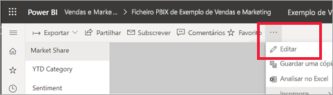

Quando estiver a editar um relatório e tiver uma visualização selecionada, é apresentado o painel **Visualizações**. Utilize este painel para alterar as visualizações. Diretamente abaixo do painel **Visualizações** estão três ícones: o ícone **Campos** (uma pilha de barras), **Formatar** (um rolo de pintura) e **Análise** (uma lupa). Na imagem abaixo, o ícone **Campos** está selecionado, indicado por uma barra amarela sob o ícone.

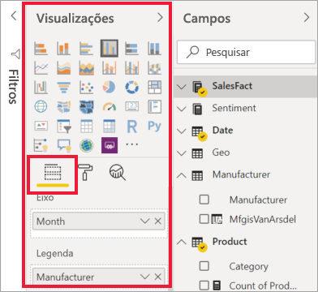

Quando selecionar **Formatar**, a área abaixo do ícone apresenta as personalizações disponíveis para a visualização atualmente selecionada.  

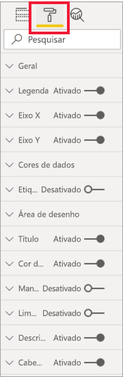

Pode personalizar muitos elementos de cada visualização. As opções disponíveis dependem do elemento visual selecionado. Algumas destas opções são:

* Legenda
* Eixo X
* Eixo Y
* Cores de dados
* Etiquetas de dados
* Formas
* Área de desenho
* Título
* Fundo
* Manter proporção
* Limite
* Descrições
* Cabeçalhos de elementos visuais
* Formas
* Posição    
e muito mais.

> [!NOTE]
>  
> Não verá todos estes elementos em cada tipo de visualização. A visualização que selecionar afetará as personalizações que estão disponíveis; por exemplo, não verá um eixo X se tiver selecionado um gráfico circular porque não há eixo x em gráficos circulares.

Repare também que, se não tiver nenhuma visualização selecionada, é apresentado **Filtros** em vez dos ícones, o que permite aplicar filtros a todas as visualizações na página.

A melhor forma de aprender a utilizar as Opções de formatação é experimentá-las. Pode sempre anular as alterações ou voltar à predefinição. Existe uma quantidade incrível de opções disponíveis, para além estarem constantemente a ser adicionadas novas. Não é possível descrever todas as opções de formatação num só artigo. Mas para começar, vamos descrever algumas delas. 

1. Alterar as cores utilizadas no elemento visual   
2. Aplicar um estilo    
3. Alterar as propriedades do eixo    
4. Adicionar etiquetas de dados    

## Trabalhar com cores

Vamos percorrer os passos necessários para personalizar as cores numa visualização.

1. Selecione a visualização para ativá-la.

2. Selecione o ícone de rolo de pintura para abrir o separador Formatação. O separador Formatação apresenta todos os elementos de formatação disponíveis para o elemento visual selecionado.

    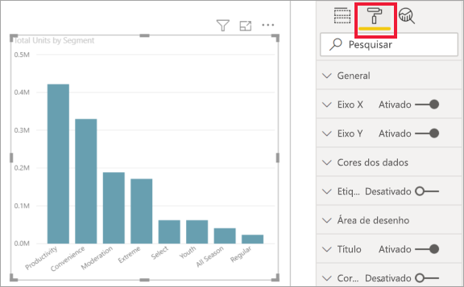

3. Selecione **Cores dos Dados** para expandir as personalizações disponíveis.  

    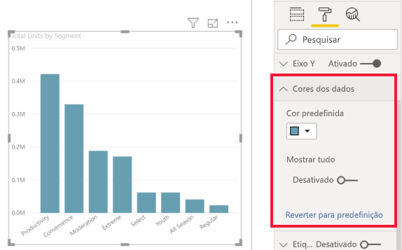

4. Altere **Mostrar tudo** para Ligado e selecione cores diferentes para as colunas.

    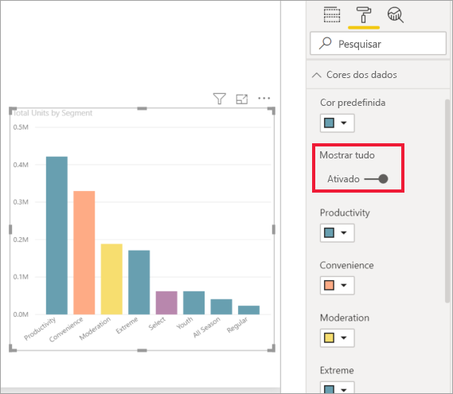

Veja a seguir algumas sugestões úteis para trabalhar com cores. Os números na lista a seguir também são mostrados no ecrã seguinte, indicando onde estes elementos úteis podem ser acedidos ou alterados.

1. Não gosta da cor? Não há problema, basta selecionar **Reverter para predefinição** para reverter a seleção para a predefinição. 

2. Não gosta de nenhuma das mudanças de cor? Selecione **Reverter para predefinição** na parte inferior da secção **Cor dos dados** e as suas cores revertem para as predefinições. 

3. Quer uma cor que não vê na paleta? Basta selecionar **Cores personalizadas** e escolher no espectro.  

   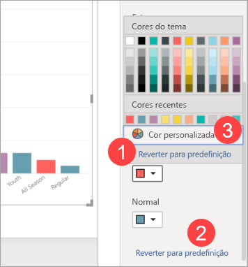

Não gostou da alteração que acabou de criar? Utilize **CTRL+Z** para anular, tal como está habituado a fazer.

## Aplicar um estilo a uma tabela
Algumas visualizações de Power BI têm uma opção **Estilo**. Com um único clique, é aplicado um conjunto completo de opções de formatação à visualização, tudo de uma vez. 

1. Selecione uma tabela ou matriz para a tornar ativa.   
1. Abra o painel Formatação e selecione **Estilo**.

   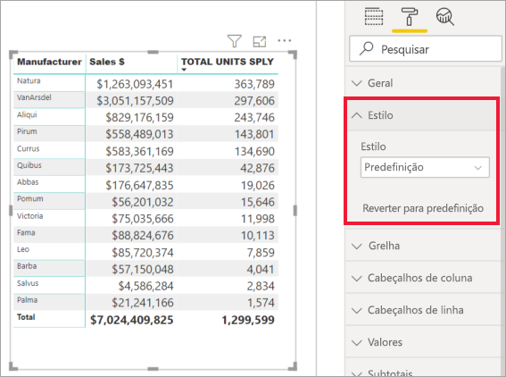

1. Selecione um estilo na lista pendente. 

   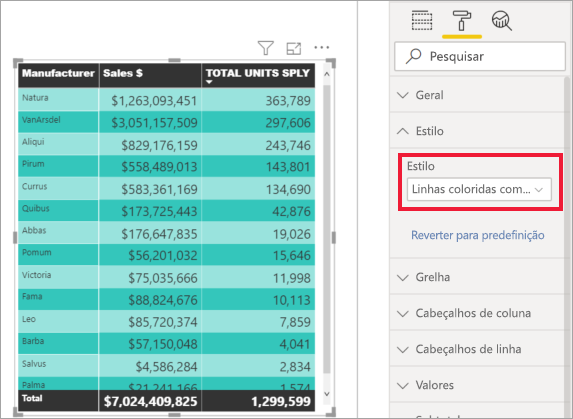

Mesmo após aplicar um Estilo, pode continuar a formatar as propriedades, incluindo a cor, dessa visualização.

## Alterar as propriedades dos eixos

Geralmente é útil modificar o eixo X ou Y. Semelhante ao trabalho com cores, pode modificar um eixo ao selecionar o ícone de seta para baixo à esquerda do eixo que deseja alterar, como mostrado na imagem a seguir.  
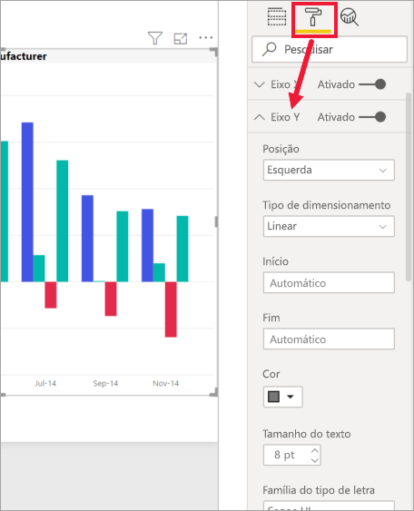

No exemplo abaixo, formatamos o eixo Y ao:
- mover as etiquetas para o lado direito da visualização

- alterar o valor inicial para zero.

- alterar a cor do tipo de letra da etiqueta para preto

- aumentar o tamanho do tipo de letra para 12

- adicionar um título ao eixo Y

    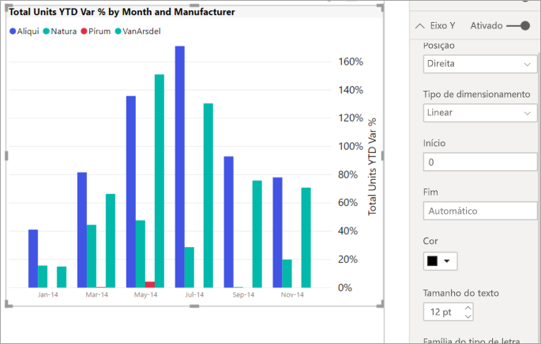

Pode remover completamente as etiquetas do eixo ao ativar/desativar o botão de opção ao lado do **Eixo X** ou **Eixo Y**. Também pode optar por ativar ou desativar os títulos dos eixos ao selecionar o botão de opção junto a **Título**.  

## Adicionar etiquetas de dados    

Um último exemplo de formatação antes de começar a explorar por sua conta.  Vamos adicionar etiquetas de dados a um gráfico de área. 

Veja a seguir a foto do *antes*. 

E esta é a foto do *depois*.

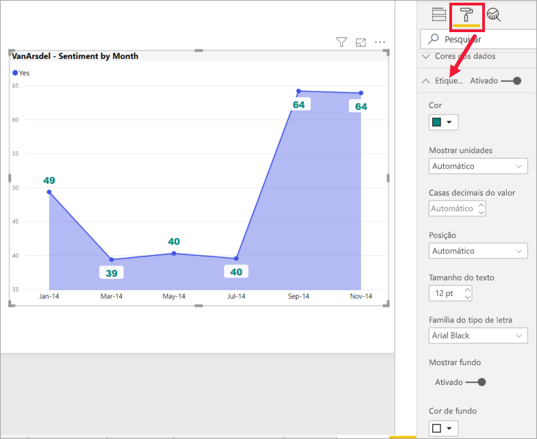

Selecionamos a visualização para a tornar ativa e abrimos o separador Formatação.  Selecionamos **Etiquetas de dados** e Ativar. Em seguida, aumentámos o tipo de letra para 12, alterámos a família de tipos de letra para Arial Black, definimos **Mostrar fundo** como Ativado e a cor de fundo como branco com uma transparência de 5%.

Estas são apenas algumas das tarefas de formatação possíveis. Abra um relatório no Modo de edição e divirta-se a explorar o painel Formatação para criar visualizações apelativas e informativas.

## Próximos passos
Para obter mais informações, veja o seguinte artigo:  

* [Sugestões e truques para formatação de cor no Power BI](service-tips-and-tricks-for-color-formatting.md)  
* [Formatação condicional em tabelas](../desktop-conditional-table-formatting.md)

