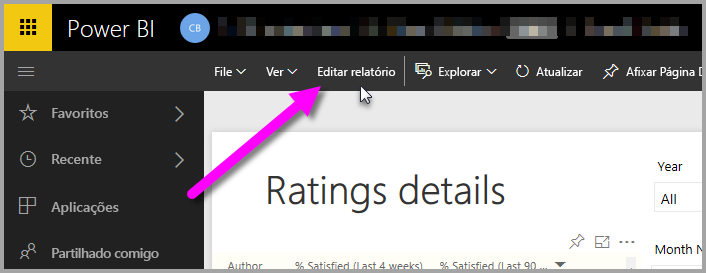
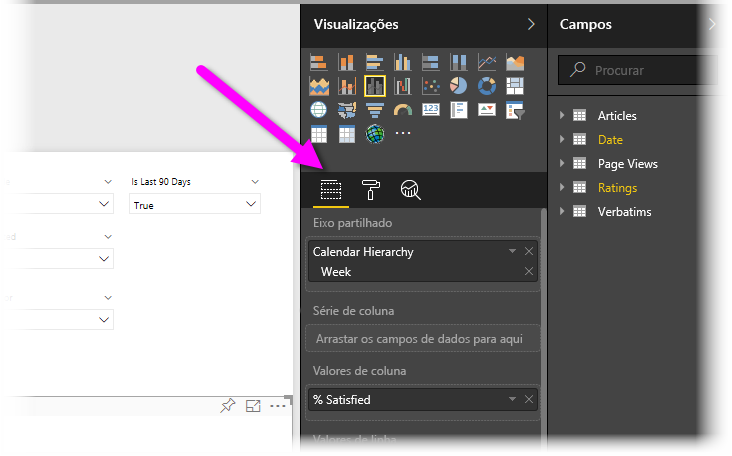
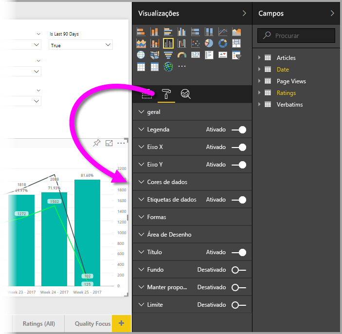
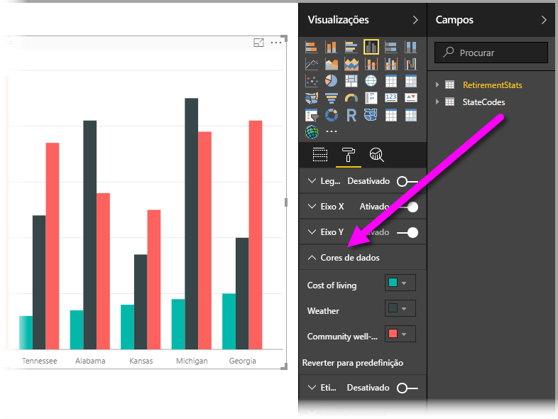
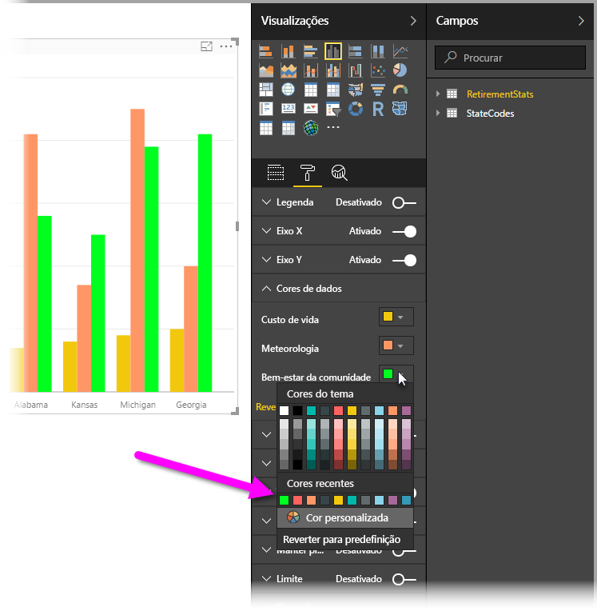
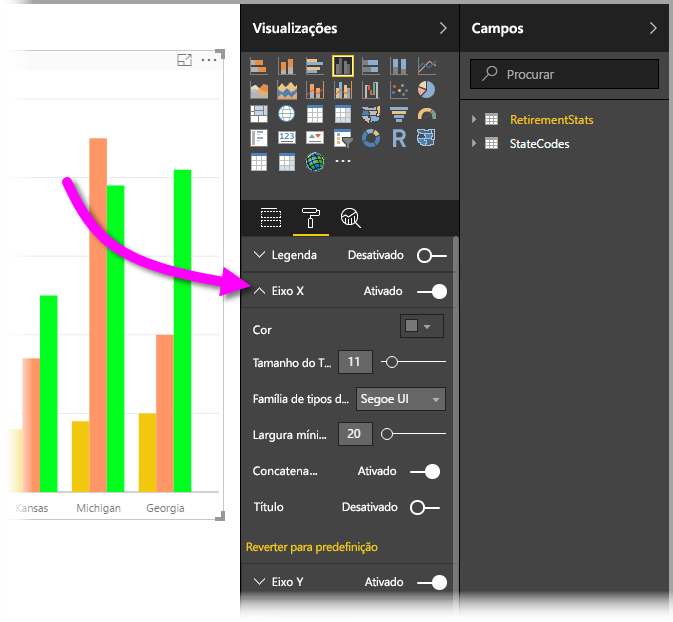

# Guia de introdução com propriedades de eixo e formatação de cor
No **Power BI**, pode alterar a cor da série de dados, os pontos de dados e até mesmo o fundo das visualizações. Também pode alterar como os eixos x e y são apresentados, tendo controlo total sobre como os seus dashboards e relatórios são mostrados.

Para começar, selecione um **Relatório** no painel **A Minha Área de Trabalho**. Na área de menu superior, selecione **Editar Relatório**.  

Quando estiver a editar um relatório e tiver uma visualização selecionada, é apresentado o painel **Visualizações**, o que permite adicionar ou alterar visualizações. Diretamente abaixo das visualizações disponíveis estão três ícones: **Campos** (uma pilha de barras), **Formatar** (um pincel) e **Análise** (uma lupa). Na imagem abaixo, o ícone **Campos** está selecionado, indicado por uma barra amarela abaixo do ícone.

Quando selecionar **Formatar**, a área abaixo do ícone apresenta as personalizações de cor e eixo disponíveis para a visualização atualmente selecionada.  

Pode personalizar muitos elementos de cada visualização:

* Legenda
* Eixo X
* Eixo Y
* Cores de dados
* Etiquetas de dados
* Formas
* Área de desenho
* Título
* Fundo
* Manter proporção
* Limite

> [!NOTE]
>  
> Não verá todos estes elementos em cada tipo de visualização. A visualização que selecionar afetará as personalizações que estão disponíveis; por exemplo, não verá um eixo X se tiver selecionado um gráfico circular porque não há eixo x em gráficos circulares.

Repare também que, se não tiver nenhuma visualização selecionada, é apresentado **Filtros** em vez dos ícones, o que permite aplicar filtros a todas as visualizações na página.

Vamos mostrar alguns exemplos: um trabalha com cores, o outro altera as propriedades de um eixo. A partir daqui, deve estar pronto para personalizar cores, eixos e etiquetas o dia inteiro.

## Trabalhar com cores

Vamos percorrer os passos necessários para personalizar cores num gráfico.

1. Selecionei um **Gráfico de Colunas em Cluster** na tela do relatório.
2. Escolhi o ícone **Formatar** para mostrar as personalizações disponíveis.
3. Em seguida, selecionei a pequena seta à esquerda da personalização **Cores de Dados**. Isto irá mostrar como posso personalizar as Cores de Dados, com opções específicas para a visualização que selecionei.
4. **Cores de Dados** é expandido para baixo para mostrar as personalizações disponíveis.  
   

Vamos fazer algumas alterações. Posso selecionar a seta para baixo ao lado da cor para fazer alterações em cada série de dados disponíveis. Vou deixar **Custo de vida** a amarelo, **Clima** a laranja e **Bem-estar da comunidade** a verde. O ecrã seguinte mostra o último passo, ao alterar **Custo de vida**.  

As alterações são mostradas na imagem abaixo. Uau, aí está um gráfico brilhante. Aqui estão alguns elementos úteis para observar como trabalhar com cores. Os números na lista a seguir também são mostrados no ecrã seguinte, indicando onde estes elementos úteis podem ser acedidos ou alterados.

1. Não gosta das cores? Não há problema, basta selecionar **Reverter para predefinição** e a seleção é revertida para as predefinições. Pode fazê-lo para uma cor ou para a visualização inteira.
2. Quer uma cor que não vê na paleta? Basta selecionar **Cores personalizadas** e escolher no espectro.  
   

Não gostou da alteração que acabou de criar? Utilize **CTRL+Z** para anular, tal como está habituado a fazer.

## Alterar as propriedades dos eixos

Geralmente é útil modificar o eixo X ou Y. Semelhante ao trabalho com cores, pode modificar um eixo ao selecionar o ícone de seta para baixo à esquerda do eixo que deseja alterar, como mostrado na imagem a seguir.  

Para quiser fechar as opções do **Eixo X**, basta selecionar o ícone de seta para cima junto a **Eixo X**.

Pode remover completamente as etiquetas do eixo X ao ativar o botão de opção junto a 7**Eixo X**. Também pode optar por ativar ou desativar os títulos dos eixos ao selecionar o botão de opção junto a **Título**.  

Existem todos os tipos de cores para escolher e muitas outras personalizações que pode aplicar nos seus relatórios e dashboards do Power BI.

> [!NOTE]
>  
> Estas personalizações de cor e eixo disponíveis quando o ícone **Formatar** é selecionado também estão disponíveis no Power BI Desktop.

## Definir cores com valores de texto

A partir da atualização de agosto de 2018 do **Power BI Desktop**, pode definir cores pelo valor de texto (ou código hexadecimal) de um determinado elemento do relatório. Para obter mais informações, veja [Formatação condicional em tabelas](../desktop-conditional-table-formatting.md).

## Próximos passos
Para obter mais informações, veja o seguinte artigo:  

* [Sugestões e truques para formatação de cor no Power BI](service-tips-and-tricks-for-color-formatting.md)  
* [Formatação condicional em tabelas](../desktop-conditional-table-formatting.md)

