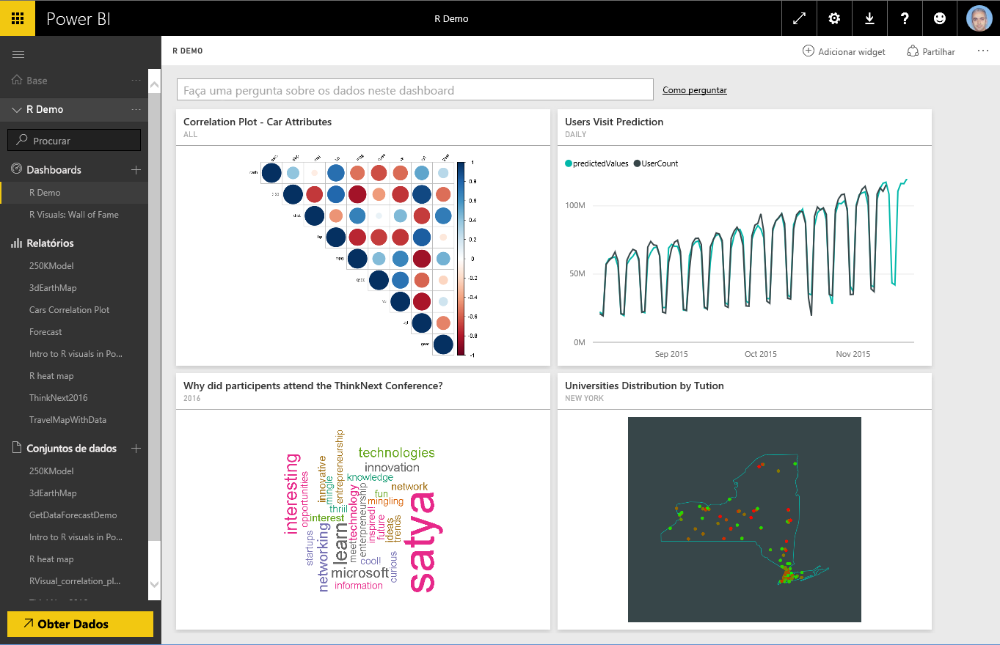
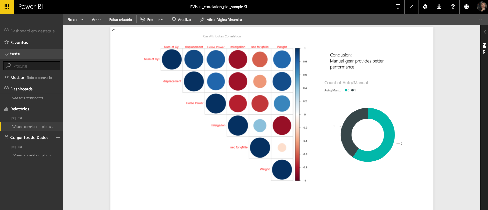
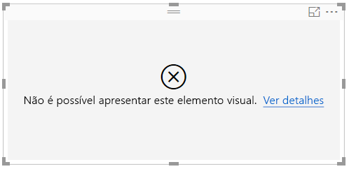
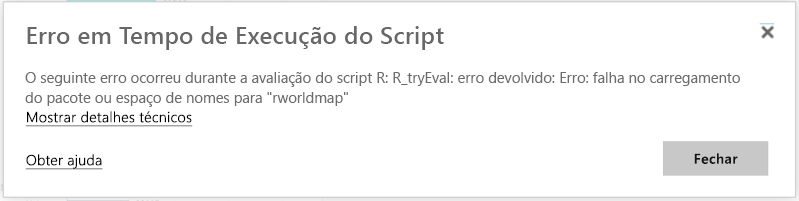
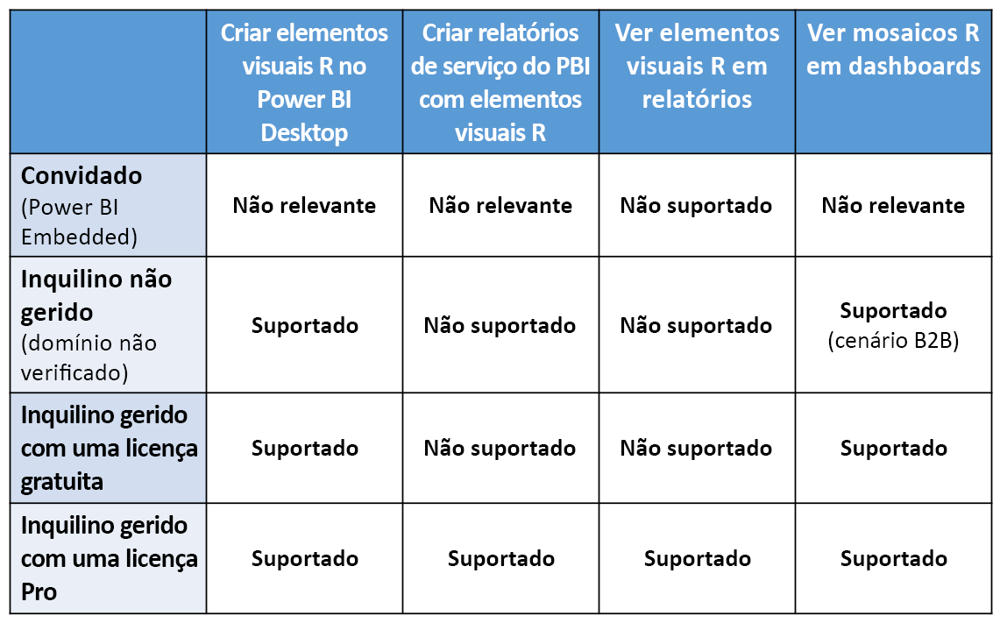

# Criar elementos visuais R no serviço Power BI
O serviço Power BI suporta a visualização e interação com elementos visuais criados com scripts R. Os elementos visuais criados com scripts R, geralmente denominados *elementos visuais R*, podem apresentar formação e análise de dados avançadas, como previsão, ao utilizar o poder avançado de análise e visualização da linguagem R.

> [!NOTE]
> A [linguagem de programação R](https://www.r-project.org/) é uma das linguagens mais utilizadas por estatísticos, cientistas de dados e analistas de negócio. A linguagem R tem uma comunidade de código aberto que disponibiliza mais de 7000 pacotes de suplementos, bem como os muito utilizados [Grupos de Utilizadores de R](http://msdsug.microsoft.com/). A versão de R implementada no serviço Power BI é *Revolution R Open 3.2.2*.
> 
> 

A imagem seguinte mostra um dashboard do Power BI com uma coleção de elementos visuais R utilizados para análise avançada.

Os elementos visuais R são criados num [relatório do Power BI Desktop](../desktop-get-the-desktop.md), tal como o relatório mostrado na imagem seguinte.

Assim que o relatório for criado no **Power BI Desktop**, pode publicar o relatório que contém um ou mais elementos visuais R no serviço Power BI. Atualmente, os elementos visuais R só podem ser criados no **Power BI Desktop** e publicados no serviço Power BI. Para obter mais informações sobre a criação de elementos visuais R, veja [Criar elementos visuais do Power BI através da linguagem R (Power BI Desktop)](../desktop-r-visuals.md).

Tenha em atenção que o serviço não suporta todos os pacotes R. Obtenha a lista de pacotes atualmente suportados no serviço Power BI no final deste artigo.

Pode transferir este [ficheiro de exemplo do Power BI Desktop](http://download.microsoft.com/download/D/9/A/D9A65269-D1FC-49F8-8EC3-1217E3A4390F/RVisual_correlation_plot_sample%20SL.pbix) (ficheiro .pbix) que contém alguns elementos visuais R para ver como tudo funciona e experimentar.

Os elementos visuais R criados no **Power BI Desktop** e publicados no serviço Power BI, na maior parte dos casos, comportam-se como qualquer outro elemento visual no serviço Power BI; pode interagir, filtrar, dividir por setores e afixar a um dashboard ou partilhá-los com outras pessoas. Para obter mais informações sobre como partilhar dashboards e elementos visuais, veja [Partilhar um dashboard com colegas e outras pessoas](../service-share-dashboards.md). Uma diferença dos outros elementos visuais é que os elementos visuais R não podem mostrar sugestões nem ser utilizados para filtrar outros elementos visuais.

Como pode ver na imagem seguinte, os elementos visuais R no serviço Power BI, em dashboards ou relatórios, na sua maioria, são apresentados e comportam-se como qualquer outro elemento visual e os utilizadores não precisam de considerar o script R subjacente que criou o elemento visual.

## Segurança dos scripts R
Os elementos visuais R são criados a partir de scripts R, os quais podem conter potencialmente código com riscos de segurança ou privacidade.

Estes riscos existem principalmente na fase de criação, quando o autor do script executa o script no seu próprio computador.

O serviço Power BI aplica uma tecnologia de *sandbox* para proteger os utilizadores e o serviço de riscos de segurança.

Esta abordagem de *sandbox* impõe algumas restrições aos scripts R em execução no serviço Power BI, tais como aceder à Internet ou a outros recursos que não têm de criar o elemento visual R.

## Experiência de erro de scripts R
Quando um script R encontra um erro, o elemento visual R não é desenhado e é apresentada uma mensagem de erro. Para obter detalhes sobre o erro, selecione **Ver detalhes** no erro do elemento visual R na tela, conforme mostrado na imagem seguinte.

Como outro exemplo, a imagem seguinte mostra a mensagem de erro apresentada quando um script R não foi executado corretamente devido a um pacote R em falta no Azure.

## Licensing
Os elementos visuais R requerem uma licença do [Power BI Pro](../service-self-service-signup-for-power-bi.md) para composição em relatórios, atualização, filtro e filtro cruzado. Para obter mais informações sobre as licenças do Power BI Pro e como diferem das licenças gratuitas, veja [Conteúdo do Power BI Pro - o que é isto?](../service-premium.md)

Os utilizadores gratuitos do Power BI só podem consumir mosaicos partilhados com os próprios. Para obter mais informações, veja [Comprar o Power BI Pro](../service-admin-purchasing-power-bi-pro.md).

A tabela seguinte descreve as capacidades dos elementos visuais R com base no licenciamento.

## Limitações Conhecidas
Os elementos visuais R no serviço Power BI têm algumas limitações:

* O suporte de elementos visuais R está limitado aos pacotes identificados na página seguinte <make this a link to the supported packages page per my excel>. Atualmente, não existe suporte de pacotes personalizados.
* Limitações de tamanho de dados – os dados utilizados pelo elemento visual do R para desenhar são limitados a 150.000 linhas. Se forem selecionadas mais de 150.000 linhas, apenas as primeiras 150.000 linhas serão utilizadas e uma mensagem será apresentada na imagem.
* Limite de tempo de cálculo – se um cálculo do elemento visual R exceder 60 segundos, o script atinge o tempo limite, resultando num erro.
* Os elementos visuais do R são atualizados após atualizações, filtragem e destaque de dados. No entanto, a imagem propriamente dita não é interativa e não suporta sugestões.
* Os elementos visuais do R respondem ao destaque de outros elementos visuais, mas não pode clicar em elementos em elementos no visual do R para efetuar a filtragem cruzada de outros elementos.
* Os elementos visuais R não são atualmente suportados para o tipo de dados *Tempo*. Em vez disso, utilize Data/Hora.
* Os elementos visuais R não são apresentados quando utilizar **Publicar na Web**.
* Atualmente, os elementos visuais R não são impressos a partir do dashboard e de relatórios
* Atualmente, os elementos visuais R não são suportados no modo DirectQuery do Analysis Services
* Os tipos de letra chinês, japonês e coreano requerem todos os passos adicionais seguintes para funcionar corretamente no serviço Power BI:
  
  * Primeiro, instale o pacote R *showtext* e todas as respetivas dependências. Pode fazê-lo ao executar o seguinte script:
    
        *install.packages("showtext")*
  * Em seguida, adicione a seguinte linha ao início do script R:
    
        powerbi_rEnableShowTextForCJKLanguages =  1

## Descrição geral de pacotes R
Os pacotes R são coleções de funções R, dados e código compilado combinadas num formato bem definido. Quando a linguagem R estiver instalada, esta inclui um conjunto de pacotes padrão e estão disponíveis outros pacotes para transferência e instalação. Depois de instalados, os pacotes R têm de ser carregados para a sessão para serem utilizados. A origem principal dos pacotes R gratuitos é a CRAN, [Comprehensive R Archive Network](https://cran.r-project.org/web/packages/available_packages_by_name.html).

O **Power BI Desktop** pode utilizar qualquer tipo de pacote R sem limitação. Pode instalar pacotes R para utilização no **Power BI Desktop** (através do [RStudio IDE](https://www.rstudio.com/), por exemplo).

Os elementos visuais R no **serviço Power BI** são suportados pelos pacotes encontrados na secção **Pacotes Suportados** encontrada [neste artigo](../service-r-packages-support.md). Se não encontrar um pacote que lhe interesse na lista de pacotes suportados, pode solicitar o suporte do pacote. Veja [Pacotes R no serviço Power BI](../service-r-packages-support.md) para obter informações sobre como solicitar o suporte.

### Requisitos e Limitações de pacotes R
Existem alguns requisitos e limitações para pacotes R:

* O serviço Power BI suporta, na maioria das vezes, pacotes R com licenças de software gratuitas e open source, como GPL-2, GPL-3, MIT+, entre outros.
* O serviço Power BI suporta pacotes publicados na CRAN. O serviço não suporta pacotes R privados ou personalizados. Recomendamos aos utilizadores que disponibilizem os respetivos pacotes privadas na CRAN antes de solicitarem que o pacote esteja disponível no serviço Power BI.
* No **Power BI Desktop**, existem duas variações para pacotes R:
  
  * Para elementos visuais R, pode instalar qualquer pacote, incluindo pacotes R personalizados
  * Para elementos visuais R personalizados, apenas os pacotes CRAN públicos são suportados para instalação automática dos pacotes
* Por motivos de segurança e privacidade, atualmente não suportamos pacotes R que forneçam consultas de cliente-servidor através da Web (por exemplo, RgoogleMaps) no serviço. O funcionamento em rede é bloqueado para essas tentativas. Veja [Pacotes R no serviço Power BI](../service-r-packages-support.md) para obter uma lista dos pacotes R suportados e não suportados.
* O processo de aprovação para incluir um novo pacote R tem uma árvore de dependências; algumas dependências que têm de ser instaladas no serviço não podem ser suportadas.

### Pacotes Suportados:
Para obter uma longa lista de pacotes R suportados (e a pequena lista de pacotes não suportados), veja o seguinte artigo:

* [Pacotes R no serviço Power BI](../service-r-packages-support.md)

