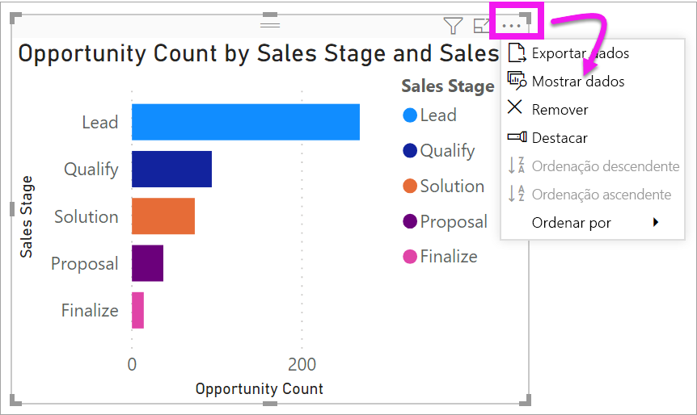
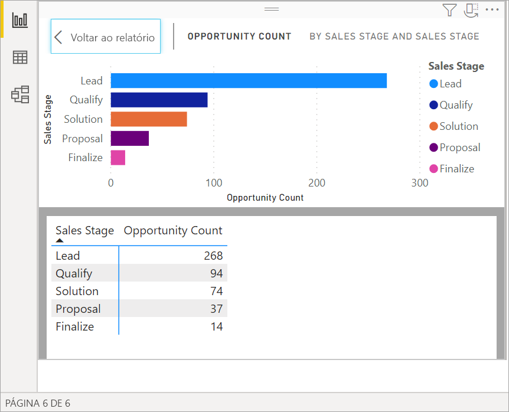
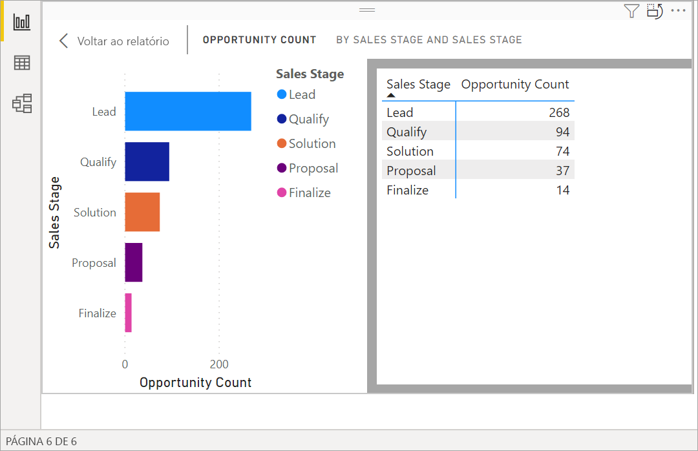
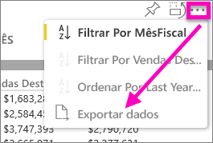
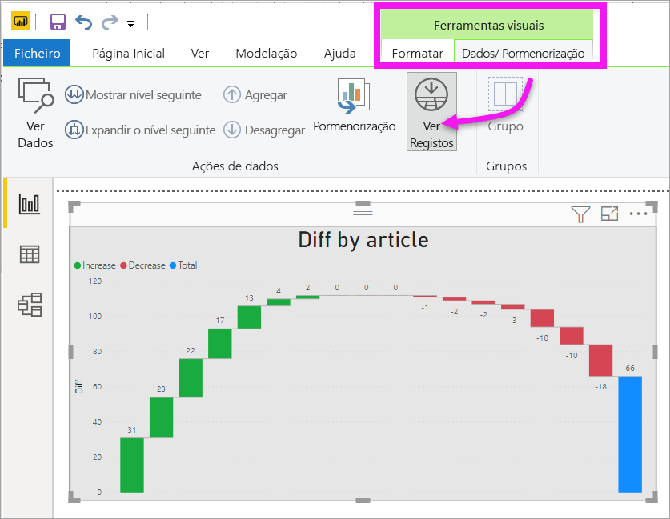
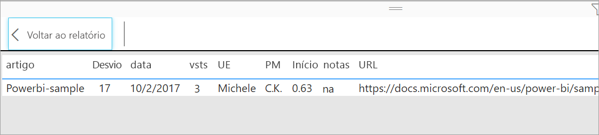

# Apresentar dados subjacentes de uma visualização

## Mostrar dados
Uma visualização do Power BI é construída com dados dos conjuntos de dados. Se estiver interessado em conhecer os bastidores, o Power BI permite-lhe *apresentar* os dados que estão a ser utilizados para criar o elemento visual. Quando seleciona **Mostrar Dados**, o Power BI apresenta os dados por baixo da visualização (ou junto da mesma).

Também pode exportar os dados que estão a ser utilizados para criar a visualização como um ficheiro .xlsx ou .csv e visualizá-los no Excel. Para obter mais informações, veja [Exportar dados de visualizações do Power BI](power-bi-visualization-export-data.md).

> [!NOTE]
> *Mostrar Dados* e *Exportar Dados* estão disponíveis no serviço Power BI e no Power BI Desktop. No entanto, o Power BI Desktop fornece uma camada adicional de detalhe; [*Mostrar Registos* apresenta as linhas atuais do conjunto de dados](../desktop-see-data-see-records.md).
> 
> 

## Utilizar *Mostrar Dados* 
1. No Power BI Desktop, selecione a visualização para ativá-la.

2. Selecione **Mais ações** (...) e escolha **Mostrar dados**. 
    

3. Por predefinição, os dados são apresentados por baixo do elemento visual.
   
   

4. Para alterar a orientação, selecione o esquema vertical  no canto superior direito da visualização.
   
   
5. Para exportar os dados para um ficheiro .csv, selecione as reticências e escolha **Exportar dados**.
   
    
   
    Para obter mais informações sobre como exportar dados para o Excel, veja [Exportar dados de visualizações do Power BI](power-bi-visualization-export-data.md).
6. Para ocultar os dados, anule a seleção **Explorar** > **mostrar dados**.

## Utilizar Mostrar registos
Também pode concentrar-se num registo de dados numa visualização e explorar os dados. 

1. Para utilizar a opção **Ver registos**, selecione uma visualização para ativá-la. 

2. No friso de Ambiente de trabalho, selecione o separador de **Ferramentas visuais** > **Dados/Pormenorização** > **Ver registos**. 

    

3. Selecione um ponto de dados ou linha na visualização. Neste exemplo, selecionámos a quarta coluna a contar da esquerda. O Power BI mostra-nos o registo do conjunto de dados deste ponto de dados.

    

4. Selecione **Voltar ao relatório** para regressar à tela de relatório do Ambiente de trabalho. 

## Considerações e resolução de problemas

- Se o botão **Ver registos** no friso estiver desativado e indisponível, significa que a visualização selecionada não suporta a opção Ver Registos.
- Não pode alterar os dados na vista Ver Registos e guardá-los novamente no relatório.
- Não pode utilizar Ver Registos quando o elemento visual utiliza uma medida calculada.
- Não pode utilizar Ver Registos quando estiver ligado a um modelo multidimensional (MD).  

## Próximas etapas
[Exportar dados de visualizações do Power BI](power-bi-visualization-export-data.md)    

Mais perguntas? [Pergunte à Comunidade do Power BI](https://community.powerbi.com/)

