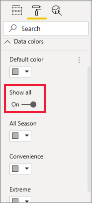

# Sugestões e truques para formatação em relatórios

[!INCLUDE[consumer-appliesto-nyyn](../includes/consumer-appliesto-nyyn.md)]    

O Power BI fornece diversas maneiras de personalizar os seus relatórios. Este artigo detalha uma coleção de dicas que podem tornar suas visualizações do Power BI mais convincentes, interessantes e personalizadas para suas necessidades.

As dicas a seguir são fornecidas. Há outra dica excelente? Excelente! Envie para nós e vermos sobre adicioná-la à lista.

* Aplicar um tema ao relatório inteiro
* Alterar a cor de um único ponto de dados
* Formatação condicional
* Basear as cores de um gráfico num valor numérico
* Base da cor de pontos de dados no valor de campo
* Personalizar as cores usadas na escala de cores
* Usar escalas de cores divergentes
* Adicionar cor às linhas da tabela
* Como anular no Power BI

Para realizar alterações, tem de ter permissões de edição no relatório. No Power BI Desktop, abra o relatório na vista **Relatório**. No serviço Power BI, significa abrir o relatório e selecionar **Editar** na barra de menus, conforme mostrado na imagem seguinte.

Quando os painéis **Filtros** e **Visualizações** forem apresentados no lado direito da tela de relatório, está pronto para começar a personalizar. Se os painéis não aparecerem, selecione a seta no canto superior direito para os abrir.

## Aplicar um tema
Com os temas de relatório, pode aplicar alterações de design a todo o relatório, como utilizar cores da empresa, alterar conjuntos de ícones ou aplicar uma nova formatação visual predefinida. Quando aplica um tema de relatório, todos os elementos visuais no relatório utilizam as cores e a formatação do tema selecionado. Para saber mais, veja [Utilizar temas de relatório](../create-reports/desktop-report-themes.md)

Aqui, aplicámos o tema **Inovar** ao relatório de Vendas e Marketing.

## Alterar a cor de um único ponto de dados
Às vezes deseja destacar um determinado ponto de dados. Talvez, o número de vendas do lançamento de um novo produto ou as classificações de qualidade aumentadas depois de lançar um novo programa. Com o Power BI, pode destacar um determinado ponto de dados ao alterar a sua cor.

A seguinte visualização classifica as unidades vendidas por segmento de produto. 

Agora, imagine que quer destacar o segmento **Conveniência** para mostrar o bom desempenho deste segmento totalmente novo através de cores. Eis os passos:

Expanda o cartão **Cores dos dados** e ative o controlo de deslize para **Mostrar tudo**. Isso mostra as cores para cada elemento de dados na visualização. Agora, pode modificar qualquer um dos pontos de dados.

Defina **Conveniência** para cor de laranja. 

Uma vez selecionado, o ponto de dados **Conveniência** fica com uma tonalidade cor de laranja e vai certamente destacar-se.

Mesmo que altere os tipos de visualização e depois os reponha, o Power BI lembrar-se-á da sua seleção e manterá **Conveniência** cor de laranja.

Pode alterar a cor de um ponto de dados para um, vários ou todos os elementos de dados na visualização. Talvez queira que o seu elemento visual reflita as suas cores empresariais: amarelo, verde e azul. 

Há inúmeras coisas que pode fazer com o Power BI Desktop. Na próxima secção, vamos abordar a formatação condicional.

## Formatação condicional para visualizações
As visualizações beneficiam muitas vezes da configuração de cor com base no valor numérico de um campo. Ao fazer isso, pode mostrar um valor diferente de o que é utilizado o tamanho de uma barra e mostrar dois valores num único gráfico. Ou pode utilizar isso para destacar pontos de dados acima (ou abaixo) de um determinado valor – talvez destacando lucratividade baixa.

As seções a seguir demonstram maneiras diferentes de cor de base num valor numérico.

### Base da cor de pontos de dados num valor
Para alterar a cor com base num valor, selecione uma visualização para ativá-la. Abra o painel Formatação ao selecionar o ícone de rolo de pintura e, em seguida, selecionar o cartão **Cores de dados**. Por baixo de **Cor predefinida**, selecione o ícone fx.  

No painel **Cores predefinidas**, utilize os menus pendentes para identificar os campos a utilizar para fins de formatação condicional. Neste exemplo, selecionámos os campos **Números de vendas** > **Total de Unidades** e selecionámos azul-claro para o **Valor mais baixo** e azul-escuro para o **Valor mais alto**. 

Também pode formatar a cor do elemento visual através de um campo que não faça parte do elemento visual. Na imagem seguinte, é utilizado o campo **% de Quota de Mercado Desde o Ano Passado Até à Data**. 

Como pode ver, embora tenhamos vendido mais unidades nos pontos de dados **Productivity** e **Extreme** (as colunas são maiores), **Moderation** possui um valor de **%Market Share SPLY YTD** maior (a coluna tem mais saturação de cor).

### Personalizar as cores usadas na escala de cores
Também pode alterar a forma como os valores mapeiam essas cores. Na imagem a seguir, as cores **mínimo** e **máximo** são definidas como laranja e verde, respectivamente.

Nesta primeira imagem, veja como as barras no gráfico refletem o gradiente mostrado na barra; o valor mais alto é verde, o mais baixo é laranja e cada barra é colorida com um tom do espectro entre verde e laranja.

Agora, vejamos o que acontece se fornecermos valores numéricos nas caixas de valor **Mínimo** e **Máximo**. Selecione **Personalizado** nas caixas de lista pendente para **Mínimo** e **Máximo** e defina **Mínimo** como 3500 e **Máximo** como 6000.

Ao definir esses valores, gradiente não é mais aplicado a valores no gráfico que estão abaixo do **mínimo** ou acima do **máximo**; qualquer barra com um valor acima do valor **máximo** é verde e qualquer barra com um valor baixo do **mínimo** fica em vermelho.

### Usar escalas de cores divergentes
Às vezes, seus dados podem ter uma escala divergente naturalmente. Por exemplo, um intervalo de temperatura tem um centro natural em congelamento de ponto e uma pontuação de rentabilidade tem um ponto intermediário natural (zero).

Para utilizar escalas de cores divergentes, selecione a caixa de seleção **Divergente**. Quando **Divergente** estiver ativado, um seletor de cores adicionais com o nome **Centro** é apresentado conforme a imagem a seguir.

Quando o controle deslizante **Divergente** estiver ativo, pode definir as cores **mínimo**, **máximo** e **centro** separadamente. Na imagem a seguir, **Centro** está definido como 0,2 para **% de Quota de Mercado Desde o Ano Passado Até à Data**, pelo que as barras com valores acima de 0,2 têm uma tonalidade de verde e as barras abaixo têm tons de vermelho.

## Adicionar cor às linhas da tabela
As tabelas e as matrizes oferecem muitas opções para a formatação das cores. 

Uma das formas mais rápidas de aplicar cor a uma tabela ou matriz é abrir o separador Formatação e selecionar **Estilo**.  Na imagem abaixo, selecionamos **Linhas coloridas com cabeçalho a negrito**.

Experimente com outras opções de formatação de cor. Nesta imagem, alterámos a cor de fundo em **Cabeçalhos de coluna** e alterámos a **Cor de fundo** e a **Cor de fundo alternativa** para os **Valores** (linhas).

## Como anular no Power BI
Como muitos outros serviços da Microsoft e o software, o Power BI fornece uma maneira fácil para desfazer o último comando. Por exemplo, vamos dizer que altera a cor de um ponto de dados ou uma série de pontos de dados, e não gosta de cor quando ele for mostrado na visualização. Não se lembra exatamente da cor anterior, mas sabe que deseja voltar àquela cor!

Para **anular** a última ação ou as últimas ações, basta utilizar o atalho Ctrl+Z.

Para eliminar todas as alterações feitas no cartão Formatação, selecione **Reverter para predefinição**.

## Envie-nos o seu feedback
Tem uma dica que gostaria de partilhar? Envie-nos e vamos ver sobre adicionar à lista.

## Próximos passos
[Getting started with color formatting and axis properties](service-getting-started-with-color-formatting-and-axis-properties.md) (Introdução às propriedades de eixo e formatação de cor)

[Partilhar relatórios](../collaborate-share/service-share-reports.md).

