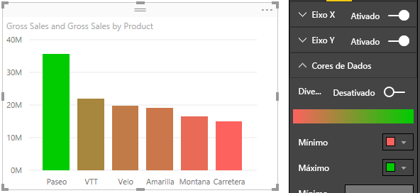

# Dicas e truques para formatação com cores no Power BI
O Power BI fornece diversas maneiras de personalizar os painéis e relatórios. Este artigo detalha uma coleção de dicas que podem tornar suas visualizações do Power BI mais convincentes, interessantes e personalizadas para suas necessidades.

As dicas a seguir são fornecidas. Há outra dica excelente? Ótimo! Envie para nós e vermos sobre adicioná-la à lista.

* Alterar a cor de um único ponto de dados
* Basear as cores de um gráfico num valor numérico
* Base da cor de pontos de dados no valor de campo
* Personalizar as cores usadas na escala de cores
* Usar escalas de cores divergentes
* Como anular no Power BI

Para fazer alterações, tem de editar um relatório. Abra o relatório e selecione **Editar Relatório** na área de menu superior, conforme mostrado na imagem seguinte.

Quando o painel **Visualizações** é mostrado no lado direito do ecrã **Relatório**, está pronto para começar a personalizar. Se o painel não aparecer, selecione a seta, no canto superior direito, para o abrir.

## Alterar a cor de um único ponto de dados
Às vezes deseja destacar um determinado ponto de dados. Talvez seja os números de vendas para o lançamento de um novo produto, ou pontuações de qualidade aumentadas depois de lançar um novo programa. Com o Power BI, pode destacar um determinado ponto de dados ao alterar a sua cor.

A seguinte visualização classifica as unidades vendidas por segmento de produto. 

Agora, imagine que quer destacar o segmento **Conveniência** para mostrar o bom desempenho deste segmento totalmente novo através de cores. Eis os passos:

Expanda a secção **Cores de Dados** e ative o controlo de deslize para **Mostrar tudo**. Isso mostra as cores para cada elemento de dados na visualização. Ao deslocar por cima dos os pontos de dados, a rolagem é ativada para que possa modificar qualquer ponto de dados.

Defina **Conveniência** para cor de laranja. 

Uma vez selecionado, o ponto de dados **Conveniência** fica com uma tonalidade cor de laranja e vai certamente destacar-se.

Mesmo que altere os tipos de visualização e depois os reponha, o Power BI lembrar-se-á da sua seleção e manterá **Conveniência** cor de laranja.

Pode alterar a cor de um ponto de dados para um, vários ou todos os elementos de dados na visualização. Talvez queira que o seu elemento visual imite as suas cores empresariais. 

Há inúmeras coisas que pode fazer com o Power BI Desktop. Na próxima secção, vamos dar uma olhada em gradientes.

## Basear as cores de um gráfico num valor numérico
Os gráficos muitas vezes se beneficiam de configurar a cor com base no valor numérico de um campo. Ao fazer isso, pode mostrar um valor diferente para que é utilizado o tamanho de uma barra e mostrar dois valores num único gráfico. Ou pode utilizar isso para destacar pontos de dados acima (ou abaixo) de um determinado valor – talvez destacando lucratividade baixa.

As seções a seguir demonstram maneiras diferentes de cor de base num valor numérico.

## Base da cor de pontos de dados num valor
Para alterar a cor com base num valor, arraste o campo no qual pretende basear a cor para a área **Saturação de Cor** no painel **Campo**. Na imagem a seguir, **%Quota de Mercado do Stock Até à Data** foi arrastada para **Saturação de Cor**. 

No painel de formatação, em **Cores de dados**, determine como o valor de **%Quota de Mercado do Stock Até à Data** vai alterar a cor e o sombreado no gráfico de colunas. Neste exemplo, uma %Quota de Mercado inferior será apresentada num azul mais claro e os valores mais altos serão apresentados num azul mais escuro.

Como podemos ver, embora tenhamos vendido mais unidades nos pontos de dados **Produtividade** e **Extremo** (as colunas são maiores), **Moderação** possui uma **%Quota de Mercado do Stock Até à Data** maior (a coluna tem mais saturação de cor).

## Personalizar as cores usadas na escala de cores
Pode personalizar as cores usadas na escala de cores. Por predefinição, o valor mais baixo nos seus dados é mapeado para a cor menos saturada e o valor mais alto para a cor mais saturada. Na imagem acima, utilizámos um gradiente de azul. 

Expanda as **Cores de dados** e verá um gradiente de cores usado para visualizar seus dados. O intervalo de cores é mostrado na barra de gradiente que mostra o espectro entre os valores de cor **mínimo** e **máximo**, com a cor de valoro **mínimo** à esquerda, e **máximo** valor de cor para a direita.

Para alterar o dimensionamento para utilizar um intervalo diferente de cores, selecione a lista suspensa ao lado da cor **mínimo** ou **máximo**, e selecione uma cor. A imagem a seguir mostra a cor **Máxima** alterada para preto e a barra de gradientes mostra o novo espectro de cores entre **Mínimo** e **Máximo**.

Também pode alterar a forma como os valores mapeiam essas cores. Na imagem a seguir, as cores **mínimo** e **máximo** são definidas como laranja e verde, respectivamente.

Nesta primeira imagem, veja como as barras no gráfico refletem o gradiente mostrado na barra; o valor mais alto é verde, o mais baixo é laranja e cada barra é colorida com um tom do espectro entre verde e laranja.

Agora, vejamos o que acontece se podemos fornecer valores numéricos nas caixas **mínimo** e **máximo** , que estão abaixo do valor dos seletores de cor **mínimo** e **máximo** (mostrados na imagem a seguir). Vamos definir o **Mínimo** para 20 000 000 e o **Máximo** para 20 000 001.

Ao definir esses valores, gradiente não é mais aplicado a valores no gráfico que estão abaixo do **mínimo** ou acima do **máximo**; qualquer barra com um valor acima do valor **máximo** é verde e qualquer barra com um valor baixo do **mínimo** fica em vermelho.

## Usar escalas de cores divergentes
Às vezes, seus dados podem ter uma escala divergente naturalmente. Por exemplo, um intervalo de temperatura tem um centro natural em congelamento de ponto e uma pontuação de rentabilidade tem um ponto intermediário natural (zero).

Para utilizar escalas de cores divergentes, deslize o controle deslizante **Divergente** para **Ativado**. Quando **Divergente** estiver ativado, um seletor de cores adicionais e caixa de valor, ambos com o nome **Centro**, mostrado conforme a imagem a seguir.

Quando o controle deslizante **Divergente** estiver ativo, pode definir as cores **mínimo**, **máximo** e **centro** separadamente. Na imagem a seguir, **Centro** está definido como um, então barras com valores acima de uma são uma gradiente tonalidade de verde e barras abaixo são tons de vermelho.

## Como anular no Power BI
Como muitos outros serviços da Microsoft e o software, o Power BI fornece uma maneira fácil para desfazer o último comando. Por exemplo, vamos dizer que altera a cor de um ponto de dados ou uma série de pontos de dados, e não gosta de cor quando ele for mostrado na visualização. Não se lembra exatamente da cor anterior, mas sabe que deseja voltar àquela cor!

Para **Desfazer** a última ação ou as últimas ações, o que precisa de fazer é:

- Escreva CTRL + Z

## Comentários
Tem uma dica que gostaria de partilhar? Envie-nos e vamos ver sobre adicionar à lista.

>[!NOTE]
>Essas personalizações de cor e eixo disponíveis quando o ícone **Formato** é selecionado também estão disponíveis no Power BI Desktop.

## Próximos passos
[Getting started with color formatting and axis properties](service-getting-started-with-color-formatting-and-axis-properties.md) (Introdução às propriedades de eixo e formatação de cor)

