# Distribuir o conteúdo do Power BI para utilizadores convidados externos com o Azure Active Directory B2B

**Resumo:** Este é um documento técnico que descreva como distribuir conteúdo para utilizadores fora da organização através da integração do Azure Active Directory empresa-empresa (B2B do Azure AD).

**Gravadores:** Lukasz Pawlowski, Kasper de Jonge

**Revisores Técnicos:** ADAM Wilson, Sheng Liu, Qian Liang, Sergei Gundorov, Jacob Grimm, Adam Saxton, Maya Shenhav, Nimrod Shalit, Elisabeth Olson

> [!NOTE]
> Pode guardar ou imprimir este documento técnico ao selecionar **Imprimir** no seu browser e, em seguida, ao selecionar **Guardar como PDF**.

## Introdução

O Power BI dá às organizações uma visão de 360 graus de sua empresa e permite todos os utilizadores nessas organizações para tomar decisões inteligentes com dados. Muitas dessas organizações têm relações fidedignas e seguras com parceiros externos, os clientes e prestadores de serviço. Essas organizações tem de fornecer acesso seguro aos dashboards do Power BI e relatórios para utilizadores nestes parceiros externos.

Power BI está integrado com [do Azure Active Directory empresa-empresa (Azure AD B2B)](https://docs.microsoft.com/azure/active-directory/b2b/what-is-b2b) para permitir uma distribuição segura do Power BI conteúdo para utilizadores convidados fora da organização – e, embora ainda manter o controlo e que regem o acesso a dados internos.

Este white paper aborda os todos os detalhes que precisa para compreender a integração do Power BI com o Azure Active Directory B2B. Vamos abordar o caso de uso mais comum, a configuração, licenciamento e segurança ao nível da linha.

> [!NOTE]
> Em todo este white paper, fazemos referência do Azure Active Directory como o Azure AD e o Azure Active Directory para empresas como o Azure AD B2B.

## Cenários

Contoso é um fabricante automóvel e funciona com muitos fornecedores variados que fornecem-lhe todos os componentes, materiais e serviços necessários para executar suas operações de fabricação. A Contoso pretende otimizar seu logística de cadeia de Suprimentos e os planos para utilizar o Power BI para monitorizar as métricas de chave de desempenho da sua cadeia de fornecimento. Contoso quer partilhar com a análise de parceiros de cadeia de fornecimento externo de uma forma segura e gerenciável.

Contoso pode ativar as seguintes experiências para os utilizadores externos com o Power BI e do Azure AD B2B.

### Ad hoc por item de partilha

Contoso funciona com um fornecedor que cria radiators para carros da Contoso. Com frequência, precisam de otimizar a confiabilidade de radiators utilizando dados de todos os carros da Contoso. Um analista da Contoso utiliza o Power BI para partilhar um relatório de confiabilidade radiator com um engenheiro de fornecedor. O engenheiro recebe um e-mail com uma ligação para ver o relatório.

Conforme descrito acima, esta partilha ad-hoc é efetuada por utilizadores empresariais de forma conforme necessário. A ligação enviada pelo Power BI para o utilizador externo é uma ligação de convite do Azure AD B2B. Quando o utilizador externo abre a ligação, é-lhes pedido para aderir a organização do Azure AD da Contoso como um utilizador convidado. Depois do convite for aceita, o link é aberto o dashboard ou relatório específico. O administrador do Azure Active Directory delega a permissão para convidar utilizadores externos à organização e escolhe o que os utilizadores podem fazer uma vez que aceite o convite, conforme descrito na secção de governação deste documento. O analista de Contoso pode convidar o utilizador convidado apenas uma vez que o administrador do Azure AD permitido essa ação e o Power BI administrador permitida aos usuários para convidar convidados para ver o conteúdo nas definições de inquilino do Power BI.

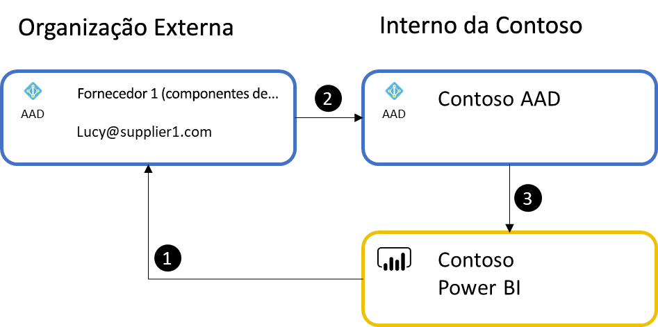

1. O processo começa com um utilizador interno de Contoso partilhar um dashboard ou um relatório com um utilizador externo. Se o utilizador externo não é já um convidado no Azure da Contoso AD, eles estão convidados. É enviado um e-mail para o respetivo endereço de e-mail que inclui um convite para o Azure da Contoso AD
2. O destinatário aceita o convite para a Contoso do Azure AD e é adicionado como um utilizador convidado no Azure da Contoso AD.
3. O destinatário, em seguida, é redirecionado para o dashboard, relatório ou aplicação, que são só de leitura para o utilizador do Power BI.

O processo é considerado ad-hoc, uma vez que os utilizadores empresariais na Contoso executam a ação de convite, conforme necessário para fins de seus negócios. Cada item partilhado é uma ligação única pode aceder o utilizador externo para ver o conteúdo.

Depois do utilizador externo foi convidado para aceder aos recursos da Contoso, pode ser criada uma conta de cópias de sombra para os mesmos no Contoso AD do Azure e não terão de ser novamente convidado.  Na primeira vez que tentarem aceder um recurso de Contoso como um dashboard do Power BI, passam por um processo de consentimento, que redeems o convite.  Se não concluírem o consentimento, eles não é possível aceder a qualquer conteúdo da Contoso.  Se tiver problemas a resgatar o seu convite através da ligação original fornecida, o administrador do Azure AD pode reenviar uma ligação de convite específicos para os mesmos resgatar.

### Planejado por item de partilha

Contoso funciona com um subcontratante para executar a análise de confiabilidade de radiators. O subcontratante tem uma equipa de 10 pessoas que necessitam de aceder aos dados no ambiente do Power BI da Contoso. O administrador da Contoso do Azure AD está envolvido para convidar todos os utilizadores e para lidar com as adições/alterações como pessoal, a alteração do subcontratante. O administrador do AD do Azure cria um grupo de segurança para todos os funcionários de que o subcontratante. Utilizar o grupo de segurança, funcionários da Contoso podem facilmente gerir o acesso a relatórios e certifique-se de que todo o pessoal de subcontratante necessário ter acesso a todos os relatórios necessários, dashboards e aplicações do Power BI. O administrador do Azure AD também pode evitar o envolvimento no processo de convite completamente escolhendo delegar direitos de convite para um funcionário confiável na Contoso, ou no subcontratante para garantir que o pessoal de atempada gestão.

Algumas organizações precisam de mais controlo sobre quando são adicionados utilizadores externos, convidando muitos usuários numa organização externa ou muitas organizações externas. Nestes casos, a partilha planeada pode servir para gerir o dimensionamento de compartilhamento, impor políticas organizacionais e até mesmo delegar direitos a pessoas fidedignas para convidar e gerir utilizadores externos. O Azure AD B2B oferece suporte a convites planeados para serem enviados diretamente [do portal do Azure por um administrador de TI](https://docs.microsoft.com/azure/active-directory/b2b/add-users-administrator), ou através de [PowerShell utilizando o Gestor de convite API](https://docs.microsoft.com/azure/active-directory/b2b/customize-invitation-api) onde um conjunto de utilizadores pode ser convidado em um ação. Usar o planeada convida abordagem, a organização pode controlar quem pode convidar utilizadores e implementar processos de aprovação. Avançadas capacidades do Azure AD, como grupos dinâmicos podem tirar fácil de manter a associação de grupo de segurança automaticamente.

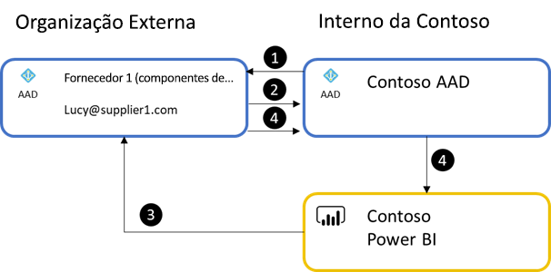

1. As estrelas de processo com um administrador de TI convidar o utilizador convidado manualmente ou por meio da API fornecido pelo Azure Active Directory
2. O utilizador aceitar o convite para a organização.
3. Depois do utilizador aceitar o convite, um utilizador no Power BI pode partilhar com o utilizador externo ou um grupo de segurança estão num relatório ou dashboard. Assim como com a partilha regulares no Power BI o utilizador externo recebe uma mensagem de e-mail com a ligação para o item.
4. Quando os acessos de utilizador externo no link, a autenticação em seu diretório é passado para a Contoso do Azure AD e usados para obter acesso ao conteúdo do Power BI.

### Ad hoc ou planeada de partilha de aplicações do Power BI

Contoso tem um conjunto de relatórios e dashboards que precisam de partilhar com um ou mais fornecedores. Para garantir que todos os utilizadores externos necessários tenham acesso a este conteúdo, é empacotado como uma aplicação do Power BI. Os utilizadores externos são adicionados ou diretamente para a lista de acesso de aplicação ou através de grupos de segurança. Alguém na Contoso, em seguida, envia o URL da aplicação para todos os utilizadores externos, por exemplo, num e-mail. Quando os utilizadores externos abrem a ligação, veem todo o conteúdo num único fácil navegar pela experiência.

Utilização de uma aplicação do Power BI torna mais fácil para a Contoso criar um Portal de BI para os seus fornecedores. Uma lista de acesso único controla o acesso a todo o conteúdo necessário reduzir o desperdício de tempo a verificação e definir as permissões ao nível do item. O Azure AD B2B mantém o acesso de segurança utilizando a identidade do fornecedor de nativa para que os usuários não precisam de credenciais de início de sessão adicionais. Se utilizar planeada convida com grupos de segurança, gestão de acesso à aplicação como pessoal girar para dentro ou fora do projeto é simplificada. Grupos de associação em segurança manualmente ou utilizando [grupos dinâmicos](https://docs.microsoft.com/azure/active-directory/b2b/use-dynamic-groups), para que todos os utilizadores externos a partir de um fornecedor são adicionados automaticamente ao grupo de segurança adequados.

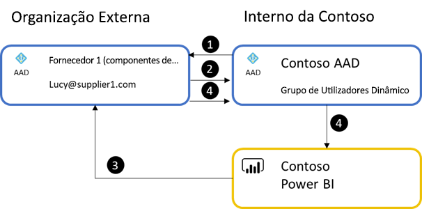

1. O processo é iniciado pelo utilizador que está a ser convidado a organização do Azure AD da Contoso através do portal do Azure ou o PowerShell
2. O usuário pode ser adicionado a um grupo de utilizadores no Azure AD. Um grupo de utilizadores estático ou dinâmico pode ser utilizado, mas os grupos dinâmicos ajudar a reduzir o trabalho manual.
3. Os utilizadores externos quais são dado acesso para a aplicação do Power BI através do grupo de utilizador. A aplicação de URL deve ser enviada diretamente para o utilizador externo ou colocada num site quais têm acesso. O Power BI faz um melhor esforço para enviar um e-mail com a ligação de aplicação para utilizadores externos, mas ao usar os grupos de utilizadores cuja associação pode alterar, o Power BI não é capaz de enviar a todos os utilizadores externos geridos através de grupos de utilizadores.
4. Quando o utilizador externo acede a URL da aplicação do Power BI, são autenticados pelo Azure da Contoso AD, a aplicação está instalada para o utilizador e o utilizador pode ver todos os relatórios contidos e dashboards na aplicação.

As aplicações também têm um recurso exclusivo, que permite que os autores de aplicações instalar a aplicação automaticamente para o utilizador, para que esteja disponível quando o utilizador inicia sessão. Esta funcionalidade só instala automaticamente para utilizadores externos que já fazem parte da organização da Contoso no momento, a aplicação é publicada ou atualizada. Assim, ele é melhor quando usado com a abordagem de convites planeados e depende a aplicação que está a ser publicadas ou atualizadas depois dos utilizadores são adicionados à Azure da Contoso AD. Utilizadores externos podem sempre instalar a aplicação através da ligação de aplicação.

### Comentários e subscrever o conteúdo entre organizações

Como Contoso continua a trabalhar com os respetivos subcontratados ou os fornecedores, os engenheiros externos tem de trabalhar em conjunto com analistas da Contoso. O Power BI fornece várias funcionalidades de colaboração que ajudam os usuários a se comunicar sobre o conteúdo que podem consumir. Comentários do dashboard (e comentários de relatório em breve) permite aos utilizadores discutir pontos de dados, eles ver e comunicam com os autores do relatório para fazer perguntas.

Atualmente, os utilizadores convidados externos podem participar de comentários deixar comentários e lendo as respostas. No entanto, ao contrário de usuários internos, os utilizadores convidados não podem ser @mentioned e não recebem notificações que recebi um comentário. Os utilizadores convidados não é possível utilizar a funcionalidade de subscrições no Power BI no momento da escrita. Numa versão futura, serão elevadas a essas restrições e o utilizador convidado irá receber um e-mail quando um comentário @mentions -los, ou quando uma subscrição é entregue ao respetivo e-mail que contém uma ligação para o conteúdo no Power BI.

### Acesso a conteúdo nas aplicações móveis do Power BI

Numa versão futura, quando os usuários da Contoso partilham relatórios ou dashboards com suas contrapartes de convidado externos, o Power BI irá enviar um e-mail a notificar o convidado. Quando o utilizador convidado é aberta a ligação para o relatório ou dashboard no seu dispositivo móvel, o conteúdo abrirá nas aplicações móveis do Power BI nativas no respetivo dispositivo, se estiver instalados. O utilizador convidado, em seguida, poderá navegar entre conteúdos partilhados com eles no inquilino externo e para seus próprios conteúdos do seu inquilino principal.

> [!NOTE]
> O utilizador convidado não é possível abrir a aplicação móvel do Power BI e navegue imediatamente para o inquilino externo, tem de começar com uma ligação para um item no inquilino externo. Soluções alternativas comuns são descritas a [distribuição ligações para conteúdo no Power BI da organização principal](#distributing-links-to-content-in-the-parent-organizations-power-bi) seção mais adiante neste documento.

### Edição entre organizações e gestão de conteúdos do Power BI

Contoso e respetivos fornecedores e subcontratados trabalham juntos cada vez mais de perto. Muitas vezes, um analista no suporte a subcontratante tem visualizações de dados de métricas ou adicionais para ser adicionado a um relatório que Contoso partilhou com eles. Os dados devem residir no inquilino do Power BI da Contoso, mas os utilizadores externos devem poder editá-lo, criar novos conteúdos e distribuí-la até mesmo pessoas apropriadas.

O Power BI fornece uma opção que permite **utilizadores convidados externos podem editar e gerir conteúdos** na organização. Por predefinição, os utilizadores externos tenham uma experiência de consumo e orientados a só de leitura. No entanto, esta nova definição permite que o administrador do Power BI escolher que utilizadores externos podem editar e gerir conteúdo em sua própria organização. Assim que o permitido, o utilizador externo pode editar relatórios, dashboards, publicar ou atualizar aplicações, trabalhar em áreas de trabalho e ligar aos dados que têm permissão para utilizar.

Este cenário é descrito detalhadamente nos utilizadores externos de ativação de seção para editar e gerir conteúdos no Power BI mais adiante neste documento.

## Relações organizacionais com o Power BI e do Azure AD B2B

Quando todos os utilizadores do Power BI são internos para a organização, não é necessário utilizar o Azure AD B2B. No entanto, uma vez que as organizações de duas ou mais querem colaborar em dados e informações, suporte do Power BI para o Azure AD B2B torna fácil e económica para fazer isso.

Seguem-se normalmente encontradas estruturas organizacionais que são adequadas para colaboração entre organizações de estilo de B2B do Azure AD no Power BI. O Azure AD B2B funciona bem na maioria dos casos, mas em algumas situações o comum abordagens alternativas abordadas no final deste documento são a pena considerar.

### Caso 1: Colaboração direta entre as organizações

Relação da Contoso com o seu fornecedor de radiator é um exemplo de colaboração direta entre as organizações. Uma vez que há relativamente poucos utilizadores na Contoso e o fornecedor que necessitam de aceder a informações de confiabilidade radiator, com o Azure AD B2B baseia partilha externa é ideal. É fácil de usar e simples de administrar. Isso também é um padrão comum nos serviços de consultoria em que o consultor poderá ter de criar conteúdo para uma organização.

Normalmente, esta partilha ocorre com o Ad hoc inicialmente por item de partilha. No entanto, à medida que as equipes de aumentam ou relações aprofundar, planeado por item de partilha abordagem torna-se o método preferencial para reduzir a sobrecarga de gerenciamento. Além disso, o Ad hoc ou planeada de partilha de aplicações do Power BI, Commenting e subscrever o conteúdo entre organizações, acesso a conteúdo nas aplicações móveis pode entrar no play e entre organizações de edição e o gerenciamento de conteúdo do Power BI. Importante é que, se os utilizadores ambas as organizações tiverem licenças do Power BI Pro em suas respectivas empresas, podem utilizar essas licenças Pro em ambientes de Power BI uns dos outros. Esta opção fornece licenciamento vantajoso, uma vez que a organização que o convidou não poderá ter de pagar por uma licença do Power BI Pro para os utilizadores externos. Isso será discutido mais detalhadamente na seção licenciamento, mais adiante neste documento.

### Caso 2: Principal e suas subsidiárias ou filiais

Algumas estruturas de organização são mais complexas, incluindo pertencentes à empresa parcial ou totalmente subsidiárias, afiliadas ou relações de fornecedor de serviço gerido. Essas organizações têm uma organização de principal como uma holding, mas as organizações subjacentes operam ponto e forma autónoma, algumas vezes com diferentes requisitos regionais. Isso nos leva a cada organização ter seu próprio ambiente do Azure AD e inquilinos do Power BI separados.

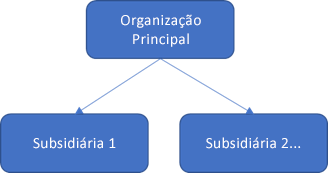

Nesta estrutura, a organização de principal, normalmente, tem de distribuir informações padronizadas para suas subsidiárias. Normalmente, esta partilha ocorre com o compartilhamento Ad hoc ou planeada da abordagem de aplicações do Power BI, conforme ilustrado na imagem seguinte, uma vez que permite a distribuição do conteúdo autoritativa padronizado para públicos-alvo amplo. Na prática, é utilizada uma combinação de todos os cenários mencionadas anteriormente neste documento.

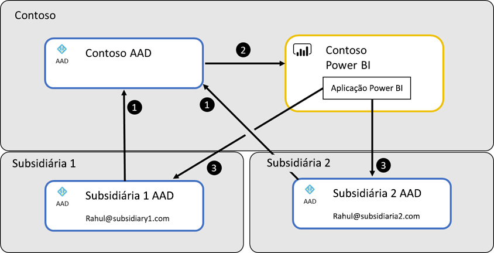

Isso segue o seguinte processo:

1. Os utilizadores de cada subsidiária estão convidados a Azure da Contoso AD
2. Em seguida, a aplicação Power BI é publicada para dar acesso a estes utilizadores para os dados necessários
3. Por fim, os utilizadores abram a aplicação através de uma ligação que já foi concedidas para ver os relatórios

Vários desafios importantes são enfrentados pelas organizações nesta estrutura:

- Como distribuir ligações para conteúdo no Power BI da organização principal
- Como permitir que os utilizadores da subsidiária fornecido aceder à origem de dados alojada pela organização principal

#### Distribuição de ligações para conteúdo no Power BI da organização principal

Três abordagens são frequentemente utilizadas para distribuir as ligações para o conteúdo. A primeira e a maioria dos basic é para enviar a ligação para a aplicação aos usuários necessários ou colocá-la num site SharePoint Online a partir da qual pode ser aberto. Os utilizadores, em seguida, podem marcar a ligação nos seus browsers para um acesso mais rápido aos dados que precisam.

A segunda abordagem baseia-se na edição de entre organizações e no gerenciamento de capacidade de conteúdos do Power BI. A organização de principal permite aos utilizadores das subsidiárias acessar o Power BI e controla o que eles podem aceder através de permissão. Isso permite o acesso ao Power BI base onde o utilizador a subsidiária vê uma lista abrangente de conteúdos partilhados com eles no inquilino da organização principal. Em seguida, o URL para o ambiente do Power BI as organizações principal é concedido para os utilizadores nos subsidiárias.

A abordagem final utiliza uma aplicação do Power BI criada no inquilino Power BI para cada subsidiária. A aplicação do Power BI inclui um dashboard com [mosaicos configurados com a opção de ligação externa](https://docs.microsoft.com/power-bi/service-dashboard-edit-tile#hyperlink). Quando o usuário pressiona o mosaico, eles são feitos para o relatório adequadas, o dashboard ou a aplicação no Power BI da organização principal. Esta abordagem tem a vantagem adicional de que a aplicação pode ser instalada automaticamente para todos os utilizadores a subsidiária e está disponível aos mesmos sempre que iniciam sessão no seu próprio ambiente do Power BI. Outra vantagem dessa abordagem é que ele funciona bem com aplicações móveis do Power BI que podem abrir a ligação de forma nativa. Também pode combinar isso com a segunda abordagem para permitir mais fácil alternar entre ambientes do Power BI.

#### Permitir que os utilizadores da subsidiária fornecido aceder a origens de dados alojadas pela organização principal

Muitas vezes, os analistas numa subsidiária tem de criar seus próprios analytics, utilizando dados fornecidos pela organização principal. Neste caso, origens de dados na cloud são utilizadas para resolver o desafio.

A primeira abordagem tira partido [do Azure Analysis Services](https://docs.microsoft.com/azure/analysis-services/analysis-services-overview) para criar um armazém de dados de nível empresarial que atende às necessidades de analistas entre pai e suas subsidiárias, conforme mostrado na imagem seguinte. Contoso pode alojar os dados e utilizar as capacidades, como a segurança ao nível da linha para garantir que os utilizadores em cada subsidiária pode acessar apenas seus dados. Os analistas em cada organização podem acessar o armazém de dados através do Power BI Desktop e publicar analytics resultante para os respetivos inquilinos do Power BI.

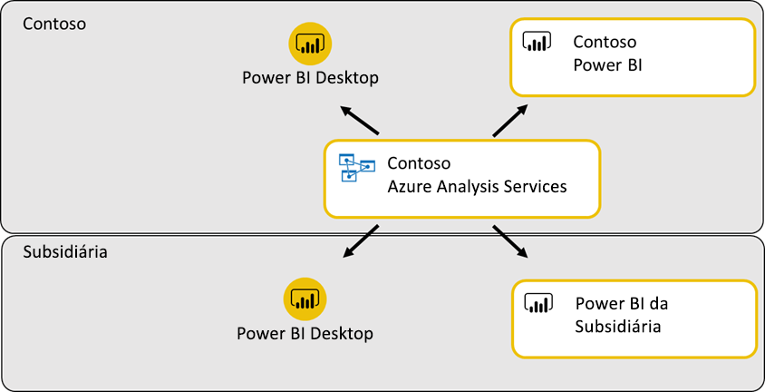

A segunda abordagem tira partido [base de dados do Azure SQL](https://azure.microsoft.com/services/sql-database/) para criar um armazém de dados relacionais para fornecer acesso a dados. Isso funciona de forma semelhante à abordagem do Azure Analysis Services, embora alguns recursos, como a segurança ao nível da linha pode ser mais difícil de implementar e manter em subsidiárias.

Abordagens mais sofisticadas, também são possíveis, no entanto, as anteriores são de longe o mais comuns.

### Caso 3: Ambiente compartilhado entre parceiros

Contoso pode introduzir para uma parceria com um concorrente em conjunto, criar um carro numa linha de montagem partilhada, mas para distribuir o veículo em diferentes marcas ou em regiões diferentes. Isto requer uma extensa colaboração e co-ownership de dados, inteligência e análise entre organizações. Essa estrutura também é comum no setor de serviços de consultoria em que uma equipa de consultores pode fazer análise baseada no projeto para um cliente.

Na prática, essas estruturas complexas, como mostrado na imagem seguinte e exigem que a equipa de manter. Para ser eficaz, esta estrutura baseia-se na edição de entre organizações e no gerenciamento de capacidade de conteúdos do Power BI, uma vez que ele permite que as organizações de reutilizar licenças do Power BI Pro compradas para os respetivos inquilinos do Power BI.

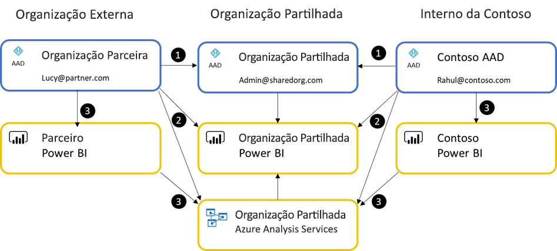

Para estabelecer um inquilino do Power BI partilhado, um Azure Active Directory tem de ser criada e pelo menos uma conta de utilizador do Power BI Pro tem de ser adquirido de um utilizador que do Active Directory. Este utilizador convida os utilizadores necessários para a organização partilhado. Importante é que, neste cenário, os utilizadores da Contoso são tratados como utilizadores externos quando as mesmas operem dentro Power BI da organização partilhado.

O processo é o seguinte:

1. A organização partilhado é estabelecida como um novo do Azure Active Directory e, pelo menos, uma conta de utilizador é criada na nova organização. Que o utilizador deve ter uma licença do Power BI Pro atribuída.
2. Este utilizador, em seguida, estabelece um inquilino do Power BI e convida os utilizadores necessários da Contoso e a organização do parceiro. O utilizador estabelece também quaisquer recursos de dados partilhada, como o Azure Analysis Services. Contoso e os utilizadores o parceiro podem aceder Power BI a organização partilhada como os utilizadores convidados. Se a permissão para editar e gerir conteúdos no Power BI os utilizadores externos podem utilizar o Power BI principal, utilizar espaços de trabalho, carregamento ou editar conteúdo e partilhar relatórios. Normalmente, todos os recursos partilhados são armazenados e acedidos a partir da organização partilhada.
3. Dependendo de como as partes concordam colaborar, é possível para cada organização desenvolver seus próprios dados proprietários e análise com recursos de armazém de dados partilhado. Pode distribuir aqueles para seus respectivos usuários internos com os respetivos inquilinos do Power BI internos.

### Caso 4: Distribuição para centenas ou milhares de parceiros externos

Agora, enquanto a Contoso criou um relatório de confiabilidade de radiator para um fornecedor, o Contoso deseja criar um conjunto de relatórios padronizados para centenas de fornecedores. Isso permite que a Contoso garantir que todos os fornecedores tenham a análises que precisam para fazer melhorias ou para corrigir os defeitos de fabrico.

Quando uma organização tem de distribuir dados padronizados e informações para muitos usuários/organizações externas, podem utilizar a partilha Ad hoc ou planeada de cenário de aplicações do Power BI para criar um Portal de BI rapidamente e sem os custos de desenvolvimento abrangente. O processo para criar um portal de utilização de uma aplicação do Power BI trata o caso prático: Criação de um Portal de BI com o Power BI + do Azure AD B2B – passo a passo instruções mais adiante neste documento.

Uma variante comum de neste caso é quando uma organização está a tentar partilhar informações com os consumidores, especialmente quando quiser para utilizar o Azure B2C com o Power BI. Power BI não suporta nativamente o Azure B2C. Se estiver a avaliar opções para este caso, considere a utilização alternativo opção 2 nas abordagens alternativas comuns a seção mais adiante neste documento.

## Estudo de caso: Criação de um Portal de BI com o Power BI + do Azure AD B2B – instruções passo a passo

Integração do Power BI com o Azure AD B2B oferece uma forma totalmente integrada, sem preocupações para fornecer os utilizadores convidados com acesso seguro ao seu portal de BI de Contoso. Contoso pode definir isso com três passos:

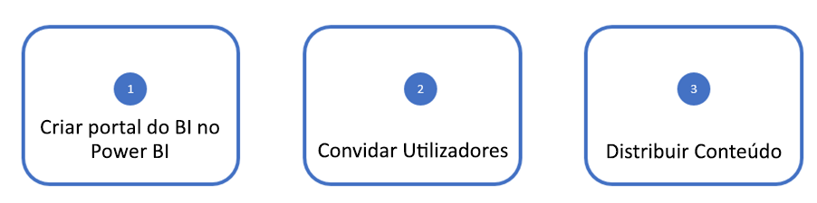

1. Criar portal do BI no Power BI

    A primeira tarefa para a Contoso é criar o seu portal de BI no Power BI. Portal de BI da Contoso consistirá numa coleção dos dashboards e relatórios que estarão disponíveis para muitos usuários internos e convidados. A forma recomendada para o fazer no Power BI é criar uma aplicação do Power BI. Saiba mais sobre [aplicações no Power BI](https://powerbi.microsoft.com/blog/distribute-to-large-audiences-with-power-bi-apps/).

- Equipa de BI da Contoso cria uma área de trabalho de aplicação no Power BI

    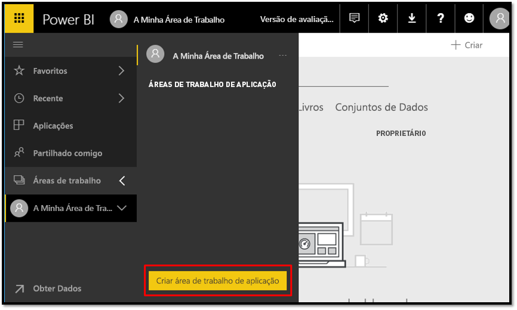
    

- Outros autores são adicionados à área de trabalho

    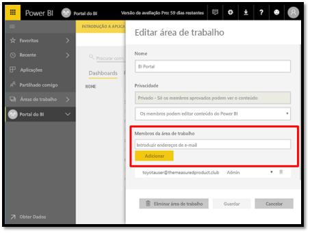

- Conteúdo é criado dentro de área de trabalho

    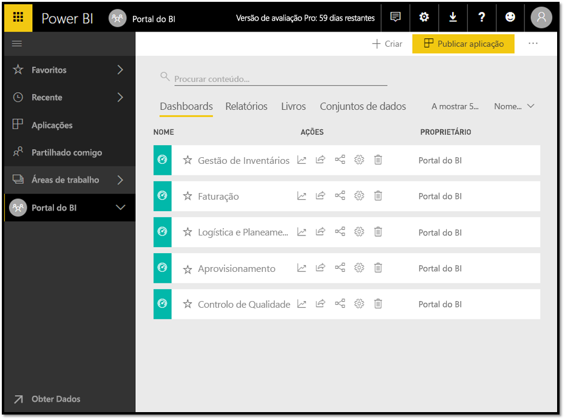

    Agora que o conteúdo é criado numa área de trabalho de aplicação, Contoso está pronta para convidar utilizadores em organizações de parceiros para consumir este conteúdo.

2. Convidar Utilizadores

    Existem duas formas para que Contoso convidar utilizadores ao seu portal de BI no Power BI:

    * Convites planeados
    * Convites ad hoc

    **Convites planeados**

    Nesta abordagem, a Contoso convida os utilizadores convidados para o seu Azure AD antes do tempo e, em seguida, distribui o conteúdo do Power BI aos mesmos. Contoso pode convidar utilizadores do portal do Azure ou através do PowerShell. Eis os passos para convidar utilizadores do portal do Azure:

    - Administrador do Azure AD da Contoso, navega para **portal do Azure > do Azure Active Directory > utilizadores e grupos > todos os utilizadores > novo utilizador convidado**

    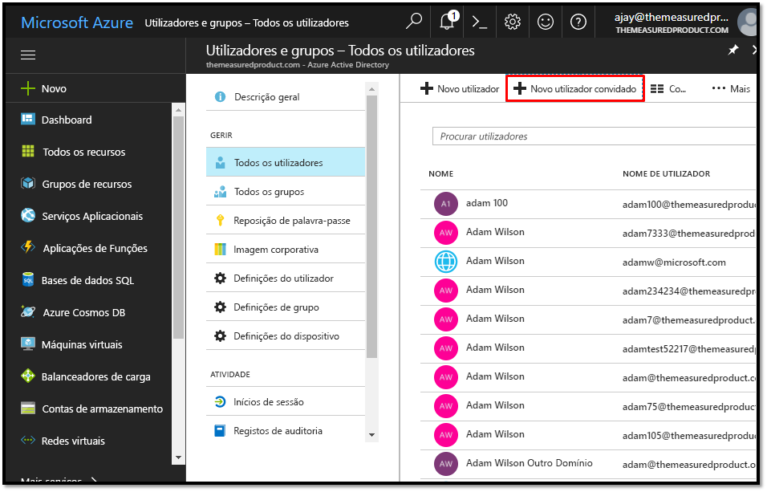

    - Adicionar uma mensagem de convite para os utilizadores convidados e clique em convite

    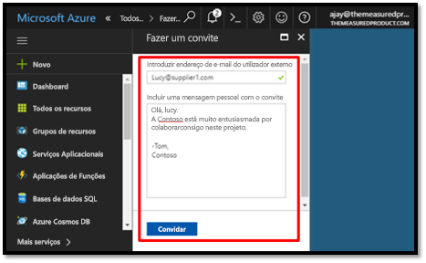

    > [!NOTE]
    > Para convidar utilizadores do portal do Azure, terá da um administrador para o Azure Active Directory do seu inquilino.

    Se a Contoso pretende convidar muitos utilizadores, eles podem fazer por isso, com o PowerShell. Administrador do Azure AD da Contoso armazena os endereços de e-mail de todos os usuários de convidados num arquivo CSV. Seguem-se [código de colaboração do Azure Active Directory B2B e exemplos do PowerShell](https://docs.microsoft.com/azure/active-directory/b2b/code-samples) e instruções.

    Após o convite, os utilizadores convidados recebem um e-mail com a ligação de convite.

    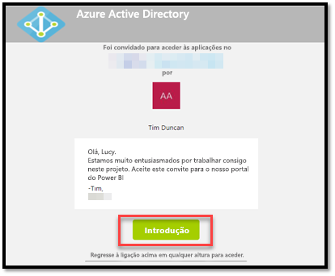

    Assim que os utilizadores convidados clicam na ligação, podem aceder a conteúdo no inquilino Contoso do Azure AD.

    > [!NOTE]
    > É possível alterar o esquema da mensagem de e-mail de convite usando o recurso de imagem corporativa do Azure AD, conforme descrito [aqui](https://docs.microsoft.com/azure/active-directory/active-directory-b2b-invitation-email).

    **Convites ad hoc**

    E se a Contoso não sabe todos os utilizadores de convidado que ele deseja convidá-lo antecipadamente? Ou, e se deseja distribuir conteúdo para utilizadores convidados passando o analista no Contoso que criou o portal de BI? Também é suportada neste cenário no Power BI com convites ad-hoc.

    O analista pode apenas adicionar os utilizadores externos à lista de acesso da aplicação quando eles são publicá-la. Os utilizadores convidados obtém um convite e assim que aceitarem ele, é automaticamente redirecionado para o conteúdo do Power BI.

    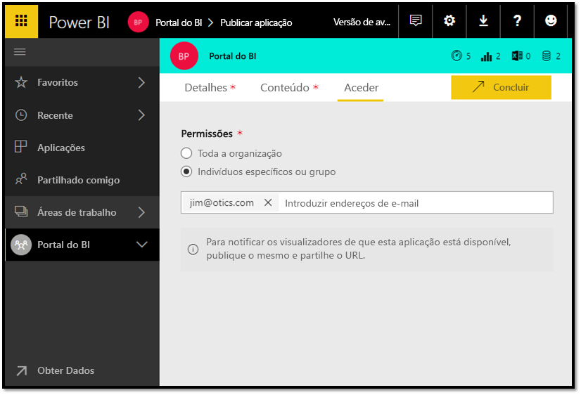

    > [!NOTE]
    > Convites são necessárias apenas na primeira vez em que um utilizador externo for convidado para a sua organização.

3. Distribuir Conteúdo

    Agora que equipa de BI da Contoso tiver criado o portal de BI e utilizadores convidados, eles podem distribuir seu portal para os utilizadores finais ao conceder acesso de utilizadores convidados para a aplicação e publicá-lo. Power BI concluído automaticamente nomes dos utilizadores convidados que foram anteriormente adicionados ao inquilino Contoso. Também podem ser adicionados a convites ad hoc para outros utilizadores convidados neste momento.

    > [!NOTE]
    > Se utilizar grupos de segurança para gerir o acesso à aplicação para utilizadores externos, utilize a abordagem de convites planeados e partilhar a ligação de aplicação diretamente com cada utilizador externo que têm de aceder a ele. Caso contrário, o utilizador externo pode não conseguir instalar ou ver o conteúdo a partir da aplicação. _

    Os utilizadores convidados recebem um e-mail com uma ligação para a aplicação.

    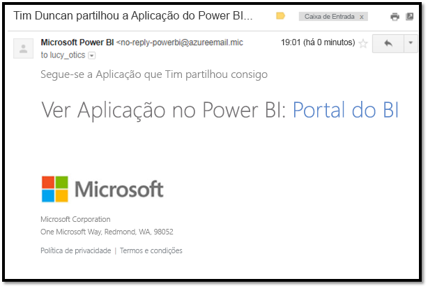

    Ao clicar nesta ligação, os utilizadores convidados são solicitados para autenticar com a identidade de sua própria organização.

    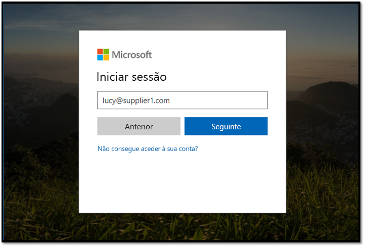

    Depois de eles serem autenticados com êxito, é redirecionado para a aplicação de BI da Contoso.

    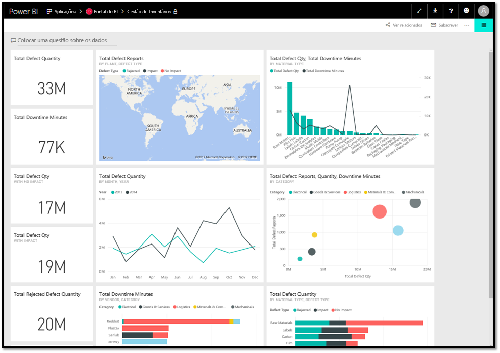

    Os utilizadores convidados, em seguida, podem obter a aplicação da Contoso ao clicar na ligação no e-mail ou a ligação de uso de indicadores. Contoso pode também tornar mais fácil para os utilizadores convidados ao adicionar esta ligação para qualquer portal extranet existente que já utilizam os utilizadores convidados.

4. Próximos passos

    Utilizar uma aplicação do Power BI e do Azure AD B2B, Contoso foi capaz de criar rapidamente um Portal de BI para seus fornecedores de uma forma de sem código. Isso simplificou muito analytics padronizado para todos os fornecedores que precisasse de distribuição.

    Embora o exemplo mostrou como um único relatório comuns pode ser distribuído entre fornecedores, o Power BI pode avançar muito mais. Para garantir que cada parceiro vê apenas os dados relevantes para si próprios, segurança de nível de linha podem ser adicionada facilmente para o modelo de relatório e dados. A segurança de dados para a secção de parceiros externos mais adiante neste documento descreve esse processo em detalhes.

    Individuais, muitas vezes, relatórios e dashboards tem de ser incorporados num portal existente. Pode também fazê-lo a reutilização de muitas das técnicas mostradas no exemplo. No entanto, essas situações pode ser mais fácil incorporar relatórios ou dashboards diretamente a partir de uma área de trabalho. O processo para convidar e atribuir a permissão de segurança para a exigir aos utilizadores permanecem os mesmos.

## Nos bastidores: Como é Lucy de Supplier1 capaz de acessar o conteúdo do Power BI do inquilino da Contoso?

Agora que temos visto como a Contoso é capaz de forma totalmente integrada distribuir o conteúdo do Power BI para utilizadores convidados em organizações de parceiros, vamos ver como isso funciona nos bastidores.

Quando Contoso convidados [ lucy@supplier1.com ](mailto:lucy@supplier1.com) ao seu diretório do Azure AD cria uma ligação entre [ Lucy@supplier1.com ](mailto:Lucy@supplier1.com) e inquilino Contoso do Azure AD. Esta ligação permite que o Azure AD, sabe que Lucy@supplier1.com pode aceder a conteúdo no inquilino Contoso.

Quando tenta aceder à aplicação do Power BI da Contoso Lucy, o AD do Azure verifica se Lucy pode aceder ao inquilino Contoso e, em seguida, fornece um token que indica que Lucy é autenticada para aceder a conteúdo no inquilino Contoso de Power BI. Power BI utiliza esse token para autorizar e certifique-se de que Lucy tem acesso à aplicação do Power BI da Contoso.

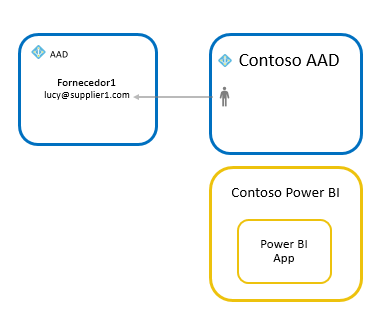

Integração do Power BI com o Azure AD B2B funciona com todos os endereços de e-mail da empresa. Se o utilizador não tem uma identidade do Azure AD, poderá ser solicitados a criar um. A imagem seguinte mostra o fluxo detalhado:

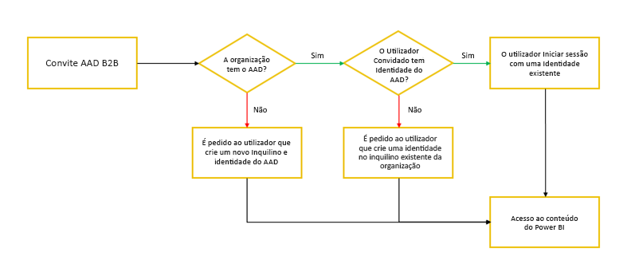

É importante para reconhecer que a conta do Azure AD será utilizada ou criada no terceiros externos do Azure AD, esta irá tornar isso possível que Lucy pode utilizar o seu próprio nome de utilizador e palavra-passe e suas credenciais automaticamente deixa de funcionar em outras inquilinos sempre que ela sair da empresa quando a sua organização também utiliza o Azure AD.

## Licensing

Contoso pode escolher uma das três abordagens para utilizadores convidados de licença de seus fornecedores e as organizações parceiras tenham acesso ao conteúdo do Power BI.

> [!NOTE]
> _Escalão gratuito do Azure AD B2B é o suficiente para utilizar o Power BI com o Azure AD B2B. Algumas funcionalidades avançadas de B2B do Azure AD, como grupos dinâmicos requerem licenças adicionais. Veja a documentação do Azure AD B2B para obter informações adicionais:_ [_https://docs.microsoft.com/azure/active-directory/b2b/licensing-guidance_](https://docs.microsoft.com/azure/active-directory/b2b/licensing-guidance)

### Abordagem 1: A Contoso utiliza o Power BI Premium

Com esta abordagem, a Contoso adquire a capacidade do Power BI Premium e atribui o seu conteúdo de portal de BI a esta capacidade. Isso permite que os utilizadores convidados de organizações parceiras aceder à aplicação do Power BI da Contoso sem qualquer licença do Power BI.

Utilizadores externos também estão sujeitos ao consumo de experiências apenas são oferecidas aos usuários "Gratuita" no Power BI ao consumir o conteúdo do Power BI Premium.

Contoso também pode tirar partido de outras capacidades premium do Power BI para seus aplicativos, como taxas de atualização de uma maior capacidade dedicada e tamanhos de modelos grandes.

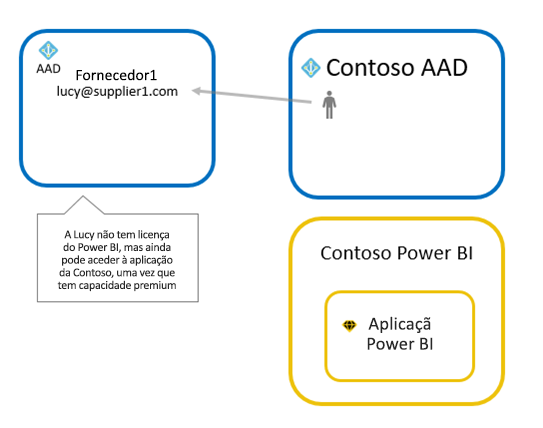

### Abordagem 2: Contoso atribui licenças do Power BI Pro para utilizadores convidados

Com esta abordagem, Contoso atribui licenças do pro para utilizadores convidados de parceiro organizações – isso pode ser feito a partir do Centro de administração do Microsoft 365 da Contoso. Isso permite que os utilizadores convidados de organizações parceiras aceder à aplicação do Power BI da Contoso sem comprar uma licença propriamente ditas. Isto pode ser adequado para a partilha com utilizadores externos cuja organização não ADOTOU Power BI ainda.

> [!NOTE]
> _Licença do pro da Contoso aplica-se aos utilizadores convidados apenas quando estes acedem a conteúdos no inquilino Contoso. Licenças Pro permitem o acesso ao conteúdo que não esteja na capacidade do Power BI Premium. No entanto, os utilizadores externos com uma licença Pro são restritos por padrão para uma experiência única de consumo. Isso pode ser alteração usando a abordagem descrita a_ _permitir que os utilizadores externos editar e gerir conteúdos no Power BI_ _seção mais adiante neste documento._

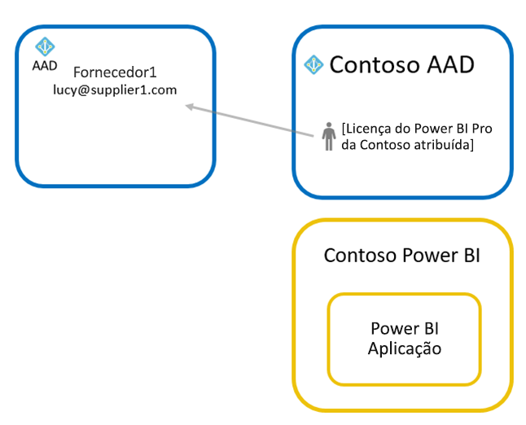

### Abordagem 3: Os utilizadores convidados traga a sua própria licença do Power BI Pro

Com esta abordagem, o fornecedor 1 atribui uma licença do Power BI Pro a Lucy. Em seguida, ele poderá acessar a aplicação do Power BI da Contoso com esta licença. Uma vez que Lucy pode utilizar a sua licença do Pro da própria organização ao aceder a um ambiente externo do Power BI, essa abordagem é por vezes denominada _traga a sua própria licença_ (BYOL). Se ambas as organizações estão a utilizar o Power BI, isso oferece licenciamento vantajoso para a solução de análise geral e minimiza a sobrecarga de atribuição de licenças a utilizadores externos.

> [!NOTE]
> _A licença do pro Lucy foi fornecida pelo fornecedor 1 se aplica a qualquer inquilino do Power BI onde Lucy se um utilizador convidado. Licenças Pro permitem o acesso ao conteúdo que não esteja na capacidade do Power BI Premium. No entanto, os utilizadores externos com uma licença Pro são restritos por padrão para uma experiência única de consumo. Isso pode ser alteração usando a abordagem descrita a_ _permitir que os utilizadores externos editar e gerir conteúdos no Power BI_ _seção mais adiante neste documento._

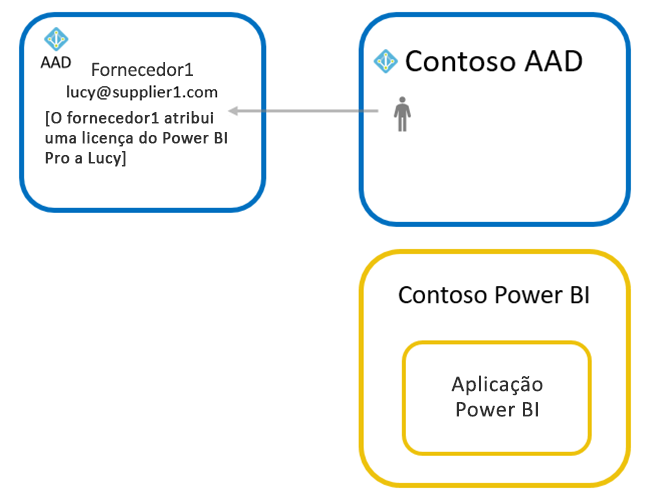

## Segurança de dados de parceiros externos

Normalmente ao trabalhar com vários fornecedores externos, a Contoso precisa de garantir que cada fornecedor, verá dados apenas sobre os seus próprios produtos. Segurança baseada no utilizador e a segurança ao nível da linha dinâmica facilitam o trabalho realizar com o Power BI.

### Segurança baseada no utilizador

Um dos recursos mais poderosos do Power BI é a segurança de nível de linha. Esta funcionalidade permite que a Contoso criar um único relatório e conjunto de dados, mas continua a aplicar regras de segurança diferentes para cada utilizador. Para obter uma explicação detalhada, consulte [segurança ao nível da linha (RLS)](https://powerbi.microsoft.com/documentation/powerbi-admin-rls/).

Integração do Power BI com o Azure AD B2B permite que a Contoso atribuir regras de segurança de nível de linha para utilizadores convidados, assim que eles estão convidados a inquilino Contoso. Como vimos antes, a Contoso pode adicionar utilizadores convidados através de um planeados ou convites ad-hoc. Se a Contoso pretende impor segurança ao nível da linha, é vivamente recomendado usar convites planeados para adicionar os utilizadores convidados antecipadamente e atribuí-las para as funções de segurança antes de partilhar o conteúdo. Se a Contoso em vez disso, utiliza convites ad-hoc, poderá haver um curto período de tempo em que os utilizadores convidados não será possível ver os dados.

> [!NOTE]
> Este atraso no acesso aos dados protegidos pelo RLS ao utilizar o ad-hoc convida pode levar a suportar pedidos para a sua equipa de TI, uma vez que os utilizadores irão ver em branco ou interrompida está à procura de relatórios/dashboards quando abrir um compartilhamento de uma ligação no e-mail que recebem. Por isso, recomenda-se vivamente utilizar convites planeados neste scenario.* *

Vamos examinar isso com um exemplo.

Como mencionado anteriormente, a Contoso tiver fornecedores em todo o mundo e quer certificar-se de que os utilizadores de suas organizações de fornecedor obtém informações a partir de dados a partir apenas seu território.  Mas os usuários da Contoso podem aceder a todos os dados. Em vez de criar vários relatórios diferentes, Contoso cria um único relatório e filtra os dados com base em usuário visualizá-lo.

Para garantir que a Contoso pode filtrar dados com base em quem está a ligar, duas funções são criadas no Power BI desktop. Um para filtrar todos os dados do SalesTerritory "Europa" e outra para "América do Norte".

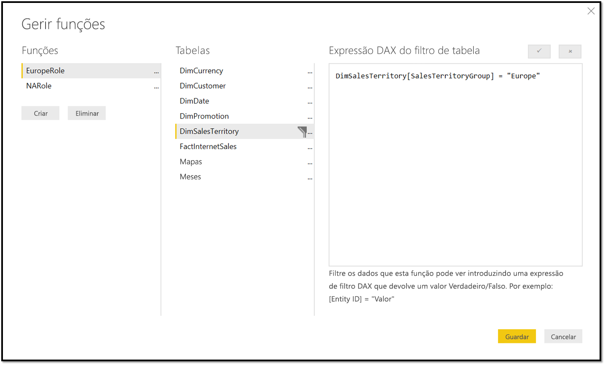

Sempre que as funções são definidas no relatório, um utilizador tem de ser atribuído a uma função específica para obter acesso a dados. A atribuição de funções acontece dentro do serviço Power BI ( **conjuntos de dados > segurança** )

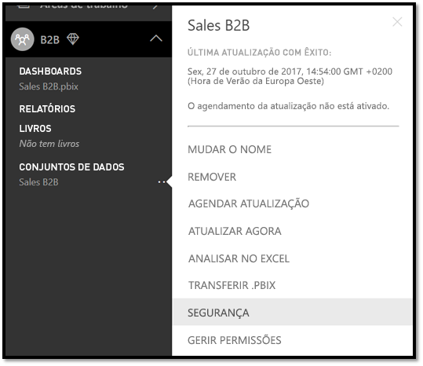

Esta ação abre uma página em que a equipa de BI da Contoso pode ver as duas funções que criaram.  Agora a equipa de BI da Contoso pode atribuir utilizadores às funções.

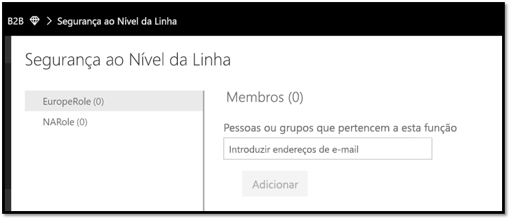

No exemplo, Contoso é adicionar um utilizador numa organização de parceiro com o endereço de e-mail "[adam@themeasuredproduct.com](mailto:adam@themeasuredproduct.com)" para a função de Europa:

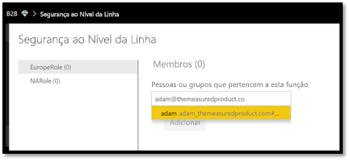

Quando isto é resolvido pelo Azure AD, a Contoso pode ver o nome aparecer na janela de pronto para ser adicionado:

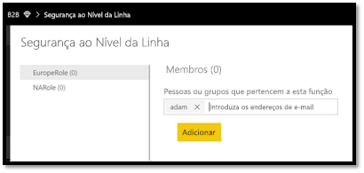

Agora quando esse usuário abre a aplicação que foi partilhada com ele, ele só vê um relatório com os dados da Europa:

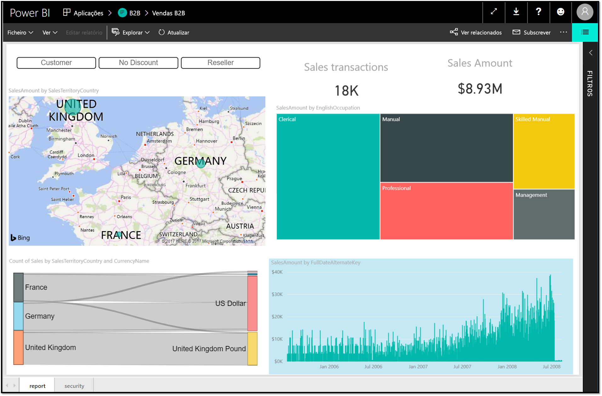

### Segurança ao nível da linha dinâmica

Outro tópico interessante é ver como dynamic linha o trabalho de segurança ao nível (RLS) com o Azure AD B2B.

Em resumo, segurança ao nível da linha dinâmica funciona ao filtrar os dados no modelo com base no nome de utilizador da pessoa a ligar ao Power BI. Em vez de adicionar várias funções para grupos de usuários, define os utilizadores no modelo. Não descrevemos o padrão em detalhes aqui. Kasper de Jong oferece uma gravação detalhada a cópia de segurança em todos os tipos de segurança ao nível da linha na [cábula de segurança do Power BI Desktop dinâmicas](https://www.kasperonbi.com/power-bi-desktop-dynamic-security-cheat-sheet/)e, na [neste White Paper](https://msdn.microsoft.com/library/jj127437.aspx) .

Vamos examinar um pequeno exemplo – Contoso tem um relatório simple sobre vendas por grupos:

Agora, este relatório tem de ser partilhados com dois utilizadores convidados e um utilizador interno: o utilizador interno pode ver tudo, mas os utilizadores convidados possam ver apenas os grupos de quais têm acesso. Isso significa que tem de filtrar os dados apenas para os utilizadores convidados. Para filtrar os dados adequadamente, a Contoso utiliza o padrão de RLS dinâmica, tal como descrito na postagem do blog e White Paper. Isso significa que, Contoso adiciona os nomes de utilizador para os dados em si:

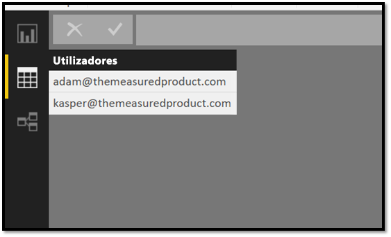

Em seguida, a Contoso cria o modelo de dados adequados que filtra os dados de maneira apropriada com as relações certos:

Para filtrar os dados automaticamente com base em quem está conectado, a Contoso precisa de criar uma função que passa no utilizador que está a ligar. Neste caso, a Contoso cria duas funções – a primeira é o "securityrole" que filtra a tabela de utilizadores com o nome de utilizador atual do utilizador com sessão iniciado Power BI (isso funciona mesmo para usuários de convidado do Azure AD B2B).

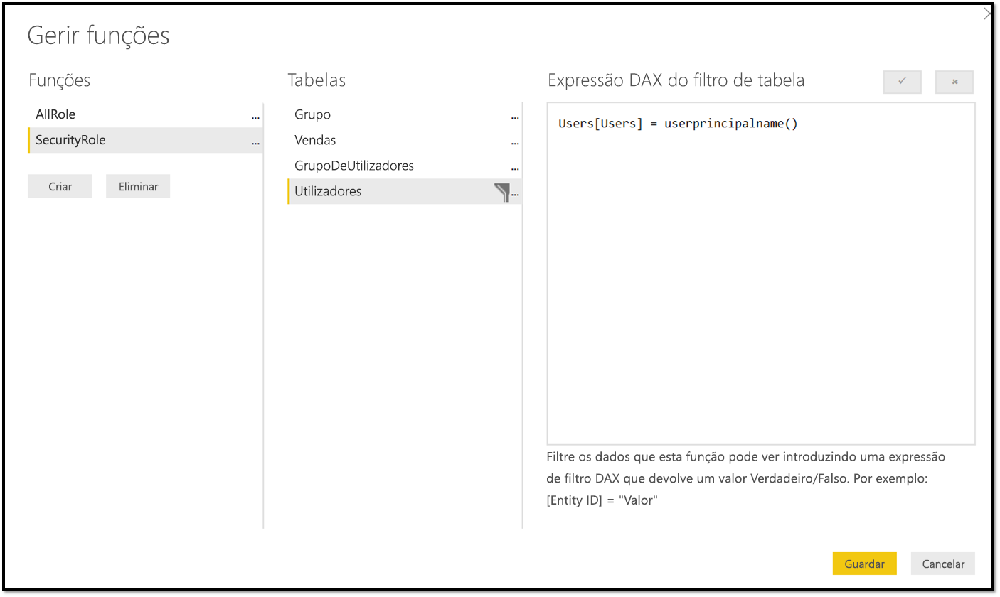

Contoso também cria outro "AllRole" para os utilizadores internos que podem ver tudo – esta função não tem qualquer predicado de segurança.

Depois de carregar o ficheiro de ambiente de trabalho do Power BI para o serviço, Contoso pode atribuir utilizadores convidados para o "SecurityRole" e os usuários internos para "AllRole"

Agora, quando os utilizadores convidados abrem o relatório, eles só vê vendas do grupo de r:

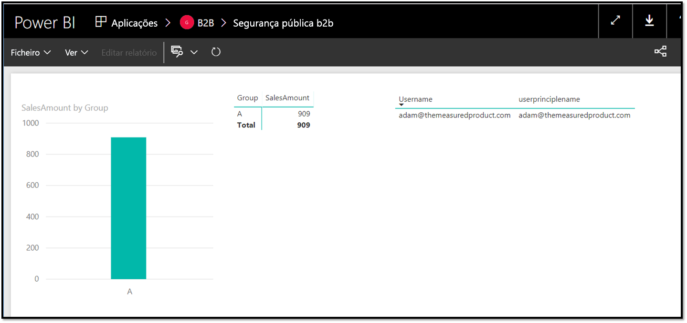

Na matriz para a direita, pode ver o resultado da função username () e userPrincipalName (), que ambos retornam o que endereço de e-mail dos utilizadores convidados.

Agora, o usuário interno obtém para ver todos os dados:

Como pode ver, a RLS dinâmica funciona com usuários internos ou convidados.

> [!NOTE]
> Este cenário também funciona quando utilizar um modelo no Azure Analysis Services. Normalmente, o seu serviço de análise do Azure está ligado ao mesmo Azure AD, como o Power BI – nesse caso, o Azure Analysis Services sabe também que os utilizadores convidados convidados através do Azure AD B2B.

## Ligar em origens de dados locais

A capacidade da Contoso tirar partido de origens de dados locais, como o Power BI oferece [SQL Server Analysis Services](https://powerbi.microsoft.com/documentation/powerbi-gateway-enterprise-manage-ssas/) ou [do SQL Server](https://powerbi.microsoft.com/documentation/powerbi-gateway-kerberos-for-sso-pbi-to-on-premises-data/) diretamente graças ao [gateway de dados no local](https://powerbi.microsoft.com/documentation/powerbi-gateway-onprem/). Também é possível iniciar sessão para essas origens de dados com as mesmas credenciais usadas com o Power BI.

> [!NOTE]
> Ao instalar um gateway para ligar ao seu inquilino do Power BI, tem de utilizar um utilizador criado no seu inquilino. Utilizadores externos não é possível instalar um gateway e ligá-lo ao seu inquilino. _

Para utilizadores externos, isso pode ser mais complicado, já que os utilizadores externos não são normalmente conhecidos com o local do AD. O Power BI oferece uma solução para isso, permitindo que os administradores da Contoso mapear os nomes de utilizador externo para nomes de utilizador interno, conforme descrito em [gerir a origem de dados – Analysis Services](https://powerbi.microsoft.com/documentation/powerbi-gateway-enterprise-manage-ssas/). Por exemplo, [ lucy@supplier1.com ](mailto:lucy@supplier1.com) podem ser mapeados para [lucy\_supplier1\_com #EXT@contoso.com](mailto:lucy_supplier1_com).

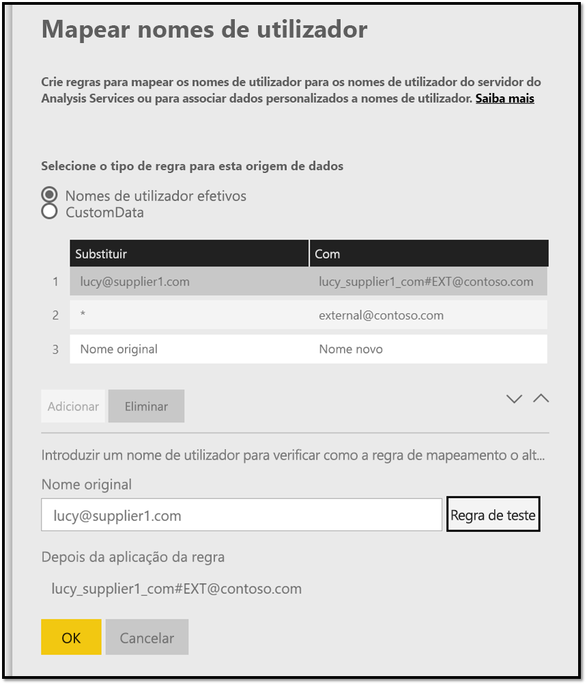

Esse método é bem se a Contoso tiver apenas um punhado de utilizadores ou se Contoso pode mapear todos os utilizadores externos para uma única conta interna. Para cenários mais complexos, em que cada utilizador precisa de suas próprias credenciais, há uma abordagem mais avançada que utiliza [atributos do AD personalizados](https://technet.microsoft.com/library/cc961737.aspx) para fazer o mapeamento, conforme descrito em [gerir a origem de dados – Analysis Services](https://powerbi.microsoft.com/documentation/powerbi-gateway-enterprise-manage-ssas/). Isso permitiria que o administrador da Contoso definir um mapeamento de todos os utilizadores no seu Azure AD (também utilizadores B2B externos).  Estes atributos podem ser definidos por meio do modelo de objeto do AD usando scripts ou código, para que a Contoso pode automatizar totalmente o mapeamento no convite ou a uma cadência agendada.

## Permitir que os utilizadores externos editar e gerir conteúdos no Power BI

Contoso pode permitir que os utilizadores externos contribuir com conteúdo dentro da organização, conforme descrito anteriormente a entre organizações de edição e o gerenciamento da seção de conteúdo do Power BI.

> [!NOTE]
> Para editar e gerir conteúdos no Power BI da sua organização, o utilizador tem de ter uma licença do Power BI Pro na área de trabalho que não seja a minha área de trabalho. Os utilizadores podem obter licenças Pro, conforme descrito nos the_ _Licensing__section deste documento._

O Portal de administração do Power BI fornece a **permitir que os utilizadores convidados externos editar e gerir conteúdos na organização** definição nas definições de inquilino. Por predefinição, a definição está definida como desativado, o que significa que os utilizadores externos obtém uma experiência de só de leitura restrita por predefinição. A definição aplica-se aos utilizadores com UserType definir a convidada no Azure AD. A tabela abaixo descreve os comportamentos que os utilizadores experiência dependendo de suas UserType e como as definições são configuradas.

| **Tipo de utilizador no Azure AD** | **Permitir que os utilizadores convidados externos editar e gerir a definição do conteúdo** | **Comportamento** |
| --- | --- | --- |
| Convidado | Desativado para o utilizador (predefinição) | Por visualizar apenas do consumo de item. Permite o acesso só de leitura para relatórios, dashboards e aplicações quando visualizado através de um URL enviado para o utilizador convidado. Aplicações do Power BI Mobile fornecem uma vista só de leitura ao utilizador convidado. |
| Convidado | Ativado para o utilizador | O utilizador externo dispõe do acesso a experiência completa do Power BI, embora algumas funcionalidades não estão disponíveis para eles. O utilizador externo tem de iniciar sessão Power BI com o URL do serviço do Power BI com as informações de inquilino incluídas. O obtém de utilizador a experiência de Home e permissões com base na minha área de trabalho podem procurar, ver e criar conteúdo.    Aplicações do Power BI Mobile fornecem uma vista só de leitura ao utilizador convidado. |

> [!NOTE]
> Utilizadores externos no Azure AD também podem ser definidos como UserType membro. Isto não é atualmente suportado no Power BI.

No portal do administrador do Power BI, a definição é mostrada na imagem seguinte.

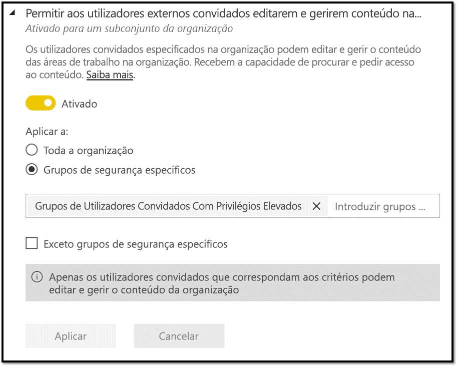

Os utilizadores convidados recebem a experiência padrão só de leitura e que pode editar e gerir o conteúdo. A predefinição é desativado, o que significa que todos os utilizadores convidados têm a experiência de só de leitura. O administrador do Power BI pode ativar a definição para todos os utilizadores na organização ou para grupos de segurança específica definidos no Azure AD. Na imagem seguinte, o administrador do Power BI da Contoso criou um grupo de segurança no Azure AD para gerir que utilizadores externos podem editar e gerir conteúdos no inquilino Contoso.

Para ajudar a estes utilizadores para iniciar sessão no Power BI, tem de fornecê-los com o URL de inquilino. Para encontrar o URL de inquilino, siga estes passos:

1. No serviço Power BI, no menu superior, selecione help ( **?** ), em seguida, **sobre o Power BI**.
2. Procure o valor junto a **URL de inquilino**. Este é o URL de inquilino pode partilhar com os seus utilizadores convidados.

    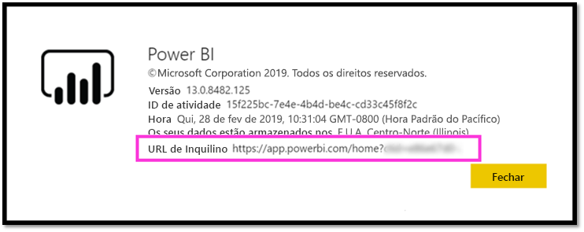

Ao utilizar os utilizadores convidados externos de permissões para editar e gerir conteúdos na organização, os utilizadores convidados especificado obtém acesso ao Power BI da sua organização e veja qualquer conteúdo para os quais tenham permissão. Eles podem acessar a home page, procure e contribuir com conteúdos a áreas de trabalho, instalar aplicações em que estão na lista de acesso e ter um minha área de trabalho. Podem criar ou ter o cargo de Administrador de áreas de trabalho que utilizem a nova experiência de área de trabalho.

> [!NOTE]
> Quando utilizar esta opção não se esqueça de rever a secção de governação deste documento, uma vez que as definições do Azure AD predefinido impedir que os utilizadores convidados para utilizar determinadas funcionalidades como selecionadores de pessoas que podem levar a uma redução experience.* *

Para os utilizadores convidados através dos utilizadores convidados externos de permissões para editar e gerir conteúdos na definição de inquilino de organização, algumas experiências não estão disponíveis para eles. Para atualizar ou publicar relatórios, os utilizadores convidados tem de utilizar a web do serviço Power BI da interface do Usuário, incluindo a obter dados para carregar ficheiros do Power BI Desktop. As seguintes experiências não são suportadas:

- A publicação direta do Power BI Desktop para o serviço Power BI
- Os utilizadores convidados não podem utilizar o Power BI Desktop para ligar a conjuntos de dados de serviço no serviço Power BI
- Áreas de trabalho clássicas associadas a Grupos do Office 365: o utilizador convidado não pode criar ou ter a função de Administrador destas áreas de trabalho. No entanto, pode ser membro.
- O envio de convites ad-hoc não é suportado para listas de acesso de áreas de trabalho
- O Power BI Publisher para Excel não é suportado para utilizadores convidados
- Os utilizadores convidados não podem instalar o Power BI Gateway e ligá-lo à sua organização
- Os utilizadores convidados não podem instalar aplicações de publicações para toda a organização
- Os utilizadores convidados não podem utilizar, criar, atualizar ou instalar pacotes de conteúdos organizacionais
- Os utilizadores convidados não podem utilizar a funcionalidade Analisar no Excel
- Os utilizadores convidados não podem ser @mentioned em comentários (esta funcionalidade será adicionada numa versão futura)
- Os utilizadores convidados não é possível utilizar subscrições (esta funcionalidade será adicionada numa versão futura)
- Os utilizadores convidados que utilizem esta funcionalidade devem ter uma conta escolar ou profissional. Os utilizadores convidados com contas pessoais experiência limitações mais devido a restrições de início de sessão.

## Governance

### Definições adicionais do AD do Azure que afetam as experiências no Power BI relacionados com o Azure AD B2B

Ao utilizar a partilha B2B do Azure AD, o administrador do Azure Active Directory controla aspectos da experiência do utilizador externo. Estes são controladas na página de definições de colaboração externa dentro das configurações do Azure Active Directory para o seu inquilino.

Detalhes sobre as definições estão disponíveis aqui:

[https://docs.microsoft.com/azure/active-directory/b2b/delegate-invitations](https://docs.microsoft.com/azure/active-directory/b2b/delegate-invitations)

> [!NOTE]
> Por predefinição, as permissões de utilizadores convidados são limitadas opção estiver definida como Sim, para que os utilizadores convidados no Power BI limitaram experiências especialmente envolvem partilha onde o selecionador de pessoas interfaces do usuário não funcionam para esses utilizadores. É importante trabalhar com o administrador do Azure AD para o definir como não, conforme mostrado abaixo, para garantir uma boa experience.* *

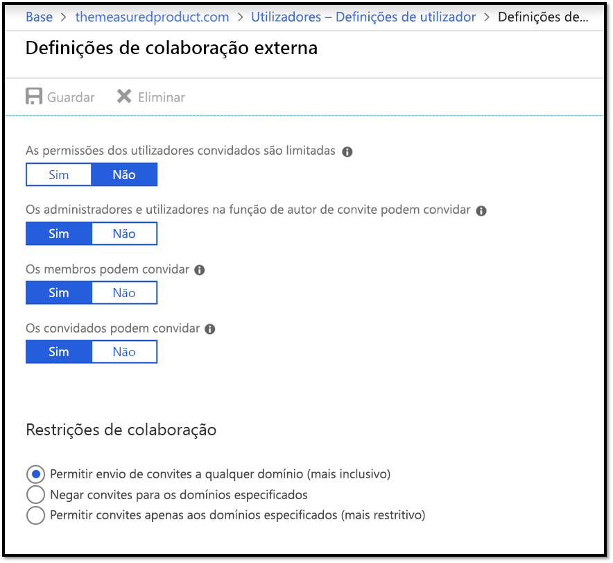

### Convite de convidado de controlo

Os administradores do Power BI podem controlar a partilha externa apenas para o Power BI, visite o portal de administração do Power BI. Mas os administradores de inquilinos também podem controlar a partilha externa com várias políticas do Azure AD.  Estas políticas permitem inquilino aos administradores

- Desativar a convites pelos usuários finais
- Apenas administradores e utilizadores na função de utilizador que convida convidados podem convidar
- Os administradores, a função de utilizador que convida convidados e os membros podem convidar
- Todos os usuários, inclusive convidados, podem convidar

Pode ler mais sobre estas políticas no [delegar convites para colaboração do Azure Active Directory B2B](https://docs.microsoft.com/azure/active-directory/active-directory-b2b-delegate-invitations).

Todas as ações do Power BI por utilizadores externos são também [auditada no nosso portal de auditoria](https://powerbi.microsoft.com/documentation/powerbi-admin-auditing/).

### Políticas de acesso condicional para utilizadores convidados

Contoso pode impor políticas de acesso condicional para utilizadores convidados que aceder a conteúdo a partir do inquilino Contoso. Pode encontrar instruções detalhadas no [acesso condicional para utilizadores de colaboração B2B](https://docs.microsoft.com/azure/active-directory/active-directory-b2b-mfa-instructions).

## Abordagens alternativas comuns

Embora B2B do Azure AD torna mais fácil de compartilhar dados e relatórios entre organizações, isso significa que há várias outras abordagens que são frequentemente utilizadas e podem ser superior em determinados casos.

### Opção 1: Criar utilizadores de identidades duplicadas para parceiros

Com esta opção, o Contoso tinha que criar manualmente as identidades duplicadas para cada utilizador do parceiro no inquilino Contoso, conforme mostrado na imagem seguinte. Em seguida, no Power BI, Contoso pode partilhar com as identidades atribuídas aplicações, dashboards ou relatórios apropriados.

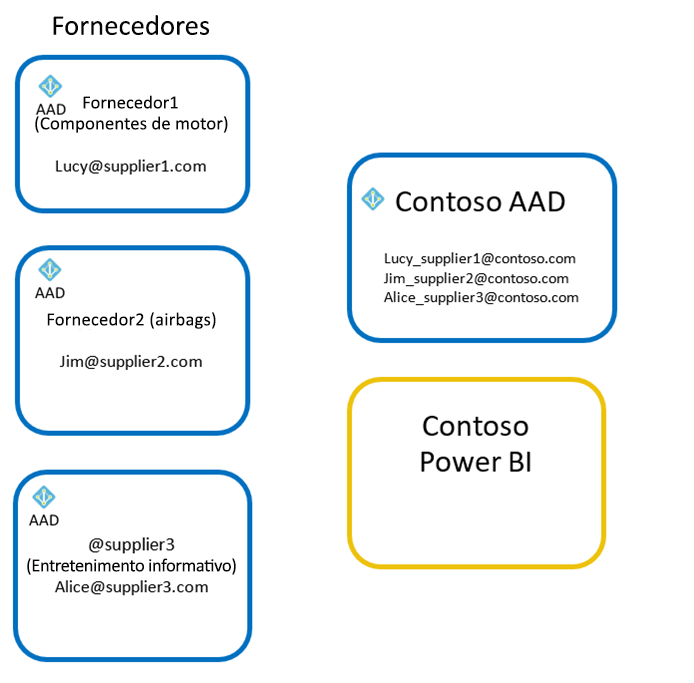

Motivos para escolher essa alternativa:

- Uma vez que a identidade do usuário é controlada pela sua organização, qualquer relacionados com o serviço, como e-mail, SharePoint, etc. também estão no âmbito da sua organização. Os administradores de TI podem repor palavras-passe, desativar o acesso a contas ou atividades nestes serviços de auditoria.
- Então, os utilizadores que utilizam contas pessoais para seus negócios, muitas vezes, são impedidos de aceder a determinados serviços poderão ter uma conta institucional.
- Alguns serviços só funcionam em utilizadores da sua organização. Por exemplo, utilizar o Intune para gerir conteúdos nos dispositivos dos utilizadores externos com o Azure B2B pessoal/móvel pode não ser possível.

Razões para não escolher esta alternativa:

- Os utilizadores de organizações parceiras Lembre-se dois conjuntos de credenciais – uma para aceder aos conteúdos de sua própria organização e outra para aceder a conteúdo da Contoso. Isso é algo incômodo para estes utilizadores convidados e muitos utilizadores convidados são confundidos por esta experiência.
- Contoso tem de adquirir e atribuir licenças por utilizador para estes utilizadores. Se um utilizador tem de receber correio eletrónico ou utilizam aplicações do office, terá das licenças adequadas, incluindo o Power BI Pro para editar e partilhar conteúdo no Power BI.
- Contoso querer impor políticas de governação para utilizadores externos em comparação com os usuários internos e de autorização mais rigoroso. Para conseguir isso, a Contoso precisa de criar uma nomenclatura interna para utilizadores externos e todos os utilizadores de Contoso precisam de ser informados esta nomenclatura.
- Quando o utilizador deixa a sua organização, continuam a ter acesso aos recursos da Contoso, até que o administrador da Contoso elimina manualmente a sua conta
- Os administradores da Contoso tem de gerir a identidade para o convidado, incluindo a criação, reposições de palavra-passe, etc.

### Opção 2: Criar uma aplicação Power BI Embedded personalizada utilizando a autenticação personalizada

Outra opção para a Contoso é compilar sua própria aplicação do Power BI embedded personalizada com autenticação personalizada (['Dados detidos pela aplicação'](https://docs.microsoft.com/power-bi/developer/embed-sample-for-customers)). Embora muitas organizações não tem o tempo ou recursos para criar uma aplicação personalizada no Power BI de distribuir conteúdo para seus parceiros externos, para algumas organizações esta é a melhor abordagem e merece uma consideração séria.

Muitas vezes, as organizações têm portais de parceiro existente que centralizam o acesso a todos os recursos da organização para parceiros, fornecem isolamento de recursos da organização internos e fornecem experiências simplificadas para parceiros oferecer suporte a vários parceiros e os utilizadores individuais.

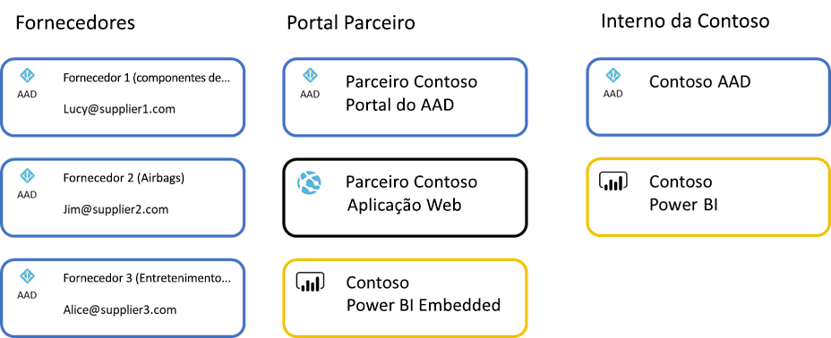

O exemplo acima, os utilizadores de cada início de sessão do fornecedor para o Portal de parceiros da Contoso que utiliza o AAD como fornecedor de identidade. Pode utilizar o AAD B2B, o Azure B2C, identidades nativas ou federar com qualquer número de outros fornecedores de identidade. O utilizador deve iniciar sessão e aceder uma compilação de portal de parceiros com a aplicação Web do Azure ou uma infraestrutura semelhante.

Dentro da aplicação web, os relatórios do Power BI são incorporados de uma implementação do Power BI Embedded. A aplicação web teria simplificar o acesso para os relatórios e de quaisquer serviços relacionados numa experiência coesa que tem como objetivo torna mais fácil para os fornecedores interagir com Contoso. Neste ambiente portal seria isolado a partir do AAD interno da Contoso e ambiente Power BI interna da Contoso para garantir que os fornecedores não foi possível aceder a esses recursos. Normalmente, os dados seriam armazenados num data warehouse separado do parceiro para garantir o isolamento de dados também. Esse isolamento tem benefícios, uma vez que ele limita o número de utilizadores externos com acesso direto aos dados da sua organização, limitar os dados que poderiam ser disponíveis para o utilizador externo além de limitar a partilha acidental com utilizadores externos.

Utilizar o Power BI Embedded, o portal pode tirar partido do licenciamento vantajoso, usar o token de aplicação ou o utilizador principal e a capacidade premium comprada no modelo do Azure, o que simplifica a preocupações sobre a atribuição de licenças aos utilizadores finais e pode aumentar verticalmente/para baixo com base no esperado utilização. O portal pode oferecer uma experiência consistente e geral mais qualidade, uma vez que os parceiros de aceder a um único portal projetado com todas as necessidades de um parceiro em mente. Por último, uma vez que o Power BI Embedded com base em soluções são, normalmente, projetadas para ser multi-inquilino, isso torna mais fácil garantir o isolamento entre as organizações parceiras.

Motivos para escolher essa alternativa:

- Cresce mais fácil de gerenciar como o número de organizações parceiras. Uma vez que os parceiros são adicionados a um diretório separado isolado do diretório do AAD interno da Contoso, ele simplifica tarefas de governação e ajuda a impedir a partilha acidental de dados internos para utilizadores externos.
- Portais de parceiro típica são altamente com a marca de experiências com experiências consistentes entre parceiros e simplificados para satisfazer as necessidades de parceiros típicos. Contoso, por conseguinte, pode oferecer uma melhor experiência geral para parceiros, integrando todos os serviços necessários num único portal.
- Licenciamento os custos para cenários avançados, como o conteúdo de edição dentro do Power BI Embedded é abrangido pelo Azure adquirido o Power BI Premium e não requer a atribuição de licenças do Power BI Pro aos utilizadores.
- Fornece melhor isolamento entre parceiros se concebido como uma solução de multi-inquilino.
- O Portal de parceiros, muitas vezes, inclui outras ferramentas para parceiros, além de relatórios, dashboards e aplicações do Power BI.

Razões para não escolher esta alternativa:

- Um esforço significativo é necessário para criar, operar e manter um portal a tornando um investimento significativo em recursos e tempo.
- Tempo para a solução é muito mais do que utilizar a partilha de B2B desde o planejamento cuidadoso e execução em vários workstreams é necessária.
- Em que há um número menor de parceiros o esforço necessário para essa alternativa provavelmente é demasiado elevado para justificar.
- Colaboração com o compartilhamento de ad-hoc é o cenário principal enfrentado pela sua organização.
- Os relatórios e dashboards são diferentes para cada parceiro. Essa alternativa apresenta gerenciamento sobrecarga para além de partilhar apenas diretamente com parceiros.

## PERGUNTAS FREQUENTES

**Contoso enviar um convite que é resgatado automaticamente, para que o utilizador é "pronto para ir"? Ou o utilizador sempre tem de clicar para o URL de resgate?**

O utilizador final sempre tem de clicar na sua experiência de consentimento antes de poderem aceder ao conteúdo.

Se irá ser convidar muitos utilizadores, recomendamos que o delegado dos administradores de núcleos do Azure AD por [a adição de um utilizador à função de autor do convite de convidado na organização de recursos](https://docs.microsoft.com/azure/active-directory/active-directory-b2b-add-guest-to-role). Este utilizador pode convidar outros utilizadores na organização do parceiro com a início de sessão IU, scripts do PowerShell, ou APIs. Isso reduz a carga administrativa sobre os seus administradores do Azure AD para convidar ou reenviados convites para os utilizadores na organização parceira.

**Contoso forçar autenticação multifator para utilizadores convidados se seus parceiros não tem a autenticação multifator?**

Yes. Para obter mais informações, consulte [acesso condicional para utilizadores de colaboração B2B](https://docs.microsoft.com/azure/active-directory/active-directory-b2b-mfa-instructions).

**Como funciona a colaboração B2B quando o parceiro convidado está a utilizar o Federação para adicionar sua própria autenticação no local?**

Se o parceiro tem um inquilino do Azure AD que está federado para a infraestrutura de autenticação no local, no local início de sessão único (SSO) é automaticamente obtido. Se o parceiro não tiver um inquilino do Azure AD, uma conta do Azure AD pode ser criada para novos utilizadores.

**Pode convidar utilizadores com contas de e-mail de consumidor?**

Convidar utilizadores com contas de e-mail de consumidor é suportado no Power BI. Isto inclui a domínios, como hotmail.com, outlook.com e gmail.com. No entanto, esses utilizadores podem ter limitações para além de que os utilizadores com funcionam ou encontram contas escolares.
