# Implementar e gerir as capacidades do Power BI Premium

**Resumo:** O Power BI Premium fornece um desempenho mais consistente, suporte para grandes volumes de dados e a flexibilidade de uma plataforma unificada de BI de Self-Service e empresarial para todas as pessoas na sua organização. Este White Paper técnico de nível 300 foi escrito especificamente para os administradores do Power BI e os autores e editores. O objetivo é ajudá-los a compreender o potencial do Power BI Premium e explicam como criar, implementar, monitorizar e resolver problemas de soluções dimensionáveis.

**Autor:** [Peter Myers](https://www.linkedin.com/in/peterjsmyers) (MVP de plataforma de dados e especialista no Power BI independente com soluções totalmente)

**Revisores Técnicos:** ADAM Saxton, Akshai Mirchandani, Bhavik comerciante, David Magar, Josh Caplan, Michael Blythe, Nimrod Shalit, Olivier Matrat, Swati Gupta

**Aplica-se a:** Serviço Power BI, Power BI Premium e as capacidades do Azure Power BI Embedded

> [!NOTE]
> Pode guardar ou imprimir este documento técnico ao selecionar **Imprimir** no seu browser e, em seguida, ao selecionar **Guardar como PDF**.

## Apresentação do Power BI

Power BI é um serviço de análise de negócios criado para fornecerem informações que permitem a decisões rápidas e informadas. Desde seu lançamento em 2015 rapidamente tornou-se um serviço de popular utilizado para fornecer soluções para a menor das organizações para o maior das corporações.

É disponibilizada de duas formas: Solução de geração de relatórios chamado como um serviço em nuvem e no local **Power BI Report Server**. \[[1](#endnote-01)\]

Como um serviço em nuvem é Software-como-serviço (SaaS) do Power BI \[ [2](#endnote-02)\]. Ele representa um conjunto de serviços e aplicações que permitem que as organizações desenvolver, implantar, gerenciar, compartilhar soluções para monitorizar o seu negócio.

Não é a intenção deste White Paper para fornecer uma descrição abrangente do serviço Power BI. Em vez disso, ele se concentra em tópicos relevantes para o assunto do Power BI Premium. Para obter informações gerais sobre o Power BI, consulte o abrangente [documentação do Power BI](service-admin-premium-multi-geo.md). Para obter uma explicação mais detalhada do serviço Power BI com um foco em alcançar implementações em empresas com bom desempenho, consulte o abrangente [planear uma implementação empresarial do Power BI](https://aka.ms/pbienterprisedeploy) White Paper.

Dentro do contexto assunto neste White Paper, esta seção apresenta e descreve as capacidades, Power BI tipos de conteúdo, modos de armazenamento do modelo e licenciamento. Uma compreensão destes tópicos é essencial para implementar e gerir o Power BI Premium com êxito.

### Capacidades

**As capacidades** são um conceito de Power BI de núcleos que representa um conjunto de recursos (armazenamento, processador e memória) utilizados para alojar e fornecer o Power BI conteúdo. As capacidades são compartilhadas ou dedicadas. R **capacidade partilhada** é partilhado com outros clientes da Microsoft, enquanto um **capacidade dedicada** está totalmente comprometida com um único cliente. As capacidades dedicadas são introduzidas na [capacidades Premium](#premium-capacities) tópico.

Na capacidade partilhada, cargas de trabalho executam em recursos informáticos partilhados com outros clientes. Como a capacidade tem de partilhar recursos, as limitações são impostas para garantir que o "fair play", como o tamanho de modelo máximo (1 GB) e a frequência de atualização diária máxima (oito vezes por dia).

### Áreas de trabalho

Áreas de trabalho do Power BI residem dentro de capacidades e eles representam os contentores de segurança, a colaboração e a implementação. Cada utilizador do Power BI tem uma área de trabalho pessoal, conhecida como **minha área de trabalho**. Áreas de trabalho adicionais podem ser criadas para permitir a colaboração e a implantação, e eles são conhecidos como **áreas de trabalho de aplicação**. Por predefinição, as áreas de trabalho - incluindo áreas de trabalho pessoas - são criadas na capacidade partilhada.

### Tipos de conteúdo de BI de energia

Para apresentar os tópicos do Power BI Premium, é importante começar com uma discussão completa de arquitetura de Power BI, incluindo tipos de conteúdo fundamentais.

Todos os conteúdos do Power BI são armazenados e gerenciados nas áreas de trabalho que são contentores para o conteúdo do Power BI. Cada utilizador do Power BI tem sua própria área de trabalho pessoal, mas a prática recomendada geral é criar áreas de trabalho de aplicação. Áreas de trabalho de aplicação ativar co-ownership de conteúdo e a capacidade de colaborar em conteúdo. Eles também fornecem a capacidade de testar e distribuir conteúdos a amplo públicos como aplicações.

O seguinte conteúdo do Power BI é armazenado em áreas de trabalho:

- Fluxos de Dados
- Conjuntos de Dados
- Livros
- Relatórios
- Dashboards

#### Fluxos de Dados

Fluxos de dados do Power BI ajudam as organizações a unificar dados de diferentes fontes. Eles podem ser considerados como dados preparados e preparado para utilização em modelos, no entanto, eles não podem ser utilizados diretamente como uma origem de relatórios. Tiram partido da coleção abrangente de conectores de dados da Microsoft, permitindo a ingestão de dados a partir de origens de dados com base na cloud e no local.

Fluxos de dados só podem ser criados e geridos em áreas de trabalho de aplicação, e são armazenados como entidades no comuns dados modelo (CDM) na geração 2 de armazenamento do Azure Data Lake. Normalmente, eles são agendados para atualização de forma recorrente para armazenar os dados atualizados.

Para obter mais informações, consulte a [de preparação de dados de Self-serviços no Power BI (pré-visualização)](service-dataflows-overview.md) documento.

#### Conjuntos de Dados

Conjuntos de dados do Power BI representam uma origem de dados prontos para relatórios e visualização. Existem muitos tipos de conjuntos de dados, criados por:

- Ligar a um modelo de dados existente que não está a ser alojado numa capacidade do Power BI
- Carregar um ficheiro do Power BI Desktop que contém um modelo
- Carregar um livro do Excel (que contém um ou mais tabelas do Excel e/ou um modelo de dados de pasta de trabalho) ou carregar um ficheiro de comma-separated. o valor (CSV)
- Utilizar o serviço do Power BI para criar um push, transmissão em fluxo ou híbrida conjunto de dados de transmissão em fluxo

Exceto para conjuntos de dados de transmissão em fluxo \[ [3](#endnote-03)\], o conjunto de dados representa um modelo de dados que aproveita as tecnologias de modelagem madura do Analysis Services.

Observe que na documentação, às vezes, as terminologias conjuntos de dados e os modelos são intercambiáveis. Em geral, da perspectiva do serviço Power BI, é referido como um **conjunto de dados** e de uma perspectiva de desenvolvimento, é referido como um **modelo**. No contexto deste White Paper que significam a mesma coisa.

##### Modelos hospedado

Ligar a um modelo alojado externamente envolve a instalação do [Gateway de dados no local](service-gateway-onprem.md) para ligar ao SQL Server Analysis Services, seja no local ou hospedado por VM infraestrutura-como-serviço (IaaS). O Azure Analysis Services não requer um gateway. Neste cenário, muitas vezes, faz sentido quando existem investimentos existentes do modelo, formando, normalmente, a parte do armazém de dados empresarial (EDW). Ele permite que o Power BI efetuar uma **ligação em direto** (LC) para o Analysis Services e faz isso ao impor permissões de dados utilizando a identidade do utilizador de relatório do Power BI. Para o SQL Server Analysis Services, são suportados modelos multidimensionais (cubos) e modelos em tabela. Conforme mostrado na imagem seguinte, um conjunto de dados de ligação em direto passa consultas para modelos alojados externamente.

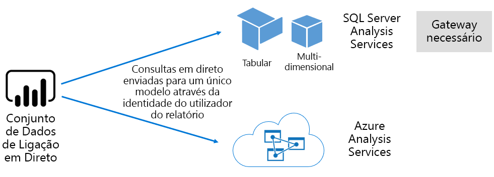

##### Modelos de desenvolvidos de ambiente de trabalho do Power BI

Power BI Desktop - uma aplicação de cliente se destina a desenvolvimento do Power BI - pode ser utilizado para desenvolver um modelo que é, efetivamente, um modelo de tabela do Analysis Services. Modelos podem ser desenvolvidos ao importar dados a partir de fluxos de dados, que, em seguida, podem ser integrados com outras origens de dados. Embora os detalhes sobre como a Modelagem pode ser alcançada é fora do escopo deste White Paper, é importante compreender o que há três diferentes tipos de - ou modos - modelos que podem ser desenvolvidas com o Power BI Desktop. Estes modos de determinam se os dados são importados para o modelo, ou se mantém na origem de dados. Os três modos são: Import, DirectQuery e composição. Uma discussão completa sobre cada modo será abordada no [modos de armazenamento de modelo](#model-storage-modes) tópico.

Hospedados externamente modelos e modelos desenvolvidos no Power BI desktop, podem impor segurança de nível de linha (RLS) para limitar os dados que podem ser recuperados para um determinado utilizador. Por exemplo, os utilizadores atribuídos ao grupo de segurança de vendedores só podem ver dados de relatório para as regiões de vendas para o qual são atribuídos. Funções RLS podem ser dinâmico ou estático. **Funções dinâmicas** filtrar por utilizador de relatórios, enquanto **estáticas funções** aplicará os mesmos filtros para todos os utilizadores atribuídos à função.

##### Modelos de livro do Excel

Criar conjuntos de dados com base em livros do Excel ou CSV ficheiros resultará na criação automática de um modelo. Tabelas do Excel e os dados do CSV serão importados para criar tabelas de modelos, enquanto um modelo de dados de livro do Excel irá ser transportado para criar um modelo do Power BI. Em todos os casos, os dados de ficheiro são importados para um modelo.

Distinções, em seguida, podem ser feitas sobre conjuntos de dados do Power BI que representam os modelos:

- Eles esteja hospedados no serviço Power BI ou são hospedados pelo Analysis Services
- Eles podem armazenar os dados importados ou elas podem emitir pass-through pedidos de consulta para origens de dados subjacentes ou uma mistura de ambos

Aqui está um resumo dos fatos importantes sobre conjuntos de dados do Power BI que representam os modelos:

- Modelos do SQL Server Analysis Services alojada requerem um gateway para executar consultas de LC
- Power BI alojado modelos que importar dados
  - Tem de ser totalmente carregado na memória para que eles podem ser consultados
  - Necessitam de atualização para manter os dados atuais e tem envolvem gateways quando a origem de dados não está acessível diretamente através da Internet
- Power BI alojado modelos que utilizam o modo de armazenamento do DirectQuery (DQ) necessitam de conectividade para a origem de dados. Quando o modelo é consultado, o Power BI emite consultas para a origem de dados para recuperar dados atuais. Neste modo tem envolvem gateways quando a origem de dados não está acessível diretamente através da Internet.
- Modelos podem impor regras RLS, impor filtros para limitar o acesso a dados a determinados utilizadores

Para implementar e gerir o Power BI Premium com êxito, é importante compreender onde estão alojados modelos, o modo de armazenamento, todas as dependências nos gateways, o tamanho dos dados importados e o tipo e a frequência de atualização. Estes podem todos ter um impacto significativo sobre os recursos do Power BI Premium. Além disso, o design de modelo em si, incluindo seus cálculos e consultas de preparação de dados pode adicionar à mistura considerações.

Também é importante compreender que alojado no Power BI importar modelos podem de acordo com a agenda de atualização ou ser acionada por demanda por um utilizador no serviço Power BI.

Mais tarde conceber modelos otimizados é discutida neste documento técnico no [otimizar modelos](#optimizing-models) tópico.

#### Livros

Pastas de trabalho do Power BI são um tipo de conteúdo do Power BI \[ [4](#endnote-04)\]. Eles são livros do Excel que foram carregados para o serviço Power BI e não devem ser confundidos com os livros do Excel carregados que criar conjuntos de dados (modelos). O tipo de conteúdo da pasta de trabalho representa uma ligação para uma pasta de trabalho, o que pode optar por ser carregada no serviço Power BI ou permanece no armazenamento na cloud no OneDrive ou SharePoint Online.

É importante compreender que este tipo de conteúdo não está disponível como uma origem de dados para visualizações de dados do Power BI. Em vez disso, pode ser aberto como uma pasta de trabalho no serviço Power BI com o Excel Online. A intenção principal deste tipo de conteúdo é permitir que o legado relatórios livro do Excel para ser acessível a partir do serviço Power BI e para permitir que as visualizações de dados ser afixadas a dashboards do Power BI.

Para obter mais informações, consulte a [obter dados de ficheiros de livro do Excel](service-excel-workbook-files.md) documento.

#### Relatórios

Existem dois tipos de relatórios: Relatórios do Power BI e relatórios paginados.

**Relatórios do Power BI** fornecer experiências de que o liga a um único conjunto de uma visualização interativa de dados. Relatórios foram concebidos para incentivar a participação de utilizador, permitindo que eles interajam com uma matriz extraordinária de recursos, incluindo a filtragem, de fragmentação, cross filtragem e realce, agregação, desagregar, desagregar, perguntas e respostas um natural idioma questionamento, concentrando-se, navegação de páginas, spotlighting, indicadores de visualização e muito mais.

No contexto deste White Paper, é importante compreender como a arquitetura do Power BI, interações de utilizador e de design de relatório do Power BI podem todos afetar nos recursos de serviço do Power BI:

- Para carregar e interagir com relatórios baseados em modelos de importação, o modelo tem de ser totalmente carregado na memória (se alojado externamente ou alojadas no serviço Power BI)
- Cada elemento visual do relatório emite uma consulta para recuperar dados através da consulta o modelo
- Em geral, as interações de filtro e segmentação de dados envolvem consultando o modelo. Por exemplo, alterar uma seleção de segmentação de dados - por predefinição - exigirá recarregar a cada elemento visual na página \[ [5](#endnote-05)\]
- Relatórios do Power BI não garantem a apresentação de dados atuais e podem exigir que o utilizador atualizar o relatório para recarregar a página de relatório e os respetivos elementos visuais
- Os usuários podem interagir com o p & um recurso de linguagem natural para fazer perguntas, fornecendo o design de relatórios do Power BI permite que o faça e o conjunto de dados representa um modelo de importação de dados alojado no Power BI ou um conjunto de dados de LC configurada para permitir que as perguntas e respostas

**Relatórios paginados** que permite a publicação e composição de relatórios do SQL Server Reporting Services (SSRS) (\*formato. RDL). Como seu nome sugere, os relatórios paginados são frequentemente utilizados quando os requisitos de ditam a necessidade de impressão para um tamanho de página fixo, ou quando existem variável listas de dados que tem de ser totalmente expandidas. Por exemplo, uma nota fiscal concebida para processamento de várias página (em vez de rolagem dentro de um elemento visual) e impressão.

Opção de fornecer os dois tipos de relatório suportados para os autores do relatório, permitindo que ele selecione o tipo com base nos requisitos e na utilização pretendida. Em geral, os relatórios do Power BI são ideais para experiências interativas, permitindo que o usuário explorar e descobrir informações a partir de dados, enquanto os relatórios paginados são mais adequados para layouts de página orientada para o parâmetro.

Independentemente do tipo de relatório, obtenção de atualizações de carga e os dados de relatório de capacidade de resposta (quando filtros ou parâmetros são alterados), é imperativo para proporcionar uma experiência de usuário confiável e com bom desempenho.

#### Dashboards

Dashboards do Power BI têm a finalidade de proporcionar experiências de monitorização e são conceitualmente muito diferentes dos relatórios do Power BI. Dashboards concebidos para serem apresentados num único painel de vidro para expressar visualizações de dados e valores nos mosaicos. Em geral, os dashboards oferecem menos experiências de interação de relatórios do Power BI, com alguns designs de dashboard não esperando nenhuma interação. Por exemplo, um dashboard autônomo apresentado numa tela de sensíveis numa sala de servidor. Outra diferença significativa é que os dashboards podem apresentar blocos que só pode ser baseado num único conjunto de dados de relatório de origem de dados de vários conjuntos de dados, enquanto um Power BI.

É importante compreender que um dashboard foi criado para carregar rapidamente e com o express dados mais atuais (conhecidos no serviço Power BI) em todos os tempos. Ela consegue isso ao colocar em cache os resultados da consulta de mosaico, e ele faz isso para cada dashboard. Na verdade, ele deve fazer isso para cada utilizador que tem acesso a um dashboard com base em modelos que impõem a RLS dinâmica.

O serviço Power BI atualiza automaticamente os caches de consulta de dashboard imediatamente depois de modelos de importação alojado no Power BI são atualizados. No caso de modelos de LC e DQ, o proprietário de conjunto de dados tem um grau de controle sobre a frequência com que o serviço Power BI atualiza o cache, que pode ser configurado como com frequência de 15 minutos ou raramente uma vez por semana. Tenha em atenção o que LC atualizações da cache de consulta consultará primeiro metadados de modelo para determinar se uma atualização do modelo ter sido efetuada desde a última atualização de cache, e não será realizada para atualizar a cache quando uma atualização uma vez que não tenha ocorrido. Esta verificação não é possível que os modelos DQ e, então, atualizações de cache acontecerá se a origem de dados foi alterado ou não.

Cache de consulta de dashboard atualizações com base no DQ e modelos de LC podem afetar significativamente nos recursos de serviço do Power BI e origens de dados externas. Considere um dashboard com mosaicos de 20, todas com base num modelo do Azure Analysis Services, que impõe a RLS dinâmica que é atualizado a cada hora e que este dashboard é partilhado com 100 utilizadores. Se o conjunto de dados estiver configurado para atualizar a cada hora, isso resultaria em, pelo menos, de 2000 (20 x 100) consultas LC. Isso pode colocar uma enorme carga no serviço Power BI e origens de dados externas, e ele também pode exceder os limites impostos no recursos disponíveis. Recursos de capacidade e limites são descritos na [nós de capacidade](#capacity-nodes) tópico.

Os usuários podem interagir com um dashboard de várias formas, que requerem que os recursos de serviço do Power BI. Especificamente, pode:

- Acionar uma atualização de mosaicos de dashboards, o que pode resultar numa atualização a pedido de todas as respetivas modelos de importação de dados alojado no Power BI
- Interaja com as perguntas e respostas um recurso de linguagem natural para fazer perguntas (fornecendo o design de dashboard permite que o faça e o conjunto de dados é um modelo de importação de dados alojado no Power BI ou um conjunto de dados de LC configurada para permitir que as perguntas e respostas)
- Utilize a funcionalidade informações rápidas para que o Power BI descobrir informações a partir de um conjunto de dados subjacente e responder com os elementos visuais que apresentar e descrevê-los (fornecendo a que o mosaico se baseia num conjunto de dados que é o modelo de importação de dados alojado no Power BI)
- Configurar alertas em mosaicos de dashboard, exigir que o serviço Power BI para comparar os limiares para o mosaico valores - possivelmente com uma frequência de hora a hora - e para notificar os utilizadores quando limiares forem ultrapassados (fornecendo a que o mosaico apresenta um único valor numérico e se baseia numa conjunto de dados que é o modelo de importação de dados alojado no Power BI)

### Modos de armazenamento do modelo

Lembre-se de que o Power BI Desktop permite desenvolver um modelo em um dos três modos. É importante compreender a lógica para cada modo de armazenamento do modelo de dados e os possíveis impactos nos recursos do serviço Power BI. Esta secção apresenta todos os três modos. Elas serão discutidas em mais detalhes posteriormente neste White Paper no tópico otimizar modelos.

#### Modo de importação

Modo de importação é o modo mais comum usado para desenvolver modelos por causa o desempenho de resposta extremamente rápidos associado a consultas, a flexibilidade de design disponível para Modeladores, na memória e suporte para funções específicas do serviço Power BI (perguntas e respostas, Quick Insights etc.). É o modo predefinido quando cria uma nova solução do Power BI Desktop.

É importante compreender que os dados importados são sempre armazenados para disco e tem de ser totalmente carregado na memória para ser consultada ou atualizada. Uma vez na memória, modelos de importação atingir resultados de consultas ultrarrápido. Também é importante compreender que não há nenhum conceito de um modelo de importação parcialmente a ser carregado na memória.

Quando atualizar, os dados são comprimidos e otimizados e, em seguida, armazenados no disco pelo mecanismo de armazenamento do VertiPaq. Quando carregado a partir de disco na memória, é possível ver a compressão de x 10 e, portanto, é razoável esperar que os 10 GB de dados de origem pode comprimir a cerca de 1 GB de tamanho. Tamanho de armazenamento em disco pode obter uma redução de 20% na parte superior isso. \[[6](#endnote-06)\]

Flexibilidade de design pode ser realizada de três formas. Podem modeladores de dados:

- Integre dados ao colocar em cache de dados de várias origens de dados - independentemente do tipo de origem de dados e o formato
- Tirar partido de todo o conjunto de funções de linguagem de fórmula do Power Query (a informalmente denominados "M") durante a criação de consultas de preparação de dados
- Tirar partido de todo o conjunto de funções de Data Analysis Expressions (DAX) quando a melhorar o modelo com lógica de negócio, obtido com colunas calculadas, as tabelas calculadas e medidas

Conforme mostrado na imagem seguinte, um modelo de importação pode integrar dados a partir de qualquer número de tipos de origens de dados suportados.

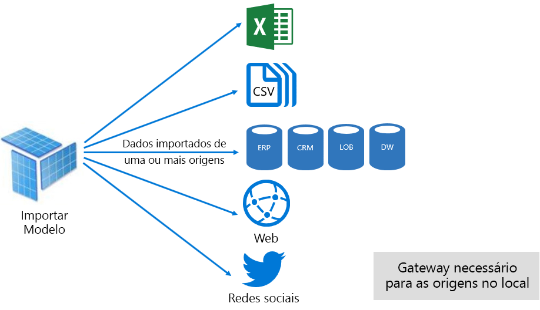

No entanto, embora haja vantagens atraentes associadas a modelos de importação, há desvantagens demasiado:

- A todo o modelo têm de ser carregado na memória antes do Power BI possa consultar o modelo, que pode colocar a pressão em recursos disponíveis à medida que aumentam o número e tamanho de modelos
- Dados de modelo são as mais atuais a atualização mais recente, e, portanto, importar modelos a ser atualizado, preferencialmente com base numa agenda
- Uma atualização completa irá remover todos os dados de todas as tabelas e recarregá-lo a partir da origem de dados. Isso pode ser muito caro em termos de tempo e recursos para o serviço Power BI e as origens de dados. Power BI tem suporte para atualização incremental que pode evitar truncar e recarregando tabelas completas e tudo isso é explicado no [Optimizing Power BI-Hosted modelos](#optimizing-power-bi-hosted-models) tópico.

De uma perspectiva de recursos de serviço do Power BI, necessitam de modelos de importação:

- Memória suficiente para carregar o modelo quando ele é consultado ou atualizado
- Recursos de processamento e recursos de memória adicional para atualizar os dados

#### Modo DirectQuery

Modelos desenvolvidos no modo DirectQuery (DQ) não importe dados. Em vez disso, eles consistem apenas de metadados que quando consultado consultas nativas de problemas para a origem de dados subjacente.

Existem dois motivos principais a considerar o desenvolvimento de um modelo DQ. O primeiro motivo é quando os volumes de dados são demasiado grandes - mesmo quando os métodos de redução de dados são aplicados - carregar para um modelo ou praticamente de atualização. O segundo motivo é quando precisam de relatórios e dashboards "quase em tempo real" de dados, além do que pode ser conseguido dentro dos limites de atualização agendada (48 vezes por dia para uma capacidade dedicada).

Existem várias vantagens associadas com modelos DQ:

- Limites de tamanho do modelo de importação não se aplicam
- Modelos não necessitam de atualização
- Os utilizadores de relatório irão ver os dados mais recentes ao interagir com filtros de relatório e segmentações de dados e pode atualizar todo o relatório para obter dados atuais
- Mosaicos do dashboard, quando baseadas em modelos DQ, podem atualizar automaticamente com uma frequência de 15 em 15 minutos

No entanto, existem várias desvantagens e limitações associadas a modelos DQ:

- O modelo deve basear-se numa origem de dados de suporte único e, portanto, qualquer integração de dados já deve ser obtida na origem de dados. Origens de dados suportadas são sistemas relacionais e análise, com suporte para muitos arquivos de dados populares \[ [7](#endnote-07)\].
- Desempenho pode ser lento, afetar negativamente potencialmente no serviço Power BI (consultas podem ser muito intensiva da CPU) e na origem de dados (que não pode ser otimizada para consultas de análise)
- Consultas do Power Query não podem ser excessivamente complexas e estão limitadas a expressões de M e funções que podem ser transpostas para consultas nativas compreendidas pela origem de dados
- As funções DAX são limitadas às que pode ser transportada para consultas nativas compreendidas pela origem de dados e não há suporte para as tabelas calculadas ou capacidades incorporadas de análise de tempo
- Por predefinição, as consultas de modelo que exigem a obtenção de mais de um milhão de linhas irão falhar
- Relatórios e dashboards com vários elementos visuais podem apresentar resultados inconsistentes, especialmente quando a origem de dados é volátil
- As perguntas e respostas e informações rápidas não são suportadas

De uma perspectiva de recursos de serviço do Power BI, modelos DQ exigem:

- Um mínimo de memória para carregar o modelo (apenas de metadados) quando forem solicitadas
- Recursos, por vezes, significativa do processador para gerar e processar consultas enviadas para a origem de dados

Para obter mais informações, consulte a [Use Direct Query no Power BI Desktop](desktop-use-directquery.md) documento.

#### Modo composto

Modelos desenvolvidos no Composite mode permitem configurar o modo de armazenamento de tabelas de modelo individuais. Ele oferece suporte, portanto, uma combinação de importação e tabelas DQ. Também suporta várias origens de dados DQ e de tabelas calculadas (definidas com o DAX).

Modo de armazenamento de tabela pode ser configurado como Import, DirectQuery ou dupla. Uma tabela configurada como modo de armazenamento dupla é importar e DirectQuery, e isso permite que o serviço Power BI determinar o modo mais eficiente a utilizar uma base de consulta por consulta.

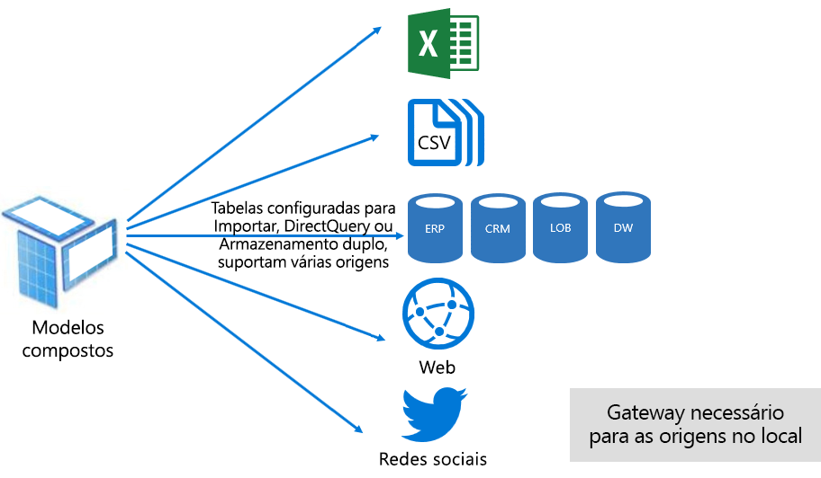

Modelos de compostos se esforçar entregar o melhor dos modos de importação e DirectQuery. Quando configurado adequadamente eles podem combinar o desempenho de consulta elevado dos modelos de dentro da memória com a capacidade de recuperar dados em tempo real de origens de dados quase.

Modeladores de dados que desenvolvem modelos compostos são provável que configurar tabelas de tipo de dimensão na importação ou dupla modo e o tipo de fato as tabelas de armazenamento no modo DirectQuery. Por exemplo, considere um modelo com uma tabela do tipo de dimensão de produto no modo duplo e uma tabela do tipo de fatos de vendas no modo DirectQuery. A tabela de produto pode ser consultada com eficiência e rápida de dentro da memória para processar uma segmentação de dados do relatório. A tabela de vendas, em seguida, pode ser consultada no modo DirectQuery associado para a tabela relacionada do produto. A última consulta foi possível ativar a geração de uma única consulta nativa eficiente para associar as tabelas de produtos e vendas e a filtragem pelos valores de segmentação de dados.

Em geral, as vantagens e desvantagens, associadas a cada modo de modelo podem ser consideradas a aplicar ao modo de armazenamento de tabela em modelos compostos.

Para obter mais informações, consulte a [utilizar modelos compostos no Power BI Desktop](desktop-composite-models.md) documento.

### Licensing

O Power BI tem três licenças:

- Power BI Gratuito
- Power BI Pro
- Power BI Premium

O **Power BI gratuito** licença permite a uma pessoa iniciar sessão no serviço Power BI e funcionam em sua área de trabalho pessoa ao publicar modelos e relatórios. É importante compreender que não é possível compartilhar o conteúdo do Power BI através desta licença. Esta licença, como o nome sugere, é gratuita.

O **Power BI Pro** licença permite a uma pessoa criar e colaborar nas áreas de trabalho de aplicação e partilhar e distribuir o Power BI conteúdo. Também pode configurar a atualização de seus conjuntos de dados manter automaticamente dados atual, incluindo a partir de origens de dados no local. Além disso, pode auditar e regular a como os dados são acedidos e utilizados. Esta licença é necessária para receber o conteúdo partilhado de outros utilizadores, a menos que o utilizador está associado com uma capacidade dedicada do Power BI Premium.

O **Power BI Premium** licença é uma licença de inquilinos e é abordada no [apresentando o Power BI Premium](#introducing-power-bi-premium) secção.

Para obter mais informações sobre o licenciamento do Power BI, consulte a [preços do Power BI](https://powerbi.microsoft.com/pricing/) página.

## Introdução ao Power BI Premium

O Power BI Premium oferece uma plataforma de BI de Self-Service e o enterprise unificada com dimensionamento, desempenho fiável e custos previsíveis. Ela principalmente consegue isso fornecendo recursos dedicados para executar o serviço Power BI para a sua organização.

Além disso, o Power BI Premium oferece muitos recursos da empresa:

- Distribuição de conteúdo econômica, permitindo que a partilha de conteúdo do Power BI para utilizadores do Power BI gratuito ilimitados, incluindo utilizadores externos
- Suporte para tamanhos de conjunto de dados maiores \[ [8](#endnote-08)\]
- Taxas de atualização mais elevadas de fluxos de dados e conjuntos de dados (até 48 horas por dia)
- Atualização incremental de fluxos de dados e conjuntos de dados
- Entidades de fluxo de dados ligado e execução paralela de transformações
- Relatórios paginados
- Power BI Report Server, para relatórios no local
- Capacidade de incorporar o conteúdo em aplicações em nome dos utilizadores da aplicação (PaaS)

Muitas destas funcionalidades podem ser utilizadas para fornecer soluções de empresa eficientes e dimensionáveis e são abordadas a [otimizando as capacidades de Premium](#optimizing-premium-capacities) secção.

### As subscrições e licenciamento

O Power BI Premium é uma subscrição do Office 365 de inquilinos disponível em duas famílias de SKU (Stock manutenção unidade):

- **EM** SKUs (EM1-EM3) para incorporar, que requerem um compromisso anual, faturados mensalmente
- **P** SKUs (P1-P3) para recursos de incorporação e enterprise, exigindo um compromisso mensal ou anualmente, faturados mensalmente e inclui uma licença para instalar o Power BI Report Server no local

Uma abordagem alternativa é comprar uma subscrição do Azure Power BI Embedded, que tem uma única família SKU: **A** SKUs (A1-A6) para incorporar e capacidade apenas a fins de teste.

Núcleos virtuais para criar as capacidades de entrega de todos os SKUs \[ [9](#endnote-09)\], mas os EM SKUs são restritos para incorporação de escala mais pequena. Embora seja o foco deste White Paper sobre os SKU P, grande parte o que é abordado também é relevante também para os SKUs.

Em contraste com a subscrição Premium SKUs, SKUs do Azure requerem sem compromisso de tempo e são cobradas à hora. Eles fornecem elasticidade completa, permitindo dimensionamento cópia de segurança, reduzir verticalmente, colocar em pausa, retomam e eliminam.

É de de Power BI Embedded do Azure em grande parte fora do escopo deste White Paper, mas ele é abordado no tópico abordagens do teste como uma opção económica e prática para testar e avaliar cargas de trabalho.

Para obter mais informações sobre os SKUs do Azure, consulte a [documentação do Azure Power BI Embedded](/azure/power-bi-embedded/).

As subscrições do Power BI Premium são compradas por administradores no Centro de administração do Microsoft 365. Especificamente, apenas administradores de faturação ou administradores globais do Office 365 podem comprar SKUs.

Assim que forem adquiridas, o inquilino recebe um número correspondente de núcleos virtuais para atribuir a capacidades - isto é conhecido como **agrupamento de núcleos virtuais**. Por exemplo, a compra de uma P3 SKU fornece ao inquilino 32 núcleos.

Para obter mais informações, consulte a [como comprar o Power BI Premium](service-admin-premium-purchase.md) documento.

### Capacidades Premium

Em contraste com uma capacidade partilhada, onde as cargas de trabalho executado em recursos informáticos partilhados com outros clientes, uma **capacidade dedicado** é para utilização exclusiva por uma organização. É isolado com recursos dedicados de computacionais que apresentam um desempenho fiável e consistente para o conteúdo alojado.

É o foco deste White Paper **capacidade Premium** , que significa que está associado a qualquer um dos EM ou P SKUs.

#### Nós de capacidade

Conforme descrito em subscrições e licenciamento por tópico, há duas famílias de SKU do Power BI Premium: EM e P. Todos os SKUs de Premium de Power BI estão disponíveis como nós de capacidade, com cada um representando uma quantidade de conjunto de recursos que consiste de processador, memória e armazenamento. Além de recursos, cada SKU tem operacionais limites no número de ligações de DirectQuery (DQ) e ligação em direto (LC) por segundo e o número de modelo paralelo é atualizada.

Processamento é obtido por um determinado número de núcleos virtuais, dividido igualmente entre o back-end e front-end.

**Núcleos de back-end** são responsáveis pela funcionalidade do Power BI principal, incluindo processamento de consultas, gestão de cache, executar os serviços R, atualização de modelo, processamento de linguagem natural (perguntas e respostas) e composição do lado do servidor de relatórios e imagens. Núcleos de back-end são atribuídos uma quantidade fixa de memória que é principal utilizado para modelos de host, que também são referidos como conjuntos de dados Active Directory.

**Núcleos de front-end** são responsáveis por web service relatórios e dashboards, gestão de documentos, gestão de direitos de acesso, agendamento, APIs, carrega e transfere e geralmente para tudo relacionado ao usuário experiências.

Armazenamento está definido para 100 TB por nó de capacidade.

Os recursos e os limites de cada SKU Premium (e tamanho de maneira equivalente A SKU) estão descritas na tabela seguinte.

| Nós de capacidade | Núcleos virtuais totais | Núcleos virtuais de back-end | RAM (GB) | Núcleos virtuais de front-end | DQ/LC (por seg) | Paralelismo de atualização do modelo |
| --- | --- | --- | --- | --- | --- | --- |
| EM1/A1 | 1 | 0,5 | 2.5 | 0,5 | 3.75 | 1 |
| EM2/A2 | 2 | 1 | 5 | 1 | 7.5 | 2 |
| EM3/A3 | 4 | 2 | 10 | 2 | 15 | 3 |
| P1/A4 | 8 | 4 | 25 | 4 | 30 | 6 |
| P2/A5 | 16 | 8 | 50 | 8 | 60 | 12 |
| P3/A6 | 32 | 16 | 100 | 16 | 120 | 24 |
| | | | | | | |

#### Cargas de trabalho de capacidade

Cargas de trabalho de capacidade são disponibilizados aos utilizadores de serviços. Por predefinição, as capacidades Premium e o Azure suportam apenas uma conjunto de dados carga de trabalho associada à execução de consultas do Power BI que não podem ser desativadas.

Cargas de trabalho adicionais podem ser ativadas para os relatórios paginados, fluxos de dados e IA. Cada carga de trabalho adicional necessita de configurar a memória máxima (como percentagem do total de memória disponível), que pode ser utilizada pela carga de trabalho.

#### Como funcionam as capacidades

Durante todo o tempo, o serviço Power BI se esforça para fazer o melhor uso de recursos de capacidade, enquanto não exceder os limites de imposto na capacidade.

Operações de capacidade são classificadas como interativo ou em segundo plano. Operações interativas incluem o processamento de pedidos e responder a interações de utilizador (filtragem, consultar as perguntas e respostas, etc.). Em geral, consultar de modelo de importação é memória com muitos recursos, embora consultar modelos de LC/DQ seja intensiva da CPU. Operações em segundo plano incluem o fluxo de dados e importar as atualizações de modelo e colocação em cache de consulta de dashboard.

É importante compreender que operações interativas estão sempre priorizadas em relação de operações em segundo plano para garantir a experiência de utilizador melhor possível. Se existirem recursos suficientes, operações em segundo plano são adicionadas a uma fila para processamento quando libertam de recursos. Operações em segundo plano, como atualizações de conjunto de dados e funções de IA, podem ser parado meio do processo pelo serviço do Power BI e adicionada a uma fila.

Modelos de importação tem de ser totalmente carregados na memória, de modo a que pode ser consultadas ou atualizadas. O serviço Power BI gerencia a memória utilização utilizando algoritmos para garantir o máximo proveito da memória disponível sofisticados e pode alcançar a capacidade de sobreconsolidação: Embora seja possível para uma capacidade para armazenar a importação de muitos modelos (até 100 TB por capacidade Premium), quando o respetivo armazenamento de disco combinado excede a memória suportada (e memória adicional é necessária para consulta e atualização), em seguida, não podem todos ser carregados na memória em ao mesmo tempo.

Modelos de importação, portanto, são carregados no - e removidos - memória, de acordo com utilização. Um modelo de importação é carregado quando é consultada (operação interativa) e ainda não na memória, ou quando está a ser atualizado (operação de fundo).

A remoção de um modelo de memória é conhecida como **expulsão** , e é uma operação que o Power BI pode realizar rapidamente, dependendo do tamanho dos modelos. Se a capacidade não está a experienciar qualquer pressão de memória, os modelos são simplesmente carregados na memória e permanecem lá. \[[10](#endnote-10) \] no entanto, quando a memória insuficiente está disponível para carregar um modelo, o serviço Power BI primeiro precisará libertar memória. Isso libera memória através da deteção de modelos que se tornaram Inativos por procurar modelos, que não foram utilizados nos últimos três minutos \[ [11](#endnote-11)\]e, em seguida, expulsá-los. Se não existirem não existem modelos Inativos para expulsar, o serviço Power BI procura modelos carregados para operações em segundo plano expulsar. Isto pode incluir a expulsão de cargas de trabalho em segundo plano, como a carga de trabalho de IA. Um último recurso, após 30 segundos de tentativas falhadas \[ [11](#endnote-11)\], está a falhar a operação interativa. Neste caso, o utilizador de relatório com elegância é notificado da falha com uma sugestão para tentar novamente em breve.

É importante ressaltar que expulsão de conjunto de dados é um comportamento normal e esperado. Esforça-se para maximizar a utilização da memória pelo carregamento e o descarregamento modelos cujos tamanhos combinados podem exceder a memória disponível. É por design e completamente transparente para os utilizadores de relatório. As taxas de expulsão alta não significa necessariamente que a capacidade é isolá resourced. Eles podem, no entanto, se tornar uma preocupação se sofrer uma capacidade de resposta de consulta ou atualização devido a taxas de expulsão elevada.

As atualizações de modelos de importação são sempre elevado consumo de memória como modelos têm de ser carregados na memória e memória adicional é necessária para o processamento. Uma atualização completa pode utilizar aproximadamente dobra a quantidade de memória, o modelo precisa. Isto garante que o modelo pode ser consultado durante o processamento (consultas são enviadas para o modelo existente, até que a atualização foi concluída e estão disponíveis novos dados de modelo). Tenha em atenção que a atualização incremental exigirá menos memória e foi possível concluir com mais rapidez e por isso, pode reduzir substancialmente pressão nos recursos de capacidade. As atualizações também podem ser intensiva da CPU para modelos, especialmente aqueles com transformações complexas do Power Query ou tabelas/colunas calculadas que são complexas ou baseiam-se em tabelas grandes.

As atualizações - como consultas - exigem que o modelo ser carregado na memória. Se existir memória insuficiente, o serviço Power BI tentará Inativos modelos expulsar e, se não for possível (como todos os modelos são Active Directory), a tarefa de atualização é colocada na fila. As atualizações são geralmente muito intensiva da CPU, ainda mais assim que as consultas. Por esse motivo, existem limites no número de atualizações em simultâneo, definido como 1,5 vezes o número de back-end núcleos virtuais, arredondados por excesso de capacidade. Se existirem demasiadas atualizações em simultâneo, uma atualização agendada será colocado em fila. Quando estas situações ocorrerem, demora mais tempo para a atualização concluir. Tenha em atenção que as atualizações a pedido (que é acionadas por um pedido de utilizador ou uma chamada à API) tentará três vezes \[ [11](#endnote-11)\]e, em seguida, falhar se ainda não existem recursos suficientes.

## Gerir o Power BI Premium

Gerir o Power BI Premium envolve a aquisição de assinaturas, criar, gerir e monitorizar capacidades Premium.

### Criar e gerir as capacidades

O **definições de capacidade** página do **administrador do Power BI** Portal apresenta o número de núcleos virtuais comprados e está disponível (ou seja, ainda que seja atribuído a uma capacidade) e apresenta uma lista de capacidades Premium. A página permite que os administradores de serviços os administradores globais do Office 365 ou Power BI para criar capacidades Premium a partir de núcleos virtuais disponíveis ou para modificar as capacidades de Premium existentes.

Ao criar uma capacidade Premium, é necessário que o administrador definir:

- Nome da capacidade (exclusivo no inquilino)
- Capacidade admin(s)
- Tamanho da capacidade
- Região para residência de dados \[ [12](#endnote-12)\]

Tem de ser atribuído pelo menos um administrador de capacidade. Os utilizadores atribuídos como administradores de capacidade podem:

- Atribuir áreas de trabalho à capacidade
- Gerir permissões de utilizador, para adicionar os administradores de capacidade ou utilizadores com permissões de atribuição (para que eles possam atribuir áreas de trabalho à capacidade) adicionais
- Gerir cargas de trabalho, para configurar a utilização de memória máxima para relatórios paginados e cargas de trabalho de fluxos de dados
- Reinicie a capacidade, para repor todas as operações em caso de sobrecarga de sistema \[ [13](#endnote-13)\]

Os administradores de capacidade não é possível aceder ao conteúdo da área de trabalho (a menos que explicitamente atribuídas permissões de área de trabalho) e não têm acesso a todas as áreas de administração do Power BI (a menos que explicitamente atribuídos), como a métrica de utilização, registos de auditoria ou as definições de inquilino. Importante, os administradores de capacidade não tem permissões para criar novas capacidades ou aumentar as capacidades existentes. Além disso, são atribuídos num por base da capacidade, garantindo que eles só podem ver e gerir as capacidades ao qual são atribuídos.

Tamanho da capacidade tem de selecionar a partir de uma lista de opções de SKU disponíveis que é restrita pelo número de núcleos virtuais disponíveis no conjunto. É possível criar vários recursos do conjunto que foi obtido a partir de um ou mais adquirido SKUs. Por exemplo, um SKU P3 (32 núcleos) poderiam ser usados para criar as capacidades de três: um P2 (16 núcleos) e P1 duas (2 x 8 núcleos). Melhoria do desempenho e dimensionamento podem ser conseguidos através da criação de menores tamanho capacidades e este tópico é discutido com o [otimizando as capacidades de Premium](#optimizing-premium-capacities) secção. A imagem seguinte mostra um exemplo de configuração para a organização Contoso fictícia consiste em cinco capacidades de Premium (3 x P1 e 2 x P3) com cada áreas de trabalho de aplicação que contém e várias áreas de trabalho na capacidade partilhada.

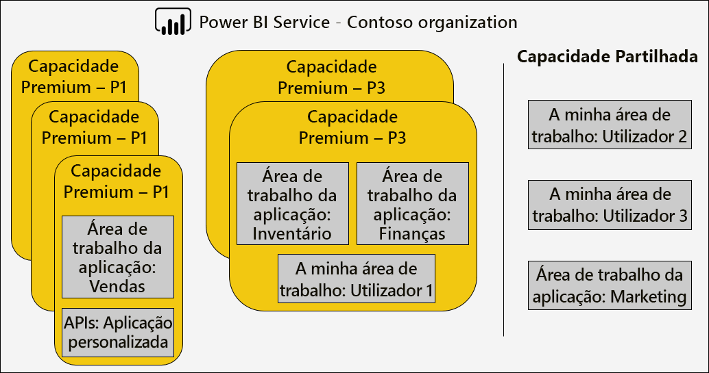

Uma capacidade Premium pode ser atribuída a uma região diferente da região base do inquilino do Power BI, fornecer controle administrativo sobre quais centros de dados (dentro de regiões geográficas definidas) o conteúdo do Power BI reside. \[[12](#endnote-12)\]

Os administradores de serviço do Power BI e os administradores globais do Office 365, podem modificar capacidades Premium. Especificamente, pode:

- Altere o tamanho da capacidade de aumentar ou reduzir verticalmente os recursos. No entanto, não é possível mudar um P SKU para um EM SKU ou atualizar o contrário.
- Adicionar ou remover os administradores de capacidade
- Adicionar ou remover utilizadores que têm permissões de atribuição
- Adicionar ou remover as cargas de trabalho adicionais
- Regiões de alteração

São necessárias permissões de atribuição para atribuir uma área de trabalho a uma capacidade Premium específica. Podem ser concedidas as permissões para a toda a organização, utilizadores ou grupos específicos.

Por predefinição, as capacidades Premium suportam cargas de trabalho associadas à execução de consultas do Power BI. Ele também oferece suporte a três cargas de trabalho adicionais: **Relatórios paginados**, **fluxos de dados**, e **IA**. Cada carga de trabalho necessita de configurar a memória máxima (como percentagem do total de memória disponível), que pode ser utilizada pela carga de trabalho. É importante compreender que as alocações de memória máximo de aumento podem causa um impacto sobre o número de modelos de Active Directory que pode ser alojada e a taxa de transferência de atualizações.

A memória é alocada dinamicamente aos fluxos de dados, mas é alocada estaticamente aos relatórios paginados. O motivo para alocar estaticamente a memória máxima é que os relatórios paginados são executadas dentro de um espaço contido seguro da capacidade. Deve ter cuidado ao definição paginados memória de relatórios, pois reduz a memória disponível para carregar os modelos.

|                     | EM3                      | P1                       | P2                      | P3                       |
|---------------------|--------------------------|--------------------------|-------------------------|--------------------------|
| Relatórios paginados | N/D | 20% predefinido; 10% mínimo | 20% predefinido; 5% mínimo | 20% predefinido; 2,5% mínimo |
| Fluxos de dados | 20% predefinido; 8% mínimo  | 20% predefinido; 4% mínimo  | 20% predefinido; 2% mínimo | 20% predefinido; 1% mínimo  |
| AI | N/D | padrão de 20%. mínimo de 20%  | 20% predefinido; 10% mínimo | 20% predefinido; 5% mínimo  |
| | | | | |

A eliminar uma capacidade Premium, é possível e não resultará na eliminação do seus espaços de trabalho e o conteúdo. Em vez disso, ele será movido qualquer áreas de trabalho atribuídas à capacidade partilhada. Quando a capacidade de Premium foi criada numa região diferente, a área de trabalho será movida para uma capacidade partilhada da região principal.

### Atribuir áreas de trabalho para as capacidades

Áreas de trabalho podem ser atribuídas a uma capacidade Premium no **administrador do Power BI** **Portal** ou - a para uma área de trabalho de aplicação - na **área de trabalho** painel.

Os administradores de capacidade, bem como os administradores globais do Office 365 ou administradores de serviço do Power BI, podem efetuar em massa atribuir áreas de trabalho no **administrador do Power BI** **Portal**. Em massa atribuída pode aplicar a:

- **Áreas de trabalho por utilizadores** : Todas as áreas de trabalho pertencentes esses utilizadores, incluindo espaços de trabalho pessoas, são atribuídas à capacidade Premium. Isto incluirá a reatribuição de áreas de trabalho quando já estão atribuídos a uma capacidade Premium diferente. Além disso, os utilizadores também recebem permissões de atribuição de área de trabalho.

- **Áreas de trabalho específicas**
- **Áreas de trabalho do toda a organização** : Todas as áreas de trabalho, incluindo espaços de trabalho pessoas, são atribuídas à capacidade Premium. Além disso, todos os utilizadores atuais e futuros são atribuídos as permissões de atribuição de área de trabalho. \[[14](#endnote-14)\]

Uma área de trabalho pode ser adicionada a uma capacidade Premium ao utilizar o **área de trabalho** painel fornecendo ao usuário é um administrador de área de trabalho e tem as permissões de atribuição.

Os administradores de área de trabalho podem remover uma área de trabalho a partir de uma capacidade (para capacidade partilhada) sem a necessidade de permissão de atribuição. Remover áreas de trabalho de capacidades dedicadas com eficiência, a área de trabalho pois realoca para capacidade partilhada. Tenha em atenção que a remoção de uma área de trabalho da capacidade Premium pode ter conseqüências negativas, resultando, por exemplo, no conteúdo partilhado se tornar indisponível para o Power BI gratuito licenciado utilizadores ou a suspensão de atualização agendada, quando eles excedem as concessões suportadas por capacidades partilhadas.

No serviço Power BI, uma área de trabalho atribuída a uma capacidade Premium é facilmente identificada por terem o ícone de diamante adorns o nome de área de trabalho.

### As capacidades de monitorização

Monitorização de capacidades Premium fornece aos administradores uma compreensão de como as capacidades estão a funcionar. As capacidades podem ser monitorizadas com o [aplicação de métricas de capacidade do Power BI Premium](service-admin-premium-monitor-capacity.md) ou o [portal de administração do Power BI](service-admin-premium-monitor-portal.md).

#### Interpretando métricas

As métricas devem ser monitorizadas para estabelecer uma compreensão de linha de base da atividade de carga de trabalho e de utilização de recursos. Se a capacidade se torna lenta, é importante compreender as métricas para monitorizar e as conclusões pode fazer.

O ideal é que consultas devem ser concluído dentro de um segundo para proporcionar experiências de reativas para utilizadores de relatórios e ativar um maior débito de consulta. Geralmente é uma preocupação menor quando processos em segundo plano - incluindo atualizações - tempos mais longos para concluir.

Em geral, os relatórios lentos podem ser uma indicação de uma capacidade de excesso de aquecimento.... Quando relatórios falhem ao carregar, esta é uma indicação de uma capacidade de excesso exaltada. Em qualquer situação, a causa raiz pode ser atribuíveis vários fatores, incluindo:

- **Consultas falhadas** certamente indicar pressão de memória e que não foi possível carregar um modelo na memória. O serviço Power BI irá tentar carregar um modelo para 30 segundos antes de falhar.

- **Tempos de espera de consulta excessiva** pode ser devido a vários motivos:
  - A necessidade do serviço Power BI para o primeiro expulsar o modelo (s) e, em seguida, carregar o modelo to-be-consultados (Lembre-se que superior taxas de expulsão de conjunto de dados autónomos não são uma indicação de estresse de capacidade, a menos que acompanhado por muito tempo consulta tempos de espera que indicam a degradação de memória)
  - Carga do modelo vezes (especialmente a espera para carregar um modelo de grandes na memória)
  - Consultas de execução longa
  - Demasiadas ligações de LC\DQ (exceder os limites de capacidade)
  - Saturação de CPU
  - Designs de relatório complexos com um número excessivo de elementos visuais numa página (Lembre-se que cada elemento visual é uma consulta)
- **Durações de consulta longo** pode indicar que os designs de modelo não são otimizados, especialmente quando vários conjuntos de dados não estão ativos numa capacidade e apenas um conjunto de dados é produzir longa durações de consulta. Isso sugere que a capacidade é suficientemente resourced e de que o conjunto de dados na pergunta é apenas lenta ou abaixo do ideal. Consultas de longa execução pode ser problemático, como eles podem bloquear o acesso aos recursos necessários por outros processos.
- **Tempos de espera de atualização longo ou tempos de espera de chamada de IA** indica memória insuficiente devido a vários modelos de Active Directory a consumir memória ou que uma atualização problemática está a bloquear o outro é atualizada (exceder atualização paralela limites).

Uma explicação mais detalhada de como utilizar as métricas é abordada em seguida a [otimizando as capacidades de Premium](#optimizing-premium-capacities) secção.

## Otimizar as capacidades Premium

Sempre que surgem problemas de desempenho de capacidade Premium, uma abordagem de primeiro comum é otimizar ou otimizar já implementadas soluções para restaurar os tempos de resposta aceitável. A lógica de substituir é evitar a aquisição de capacidade de Premium adicional, a menos que ele pode ser justificado.

Quando a capacidade de Premium adicional é necessária, existem duas opções que serão discutidas posteriormente nesta secção:

- Aumentar verticalmente a capacidade de Premium
- Adicionar uma nova capacidade Premium

Por fim, a testes de abordagens e dimensionamento de capacidade de Premium estará concluída esta secção.

### Melhores práticas do geral

Quando tentando alcançar melhor desempenho lá e a utilização se algumas melhores práticas que podem ser consideradas juntando recomendações gerais. Incluem-se:

- Com áreas de trabalho de aplicação em vez de áreas de trabalho pessoas
- Separar crítico para a empresa e de BI de autoatendimento (SSBI) em diferentes capacidades

  

- Se a partilha de conteúdo apenas com utilizadores do Power BI Pro, poderão existir sem a necessidade de armazenar o conteúdo numa capacidade dedicada
- Utilizar as capacidades dedicadas quando procuram para alcançar uma hora de atualização específico ou quando são necessários, por exemplo, grandes conjuntos de dados de funcionalidades específicas ou paginado reporting

### Responder a questões comuns

Otimizar as implementações do Power BI Premium é um tópico complexo que envolvem uma compreensão dos requisitos de carga de trabalho, os recursos disponíveis e seu uso Efetivo.

Este tópico aborda sete perguntas de suporte comuns, que descreve os possíveis problemas e explicações e informações sobre como identificar e a resolvê-los.

#### Por que é a capacidade lenta e que posso fazer?

Existem muitos motivos pelos quais podem contribuir para uma capacidade Premium lenta. Essa questão requer mais informações para compreender o que se entende por lenta. São relatórios lento a carregar? Ou falham ao carregar? Elementos visuais do relatório são lentas carregar ou atualizar quando os utilizadores interagem com o relatório? As atualizações são demorar mais tempo a concluir que o esperado ou anteriormente experimentado?

Tendo obtido um entendimento do motivo, pode, em seguida, começar a investigar. As respostas às seguintes seis perguntas ajuda-o a resolver mais problemas específicos.

#### O conteúdo que está a utilizar a minha capacidade?

Pode utilizar o **métricas de capacidade do Power BI Premium** aplicação para filtrar por capacidade e reveja as métricas de desempenho para o conteúdo da área de trabalho. É possível rever a utilização de recursos e as métricas de desempenho por hora nos últimos sete dias para todos os conteúdos armazenados dentro de uma capacidade Premium. Isto é, muitas vezes, o primeiro passo a tomar quando uma preocupação geral sobre o desempenho de capacidade de Premium de resolução de problemas.

As principais métricas para monitorizar incluem:

- CPU média e contagem de alta utilização
- Média de memória e a contagem de alta utilização e a utilização de memória para conjuntos de dados específicos, fluxos de dados e relatórios paginados
- Active Directory conjuntos de dados carregados na memória
- Durações de consulta máxima e média
- Tempos de espera médio de consulta
- Conjunto de dados de média e fluxo de dados são atualizados vezes
- IA média chamar vezes e tempos de espera

Além disso, a aplicação de métricas de capacidade Premium do Power BI, memória Active Directory mostra a quantidade total de memória atribuída a um relatório que não pode ser expulsas porque está a ser utilizado nos últimos três minutos. Um pico alta no tempo de espera da atualização pode ser correlacionado com um conjunto de dados grandes e/ou Active Directory.

O gráfico "5 principais por duração média" destaca os cinco principais conjuntos de dados, relatórios paginados, fluxos de dados e as chamadas de IA consumir recursos de capacidade. Conteúdo nas listas de cinco principais são candidatos para a otimização de investigação e possíveis.

#### Por que motivo são relatórios lento?

As tabelas seguintes mostram os possíveis problemas e formas de identificar e manipulá-las.

##### Recursos de capacidade insuficiente

| Explicações possíveis | Como identificar | Como resolver |
| --- | --- | --- |
| Memória total Active Directory (modelo não pode ser expulsas porque está a ser utilizado nos últimos três minutos)   Vários picos elevados de tempos de espera de consulta   Vários picos elevados de tempos de espera da atualização | Monitorizar as métricas de memória \[ [18](#endnote-18)\]e contagens de expulsão \[ [19](#endnote-19)\] | Diminuir o tamanho do modelo, ou converter para o modo DirectQuery - consulte o [otimizar modelos](#optimizing-models) tópico nesta secção   Aumentar verticalmente a capacidade   Atribua o conteúdo a uma capacidade diferente |

##### Designs de relatório ineficiente

| Explicações possíveis | Como identificar | Como resolver |
| --- | --- | --- |
| Páginas de relatório contêm vários elementos visuais (filtragem interativo pode acionar, pelo menos, uma consulta por elemento visual)   Os elementos visuais recuperar mais dados que o necessário | Reveja os designs de relatório   Utilizadores de relatórios de entrevista para compreender a forma como interagem com os relatórios   Monitorizar as métricas de consulta do conjunto de dados \[ [20](#endnote-20)\] | Relatórios de reformulação com elementos visuais menos por página |

##### Conjunto de dados lenta (especialmente quando relatórios anteriormente efetuou bem)

| Explicações possíveis | Como identificar | Como resolver |
| --- | --- | --- |
| Cada vez mais grandes volumes de dados de importação   Lógica de cálculo complexo ou ineficaz, incluindo funções RLS   Modelo não totalmente otimizado   (DQ/LC) Latência de gateway   Lentos tempos de resposta de consulta a origem DQ | Reveja os designs de modelo   Contadores de desempenho do gateway de monitor | Consulte a [otimizar modelos](#optimizing-models) tópico nesta secção |

##### Utilização elevada de relatório em simultâneo

| Explicações possíveis | Como identificar | Como resolver |
| --- | --- | --- |
| Tempos de espera de consulta elevado   Saturação de CPU   Limites de conexão de DQ/LC excedidos | Monitorizar a utilização da CPU \[ [21](#endnote-21)\], tempos de espera de consulta e a utilização de DQ/LC \[ [22](#endnote-22) \] métricas + durações de consulta – se a flutuar pode indicar problemas de simultaneidade | Aumentar a capacidade ou atribuir o conteúdo a uma capacidade diferente   Relatórios de reformulação com elementos visuais menos por página |

#### Por que motivo são relatórios não está carregando?

Quando a ativação de relatórios para carregá-lo é um cenário mais desfavorável e um início de sessão-se de que a capacidade não tem memória suficiente e é excessivamente exaltada. Isto pode ocorrer quando todos os modelos de carregá-lo são ativamente a ser consultados e por isso, não podem ser expulsas e quaisquer operações de atualização foram colocadas em pausa ou atrasadas. O serviço Power BI irá tentar carregar o conjunto de dados durante 30 segundos e o utilizador com elegância é notificado da falha com uma sugestão para tentar novamente em breve.

Não existe atualmente não existem métricas para monitorizar a existência de falhas de carregamento de relatório. Pode identificar o potencial para este problema, a memória do sistema de monitorização, especificamente mais altos de utilização e de tempo de maior utilização. Expulsões de conjunto de dados de alta e longo conjunto de dados tempo de espera médio de atualização poderiam sugerir que este problema está a ocorrer.

Se isto acontecer muito ocasionalmente, isso pode não ser considerado um problema de prioridade. Utilizadores de relatórios são informados de que o serviço está ocupado e que deve repetir após um curto período de tempo. Se isto acontecer com muita frequência, pode ser resolvido o problema, aumente verticalmente a capacidade de Premium ou ao atribuir o conteúdo a uma capacidade diferente.

Os administradores de capacidade (e os administradores de serviço do Power BI) pode monitorizar o **falhas nas consultas** métrica para determinar quando isso acontece. Eles também podem reiniciar a capacidade, repor todas as operações em caso de sobrecarga de system.

#### Por que as atualizações não começam numa agenda?

Horas de início da atualização agendada não são garantidas. Lembre-se de que o serviço Power BI sempre priorizar operações interativas sobre operações em segundo plano. A atualização é uma operação em segundo plano que pode ocorrer quando duas condições são cumpridas:

- Não existe memória suficiente
- O número de atualizações em simultâneo suportados para a capacidade de Premium não seja excedido

Quando as condições não forem cumpridas, a atualização é colocada na fila até que as condições são favoráveis.

Para uma atualização completa, lembre-se que, pelo menos, duas vezes o tamanho de memória atual do conjunto de dados é necessária. Se não está disponível memória suficiente, a atualização não é possível começar até que a expulsão de modelo liberta memória – Isto significa atrasos até que um ou mais conjuntos de dados torna-se inativo e podem ser expulso.

Lembre-se de que o número suportado de atualizações em simultâneo máximos é definido como 1,5 vezes os back-end núcleos virtuais, arredondados.

Uma atualização agendada irão falhar quando não é possível começar a antes da próxima atualização agendada começar. Uma atualização a pedido acionada manualmente a partir da interface do Usuário irá tentar executar até três vezes antes de falhar.

Os administradores de capacidade (e os administradores de serviço do Power BI) pode monitorizar o **média de atualização de tempo de espera (minutos)** métrica para determinar a latência média entre a hora agendada e o início da operação.

Embora não normalmente uma prioridade administrativa, para influenciar no tempo de dados for atualizado, certifique-se de que o está disponível memória suficiente. Isso pode envolver a isolar os conjuntos de dados para as capacidades com recursos suficientes conhecidos. Também é possível que os administradores podem coordenar com os proprietários de conjunto de dados para ajudar a escalonar ou reduzir os tempos de atualização de dados agendada para minimizar as colisões. Tenha em atenção que não é possível que um administrador para ver a fila de atualização, ou para recuperar as agendas de conjunto de dados.

#### Por que são atualizações lento?

As atualizações podem ser lentas - ou percebida lento (como os endereços de pergunta comum anterior).

Quando a atualização de fato estiver lenta, pode ser devido a vários motivos:

- CPU insuficiente (atualização pode ser muito intensiva da CPU)
- Memória insuficiente, resultando em atualização de colocar em pausa (que requer a atualização para começar de novo quando as condições são favoráveis para recommence)
- Motivos de não-capacidade, incluindo a capacidade de resposta de sistema de origem de dados, de latência de rede, de permissões inválidas ou de débito do gateway
- Volume de dados - um bom motivo para configurar incremental atualiza, tal como explicado abaixo

Os administradores de capacidade (e os administradores de serviço do Power BI) pode monitorizar o **duração média de atualização (minutos)** métrica para determinar um parâmetro de comparação para comparação ao longo do tempo e o **média de atualização de tempo de espera (minutos)** métricas para determinar a latência média entre média de atraso entre a hora agendada e o início da operação.

A atualização incremental pode reduzir significativamente o período de atualização de dados, especialmente para tabelas de modelos grandes. Existem quatro benefícios associados com atualização incremental:

- **As atualizações são mais rápidas** : Apenas um subconjunto de uma tabela precisa a utilização de CPU e memória de carregamento, redução e paralelismo pode ser superior ao atualizar várias partições
- **Apenas quando necessário, elas ocorrem** : Políticas de atualização incremental podem ser configuradas para carregar apenas quando os dados foram alterados
- **As atualizações são mais confiáveis** : As ligações em execução mais curtas para sistemas de origem de dados voláteis são menos suscetíveis a desativação
- **Modelos de permanecerem corte** : Políticas de atualização incremental podem ser configuradas para remover automaticamente o histórico para além de uma janela deslizante de tempo

Para obter mais informações, consulte a [Incremental atualizar no Power BI Premium](service-premium-incremental-refresh.md) documento.

#### Por que motivo são dados atualiza não concluir?

Quando a atualização de dados começa, mas não for concluída, pode ser devido a vários motivos:

- Memória insuficiente, mesmo que haja apenas um modelo na capacidade Premium, ou seja, o tamanho do modelo é muito grande
- Motivos de não-capacidade, incluindo dados de origem de desativação de sistema, permissões inválidas ou erros de gateway

Os administradores de capacidade (e os administradores de serviço do Power BI) pode monitorizar o **atualizar falhas devido a memória esgotada** métrica.

#### Por que são chamadas de IA a falhar?

Chamadas de IA podem falhar por vários motivos. A memória mínima necessária para iniciar a IA a carga de trabalho é 5 GB, mas isso pode não ser suficiente para alguns conjuntos de dados de entrada. Por exemplo, o automatizada aprendizagem de preparação de modelos requer, pelo menos, duas vezes e, às vezes, várias vezes o tamanho de conjunto de dados de entrada. Além disso, uma chamada de IA é terminada se demora mais de duas horas a concluir. Chamadas de treinamento de modelo não concluídas em duas horas, o melhor modelo encontrado nessas duas horas de aprendizado é devolvido para a máquina automatizada.  Chamadas de IA também podem ser interrompidas por pedidos interativos, que têm precedência.

Os administradores devem monitorar os tempos de espera de ia para detetar sinais de outros pedidos de precedência. Os administradores também podem garantir que existe memória suficiente para a carga de trabalho de IA em relação ao tamanhos de dados de entrada. Isso pode envolver o isolamento de cargas de trabalho de ia para as capacidades conhecidas por ter recursos suficientes. Também é possível que os administradores podem coordenar com os proprietários de fluxo de dados para ajudar a escalonar ou reduzir os tempos de atualização de fluxo de dados para minimizar as colisões. Tenha em atenção de que não é possível que um administrador para ver a fila de chamada de IA.

### Otimizar modelos

Design do modelo ideal é crucial para o fornecimento de uma solução eficiente e dimensionável. No entanto, é além do escopo deste White Paper fornece uma discussão completa. Em vez disso, esta secção irá fornecer áreas-chave para consideração aquando da otimização dos modelos.

#### Otimizar modelos de BI alojado de energia

Otimizar modelos alojados numa capacidade Premium podem ser alcançados nas camadas de origens e o modelo de dados.

Considere as possibilidades de otimização para um modelo de importação:

Na camada de origem de dados:

- Origens de dados relacional podem ser otimizadas para garantir que a atualização mais rápida possível ao previamente integrando dados, aplicar índices apropriados, definindo as partições de tabela que se alinham para períodos de atualização incremental e ao materializar os cálculos (em vez de calculados tabelas e colunas de modelo) ou adicionar lógica de cálculo a vistas
- Origens de dados não relacionais podem ser pré-integradas com repositórios relacionais
- Certifique-se de que os gateways têm recursos suficientes, preferencialmente, em máquinas dedicadas, com largura de banda de rede suficiente e próximos as origens de dados

Na camada do modelo:

- Designs de consulta do Power Query podem minimizar ou remover transformações complexas e especialmente aquelas que origens de dados diferentes (armazéns de dados atingir esse objetivo durante o estágio de Extract-Transform-Load) de intercalação. Além disso, garantindo que os níveis de privacidade de origem de dados adequadas estão definidos, isso pode evitar que seja necessário Power BI carregar os resultados completos para produzir um resultado combinado em consultas.
- A estrutura do modelo determina os dados para carregar e tem um impacto direto sobre o tamanho do modelo. Ele pode ser projetado para evitar o carregamento de dados desnecessários, removendo as colunas, remover as linhas (especialmente histórico de dados) ou com o carregamento de dados resumidos (às custas de carregar dados detalhados). Redução do tamanho dramática pode ser realizada removendo colunas de cardinalidade elevada (especialmente colunas de texto) que não armazenar ou comprimir de forma muito eficiente.
- Desempenho de consulta do modelo pode ser melhorado através da configuração de relações de direção única, exceto se houver uma razão convincente para permitir a filtragem bidirecional. Considere também utilizar a função CROSSFILTER em vez de filtragem bidirecional.
- Tabelas de agregação podem conseguir consulta rápida respostas carregando previamente resumidos dados, no entanto, isso aumentará o tamanho do modelo e resultado em tempos mais longos de atualização. Em geral, as tabelas de agregação devem ser reservadas para modelos grandes ou designs de modelo composto.
- As tabelas calculadas e colunas aumentam o tamanho do modelo e resultam em períodos de atualização. Um tamanho mais pequeno de armazenamento e a hora de atualização mais rápida em geral, podem ser obtidos quando os dados são materializados ou calculados na origem de dados. Se não for possível, usar colunas personalizadas do Power Query pode oferecer a compressão de armazenamento aperfeiçoados.
- Pode haver oportunidade de otimizar as expressões de DAX para medidas e regras RLS, talvez reescrever a lógica para evitar caras fórmulas
- A atualização incremental drasticamente pode reduzir o tempo de atualização e poupar memória e CPU. A atualização incremental também pode ser configurada para remover o histórico de dados mantendo os tamanhos de modelos compactação.
- Um modelo poderia ser recriado como dois modelos quando existem padrões de consulta diferentes e em conflito. Por exemplo, alguns relatórios agregados de alto nível presentes ao longo de todos os histórico e pode toleram a latência de 24 horas. Outros relatórios estão preocupados com os dados de hoje e precisam de acesso granular para transações individuais. Em vez de design de um único modelo para atender a todos os relatórios, criar dois modelos otimizados para cada requisito.

Considere as possibilidades de otimização para um modelo de DirectQuery. Como o modelo de problemas de pedidos de consulta para a origem de dados subjacente, otimização de origem de dados é fundamental para o fornecimento de consultas de modelo de capacidade de resposta.

 

Na camada de origem de dados:

- A origem de dados pode ser otimizada para garantir que o mais rápido possível consultar o integrando previamente dados (que não é possíveis na camada de modelo), aplicar os índices apropriados, a definição de partições de tabela, materializar resumidos dados (com exibições indexadas), e minimizar a quantidade de cálculo. A melhor experiência é obtida quando as consultas de pass-through precisam apenas filtrar e efetuar as junções internas entre indexada tabelas ou vistas.
- Certifique-se de que os gateways têm recursos suficientes, preferencialmente, em máquinas dedicadas, com largura de banda de rede suficiente e próximos à origem de dados

Na camada do modelo:

- Consulta do Power Query designs de preferência, não devem ser aplicada nenhuma transformação - caso contrário, tente manter as transformações reduzido ao mínimo
- Desempenho de consulta do modelo pode ser melhorado através da configuração de relações de direção única, exceto se houver uma razão convincente para permitir a filtragem bidirecional. Além disso, as relações de modelo devem ser configuradas para assumir integridade referencial é imposta (quando for este o caso) e irá resultar em consultas de origem de dados com associações internas mais eficientes (em vez das associações externas).
- Evite criar colunas personalizadas de consulta de Power Query ou coluna calculada do modelo - materializá-los na origem de dados, sempre que possível
- Pode haver oportunidade de otimizar as expressões de DAX para medidas e regras RLS, talvez reescrever a lógica para evitar caras fórmulas

Considere as possibilidades de otimização para um modelo composto. Lembre-se de que um modelo composto permite uma combinação de importação e DirectQuery tabelas.

- Em geral, os tópicos de otimização para modelos de importação e DirectQuery aplicam-se às tabelas de modelo composto que utilizam esses modos de armazenamento.
- Normalmente, o nosso objetivo chegar a um design equilibrado através da configuração de tabelas de tipo de dimensão (que representa as entidades de negócios) como duplo modo e o tipo de fato as tabelas de armazenamento (tabelas, muitas vezes, grandes, que representam fatos operacionais) como o modo de armazenamento do DirectQuery. Modo de armazenamento dupla significa ambos importar e modos de armazenamento do DirectQuery e isso permite que o serviço Power BI determinar o modo de armazenamento mais eficiente a utilizar ao gerar uma consulta nativa de pass-through.
- Certifique-se de que os gateways têm recursos suficientes, preferencialmente, em máquinas dedicadas, com largura de banda de rede suficiente e próximos as origens de dados
- Tabelas de agregações configurado como modo de armazenamento de importação pode fornecer melhorias de desempenho de consulta expressiva quando usada para resumir as tabelas de fatos-tipo de modo de armazenamento de DirectQuery. Neste caso, as tabelas de agregação irão aumentar o tamanho do modelo e aumentar o tempo de atualização e, muitas vezes, este é um compromisso aceitável para consultas mais rápidas.

#### Otimizar modelos de hospedados externamente

Muitas possibilidades de otimização discutidas a [Optimizing Power BI-Hosted modelos](#optimizing-power-bi-hosted-models) tópico também se aplicam a modelos desenvolvidos com o Azure Analysis Services e o SQL Server Analysis Services. Limpar exceções são determinadas funcionalidades que não são atualmente suportadas, incluindo modelos compostos e tabelas de agregação.

Uma consideração adicional para conjuntos de dados hospedados externamente é a base de dados de alojamento em relação ao serviço Power BI. Para o Azure Analysis Services, isso significa a criar o recurso do Azure na mesma região que o inquilino do Power BI (região). Para o SQL Server Analysis Services, para o IaaS, isso significa que aloja a VM na mesma região e no local, significa assegurar uma configuração do gateway eficiente.

Como uma exceção, talvez seja interessante observar que as bases de dados do Azure Analysis Services e bancos de dados em tabela do SQL Server Analysis Services exigem que os seus modelos de ser totalmente carregados na memória e que permanecem lá em todos os tempos de oferecem suporte à consulta. Como o serviço Power BI, tem de haver memória suficiente para atualizar se o modelo tem de permanecer online durante a atualização. Ao contrário do serviço Power BI, não há conceito que os modelos são automaticamente desatualizados dentro e fora de memória, de acordo com utilização. Por conseguinte, o Power BI Premium, oferece uma abordagem mais eficiente para maximizar a consultar o modelo com o uso de memória inferior.

### Planejamento de capacidade

O tamanho de uma capacidade Premium determina a memória disponível e recursos de processador e limites impostos na capacidade. O número de capacidades Premium também é uma consideração, como criação de vários Premium capacidades podem ajudar a isolar cargas de trabalho entre si. Tenha em atenção que o armazenamento é 100 TB por nó de capacidade, e é provável que seja mais do que suficiente para qualquer carga de trabalho.

Determinar o tamanho e número de capacidades Premium pode ser desafiante, especialmente para as capacidades iniciais que cria. A primeira etapa ao dimensionamento de capacidade é compreender a carga de trabalho média que representa o uso diário esperado. É importante compreender que nem todas as cargas de trabalho são iguais. Por exemplo, - numa extremidade num espetro - 100 utilizadores em simultâneo, aceder a uma página de relatório único que contém um único elemento visual é facilmente realizáveis. Ainda - no outro extremo do espectro - 100 utilizadores em simultâneo, aceder a 100 relatórios diferentes, cada um com 100 elementos visuais na página do relatório, será muito diferentes demandas de recursos com capacidade de fazer.

Os administradores de capacidade, por conseguinte, terá de considerar vários fatores específicos para o seu ambiente, o conteúdo e a utilização esperada. O substituir objetivo é maximizar a utilização de capacidade, ao mesmo tempo, os tempos de consulta consistente, tempos de espera aceitável e taxas de expulsão. Fatores para consideração podem incluir:

- **Modelar dados de tamanho e características** : Modelos de importação tem de ser totalmente carregados na memória para permitir que consultar ou atualizar. LC/DQ conjuntos de dados podem exigir tempo significativa do processador e, possivelmente, significativa da memória para avaliar medidas complexas ou regras da RLS. Memória e o tamanho de processador e o débito de consulta de LC/DQ estão restritos pelo tamanho da capacidade.
- **Modelos de Active Directory em simultâneo** : A consulta em simultâneo dos modelos diferentes de importação irá fornecer melhor desempenho e capacidade de resposta quando eles permanecem na memória. Deverá existir memória suficiente para alojar todos os modelos intensamente consultados, com memória adicional para permitir a sua atualização.
- **Atualização do modelo de importação** : O tipo de atualização (completo ou incremental), a duração e a complexidade de consultas do Power Query e lógica de tabela/coluna calculada podem ter impacto na memória e a utilização de processador especialmente. Atualizações em simultâneo estão restritos pelo tamanho de capacidade (1,5 x backend núcleos virtuais, arredondados).
- **Consultas em simultâneo** : Muitas consultas em simultâneo podem resultar em relatórios sem resposta quando processador ou LC/DQ ligações excede o limite de capacidade. Isso é especialmente relevante para as páginas de relatório que incluem muitos elementos visuais.
- **Paginados de fluxos de dados, relatórios e funções de IA** : A capacidade pode ser configurada para suportar fluxos de dados, relatórios paginados e funções de IA, com cada um a solicitar uma configurável percentagem máxima de memória de capacidade. Memória é alocada dinamicamente para fluxos de dados, mas é atribuído estaticamente para relatórios paginados e a carga de trabalho de IA.

Além desses fatores, os administradores de capacidade pode considerar a criação de vários recursos. Vários recursos de permitem o isolamento de cargas de trabalho e podem ser configurados para se certificar de cargas de trabalho de prioridade têm a garantia de recursos. Por exemplo, as capacidades de duas podem ser criadas para separar cargas de trabalho críticas de self-service a cargas de trabalho de BI (SSBI). A capacidade de crítico para a empresa pode ser utilizada para isolar grandes modelos empresariais, fornecendo recursos garantidos, com acesso concedido apenas para o departamento de TI de criação. A capacidade SSBI pode ser utilizada para alojar um crescente número de modelos mais pequenos, com acesso concedido aos analistas de negócios. A capacidade SSBI às vezes, poderá ter esperas de consulta ou atualização que estão tolerável.

Ao longo do tempo, os administradores de capacidade pode balancear as áreas de trabalho em capacidades ao mover o conteúdo entre áreas de trabalho ou áreas de trabalho entre as capacidades e ao aumentando ou reduzindo, as capacidades. Em geral, para alojar maiores modelos aumenta verticalmente e de simultaneidade mais elevada aumentar horizontalmente.

Lembre-se de que a compra de uma licença fornece ao inquilino núcleos virtuais. A compra de um **P3** subscrição pode ser utilizada para criar uma ou, até quatro capacidades de Premium, ou seja, 1 x P3, ou 2 x P2 ou 4 x P1. Além disso, antes de upsizing uma capacidade de P2 a uma capacidade de P3, consideração puder ser dado ao dividir os núcleos virtuais para criar dois P1 capacidades.

### Abordagens de teste

Depois de decidir o tamanho de capacidade, o teste pode ser efetuado através da criação de um ambiente controlado. É uma opção económica e prática criar uma capacidade do Azure (A SKUs), observar que uma capacidade de P1 é o mesmo tamanho que uma capacidade de A4, com o P2 e P3 capacidades do mesmo tamanho que as capacidades das séries A5 e A6, respectivamente. As capacidades do Azure podem ser criadas rapidamente e são faturadas à hora. Então, depois de testes são concluídos, eles podem ser facilmente eliminados para parar a acumulação de custos.

O conteúdo de teste pode ser adicionado para as áreas de trabalho criadas na capacidade do Azure e, em seguida, como um único utilizador pode executar relatórios para gerar uma carga de trabalho realista e representativa de consultas. Se existirem modelos de importação, uma atualização para cada modelo deve ser efetuada também. Ferramentas de monitorização, em seguida, podem ser utilizada para rever todas as métricas para compreender a utilização de recursos.

É importante que os testes são reproduzidos: Testes devem ser executados várias vezes e devem fornecer aproximadamente o mesmo resultado a cada vez. Uma média desses resultados pode ser utilizada para extrapolar e estimar uma carga de trabalho sob condições de produção verdadeiro.

Para gerar um teste de carga, considere a desenvolver uma aplicativo para simular uma carga de trabalho realista de teste de carga. As especificações de como fazer isso estão fora do escopo deste White Paper. Para obter mais informações, incluindo um exemplo de código, consulte a [carga teste Power BI de aplicações com o teste de carga do Visual Studio](https://blogs.msdn.microsoft.com/charles_sterling/2018/04/04/webinar-load-testing-power-bi-applications-with-visual-studio-load-test/) webinar.

## Explorar cenários reais

Nesta secção, vários cenários do mundo real irão ser apresentados para descrever os problemas comuns ou desafios, como identificá-los e como ajudar a resolvê-los:

- [Manter atualizados os conjuntos de dados](#keeping-datasets-up-to-date)
- [Resposta lenta a conjuntos de dados de identificação](#identifying-slow-responding-datasets)
- [Identificar as causas para esporadicamente lento de resposta conjuntos de dados](#identifying-causes-for-sporadically-slow-responding-datasets)
- [Determinar se existe memória suficiente](#determining-whether-there-is-enough-memory)
- [Determinar se existe suficiente CPU](#determining-whether-there-is-enough-cpu)

Os passos, junto com exemplos de gráfico e tabela são a partir do **aplicação de métricas de capacidade do Power BI Premium** (aplicação) que têm acesso a um administrador do Power BI.

### Manter os conjuntos de dados até à data

Neste cenário, uma investigação foi acionada quando os usuários reclamam que os dados de relatório apareceram, às vezes, ser antigo ou "obsoleto".

Na aplicação, o administrador interage com o **atualiza** elemento visual, conjuntos de dados de classificação a **de tempo de espera máximo** estatísticas por ordem descendente. Isso os ajuda a revelar os conjuntos de dados que tenham há mais tempo de espera vezes, agrupadas por nome de área de trabalho.

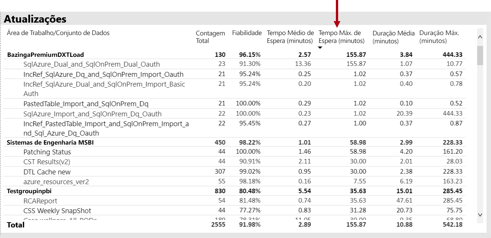

Além disso, no **por hora média atualizar aguardar vezes** visual, tenha em atenção que os tempos de espera da atualização picos consistentemente cerca de 4 horas por dia.

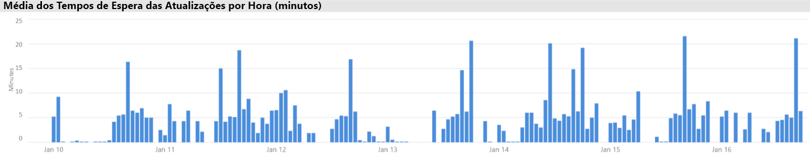

Há várias explicações possíveis para esses resultados:

- Demasiadas tentativas de atualização podem estar a ocorrer ao mesmo tempo, que exceda os limites impostos pelo nó de capacidade (seis atualizações simultâneas num P1 com alocação de memória do padrão)

- Conjuntos de dados seja atualizado podem ser demasiado grandes para caber na memória disponível (o que requer, pelo menos, 2 x a memória necessária para atualização completa)
- Lógica ineficiente do Power Query pode ser resultando num pico de utilização de memória durante a atualização do conjunto de dados. Uma capacidade ocupado, ocasionalmente, isso pode atingir o limite físico, a atualização a falhar e potencialmente afetar outras operações de vista de relatório na capacidade.
- Conjuntos de dados consultados com frequência que precisam para se manter na memória podem afetar a capacidade de outros conjuntos de dados de atualização, devido a memória disponível limitada

Para ajudar a investigar isso, o administrador do Power BI pode procurar:

- Falta de memória disponível no momento da atualização de dados, quando a memória disponível é menor do que 2 vezes o tamanho do conjunto de dados para ser atualizado
- Conjuntos de dados que não estavam a ser atualizado e não estavam na memória antes de uma atualização, ainda que começou a aparecer tráfego interativo durante as horas de atualização pesada. Para ver que conjuntos de dados foram carregados na memória em qualquer momento um Power BI administrador pode ver a área de conjuntos de dados do **conjuntos de dados** separador no filtro da aplicação e em vários para um determinado momento clicando em uma das barras no **por hora Carregar o conjunto de dados contagens**. Um pico local (mostrado na imagem abaixo) indica uma hora quando vários conjuntos de dados foram carregados na memória, que pode atrasar o início de atualizações agendadas
- Expulsões de conjunto de dados maior tirar colocam quando as atualizações de dados são agendadas para ser inicializados, indicando que não havia pressão de memória elevada causado pelo uso de muitos relatórios interativos diferentes antes da data de atualização. O **Expulsões de conjunto de dados por hora e o consumo de memória** visual pode indicam claramente picos na expulsões.

A imagem seguinte mostra um pico de local em conjuntos de dados carregados, que sugere consultas interativas início com atraso de atualizações. Selecionar um período de tempo no **por hora carregado conjunto de dados contagens** visual irá filtro cruzado a **tamanhos de conjunto de dados** visual.

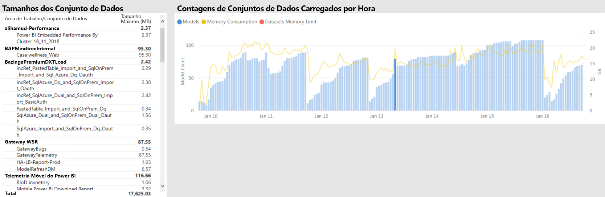

O administrador do Power BI pode tentar resolver o problema efetuando os passos para se certificar de que a memória suficiente está disponível para atualizações de dados começar por:

- Entrar em contato com o conjunto de dados proprietários e solicitar para escalonar e os dados do espaço atualizar agendas
- Reduzir o conjunto de dados de carregamento de consulta ao remover dashboards desnecessários ou dashboard mosaicos, especialmente aquelas que impor segurança ao nível da linha
- Acelerar as atualizações de dados ao otimizar a lógica do Power Query, modelo de colunas calculadas ou atualizar tabelas, reduzindo os tamanhos de conjunto de dados ou a configuração de conjuntos de dados maiores para realizar incremental de dados

### Resposta lenta a conjuntos de dados de identificação

Neste cenário, uma investigação foi acionada quando os usuários reclamam que determinados relatórios demoraram muito tempo para abrir e às vezes seria bloqueado.

Na aplicação, o administrador do Power BI pode utilizar o **durações de consulta** visual para determinar os conjuntos de dados de pior desempenho a ordenação de conjuntos de dados por descendentes **duração média**. Este elemento visual também mostra conjunto de dados de contagens de consultas, para que possa ver a frequência com que os conjuntos de dados são consultados.

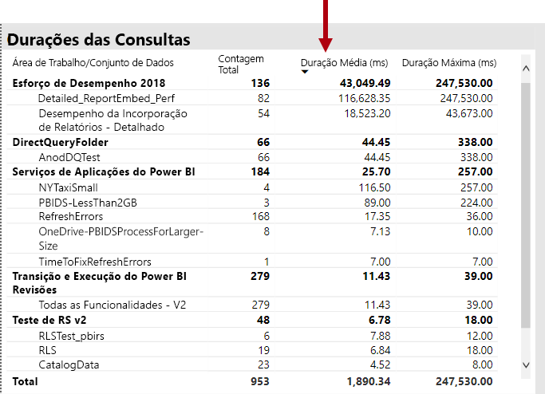

O administrador do Power BI pode referir-se para o **distribuição de duração de consulta** visual, que mostra uma distribuição geral de desempenho de consultas agrupados (< = 30ms, 0-100 MS, etc.) para o período de tempo filtrado. Em geral, as consultas que demoram um segundo ou menos são considerados responsiva pela maioria dos usuários; consultas que demoram mais tempo tendem a criar uma percepção de desempenho ruim.

O **distribuição de duração de consulta por hora** visual permite ao administrador do Power BI identificar períodos de uma hora quando o desempenho de capacidade pode ter sido percebido tão ruim. Quanto maior for a barra de segmentos essa consulta representam durações num segundo, quanto maior o risco de que os usuários passarão a fraco desempenho.

O elemento visual é interativo e, quando um segmento da barra de está selecionado, o correspondente **durações de consulta** visual na página do relatório de tabela é um filtro para mostrar os conjuntos de dados representa. Esta filtragem cruzada permite que o administrador do Power BI para o identificar facilmente que os conjuntos de dados estão a responder lentamente.

A imagem seguinte mostra um elemento visual filtrado pela **distribuições de duração de consulta por hora**, concentrando-se nos conjuntos de dados de pior desempenho nos registos de uma hora. 

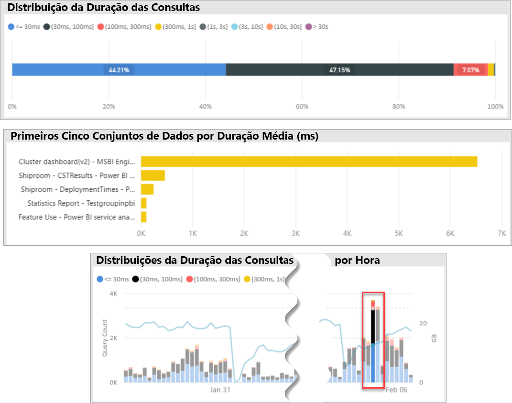

Depois do conjunto de dados de desempenho fraco num intervalo de tempo de 1 hora específico for identificado, o administrador do Power BI pode investigar se fraco desempenho é causado por uma capacidade sobrecarregada ou devido a um projetado o conjunto de dados ou relatório. Para conseguir isso, pode consultar para o **tempos de espera de consultas** visual e conjuntos de dados de ordenação descendente de tempo de espera médio de consulta. Se um grande percentual das consultas está a aguardar, uma procura elevada para o conjunto de dados é, provavelmente, a causa de esperas de consulta muitos. Se a consulta de média de tempo de espera é substancial (> 100 MS), poderá ser útil rever o conjunto de dados e o relatório para ver se as otimizações podem ser feitas. Por exemplo, talvez menos elementos visuais com páginas de relatório ou um recurso de otimização de expressão DAX.

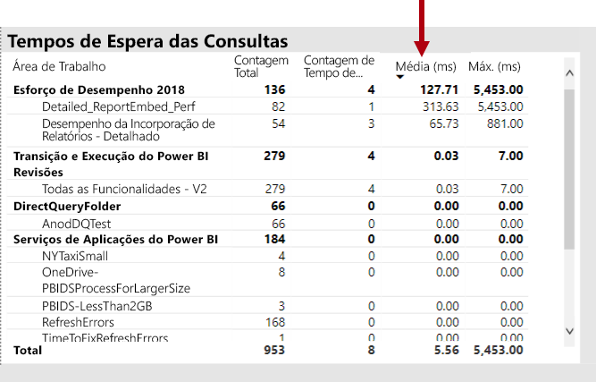

Existem vários motivos possíveis para a compilação de tempo de espera do consulta cópia de segurança em conjuntos de dados:

- Um design de modelo abaixo do ideal, expressões de medida ou até mesmo design de relatórios - todas as circunstâncias que podem contribuir para consultas que consomem altos níveis de CPU de longa execução. Isso força novas consultas a aguardar até que os threads de CPU se tornarem disponíveis e podem criar um efeito de comboio (confusão de processamento de tráfego), normalmente observado durante o horário de pico. O **esperas de consulta** página vai ser o principal recurso para determinar se os conjuntos de dados tem tempos de espera médio de consulta elevado.
- Um elevado número de utilizadores de capacidade em simultâneo (centenas a milhares) consumir o mesmo relatório ou conjunto de dados. Ainda bem projetados de conjuntos de dados podem efetuar incorretamente para além de um limiar de simultaneidade. Isso normalmente é indicado por um único conjunto de dados que mostra um valor substancialmente mais alto para a conta de consulta que outros show de conjuntos de dados (ou seja, de 300 mil consultas para um conjunto de dados em comparação com o < 30 mil consultas para todos os outros conjuntos de dados). Em algum momento, a consulta tem de aguardar para este conjunto de dados será iniciada escalonar e isso será visto no **durações de consulta** visual.
- Muitos diferentes conjuntos de dados consultados ao mesmo tempo, causar degradação como conjuntos de dados com frequência ciclo dentro e fora de memória. Isso resulta em utilizadores com um desempenho lento quando o conjunto de dados é carregado na memória. Para confirmar isso, o administrador do Power BI pode referir-se para o **Expulsões de conjunto de dados por hora e o consumo de memória** visual, que pode indicar que um elevado número de conjuntos de dados carregados na memória estão a ser repetidamente expulso.

### Identificar as causas para esporadicamente lento de resposta conjuntos de dados

Neste cenário, uma investigação foi acionada quando os utilizadores descrito que o relatório de elementos visuais, às vezes, achamos lento para responder ou pode deixar de responder, mas outras vezes foram aceitável pela capacidade de resposta.

Na aplicação, o **durações de consulta** seção foi usada para localizar o conjunto de dados culpado da seguinte forma:

- Na **durações de consulta** visual administrador filtrado de conjunto de dados por conjunto de dados (começando em conjuntos de dados principais consultados) e examinado as barras filtradas cruzadas no **por hora de consulta de distribuições** visual.
- Quando uma única barra de uma hora mostrou alterações significativas no rácio entre todos os grupos de duração de consulta vs. outras barras de uma hora para esse conjunto de dados (ou seja, as taxas entre as cores altera drasticamente), significa que este conjunto de dados demonstrou uma alteração de esporádica no desempenho.
- As barras de uma hora, que mostra uma parte irregular de consultas com desempenho ruins, indicado um intervalo de tempo em que esse conjunto de dados foi afetado por um efeito de vizinhos ruidosos, causado por atividades de outros conjuntos de dados.

A imagem abaixo mostra uma hora no dia 30 de Janeiro, em que ocorreu uma infeliz significativo no desempenho de um conjunto de dados, indicado pelo tamanho do "(3,10s]"execução bucket de duração. Clicando nessa barra de uma hora revela a todos os conjuntos de dados carregados na memória durante esse tempo, analisar, portanto, os conjuntos de dados de culpado Release candidate, fazendo com que o efeito de vizinhos ruidosos.

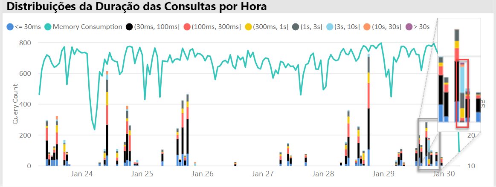

Depois de um intervalo de tempo problemático é identificado (ou seja, durante 30 de Jan na imagem acima) administrador do Power BI pode remover todos os filtros de conjunto de dados, em seguida, filtrar apenas por esse período de tempo para determinar quais conjuntos de dados foram consultados ativamente durante este período. O conjunto de dados de culpado para o efeito de vizinhos ruidosos normalmente é o conjunto de dados consultado superior ou um com o maior duração média da consulta.

Uma solução para esse problema pode ser distribuir o culpado conjuntos de dados ao longo de áreas de trabalho diferentes em diferentes capacidades Premium, ou na capacidade partilhada, se o tamanho do conjunto de dados, requisitos de consumo e dados de padrões de atualização são suportados.

O inverso poderá ser verdadeiro também. O administrador do Power BI pode identificar quando um conjunto de dados de desempenho de consulta melhora drasticamente e, em seguida, procure o que desapareceu. Se determinadas informações estão em falta nesse ponto, que pode ajudar a apontar para o problema que.

### Determinar se existe memória suficiente

Para determinar se existe memória suficiente para a capacidade de concluir as suas cargas de trabalho, o administrador do Power BI pode referir-se para o **percentagens de memória consumida** visual no **conjuntos de dados** separador da aplicação. **Todos os** (total) de memória representa a memória utilizada pelas conjuntos de dados carregados na memória, independentemente se estão ativamente consultados ou processados. **Active Directory** memória representa a memória utilizada pelas conjuntos de dados que estão a ser processados ativamente.

Numa capacidade de bom estado de funcionamento o elemento visual terá um aspeto semelhante esta, que mostra uma lacuna entre todos os (total) e a memória do Active Directory:

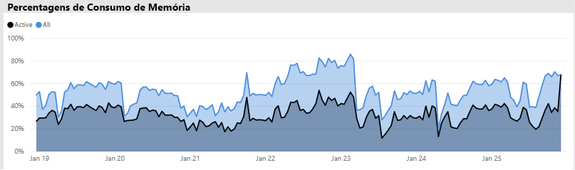

Numa capacidade de ter a pressão de memória, o mesmo elemento visual mostrará claramente memória Active Directory e a memória total convergir, que significa que não é possível carregar conjuntos de dados adicionais na memória nesse ponto no tempo. Neste caso, o administrador do Power BI pode clicar em **capacidade reinicie** (no **opções avançadas** da área de definições de capacidade do portal de administração). Reiniciar os resultados de capacidade em todos os conjuntos de dados que está a ser liberadas da memória e permitindo-lhes recarregar na memória conforme necessário (por atualização de dados ou de consultas).

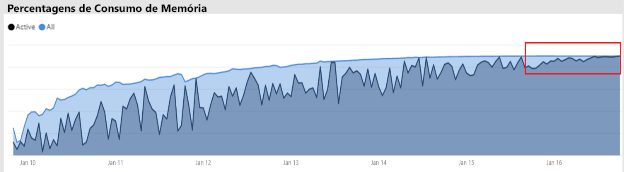

### Determinar se existe suficiente de CPU

Em geral, a utilização de CPU média de uma capacidade deve permanecer inferior a 80%. Exceder este valor significa que a capacidade está a aproximar-se o saturação de CPU.

Efeitos de saturação de CPU são expressos por operações a demorar mais tempo do que deveriam devido a capacidade de realizar muitas Alternâncias de contexto de CPU como ele tenta processar todas as operações. Numa capacidade Premium com um elevado número de consultas em simultâneo, que isso é indicado pela consulta elevada Aguarde vezes. Uma conseqüência de tempos de espera de consulta elevado é a capacidade de resposta mais lenta do que o habitual. O administrador do Power BI possa identificar facilmente quando a CPU está saturada visualizando os **distribuições de tempo de espera por hora consulta** visual. Contagens indicam potencial saturação de CPU de tempo de espera de picos periódicos da consulta.

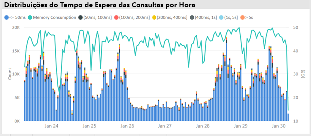

Um padrão semelhante às vezes, pode ser detetado no operações em segundo plano, se eles contribuem para a saturação de CPU. Um administrador do Power BI, pode procurar um pico periódico em horas de atualização para um conjunto de dados específico, o que pode indicar a saturação de CPU no momento (provavelmente devido a outras atualizações de conjunto de dados em curso e/ou consultas interativas). Neste caso, referir-se para o **sistema** vista na aplicação pode não necessariamente revelar que a CPU está a 100%. O **sistema** vista apresenta médias por hora, mas a CPU pode se tornar saturada durante vários minutos de operações pesadas, que aparece como picos em tempos de espera.

Existem nuances mais a ver o efeito de saturação de CPU. Embora o número de consultas que aguardam seja importante, o tempo de espera de consulta será sempre acontece até certo ponto sem causar degradação do desempenho discernable. Alguns conjuntos de dados (com mais demorado tempo médio de consulta, que indica o tamanho ou complexidade) são mais propensos aos efeitos de saturação de CPU do que outras. Para identificar facilmente estes conjuntos de dados, o administrador do Power BI pode procurar alterações da composição de cores das barras no **distribuição de tempo de espera por hora** visual. Depois de detetar uma barra de exceção, podem procurar os conjuntos de dados que tinha esperas de consulta durante esse período e também observar o tempo de espera de média de consulta em comparação comparado a duração de consulta média. Quando essas duas métricas são da mesma magnitude e a carga de trabalho de consulta para o conjunto de dados não é simples, é provável que o conjunto de dados é afetado por CPU insuficiente.

Esse efeito de mensagens em fila pode ser especialmente evidente quando um conjunto de dados é consumido em curtos picos de elevada frequência consultas por vários utilizadores (ou seja, numa sessão de treinamento), resultando em saturação de CPU durante cada rajada. Neste caso, podem encontrar tempos de espera significativo consulta neste conjunto de dados, bem como a afetar outros conjuntos de dados na capacidade (efeito de vizinhos ruidosos).

Em alguns casos, os administradores do Power BI podem solicitar que os proprietários de conjunto de dados, criar um menor carga de trabalho de consulta volátil através da criação de um dashboard (atualizar as consultas periodicamente com qualquer conjunto de dados para os mosaicos em cache), em vez de um relatório. Isso pode ajudar a evitar picos, quando o dashboard é carregado. Esta solução pode não será sempre possível devido a requisitos empresariais, mas pode ter um método eficaz para evitar a saturação de CPU, sem ter que fazer a alteração para o conjunto de dados.

## Conclusão

O Power BI Premium fornece um desempenho mais consistente, suporte para grandes volumes de dados e a flexibilidade de uma plataforma unificada de BI de Self-Service e empresarial para todas as pessoas na sua organização. Este White Paper técnico de nível 300 foi escrito especificamente para os administradores do Power BI e os autores e editores. O objetivo é ajudá-los a compreender o potencial do Power BI Premium e explicam como criar, implementar, monitorizar e resolver problemas de soluções dimensionáveis.

Para implementar e gerir as capacidades do Power BI Premium, os administradores e desenvolvedores de modelo requer um entendimento muito boa de como as capacidades função, como podem ser geridos e monitorizados e como modelos podem ser otimizados, fim de responder adequadamente a problemas de desempenho e congestionamentos que surgem.

## Notas de fim

\[1\] este documento técnico está preocupado com o Power BI Premium, que só é suportado pelo serviço de nuvem do Power BI e Power BI Report Server é não está no escopo, exceto para o estado de que a licença necessários para instalar o Power BI Report Server está incluído com algumas SKUs do Power BI Premium.

\[2\] power BI como um serviço em nuvem quando utilizada para incorporar conteúdo em nome dos utilizadores da aplicação é a plataforma-como-serviço (PaaS). Este tipo de incorporação pode ser obtido com diferentes dois produtos, um dos quais é o Power BI Premium.

\[3\] enviar por push, transmissão em fluxo e conjuntos de dados híbrida não são armazenados no capacidades Premium e, portanto, não são considerados na implementação, gestão e monitorização de capacidades Premium.

\[4\] livros do Excel como um tipo de conteúdo do Power BI não são armazenados no capacidades Premium e, portanto, não são considerados ao implementar, gerir ou monitorização capacidades Premium.

\[5\] elementos visuais podem ser configurados para ignorar as interações de segmentação de dados. Para obter mais informações, consulte a [interações de visualização num relatório do Power BI](service-reports-visual-interactions.md) documento.

\[6\] a diferença de tamanho pode ser determinada ao comparar o tamanho de ficheiro do Power BI Desktop com o o uso de memória de Gestor de tarefas para o ficheiro.

\[7\] incluem o suporte para origens de dados do Microsoft SQL Server, módulos de dados do Azure, Azure HDInsight Spark (Beta), SQL Database do Azure e Azure SQL Data Warehouse. Para obter informações sobre origens adicionais, consulte a [origens de dados suportadas pelo Directquery no Power BI](desktop-directquery-data-sources.md) documento.

\[8\] power BI Premium suporta o carregamento de um ficheiro do Power BI Desktop (. pbix) até um máximo de 10 GB de tamanho. Depois de carregados, um conjunto de dados pode crescer até 12 GB de tamanho como resultado da atualização. Tamanho máximo de upload varia consoante o SKU. Para obter mais informações, consulte a [suporte do Power BI Premium para grandes conjuntos de dados](service-premium-large-datasets.md) documento.

\[9\] SKUs com menos de quatro núcleos virtuais não são executadas na infraestrutura dedicada. Isto inclui o EM1, EM2, A1 e A2 SKUs.

\[10\] embora raras, os modelos podem ser baixados da memória devido a operações de serviço.

\[11\] estes temporizações estão sujeitos a alterações em qualquer altura.

\[12\] isso é chamado de multi-geo, atualmente em pré-visualização. A lógica para uma implementação de multi-geo é normalmente para empresariais ou conformidade do Governo, em vez de desempenho e dimensionamento. Relatório e o carregamento do dashboard ainda envolve a pedidos para a região base para os metadados. Para obter mais informações, consulte a [Multi-Geo suporte do Power BI Premium (pré-visualização)](service-admin-premium-multi-geo.md) documento.

\[13\] é possível que os utilizadores podem causar problemas de desempenho por sobrecarga no serviço Power BI com tarefas, escrever consultas excessivamente complexas, criando referências circulares, etc.

\[14\] a opção de atribuir áreas de trabalho a toda a organização não é recomendada e uma abordagem mais direcionada é preferencial. Em geral, não é prática recomendada usar as áreas de trabalho pessoas para o conteúdo de produção.

\[15\] é possível monitorizar A SKUs na aplicação ou no portal do Azure, mas não no Portal de administração do Power BI. Para monitorizar A SKUs, a atualização do relatório irá falhar se a aplicação não foi adicionada à função do leitor do recurso. Para obter mais informações, consulte a [as capacidades de Monitor de Power BI Premium e o Power BI Embedded](service-admin-premium-monitor-capacity.md) documento.

\[16\] atualizações podem esperar quando não existe suficiente CPU ou memória para começar.

\[17\] o tamanho de conjunto de dados na memória pode ser maior que o tamanho no disco até 20%.

\[18\] média de utilização de memória (GB) e o mais alto consumo de memória (GB)

\[19\] Expulsões de conjunto de dados

\[20\] consultas de conjunto de dados, duração de consulta de conjunto de dados de média (ms), conjunto de dados aguardar contagem e a média do conjunto de dados de tempo de espera (ms)

\[21\] contagem de utilização elevada da CPU e de tempo de CPU de maior utilização (últimos sete dias)

\[22\] DQ/LC elevada contagem de utilização e a hora DQ/LC de maior utilização (últimos sete dias)